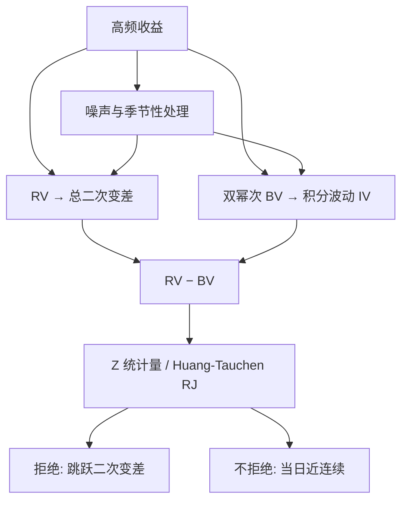

# 跳跃检验

已实现方差把连续路径的积分波动和跳跃的平方和加在一起；相邻收益绝对值乘积的双幂次，在有限活动跳跃下仍收敛到积分波动，两者之差才是跳。

<footer>—— Barndorff-Nielsen and Shephard, Power and Bipower Variation, Journal of Financial Econometrics 2004；检验理论见同作者 2006 年 Journal of Financial Econometrics 文</footer>

[上一课](/quant/dcc)把条件协方差写成 $D_t R_t D_t$，更新二阶相关，不产生尾依赖，并点名与 Copula、EVT 互补。缺口是高频路径上的大缺口：有的是连续波动在开盘附近升高，有的是价格真的跳了。二次变差不区分二者。RV 估二次变差，双幂次变差在有限次跳跃下仍估连续部分的积分波动。本课写 BN–S 检验的对象、噪声如何冒充跳。不重写 DCC 的 $Q_t$。

## 问题

半鞅分解把对数价格写成连续局部鞅加有限（或无穷）活动跳跃。积分波动 $IV=\int\sigma_u^2 du$ 只来自连续部分；跳跃二次变差 $\sum_{s\le t}(\Delta X_s)^2$ 是另一项。期权的方差互换、连续 Delta 对冲、已实现核的对象常常是 $IV$，不是总二次变差。问题是：只用离散观测，如何检验当天（或某个格子）是否有跳，以及跳对当天方差的贡献有多大。

朴素做法是看是否有「很大」的格子收益。阈值依赖 $\sigma$，而 $\sigma$ 日内季节性极强：开盘的 3σ 在统计上可能只是连续波动。必须用对跳跃稳健的波动尺度去标准化，而不是用当天的 RV——RV 已经含跳，阈值会被跳自己抬高，检验变保守。

### 双幂次为何对有限跳稳健

一次跳跃只污染一个格子收益。双幂次是相邻绝对值的乘积之和：跳所在格与邻居相乘，相对平方和，跳的贡献在网格变细时阶更低，概率上消失。三幂次、多幂次把同样逻辑推到更高阶，用于估积分四次变差（quarticity），给检验提供分母。无穷活动跳跃（许多小跳）会破坏这套分离，BN–S 的原定理针对有限活动，或跳的活动指数足够低。

「跳」在这里是半鞅的不连续点，不是财经标题里的「暴跌」。连续的随机波动可以在一小时内把 $\sigma$ 翻倍，路径仍连续，RV 与双幂次应接近。把宏观公告日一律叫做跳日，会把波动状态变量与不连续混成一个标签。

## 方法

记第 $i$ 个高频收益为 $r_i$。已实现方差 $\mathrm{RV}=\sum r_i^2$。已实现双幂次

$$
\mathrm{BV}=\mu_1^{-2}\sum_{i=2}^{n}|r_{i-1}||r_i|,\qquad \mu_1=\mathbb{E}|Z|=\sqrt{2/\pi},
$$

$Z$ 标准正态。无噪声、有限活动跳、网格 $\Delta\to 0$ 时，$\mathrm{BV}\to_p IV$，而 $\mathrm{RV}\to_p IV+\sum(\Delta X)^2$。Barndorff-Nielsen–Shephard（2006）构造

$$
Z_{\mathrm{J}}=\frac{\mathrm{RV}-\mathrm{BV}}{\sqrt{\theta\,\Delta\,\mathrm{TP}}},
$$

其中 $\mathrm{TP}$ 是已实现三幂次一类对 $\int\sigma^4$ 的估计，$\theta$ 是由渐近理论给出的常数。无跳时 $Z_{\mathrm{J}}$ 渐近标准正态；有跳时分子趋于正的跳跃二次变差，检验趋于拒绝。Huang–Tauchen 的相对跳跃度量 $\mathrm{RJ}=(\mathrm{RV}-\mathrm{BV})/\mathrm{RV}$ 把贡献写成比例，便于跨日比较。

Lee–Mykland 在每个格子上用局部窗口估瞬时 $\sigma$，标准化 $|r_i|$，定位跳发生在哪一笔。Aït-Sahalia–Jacod 用不同幂次的已实现幂变差之比，对无穷活动也有理论。实务上日度「是否有跳」常用 BN–S 或 Huang–Tauchen；「哪一分钟跳」用 Lee–Mykland。

### 噪声、隔夜与多重检验

[微观结构噪声](/quant/microstructure-noise) 抬高 RV，也破坏相邻乘积的极限。密采样上朴素 BN–S 会把噪声当跳。先预平均、已实现核或降频到噪声可忍受的格子，再做检验。隔夜缺口是日历上的跳，应单独一项，不要塞进日内 BV 的第一格。

一年 250 个交易日各做一次 5% 检验，期望就有十几个假跳日。阈值应用 Bonferroni 或假发现率，或把显著性放到 0.1%。检验功效对小跳弱：跳若只占当天 IV 的很小比例，$Z_{\mathrm{J}}$ 仍可能不拒绝。

## 机制

连续半鞅的二次变差等于积分波动，离散 RV 多出来的交叉项与跳的平方在极限里分离：跳是稀疏的大项，连续部分是许多小项的平方和。双幂次用「不同格的乘积」避开同一格的平方，从而避开跳。分母里的 quarticity 来自连续部分的四次变差，描述无跳时 $\mathrm{RV}-\mathrm{BV}$ 的波动；跳存在时你不再需要这个正态近似去做估计，只需要它在原假设下给临界值。

与[隐含 vs 已实现](/quant/iv-vs-rv)的联系：方差互换复制在有跳时对准对数合约，与 $\mathrm{RV}$ 差跳跃凸性。BN–S 把 RV 拆成 BV 与跳，有助于解释 IV−RV 在公告日的裂口有多少来自跳溢价而不是连续方差溢价。

签名图上，噪声让 RV 在高频上翘；跳让 RV 在所有频率都抬一截（跳的平方不随网格变细而消失）。先看签名图再做 $Z_{\mathrm{J}}$：上翘为主时先去噪声，平台抬高才像跳。

### 从检验到建模

检出跳之后，建模仍要选：有限活动复合泊松、无穷活动 Lévy，还是把公告做成确定时刻的条件跳。检验拒绝的是「连续半鞅加噪声可忽略」，并不指出跳的强度模型。把跳日从样本里删掉再估连续波动，是一种稳健做法，但会丢掉跳溢价的定价信息。对冲若假设连续路径，跳日的误差应由跳检验触发另一套限额，而不是把 $Z_{\mathrm{J}}$ 当成交易信号。

## 边界与工程取舍

有限样本里 BV 对连着两格都大的波动（开盘）会偏，季节性应先用日内模式除权。稀疏跳假设在闪崩式连续多笔大单上作假，Lee–Mykland 会标出一串「跳」，其实是短时流动性蒸发。无穷活动下 BN–S 的分离不干净，应换 Jacod 一类幂变差检验。

不要用日收益的绝对值阈值替代高频检验：日收益把跳与当天连续波动加总，无法分离。不要在未清洗的 tick 上算 BV：错价平方就是假跳。不要把显著 $Z_{\mathrm{J}}$ 解释为「可预测的跳」——检验是事后分解，不是提前预警。

多元时，共同跳与特异跳要分开：指数跳了并不意味每只成分都跳。已实现协方差的跳稳健版本（双幂次协方差等）对异步成交更脆弱，需与 [Hayashi–Yoshida 一类同步问题](/quant/irregular-sampling)一起处理。

Barndorff-Nielsen–Shephard 的渐近是 $\Delta\to 0$ 且无噪声。五分钟网格是噪声与偏差之间的工程点，不是定理里的采样。报告跳跃占比时写清网格、是否预平均、临界值如何对多重检验调整。

## 小结

- RV 估总二次变差，双幂次在有限活动跳跃下估连续积分波动，差为跳的贡献。
- BN–S 用 quarticity 标准化该差，得日度跳跃检验；Lee–Mykland 定位格子，Aït-Sahalia–Jacod 覆盖更广的活动指数。
- 噪声、隔夜、日内季节性与多重检验会制造假跳；先清洗与降噪，再检验。
- 拒绝连续路径不等于给出跳的强度模型，也不等于可交易预测。
- 与无模型 IV 对照时，跳使对数合约与二次变差分家，应分开连续方差溢价与跳溢价。
- 出处：Barndorff-Nielsen and Shephard, *Journal of Financial Econometrics*, 2004 与 2006；相对份额见 Huang and Tauchen, 2005；定位见 Lee and Mykland, 2008；幂变差见 Aït-Sahalia and Jacod, 2009。
