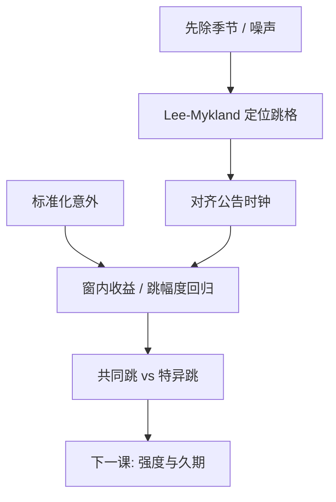

# 跳跃与新闻事件

宏观公告时刻，价格可以在连续波动之外再加一跳；检验拒绝连续路径之后，还要把跳对到时钟上的新闻，而不是把所有显著 $Z_J$ 都叫做消息。

<footer>—— Andersen, Bollerslev, Diebold and Vega, Micro Effects of Macro Announcements: Real-Time Price Discovery in Foreign Exchange, American Economic Review, 2003；跳的定位见 Lee and Mykland, Review of Financial Studies, 2008</footer>

[上一课](/quant/noise-variance-estimate)把签名图的高频上翘留给噪声、把平台抬高留给跳。[跳跃检验](/quant/jump-tests) 已给出 BN–S 与 Lee–Mykland。本课缺口：把检出的跳**对齐到新闻时间表**——非农、CPI、FOMC、个股盈余。Andersen、Bollerslev、Diebold 与 Vega 用高频外汇看宏观意外的即时效应；Lee–Mykland 给出格点定位。对象是「跳是否在公告窗」，不是再推导双幂次。下一课点过程给公告之间的等待时间建模，强度可以在新闻时刻抬升。

## 问题

无条件跳检验回答「当天有没有跳」。新闻研究问：跳是否落在 $\pm\Delta$ 的公告窗、意外大小是否解释跳的符号与幅度。问题是多重检验（一年许多公告）、时区、预泄漏、以及连续波动在公告前已经季节性抬高——未除季节会把「忙」当成跳。

对象分层：（1）宏观对汇率/国债/股指的共同跳；（2）个股特异跳（并购、盈余）。共同跳进入已实现协方差的共跳项；特异跳进入半方差的一侧。先标类型再做定价或对冲。

### 窗宽与意外

标准化意外 $s_t=(a_t-E[a_t])/\sigma_a$，回归 $r_{t,i}=\gamma s_t 1_{i\in\mathrm{窗}}+\cdots$。窗太宽混进无关波动，太窄错过慢消化。外汇里数秒到数分钟；个股盈余可能数十分钟。应预登记窗，并报告泄漏窗 $t\lt 0$。

「有新闻的日子 RV 高」可以全是连续 $\sigma$ 升，BN–S 不拒绝。新闻效应不等于跳效应。应同时报窗内连续波动与跳贡献。

## 方法

**定位。** Lee–Mykland 局部 $\sigma$ 标准化 $|r_i|$，标出格。与官方时间戳对齐（注意发布延迟与交易所时钟，见时钟课）。BN–S 只给日度，不够对到分钟。

**回归。** 窗内收益或已实现跳对意外；标准误按公告聚类（同一宏观日所有资产相关）。这是 [事件研究](/quant/event-study) 的高频版，异方差用窗内已实现量标准化。

**共同 vs 特异。** 指数跳而成分未跳：可能是期货–现货同步问题。成分都跳：共跳。HY 或刷新格上的共跳检验（Jacod–Todorov 一类）比「大家都显著」的 Bonferroni 更对口，但实现重。工程上先看指数窗，再抽样成分。

### 与半方差、对冲

负宏观意外 → $RS^-$ 与负跳。对冲若假设连续路径，新闻窗应切换限额或期权保护，而不是把 $Z_J$ 当反向信号。检出是事后分解；可交易的是预先知道的日历（公告时刻已知、意外未知）。日历本身可进季节与强度。

## 机制

公告把信息集在离散时刻更新，半鞅允许不连续。若做市在窗内用宽价差吸收，观测到的 $Y$ 跳含噪声加宽；应中点或预平均再测跳，否则把价差拉宽当成跳。机制：真信息跳持久，价差跳反向。事后几分钟是否回吐是诊断。

Andersen 等强调价格发现速度：汇率对宏观的调整可以在一次印记里完成大部分。这与日频事件研究的「几天 CAR」不同——对象已经是秒到分钟。日频 CAR 会把跳与随后的连续波动加总。

多重公告同一分钟（数据扎堆）无法分离哪个数字造成跳。应看官方日历是否重叠，重叠则把窗标为「包」，不要硬归因。

### 到点过程的交接

跳与普通成交都是点事件。新闻时刻强度 $\lambda(t)$ 升，久期变短。下一课 ACD/Hawkes 式点过程给「下一笔何时来」，本课的跳是标值（有方向的幅度）。先标值再点过程，避免把所有密集成交都叫跳。

## 边界与工程取舍

假新闻、社交媒体时间戳不可靠。停牌使公告落在空洞，跳出现在复牌第一笔，应对齐复牌而非公告墙钟。A 股业绩预告与正式公告多时点，预登记哪一个 $t=0$。

工程：预登记日历与窗；Lee–Mykland + 意外回归；按日聚类。不要把所有 BN–S 显著日讲成新闻日。不要用日收益对意外回归冒充高频发现。下一课：久期与点过程。

## 小结

- 跳检验之后须对到新闻时钟；新闻高波动可以是连续 $\sigma$，不必是跳。
- Lee–Mykland 给格点，BN–S 给日度；意外回归按公告聚类，窗宽预登记。
- 价差拉宽与真信息跳要用中点/回吐诊断分开。
- 公告时刻已知、意外未知：日历进强度，幅度仍不可预知。
- 出处：Andersen, Bollerslev, Diebold and Vega, *AER*, 2003 及后续；Lee and Mykland, *RFS*, 2008；BN–S 跳跃检验见 [跳跃检验](/quant/jump-tests)。
