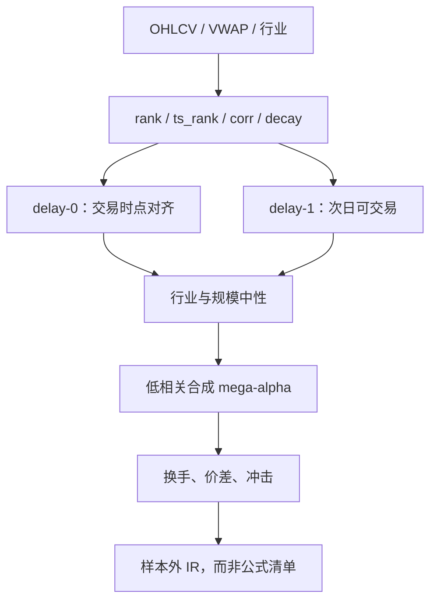

# 101 Formulaic Alphas

    
我们给出 101 个真实量化交易 alpha 的显式公式——它们同时也是计算机代码。平均持有期大约在 0.6 到 6.4 天；两两相关均值只有 15.9%。

    <footer>—— Kakushadze, 101 Formulaic Alphas, Wilmott Magazine, 2016；arXiv:1601.00991</footer>

Zura Kakushadze 在 2016 年把 WorldQuant 许可使用的 101 条公式化 alpha 公开成可复制的表达式。它们大多是价量（开高低收、成交量、VWAP、收益），少数用市值或行业分类做中性。持有期短、相关低、收益与波动强相关而与换手无关——这组经验事实直接确认了 Kakushadze 与 Tulchinsky（2015）对四千条实盘 alpha 的间接结论。本篇把 101 式当作**可审计的短持有因子语法**：算子、delay-0 / delay-1、行业中性与「魔法数字」，而不是当作 2016 年之后仍可原样交易的信号清单。Harvey、Liu 与 Zhu 的多重检验、以及公开后的拥挤，都会改写这些公式的经济含义。

## 问题

公式化 alpha 要回答的不是「市场有没有可预测性」，而是：在价量算子的闭包里，什么样的表达式曾经构成可交易的预期收益，以及它们之间是否高度共线。公开数据里很少能看见真实交易式；学术因子又往往是月频、长持有、用账面与盈利。两者中间缺一块：**日频、持有数日、用 `rank`、`ts_rank`、`correlation`、`decay_linear` 拼起来的短 alpha**。Kakushadze 填的是这块。定义上，他沿用交易员口径：alpha 是「任何合理的预期收益指令」，不必等于资产定价里相对因子模型的截距。

挑战立刻出现。表达式是可复制的，生产配置不是：宇宙、行业分类版本、VWAP 口径、涨跌停与停牌处理、以及那些看起来像优化残留的非整数窗长（例如 `3.92795`）。把附录 A 逐条丢进 pandas 而不锁这些选择，得到的不是论文里的 101 条，而是另一族相关的技术指标。更严重的是[前视](/quant/look-ahead-bias)：`delay-0` 用当日开盘或当日 VWAP，意味着交易必须发生在该信息已知之后；用收盘价假装在开盘成交，是把 delay-0 做成了不可实现的 delay 负值。

### 均值回复块与动量块不是互斥分类

粗分类里，均值回复 alpha 与它所基于的收益异号；动量 alpha 同号。简单 delay-0 回复可以写成 $-\ln(\text{今开}/\text{昨收})$，希望开盘跳空被吐回；简单 delay-1 动量可以写成 $\ln(\text{昨收}/\text{昨开})$，希望昨日日内趋势延续。复杂式把两种块嵌套：`rank`、`delta`、`correlation` 可以让同一条公式在某些股票上像回复、在另一些上像动量。Alpha#101 是 delay-1 动量：若日内收盘高于开盘且高低价差为正，次日做多。Alpha#42 本质是 delay-0 回复：`rank(vwap - close)` 在尾盘相对 VWAP 拉升时变低。读 101 式应拆成块，而不是给整条贴一张「动量/反转」标签。

论文明确说这些式子是按「能写进一篇文章」挑的简单子集；还存在大量无法公式化、只能以代码存在的 alpha。把 101 当成 WorldQuant 的完整因子库，是把演示样本当成总体。

## 方法

**输入与算子。** 字段包括 `open, high, low, close, volume, vwap, returns`，以及 `adv20` 一类平均成交量、`cap`、行业中性 `IndNeutralize`。截面算子：`rank` 把当天截面映到 $(0,1)$，`scale` 把仓位和归一。时间序列算子：`delay`、`delta`、`ts_min/max`、`ts_argmin/argmax`、`ts_rank`、`sum`、`stddev`、`decay_linear`（过去 $d$ 日线性衰减权重并归一）、`correlation` 与 `covariance`。条件用三元 `? :`。行业中性针对 GICS / BICS 等不同粒度；论文强调不同分类的「行业」层级名词并不一一对应，复制时必须固定一份分类 vintage。

**Delay 与可交易日历。** Delay-0：公式里最新价格的时点与拟交易时点重合，现实中只能尽量靠近。Delay-1：用截至昨日的数据，今日开盘或全日交易。Delay-$d$ 类推。A 股还要叠 [T+1](/quant/cn-tplus1) 与涨跌停：delay-0 开盘回复在涨停打开前可能无法买入。评价应使用当时可成交价，而不是复权后的研究用价格，见[公司行为](/quant/corporate-actions)。

**经验事实（论文第 3 节）。** 在作者提供的夏普、换手、每股美分与样本协方差上：平均（中位）两两相关 15.9%（14.3%）；收益 $R$ 与波动 $\sigma$ 满足近似幂律 $R\sim\sigma^{0.76}$；收益对换手没有显著依赖。换手本身对 alpha 之间的相关解释力差：$\mathrm{corr}_{ij}$ 与 $\ln\tau_i\ln\tau_j$ 并不高度同向。这不是说换手在协方差因子模型里没有用，而是说「换手相近 $\Rightarrow$ 信号共线」这条捷径不成立。

### 从单式到 mega-alpha

Kakushadze 的引言把当代量化写成两股力量：单条 alpha 越来越弱、越来越短命；同时自动化让 alpha 数量膨胀到十万、百万。组合它们得到 mega-alpha，内部对倒降低成本，并分散「某一子集突然失效」。样本协方差在 $N\gg T$ 时奇异，这把问题接到因子协方差与收缩，而不是接到「再挖第 102 条」。公开 101 条之后，正确的研究问题是：在[截面 rank](/quant/cs-rank-features) 与行业中性之后，它们对标准动量、短期反转、流动性的增量 $R^2$ 还有多少；以及在扣[有效价差](/quant/spread-cost) 后持有 0.6–6.4 天是否仍过零。

非整数窗长是优化痕迹。复制时应把 `3.92795` 当成已冻结的超参，而不是再在同一测试段上搜附近的实数。那会把 101 条变成 101 次新的[多重检验](/quant/harvey-liu-zhu)。

## 机制

价量公式能有预期收益，机制通常是微观结构与行为，而不是宏观风险：开盘跳空的过度反应、价量背离、尾盘相对 VWAP 的拉动、行业内相对强弱。`correlation(rank(delta(log(volume))), rank((close-open)/open))` 一类式子捕捉的是「价与量是否同向」；负号把它变成背离交易。`ts_rank` 把绝对变化变成「在自己近期历史上的分位」，从而对波动水平更不敏感——这与论文发现的「收益跟波动走、不跟换手走」相容：波动高的名字上，同样的分位对应更大的美元收益。

低两两相关来自算子组合的多样性，而不是来自正交化定理。101 条仍共享价量宇宙与短持有，对共同流动性冲击会一起受伤。换手解释不了相关，是因为两条低换手公式可以一个做开盘回复、一个做五日动量，持仓重叠不必高。反过来，两条高换手公式若都在追同一分钟的 OFI，相关会高——但 101 条是日频公式，看不见那一层。

公开之后的机制变化更重要。公式一旦成为标准特征，拥挤把原来的误定价压成风险：短期反转容量下降，残差转到尚未公式化的交互或更高频的队列。把 2016 年的夏普当作 2026 年的 $\mu$，是把论文里的历史对象当成了 Kelly 公式里的参数。

### 中国市场与算子语义

A 股的涨跌停让 `ts_max(close)` 经常顶在限制价，`correlation(close, volume)` 在封板日变成「量与一个常数」的相关。`vwap` 在集合竞价与午间休市上的定义必须与交易所一致。行业中性若用申万而论文用 BICS，中性后的残差不是同一对象。Leippold、Wang 与 Zhou（2022）在 A 股机器学习可预测性上的警告这里同样适用：不可交易日应在损失里视为不可实现，否则公式会去拟合涨停余波。

## 边界与工程取舍

不要把 101 条等权合成一个「WorldQuant 因子」再报告一个夏普：相关 15.9% 仍会在压力周共动，且等权忽略了各自波动。不要在全样本上调窗长再声称复制成功。不要用后复权价计算 `close < 5` 一类过滤。容量上，持有不到一周的价量信号对[冲击](/quant/sqrt-impact)极度敏感；论文的 cents-per-share 是当时、当时宇宙上的描述统计，不是你的成交价。

可审计性是这批公式相对黑箱模型的真正优点：每一条都能写成算子树，便于[研究与实盘隔离](/quant/research-sim-prod)时做特征冻结。缺点是语法纵容组合爆炸——`rank` 套 `ts_rank` 套 `decay_linear` 可以无限长。搜索应预指定算子预算与[标签重叠](/quant/label-horizon-overlap)规则，并把试验次数记进 Harvey–Liu–Zhu 的 $M$。

「公式即代码」只在同一解释器下成立。`rank` 对并列的处理、`correlation` 在常数输入上的返回值、停牌日是否进入 `adv20`，都会让两条「同一公式」的实现分叉。复制论文应同时冻结算子语义说明书。

## 小结

- Kakushadze（2016）公开 101 条价量为主的公式化 alpha：持有约 0.6–6.4 天，两两相关均值 15.9%，收益随波动缩放、与换手无关。
- 算子闭包（截面 rank、时序 rank、衰减、相关、行业中性）是短持有 alpha 的语法；delay-0 / delay-1 决定信息集是否可交易。
- 低相关不自动等于可加杠杆；公开后拥挤与成本会收走历史夏普。窗长与行业分类必须冻结。
- A 股须把涨跌停、T+1 与停牌写进算子语义，否则是在拟合不可成交路径。
- 出处：Kakushadze, *101 Formulaic Alphas*, Wilmott Magazine 2016(84):72–80，arXiv:1601.00991；经验对照见 Kakushadze and Tulchinsky, 2015。
