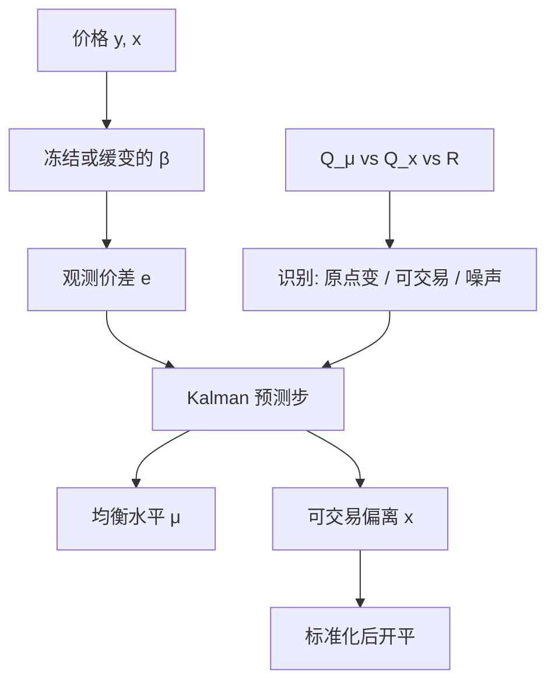

# Kalman 价差滤波

    
把可观测价差写成隐均衡水平加噪声，或写成带均值回复的状态加量测误差；Kalman 给出的是过滤后的偏离，用来开仓，而不是把对冲比当成每天要重估的主状态。

<footer>—— 线性滤波见 Kalman, 1960；状态空间计量见 Harvey, 1989；配对上把价差建成均值回复状态见 Elliott, Van Der Hoek and Malcolm, Quantitative Finance, 2005</footer>

[上一课](/quant/copula-pairs)把边缘与依赖分开，用条件分位开仓，补的是非线性、不对称尾部；强依赖可以与 $I(1)$ 价差共存，必须单独声明交易对象。缺口是价差的隐状态。原始 $e_t$ 含微观结构噪声与缓慢漂移，直接算 Z-score 会把每一次跳动都当成均衡偏离；滤波平滑又含未来。本课把状态换成价差的均衡水平或潜在 OU，信号用预测步偏离。不重选 Copula 族。它与[时变对冲比](/quant/kalman-hedge)正交，必须分开设 $Q$。

## 问题

原始价差含微观结构噪声、隔夜跳空与短暂的流动性冲击。直接对 $e_t$ 算 [Z-score](/quant/zscore-entry)，等于把每一次跳动都当成均衡偏离。若真实均衡水平 $\mu_t$ 慢变（利率台阶、季节性、缓慢的相对基本面），固定均值会把制度漂移读成可交易 alpha。把 $\mu_t$ 写成随机游走或弱回复状态，

$$
\mu_t=\mu_{t-1}+\eta_t,\qquad e_t=\mu_t+x_t,\qquad x_t=\phi x_{t-1}+\varepsilon_t,
$$

或更紧地写成单状态 OU：量测是带噪声的价差，状态是潜在 OU。Kalman 输出 $\hat\mu_{t|t-1}$ 与 $\hat x_{t|t-1}$，开仓用过滤后的 $x$ 而不是原始 $e$。问题是识别：观测到的一次跳，究竟是噪声（应忽略）、是可交易的 $x$（应开仓），还是 $\mu$ 变了（应改原点、不应开仓）。

这与时变 $\beta$ 的识别同构，但对象不同。调 $\beta$ 会改变价差的定义本身；调 $\mu$ 只改变价差的原点。前者在 [对冲比断裂](/quant/hedge-ratio-break) 时更致命，后者在水平漂移时更致命。两者同时开、两个 $Q$ 都大，价差被解释光，没有信号。

### 可交易的是预测偏离

滤波 $\hat x_{t|t}$ 用了当期 $e_t$。回测若在 $t$ 用 $\hat x_{t|t}$ 开仓，含同期信息。可交易信号是 $\hat x_{t|t-1}$，或用 $t-1$ 的滤波状态加 $t$ 的新价格之前先做预测步。平滑 $\hat x_{t|T}$ 会把未来的回归提前画出来，样本内几乎总是漂亮。Elliott 等人的贡献是把均值回复放进状态方程，使「过滤」与「交易的那条过程」是同一个似然；贡献不是允许使用平滑状态下单。

量测噪声 $R$ 过小，滤波认为价差精确，几乎不平滑，退化成原始 $e$ 的 Z-score。$R$ 过大，状态紧跟，过滤后的 $x$ 接近 0，永远不开仓。$Q_\mu$ 过大则原点跟着价差走，开仓信号被吃掉——这是「时变均值」最常见的过拟合。

## 方法

**规格 A：固定 $\beta$，滤 $\mu$ 与 $x$。** 形成期 OLS 或 Engle–Granger 得 $\hat\beta$，交易期冻结。状态 $(\mu_t,x_t)$，量测 $e_t=\mu_t+x_t$。$x$ 的转移系数 $\phi=e^{-\kappa\Delta}$ 可固定（用形成期 OU）或与 $Q,R$ 一起用预测误差似然估计。冻结 $\beta$ 使本篇与 kalman-hedge 正交：这里不把缺口解释成对冲比变了。

**规格 B：单状态 OU 加量测噪声。** 状态即潜在价差 $z_t$，

$$
z_t=\mu(1-\phi)+\phi z_{t-1}+\eta_t,\qquad e_t=z_t+\varepsilon_t.
$$

开仓用 $(z_{t|t-1}-\mu)/\sigma_z$。当 $R=0$，退化为对原始价差做 AR(1)。$R\gt 0$ 相当于先低通再标准化，减少因单日跳空触发的假开仓。

超参数仍用 Harvey 的预测误差分解。不要用交易期 PnL 网格搜 $Q,R$。诊断：新息应近白；若新息仍有单位根，不是噪声太大，而是 $\beta$ 错了或协整已经破裂，应停止滤价差、回到 [协整破裂](/quant/cointegration-break) 的检验，而不是把 $Q_\mu$ 开大把单位根吸进均值。

### 与滚动均值、EWMA 的等价

对 $\mu_t$ 随机游走、无 $x$ 分解的 Kalman，稳态下是 EWMA：增益由 $Q_\mu/R$ 决定。许多「自适应 Z-score」其实是这一退化。写出状态空间的好处是：可以把 $x$ 的回复与 $\mu$ 的漂移分开，并给出状态方差——不确定度大时降低杠杆。滚动窗口均值对应一种硬切断的记忆；Kalman 是指数记忆。两者都在偏误–方差前线上，都不是协整定理。

执行时钟与 kalman-hedge 相同：用预测状态在次日或下一可交易中点开仓。盘中滤价差需要同步中点，跳空时量测缺失或方差放大，应只做预测步。A 股涨跌停使 $e_t$ 截断，量测模型应承认截断，否则状态会为了拟合板上的钉住值而扭曲。

把 Kalman 滤过的价差再套一层布林带或 MACD，是把同一低通重复两次，并多了一组不可比的超参。信号应直接来自标准化的 $\hat x_{t|t-1}$。

## 机制

Kalman 增益把新息按「状态不确定 vs 量测噪声」写入 $\mu$ 或 $x$。设计矩阵决定写入哪一个：若模型里 $x$ 回复快、$\mu$ 几乎常数，短暂缺口进 $x$，成为可交易偏离；若 $Q_\mu$ 被估得很大，同一缺口进 $\mu$，原点搬家，不交易。样本内似然往往偏好较大的 $Q_\mu$，因为这样拟合更好——而这正会榨干交易信号。所以价差滤波的超参数应在形成期估、交易期冻结，与 GGR 把 $\sigma$ 钉在形成期是同一纪律。

机制上的第二句话是噪声的来源。买卖弹跳、非同步、指数套利流量，使 $e_t$ 的高频成分不像 OU。[有效价差](/quant/effective-realized-spread) 量级的跳动不应触发开仓；$R$ 的数量级至少应覆盖半价差，而不是用收盘价的样本方差去估一个过小的 $R$。过滤因此首先是执行友好：少在噪声上换手，而不是提高信息比率的魔法。

### 何时不该滤价差、该调 $\beta$

滤波价差假定线性组合的系数对。成分股权重变、一只腿换了业务、期现乘数或 ETF 份额变，缺口来自 $\beta$，不是来自 $\mu$。此时加大 $Q_\mu$ 会把错误对冲比吸收成「新均衡」，看起来残差很稳，经济上你已经在用错误的腿数做空。诊断是：$\hat\beta$ 与滚动 OLS 分道、或 Gregory–Hansen 拒绝稳定协整。应切换到 kalman-hedge 或停止交易，而不是把价差原点再平滑一次。反过来，分红、拆股应在观测方程里显式调整，不要让 $\mu$ 去吸收公司行为。

## 边界与工程取舍

不要同时让 $\beta_t$、$\mu_t$、$x_t$ 都成为高噪声状态：不可识别。典型分工：经济上 $\beta$ 该稳（转换比率、固定篮子权重）则滤价差；$\beta$ 该变（统计篮子、行业权重）则滤对冲比，价差阈值建在预测残差上。两者都变时，需要更多量测（多对价格）或更强的先验。不要用平滑路径画「当时该不该开仓」。不要把状态方差当成组合 VaR。

与 [OU 价差](/quant/ou-spread) 的关系：OU 是 DGP 假设；Kalman 是在该假设（或带噪声的该假设）下的递归估计。半衰期应在预测残差上估，否则描述的是另一条序列。成本后比较的是：滤过的信号是否减少了假开仓、是否补偿了滞后。过滤引入滞后，在真回归很快时会吃掉边缘；这是 $R$ 的代价，不是 bug。

Elliott, Van Der Hoek and Malcolm（2005）把对冲比与均值回复放进同一状态空间。复制时若只实现了滤 $\beta$、却用原始价差开仓，或只滤了价差却让 $\beta$ 每日 OLS，都不是原文系统，也不能用他们的示意路径当绩效。

## 小结

- Kalman 价差滤波的状态是价差的均衡水平或潜在 OU，不是对冲比；与 [时变对冲比](/quant/kalman-hedge) 正交，必须分开设 $Q$。
- 可交易信号用预测步偏离；滤波平滑含未来，不能进撮合。
- $Q_\mu$ 过大则无信号，$R$ 过小则不过滤噪声；超参数应在形成期估、交易期冻结。
- 新息若仍像单位根，问题在 $\beta$ 或协整破裂，不是把均值再平滑一次。
- 出处：Kalman, 1960；Harvey, 1989；Elliott, Van Der Hoek and Malcolm, *Quantitative Finance*, 2005。
