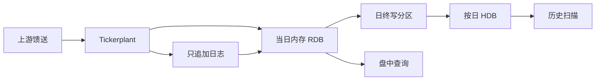

# kdb+ 与 q

    
把当天的逐笔放进内存列存，把历史按日期分区落盘，中间用一条只追加的日志把两者接住——kdb+ 的行情栈不是「又一个 SQL 库」，而是为金融时序的追加与向量扫描而长出来的进程拓扑。

    <footer>—— 据 Kx Systems 对 kdb+ 与 q 的技术说明；行情库常见的 tickerplant / RDB / HDB 分工</footer>

微观结构研究与生产行情库面对同一物理事实：数据按时间追加、查询却按列扫描（某几只证券的某几个字段、某一时间窗）。行式库把同一时刻的所有字段捆在一起，对「只要成交价与量」的扫描极不友好；通用数据湖又把延迟与模式演进丢给上层。kdb+ 用列存、枚举符号、内存映射与一种 APL 风格的向量语言 q，把「当天热数据」和「按日分区的历史」拆成可独立伸缩的进程。[ClickHouse 金融时序](/quant/clickhouse-finance-ts) 与 [DolphinDB](/quant/dolphindb) 解决的是相近问题，但进程模型与语言不同。本篇写 kdb+ 作为数据架构：表如何躺在内存与盘上、TP/RDB/HDB 如何衔接、以及 q 的向量语义如何既加速又制造错误。它不是一份可执行的生产部署手册，也不涉及未授权接入实时行情口。

## 问题

Tick 的写入是追加：每条成交、每条报价只发生一次，几乎不更新（除了晚到与更正）。读取却是分析型的：某日某标的的全部成交价、按时间对齐的买卖一档、一段窗口上的聚合。若存储按行，聚合必须跳过无关字段；若没有按日期与符号的分区，一次「昨天这只股票」会扫到整个库。kdb+ 把表看成命名列的集合，列是同质向量；符号列被枚举成整数，比较与分组变成对小整数的向量运算。问题是如何在全日不中断写入的同时，让分析查询走满向量化，并且在日终把内存表变成可内存映射的历史分区。

第二个问题是语言。SQL 的声明式对连接与过滤很稳，但对「把这列与其滞后做一次向量减、再按符号分组取最后一条」写起来冗长，且优化器不一定选列式计划。q 把表当作翻转的列字典，查询是向量表达式。表达力换来的是可维护性与隐式广播错误——架构讨论必须把语言风险算进去。

### 列存、枚举与按日分区

一张成交表至少有时间、符号、价、量。列存意味着「只要价」只读一列；过滤符号时先走枚举后的整数向量。历史库按日期分区：每个日期一个目录，目录内按列分文件。查询某一天只打开那天的文件，操作系统的页缓存可以按列预读。跨日查询由 q 把各分区的结果拼接，这要求各日模式一致——加列必须是可演进的，而不能默默错位。

kdb+ 的「内存数据库」指的是 RDB 与当前热分区可以全部放进 RAM，不是所有历史都必须常驻。HDB 靠 mmap：只用到的列页被装入。把三年逐笔强行全部 `select` 进内存，仍然会把机器打满。容量规划按「并发查询触及的列×时间窗」来，而不是按库的名义体积。

## 方法

标准行情拓扑分三截。**Tickerplant（TP）** 从上游馈送收消息，做最小解析与时间戳，写入只追加日志，再发布给订阅者。它不负责复杂计算，以便崩溃后能从日志重放。**RDB** 订阅当天数据，表留在内存，供盘中查询与监控。**HDB** 存历史分区；日终把 RDB 的表写到新的日期目录，清空内存表，准备下一个交易日。更正与晚到消息要么写入单独的更正通道，要么在次日以补充文件存在分区里——与 [迟到数据对账](/quant/late-data-recon) 是同一类问题，只是实现落在列文件而不是对象存储。

查询规划应显式：先按日期缩小分区，再按符号，再取列。q 里写反顺序，解释器仍可能先物化一张大表。对高频用户，常用的聚合应预计算成 bar 表，而不是每次从 tick 现场 `select`。预计算是研究与生产的分界：研究可以扫原始成交；生产仪表盘应读 bar。两者的时间戳定义必须一致，否则 [时点对齐](/quant/pit-alignment) 会在两套表之间裂开。

### q 的向量语义与表

q 的原子是列表。标量运算自动沿列表走；表是特殊字典。`update`、`delete`、`select` 看起来像 SQL，但求值顺序、左连接与窗口函数的语义是 q 自己的。典型加速来自「先过滤再计算」与「避免逐行循环」：能写成列运算的不要写成 `each`。反面是隐式对齐：两条不等长的列表相加会报错，两个按不同符号排序的表做运算却可能静默错位。架构规范应要求：任何跨表运算前，键与排序不变量被断言。

与 [Apache Arrow 零拷贝](/quant/apache-arrow) 的交界：kdb+ 有自己的内存布局，并不等于 Arrow RecordBatch。把结果交给 Python 研究栈时，通常会发生一次拷贝或一次 IPC。若研究侧以 Arrow 为交换格式，应把导出做成显式批次，而不是在回调里逐行吐 pandas。零拷贝只有在双方同意同一布局时才成立。

## 机制

机制上，TP/RDB/HDB 是把「追加写」和「分析读」拆到不同的失败域。TP 的职责是不丢消息与保持次序；RDB 的职责是低延迟的当日全量；HDB 的职责是可并行的历史扫描。日志是两者之间的契约：RDB 挂了可以从日志重建当天，HDB 不参与盘中写入，避免把分析查询的锁带进馈送路径。这与 [事件驱动回测](/quant/event-driven-backtest) 的事件队列是同一因果观念：时钟由到达的记录推进，而不是由一个全局 SQL 事务推进。

q 作为实现语言，把「对一整列做同一件事」变成默认路径，于是清洗、加栏、简单特征可以在库内完成，减少数据搬出。这既是优点也是边界：复杂的机器学习不应塞进 q 脚本里「顺便」跑，而应把特征表按日分区导出。库内计算的审计比外部作业更难：没有自然的作业图，只有脚本与 cron。生产上应把 q 脚本当成代码，纳入版本与测试，而不是当成一次性查询。

### 日终切换与查询隔离

日终写分区时，HDB 需要看到完整的一天。常见做法是先写到临时目录，再原子改名；查询进程重载根路径。切换窗口里，若有人查询「今天」，应明确是 RDB 还是尚未可见的新分区。隔离做不好会出现双读或空洞。多站点复制时，次序以 TP 日志为准，而不是以某个 RDB 的内存快照为准。这些是架构不变量，与 q 的语法糖无关。

把研究用的临时 `select` 直接嵌进生产订阅回调，是把交互式语言的习惯带进馈送路径。回调里只做 O(1) 或严格限额的向量运算；重查询走专门的查询进程。否则一次全表扫描会拖住整个 tickerplant 的下游。

## 边界

kdb+ 不是通用事务库：改历史某一格，代价是重写列文件或追加更正。它也不是分布式 SQL 的替代品——集群靠进程拓扑与共享存储协议，而不是隐藏分片的查询引擎。许可与运维成本高，团队必须会 q；把 q 当成「短 SQL」来写，会既慢又难读。Windows 与 Linux 部署的路径、内存锁定与 NUMA 都影响延迟，不能假设笔记本上的脚本等于机房里的 RDB。

不要用 HDB 当消息总线。不要在没有日期分区的单文件里堆多年 tick。不要假设 `select` 的结果顺序等于馈送顺序——若需要事件次序，必须保留序号列。中国市场的午休、夜盘与竞价段是分区日历问题，见相关制度条目；kdb+ 不会自动知道哪一段不该连成连续时间。

架构比较应看写入模型与查询模型，而不是基准测试海报上的单次聚合毫秒数。kdb+ 赢在追加型金融时序与向量语言的贴合；若工作负载是多表事务或临时宽表探索，别的引擎可能更合适。

## 小结

- kdb+ 用列存、枚举符号与按日分区，把当天内存表与历史 mmap 表拆成不同进程。
- 典型拓扑是 tickerplant、RDB、HDB，中间靠只追加日志重放。
- q 把表当向量，加速来自列运算；隐式对齐与脚本化生产是主要风险。
- 与 Arrow、ClickHouse、DolphinDB 比较时应对齐写入与查询模型，而不是单次基准。
- 日终切换、更正通道与查询隔离是正确性条件，不是运维细节。
- 出处：Kx Systems kdb+ / q 文档与白皮书；金融行情库的 TP/RDB/HDB 是该生态的标准进程分工。
