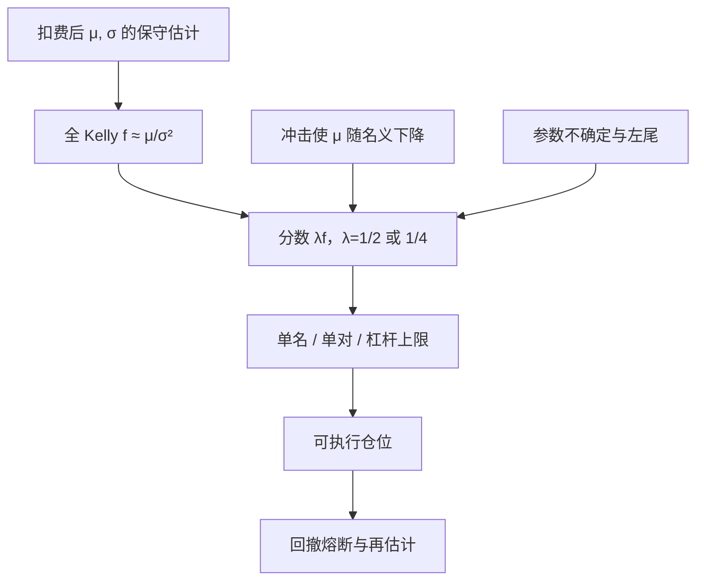

# 仓位与 Kelly / 分数 Kelly

    
若重复独立的赌局有正的期望对数财富增长，存在一个最大化该增长率的投注比例；把估计当真理并下满这个比例，在参数不确定时会把增长变成破产风险。

    <footer>—— Kelly, A New Interpretation of Information Rate, Bell System Technical Journal, 1956；Thorp 与 Samuelson 之后的分数化实践</footer>

Kelly 1956 年从信息率出发：在重复赌局中，按后验优势把财富的一个固定比例投注，可使财富的对数期望（渐近增长率）最大。Thorp 把它带到 21 点与证券；连续时间、正态超额收益下，全 Kelly 仓位近似 $\mu/\sigma^2$，与 Merton 对数效用的风险资产权重同形。统计套利里「每对、每个 Z-score 信号下多少名义」常被不严谨地叫做 Kelly。真正约束增长的是：边缘 $\mu$ 要在扣费后估计、且估计噪声很大；满 Kelly 对 $\mu$ 高估极度敏感；Samuelson 批评用增长率代替期望效用。实务几乎总是分数 Kelly，并加杠杆上限与回撤熔断。它不保证正复利。

## 问题

设每期超额收益（已扣融资）为 $R$，财富 $W_{t+1}=W_t(1+f R_{t+1})$。Kelly 选 $f$ 最大化 $\mathbb{E}[\log(1+f R)]$。两点分布（以概率 $p$ 赢 $b$ 倍、否则输光投注）下有闭式 $f^\ast=p-(1-p)/b$。证券上 $R$ 连续且可亏过投注（若有杠杆），$f$ 的定义域被 $1+fR>0$ 限制。问题变成：统计套利的 $R$ 既不是独立同分布，也不是已知分布——残差回归、基差收敛都有破裂与拥挤，样本均值不是 $\mu$。

若把回测夏普 $\widehat{\mathrm{SR}}$ 代入 $f\approx\mathrm{SR}/\sigma$，高估夏普会线性抬高杠杆。高估若来自未计入的[交易成本](/quant/net-edge)或多重检验，满 Kelly 会在真实 $\mu$ 接近零甚至为负时仍加杠杆。Kelly 原论文假设概率已知或可从信息精确更新；市场边缘没有那样的信道。

### 对数增长最大不是人人要的目标

Samuelson 指出，最大化渐近增长率并不最大化有限视野的期望效用，除非效用恰好是对数。对更厌恶风险的人，最优 $f$ 更小。即使接受对数效用，参数不确定等价于更厌恶：应对 $\mu$ 积分而不是插一个点估计。MacLean、Thorp 与 Ziemba 汇编的文献反复出现同一处方：用全 Kelly 的 $1/2$ 或 $1/4$，以降低估计误差导致的过度投注。分数不是随意打折，是对模型误差的承认。

连续近似 $f=\mu/\sigma^2$ 在 $\mu$ 为年化 5%、$\sigma$ 为 10% 时给出 $f=5$，即五倍杠杆。统计套利残差策略的样本 $\mu$ 常常是未扣真实冲击的。把纸面 $\mu$ 代入该公式，是最常见的爆仓路径之一。

## 方法

可落地的分层。第一层：单策略扣费后的 $\hat\mu,\hat\sigma$，用保守区间（例如均值的下置信界）代入 $f_{\mathrm{full}}=\hat\mu/\hat\sigma^2$，再取 $f=\lambda f_{\mathrm{full}}$，$\lambda\in\{1/2,1/4\}$。第二层：多策略、多配对时，Kelly 变成增长最优组合，权重与协方差逆有关；估计 $\Sigma$ 在高维同样不稳，必须收缩，并约束单名与单对上限。第三层：波动目标（例如组合年化波动 10%）往往比直接 Kelly 更可审计，它相当于假设夏普稳定、只缩放 $\sigma$；夏普若不稳定，波动目标仍会在边缘消失时保持风险，只是比满 Kelly 温和。

与 Z-score 的接口。不要把 $|z|$ 线性映射成 Kelly 分数： $|z|$ 大可能是破裂而不是更大的 $\mu$。更一致的做法是：信号只决定方向与是否开仓，仓位由组合级风险预算决定；或对 $\mu(|z|)$ 用样本外校准，并在 $|z|$ 进入极端分位时改为减仓而非加仓。后者需要预先写进规则，不能在亏损后才发明。

### 再平衡、离散与路径依赖

Kelly 理论常假设每期按新财富再平衡。统计套利有最低手数、涨跌停、借券可获得量，再平衡本身产生换手成本，侵蚀 $\mu$。降低再平衡频率是在用跟踪误差换成本，最优频率与冲击函数绑定，不是信息率公式的一部分。路径依赖：同样的平均增长，先大亏后大赢与先大赢后大亏对杠杆约束、保证金、心理止损的命中不同。分数 Kelly 降低杠杆，主要价值往往是减少「触及融资或风控强平」的概率，而不是提高渐近增长率。

Kelly 对独立重复赌局最优，对序列相关、有状态（拥挤、波动集群）的残差并不最优。状态依赖的 $f$ 需要条件期望；用无条件 $\mu$ 在高压期保持仓位，等于否认[协整破裂](/quant/cointegration-break)与拥挤。

## 机制

对数效用下，边际上要把财富增长的几何均值推高，避免零财富。全 Kelly 在已知优势的掷币里是「不破产且渐近最快」。优势一旦是估计的，过度投注的损失是非对称的：低估 $f$ 只是增长慢一点，高估 $f$ 使财富波动的对数期望下降甚至为负。这就是为何分数化几乎总是占优满仓 Kelly——不是因为市场「更有效」，而是因为 $\hat\mu$ 的误差分布向高估一侧被回测选择所污染。

统计套利的「优势」来自回归速度 $\kappa$ 与偏离幅度，但单次交易的 $R$ 有天花板（价差回到均值）和地板（破裂、停牌）。收益分布左尾比掷币更肥。Kelly 公式用 $\sigma^2$ 代表全部风险，对跳跃不够。实务用仓位上限、单对损失上限、组合回撤熔断来补这一块，这些都不是 Kelly 原式的项，却决定能不能活过样本外的第一次结构变化。

### 容量：Kelly 不管市场深度

$f^\ast$ 按自己的财富比例出清，不读 ADV。财富变大后，同一 $f$ 对应的名义超过成份股深度，$\mu$ 随冲击下降，真正的增长最优 $f$ 应内生化价格影响。大账户必须把 Almgren–Chriss 一类冲击放进有效 $\mu(f)$，再对 $f$ 求解；解通常远小于无摩擦 Kelly。忽略这一点会把小样本账户的分数 Kelly 直接乘到基金规模上。指数与 ETF 套利同样：基差边缘以基点计，Kelly 会建议很大的名义，直到你发现一揽子无法在该名义下成交。

## 边界与工程取舍

不要用未扣费、含未来函数的回测夏普去算 $f$。不要在杠杆上再叠满 Kelly，把两层乐观相乘。监管与经纪商的保证金、A 股 T+1 与涨跌停，会把连续公式的 $f$ 变成不可执行。对数财富目标与客户的季度相对基准也冲突：Kelly 允许深回撤换长期增长，多数委托合同不允许。

分数 $\lambda$ 的选择应在压力情景下校准：例如残差相关升至 0.3、有效价差翻倍、$\mu$ 减半时，组合是否仍满足最大回撤约束。若只有在历史最好的子样本里满 Kelly 才「看起来好」，则应拒绝该杠杆。Kelly 1956 解决的是已知信道的重复赌局；把它写成证券的最优杠杆定理，必须附上估计误差、冲击与效用设定三条免责。

Thorp 自己强调分数 Kelly 与安全边际。引用 1956 年论文却下满 $\hat\mu/\hat\sigma^2$，是只借了公式、没借实践里对不确定性的处理。

## 小结

- Kelly（1956）最大化重复赌局的对数财富增长；连续近似下 $f\approx\mu/\sigma^2$，与对数效用的 Merton 权重同形。
- 边缘必须是扣费后的，且对估计误差高度敏感；满 Kelly 在高估 $\mu$ 时非对称地伤害增长。
- 分数 Kelly、波动目标、单对上限与冲击内生化，是可审计的实践；它们降低的是破产与强平风险，不创造保证复利。
- 容量不在原公式里：名义大时 $\mu(f)$ 下降，最优 $f$ 远小于无摩擦解。
- 出处：Kelly, *Bell System Technical Journal*, 1956；Thorp 在 MacLean–Thorp–Ziemba 文集中的综述；Samuelson 对几何均值准则的批评；连续时间对照 Merton, *Review of Economics and Statistics*, 1969。
