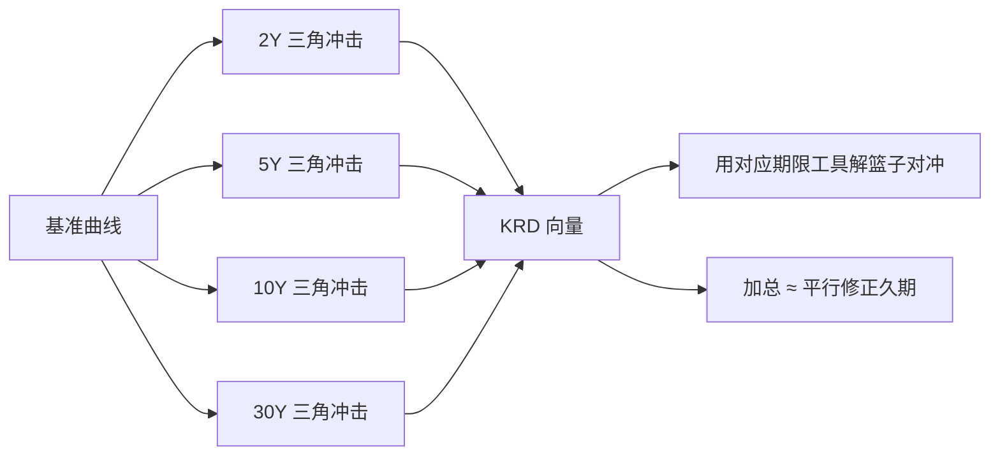

# 关键利率久期

    
把收益率曲线的风险拆到若干关键期限上，每个期限做一次局部平移、其余用插值衔接；得到的一组久期描述形状风险，而不只是平行移动。

    <footer>—— Ho, Key Rate Durations: Measures of Interest Rate Risks, Journal of Fixed Income, 1992</footer>

修正久期把整条曲线的平行移动收成一个数。真实曲线还会变陡、变平、在某个期限出现折缝。Thomas Ho 1992 年在 *Journal of Fixed Income* 提出关键利率久期（key-rate duration, KRD）：选定一组关键期限（如 2Y、5Y、10Y、30Y），在每个关键点把曲线抬高一点，两侧用线性（或其他规定的）插值落到未扰动的节点，计算价格的相对变化。一组 KRD 之和近似等于平行移动下的修正久期；每一个单独的 KRD 告诉你对「那一段」的暴露。它是固定收益版的分桶 Vega：把一维希腊字母换成沿期限的向量。与 [Bootstrap 曲线](/quant/curve-bootstrap) 的节点、与 [久期、凸性](/quant/duration-convexity) 的标量，三者构成同一套曲线风险语言的不同分辨率。

## 问题

平行久期无法区分 barbell 与 bullet：两者可以有相同的修正久期，却对 10Y 扭转符号相反。主成分分析能给出水平、斜率、曲率因子，但对冲要用可交易的 2Y、10Y、30Y 工具，因子权重还得再映射。关键利率直接定义在交易期限上：扰动 10Y 关键点，就用 10Y 互换或国债去对冲该 KRD。问题是如何规定「只动一段」而不破坏曲线的连续性，以及多少个关键点才够：太少，中间形状自由；太多，对冲工具共线，估计噪声大。

Ho 的做法是工程性的：关键点上冲击为 1，相邻关键点上冲击为 0，中间线性。这样一组三角形扰动构成曲线冲击空间的一组基。任意分段线性的曲线变动，都可以写成关键冲击的线性组合，KRD 就是价格对这组基的梯度。

### 三角形冲击

设关键期限 $T_1\lt \cdots\lt T_k$。第 $j$ 个情景里，即期（或所用坐标）在 $T_j$ 增加 $\Delta$，在 $T_{j-1}$ 与 $T_{j+1}$ 为 0，之间线性。价格变为 $P^{(j)}$，则

$$
\mathrm{KRD}_j = -\frac{1}{P}\frac{P^{(j)}-P}{\Delta}.
$$

单位与修正久期相同。对所有 $j$ 把冲击同向相加，若插值是线性的，合成接近整体平行移动，故 $\sum_j \mathrm{KRD}_j \approx D_{\mathrm{mod}}$。差异来自日计数、边界（最短端以左、最长端以右如何外推）以及曲线坐标不是即期而是远期。应在系统里核对这一加总恒等式，作为实现测试。

关键点必须与对冲工具的流动性对齐。把关键点设在 7Y 却只能交易 5Y 与 10Y，KRD 漂亮但对冲要拆到相邻桶，等于没选对基。

## 方法

计算步骤：取今日曲线；对每个关键点生成扰动曲线；用同一套定价引擎重估组合；差分得 KRD。含权产品、MBS、非线性凸性都自动进入有效 KRD，因为用的是全价而不是 YTM 公式。多曲线下应对 OIS 与各投影曲线分别做关键冲击，得到「哪一条曲线、哪一个期限」的矩阵，而不是一条 KRD 向量，见 [OIS 与多曲线](/quant/multi-curve-ois)。

对冲：若 10Y KRD 为 $d_{10}$，10Y 对冲工具的 10Y KRD 为 $d_{10}^h$，名义取 $-d_{10}/d_{10}^h$ 的数量级，并检查对其它关键点的泄漏。泄漏来自对冲工具本身也有相邻 KRD（一只 10Y 债券对 5Y 关键点不是精确为零）。要用一篮子关键工具解线性方程，使向量 KRD 落入限额，而不是逐个桶独立打零。

### 与主成分、DV01 分桶

PCA 的水平因子接近 KRD 之和，斜率接近长端减短端的加权差。KRD 更笨、更可交易。DV01 分桶若按现金流归属到最近节点，与 KRD 相近但不完全相同：KRD 是曲线扰动的价格导数，现金流分桶是把线性折现敏感归堆。对简单固息债二者接近；对含曲线期权的产品，只有重定价差分抓住凸性与波动。Bootstrap 插值若全局泄漏，KRD 的三角形在实现层就不是三角形，10Y 扰动会改变 30Y 远期，Ho 的解释崩掉——这是 Hagan–West 强调局部插值的原因之一。

## 机制

KRD 把形状风险变成可加的桶。陡峭化：短端 KRD 与长端 KRD 反号的组合会亏或赚，而平行久期显示中性。这正是 barbell 的风险：两端关键点暴露大、中间小。Bullet 则集中在一个关键点。凸性仍是二阶：KRD 是一阶，大冲击要用关键凸性或情景。Ho 的论文把对象定义为风险管理测度，不是新的定价模型；定价仍用整条曲线，风险报告用 KRD 投影。

边界关键点的外推规则影响短端存款与超长债券。若 30Y 以右曲线平移与 30Y 关键点绑定，40Y 负债会表现为巨大的 30Y KRD，对冲却只能用 30Y 工具，留下超长残差。应显式增加 40Y 关键点，或声明外推并单独限额。短端同理：隔夜政策利率与 2Y 关键点之间的形状，在只有 2Y 为第一关键点时被折叠。

### 多曲线与基差

OIS 的 10Y KRD 与 LIBOR 投影的 10Y KRD 是不同风险：前者用 OIS 互换对冲，后者用 LIBOR 互换或基差互换。把它们加总成一个「10Y 久期」会在基差波动时失效。跨币种还有交叉货币基差曲线的关键期限。Ho（1992）的原文在单曲线国债世界里叙述；今日要把「关键利率」理解成「关键曲线上的关键期限」。

KRD 对 $\Delta$ 的大小有弱依赖，因为凸性。应用与限额相同的冲击（例如 1bp 或 10bp）计算，不要混用解析 YTM 久期与 50bp 有效 KRD。

## 边界

三角形基不能张成任意光滑曲线变动；非常局部的折缝若落在两关键点之间，会被两个桶分摊，对冲工具无法精确复制。关键点过多导致矩阵病态：相邻互换高度相关，解出的篮子名义巨大且符号相反。应限制条件数，或用 PCA 缩维后再映射到少量关键工具。信用曲线、通胀曲线各自需要自己的关键点，不能借用国债 KRD。

Ho（1992）给出测度与对冲哲学。它不替代凸性限额，不替代多曲线，也不规定关键点集合。实现必须与曲线插值一致，否则纸面上的三角形不是引擎里的三角形。与 Macaulay 久期的关系是分辨率：一个数对平行，一组数对分段线性形状。

用历史回归「哪些关键点最重要」来每天更换关键点集合，会使 P&L 解释断裂。关键点应稳定，像会计科目；哪些暴露大可以变，科目本身不要天天改。

## 小结

- Ho（1992）用关键期限上的局部（三角形）平移定义一组久期，刻画非平行的曲线风险。
- KRD 之和应近似等于平行修正久期；加总失败说明插值或外推与定义不一致。
- 对冲应在关键工具上解向量，而不是假设一只债券只影响一个桶。
- 含权产品必须用全价重估得到有效 KRD；现金流分桶只对简单线性产品近似成立。
- 多曲线下 KRD 是「曲线 × 期限」矩阵；基差是独立维度。
- 出处：Ho, *Journal of Fixed Income*, 1992；平行久期见 Macaulay, 1938 与 Hull；曲线插值见 Hagan and West, 2006。
