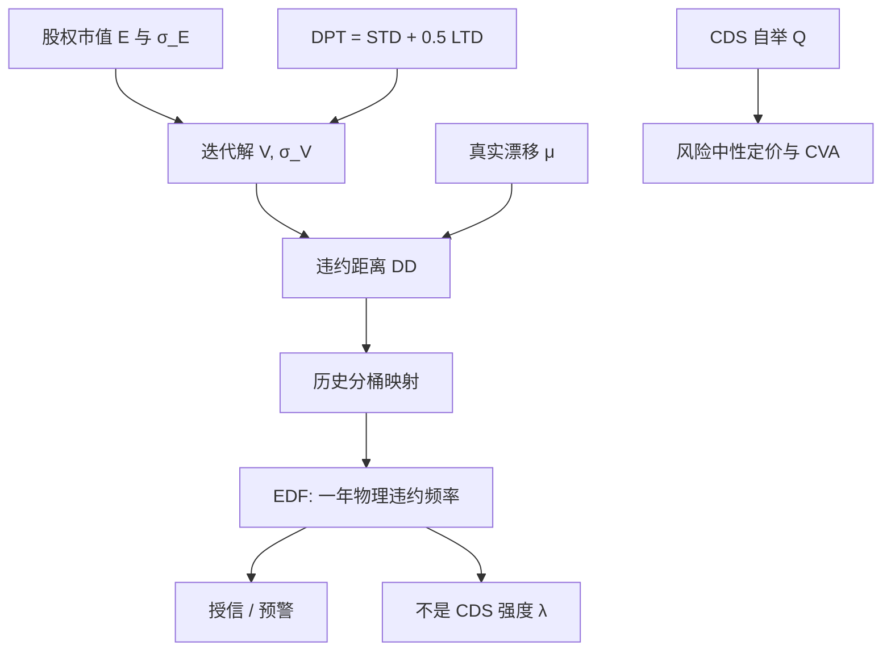

# KMV 违约距离 DD

把资产价值到违约点的距离用资产波动标准化，再拿历史违约频率把这个距离映射成 EDF；结构公式负责排序，经验表负责概率，二者不要合成风险中性 CDS。

<footer>—— Crosbie & Bohn, Modeling Default Risk, Moody's KMV, 2003（及此前 KMV 技术文档的同一构造）</footer>

[Merton 结构模型](/quant/merton-structural) 把股权写成资产看涨，并给出风险中性利差。KMV（后并入 Moody's）把同一期权图景改成信用监测工具：关注的不是看跌价格，而是真实测度下「还有几个资产标准差会撞上负债」。Crosbie 与 Bohn 把违约点取成短期负债加一半长期负债，用股权市值与股权波动迭代出资产价值 $V$ 与 $\sigma_V$，定义违约距离 DD，再通过历史样本把 DD 映射为期望违约频率 EDF。本篇写这一实务构造、它与 $N(-\mathrm{DD})$ 的差别，以及为何 EDF 不能直接当 [CDS](/quant/cds-pricing) 强度；利率动态仍不是 KMV 的重点，随机利率留给 [混合定价](/quant/rates-credit-hybrid)。

## 问题

上市公司能观察的是股权市值 $E$ 与股价波动，不能观察企业资产 $V$。Merton 给出两个方程，原则上可解 $(V,\sigma_V)$。银行与评级用户要的却是一年内违约的实际频率，用来授信、限额和早期预警，而不是用来对冲 CDS。若直接把风险中性 $N(-d_2)$ 当违约概率，会混进股权风险溢价，且短端连续路径使概率过低，对高杠杆金融机构尤其失真。

KMV 的回答分三步，每一步都偏离原文 Merton：违约点不是单一零息面值 $D$；DD 用真实漂移或甚至用简单的 $(V-\mathrm{DPT})/(V\sigma_V)$；概率不是正态 CDF，而是经验映射。问题是可识别性与样本：负债结构复杂、股权波动有杠杆倾斜、违约样本稀疏且受周期影响。把 DD 当成连续交易信号还可以；把 EDF 当成已经校准到 CDS 的 $\lambda$，就把物理测度对象塞进了风险中性定价。

### 违约点不是账面总负债

Crosbie–Bohn 的违约点

$$
\mathrm{DPT}=\mathrm{STD}+\tfrac12\mathrm{LTD},
$$

即流动负债（及短期债务）全额计入，长期负债只计一半。经验理由是：一年地平线上，长期债不必全部再融资，但短债必须滚。这与 Merton 到期一次还本不同，也与 [Black-Cox](/quant/black-cox) 的连续边界不同。DPT 随财报更新而跳，季报窗口会让 DD 跳动，需要与市值更新分开版本化。或有负债、经营租赁、表外承诺会让 DPT 偏低；金融公司的短期批发融资使「一半长期」规则偏松，KMV 对金融机构常另套。

DD 地平线通常取一年，与 EDF 表一致。用五年 DD 去解释五年 CDS，既改了距离的尺度，又没有对应的五年经验映射，不能靠 $\sqrt{T}$ 硬扩。

## 方法

**迭代资产。** 股权视为以 DPT 为执行价、期限为地平线（常一年）的看涨。观察到 $E^{\mathrm{mkt}}$ 与由股价估计的 $\sigma_E$，解

$$
E=V N(d_1)-e^{-rT}\mathrm{DPT}\,N(d_2),\qquad
\sigma_E E = \Delta\,\sigma_V V,
$$

$\Delta=N(d_1)$。需要迭代：先猜 $V$，由看涨公式反推或由 $\sigma_E$ 关系更新 $\sigma_V$，直到两式同时满足。实务上还用高频股价估计 $\sigma_E$，并对杠杆导致的 $\sigma_E$ 时变做平滑。Bharath–Shumway 后来指出，朴素用 $E+\mathrm{账面债}$ 当 $V$、用股权波动当 $\sigma_V$ 的简单 DD，预测力已经很强，迭代增量有限——KMV 的工程价值更多在违约点定义与 EDF 映射，而不在解方程的精度。

**违约距离。** 常用两种写法。对数 Merton 型

$$
\mathrm{DD}=\frac{\ln(V/\mathrm{DPT})+(\mu-\sigma_V^2/2)T}{\sigma_V\sqrt{T}},
$$

$\mu$ 是资产的真实期望回报（可由股权回报与杠杆反推，或用一个长期均值）。KMV 文档中更直观的水平写法是「资产净值除以一倍资产波动」：

$$
\mathrm{DD}\approx\frac{V-\mathrm{DPT}}{V\sigma_V\sqrt{T}}.
$$

两者在深度实值（高 DD）时接近，在接近违约时对数形式更接近期权。报告应固定一种，不要混用后再比较分位数。

**EDF 映射。** 关键步骤：在历史交叉样本里，把公司按 DD 分桶，统计随后一年实际违约频率，得到 $\mathrm{EDF}=F(\mathrm{DD})$，而不是 $\mathrm{EDF}=N(-\mathrm{DD})$。Crosbie–Bohn 强调经验频率高于正态尾，因为资产有跳、负债会修订、违约点本身随机。映射表随周期更新；衰退里同一 DD 对应更高 EDF。这是为什么 DD 排序在截面上稳定，而 EDF 水平会随周期整体平移。

### 与 CDS、评级和授信的接口

EDF 是物理测度、一年地平线、优先债务一类定义下的违约频率。CDS 升水是风险中性强度加回收加流动性。把 $\mathrm{EDF}\approx(1-R)\lambda$ 去「验证」自举曲线，会系统性地发现 EDF 低于 CDS 隐含概率——差额是信用风险溢价，不是自举错了。授信与限额用 EDF 合理；CVA 与 CDS 对冲必须用 [生存曲线自举](/quant/cds-survival-bootstrap)。评级是离散、滞后、过周期平滑的意见；DD 是市值驱动的连续量。两者一起用时，应把 DD 恶化而评级未动当成预警，而不是把 EDF 映射成评级字母再进模型。

结构错向：对手方 DD 下降时，若你的组合暴露同时变大，CVA 独立公式偏低。KMV 给相关一个可监测的状态（对方的 $V$），但仍不能给出风险中性 $\rho$。混合定价要另建，见 [利率-信用混合](/quant/rates-credit-hybrid)。

## 机制

经济机制仍是期权：杠杆越高、$V$ 越近 DPT、$\sigma_V$ 越大，DD 越短，随后一年违约越频繁。股权波动在杠杆下被放大，所以股价大跌会通过 $E$ 与 $\sigma_E$ 两条通道压缩 DD——这是 KMV 比纯账面杠杆敏感的原因。经验映射把「正态世界里几乎不违约的远尾」改写成「历史上这些 DD 的公司有 x% 倒了」，从而修复 Merton 短端概率过低的一部分，但修复的是无条件频率，不是不可料跳的风险中性密度。

$\mu$ 进入 DD 却不进入 CDS 定价：真实漂移越高，一年后 $V$ 越可能远离 DPT，EDF 越低；风险中性定价用 $r$ 替代 $\mu$，利差更宽。把 EDF 当 $\lambda$ 就是把股权溢价误当成违约补偿。Crosbie–Bohn 把模型定位为违约风险测量，而不是衍生品定价引擎，这一边界必须写进使用说明。

EDF 映射表是专有经验资产。复制「KMV」却用 $N(-\mathrm{DD})$，只做了 Merton 距离，没有做 KMV。比较供应商 EDF 时，先问违约点规则、地平线与映射样本，再问迭代细节。

### 会计、流动性与非上市

财报滞后、应计与表外项使 DPT 过时；市值却天天动，于是 DD 在季报附近既有信息也有噪声。回购与现金变化应进入净债务，否则 $V$ 与 DPT 双错。非上市没有 $E$，要用会计或可比公司，DD 退化成杠杆加行业波动，排序价值下降。流动性差的股票 $\sigma_E$ 被微观结构噪声抬高，DD 被低估，限额会过紧——应对 $\sigma_E$ 做噪声调整，而不是把 DD 阈值一律放宽。

## 边界与工程取舍

不要对滚动隔夜负债的经纪商用「一半长期债」的非金融规则。不要用期权隐含 $\sigma_E$ 当历史 $\sigma_E$ 却不处理偏斜：虚值看跌隐含波动更高，会系统性压低 DD。不要用单一全球映射表覆盖新兴市场与银行——违约定义与样本密度不同。不要把 DD 日频变化当成可交易 alpha 而不扣微观结构与指数重估。

作为风险因子，DD 适合截面排序与预警；作为定价输入，最多充当错向或混合模型的状态变量，概率仍须 CDS。资本公式若用 EDF 当 PD，应明确是内部评级法的物理 PD，与 CVA 的风险中性 $Q$ 分列。

出处：Crosbie & Bohn, *Modeling Default Risk*, Moody's KMV, 2003。期权结构来自 Merton, *Journal of Finance*, 1974。预测力比较见 Bharath & Shumway, *Review of Financial Studies*, 2008。KMV 不是 Black–Scholes 公式本身。

## 小结

- KMV 的 DD 把资产到违约点的距离用 $\sigma_V$ 标准化；DPT 取短期负债加一半长期负债。
- 由股权市值与波动迭代 $(V,\sigma_V)$；EDF 来自历史 DD 分桶，不是 $N(-\mathrm{DD})$。
- EDF 是物理测度预警，CDS 与 CVA 用风险中性生存曲线，二者差额含风险溢价。
- 金融机构、表外负债与股权噪声会破坏违约点与 $\sigma_E$，规则不能全球一套。
- 结构故事与 Merton 同源；KMV 的增量是违约点、真实测度距离与经验映射。
- 出处：Crosbie & Bohn, Moody's KMV, 2003；Merton, 1974；Bharath–Shumway, 2008。
