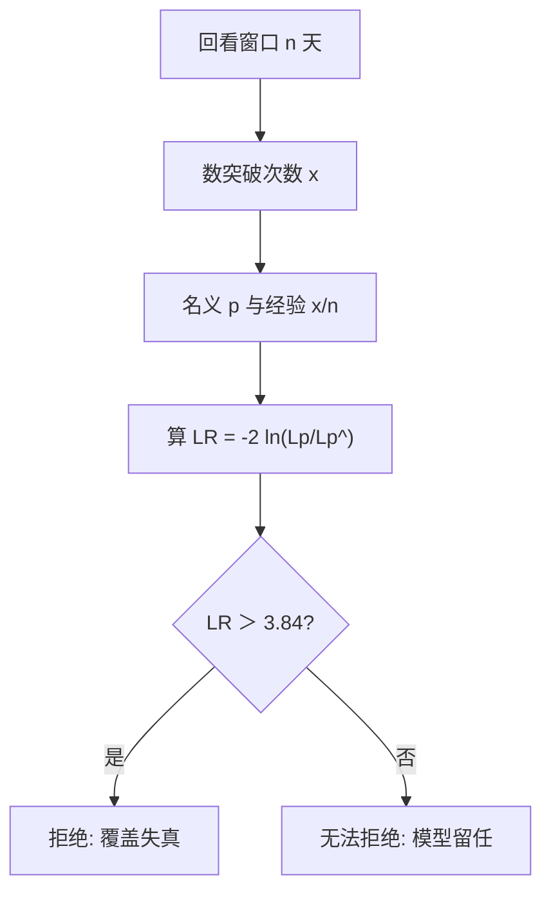
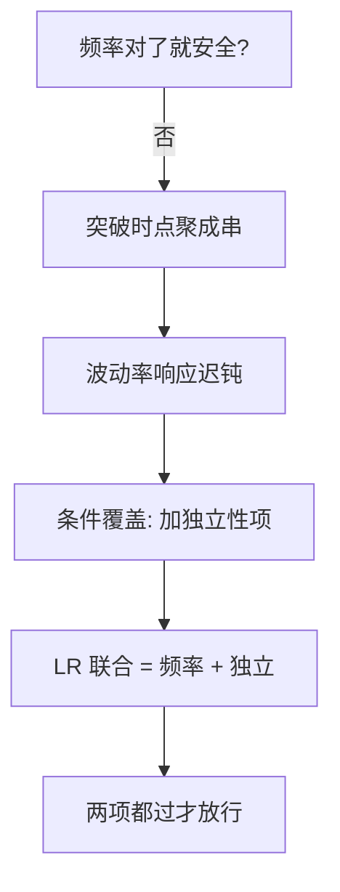

# Kupiec 回测检验

VaR 模型说「99% 的日子亏损不超过 X」，Kupiec 检验问的只有一句：突破次数对得上吗？

<footer>—— 据 Kupiec (1995) 无条件覆盖检验；Christoffersen (1998) 独立性扩展</footer>

[PFE 敞口曲线](/quant/pfe-ee-profile)是模型的输出，本课是模型的体检：风险模型给出的 VaR 分位数是否名副其实。缺口是**回测覆盖检验**——把「突破次数」换算成一个能拒绝/不能拒绝的统计量。Kupiec 检验是这一族里最朴素也最常被监管点名的一个。本课只做频率维度，不进 Christoffersen 的独立性维度。

## 问题

250 个交易日、99% VaR：期望突破 2.5 天。实际突破 5 天，模型坏了还是运气差？拍脑袋定不了。缺口：**把观察频率与名义覆盖率的偏离量化成 p 值**，并给「红区」一个客观边界（Basel 交通灯）。本课不评估突破的聚类（那正是独立性检验的活）。

术语翻译：突破（exception）= 实亏越过 VaR 的日子；覆盖率（coverage）= 名义「不突破概率」，99% VaR 即覆盖率 99%。Kupiec 的原名叫 POF 检验——Proportion of Failures。

数字实例：$n=250$、$p=1\%$。突破 $x=2$ 时似然比 $LR=0.06$（远小于 3.84，不拒绝）；$x=5$ 时 $LR\approx 4.5$（在 5% 水平拒绝）；$x=7$ 时 $LR\approx 12$（强烈拒绝）。同样的 250 天，「5 次突破」已经够把模型送进黄区。

## 方法

似然比检验三步：在原假设下突破概率为 $p$，似然 $L_p=(1-p)^{n-x}p^x$；不受约束地用样本频率 $\hat p=x/n$ 算 $L_{\hat p}$；取 $LR=-2\ln(L_p/L_{\hat p})$，原假设下渐近 $\chi^2(1)$，超 3.84 即 5% 水平拒绝。全程一个公式，任何回测系统都能内嵌。

直觉类比：Kupiec 像投篮命中率质检——教练说「罚球 99% 中」，一个赛季 250 罚只中 243，Kupiec 算的不是「差 7 个球多不多」，而是「若真有 99% 水平，差这么多概率多大」。概率小到说不过去，才判教练吹牛。

## 机制

检验的力量来自似然比对数刻度的可加性：突破每多一天，$LR$ 增量非线性放大——这正是「黄区红区」的统计底座。Basel 交通灯把 250 天、99% VaR 的突破数分三段（0–4 绿、5–9 黄、≥10 红），与 Kupiec 在不同置信度下的拒绝域大体咬合。但检验只能看**频率**：突破若全挤在危机周（聚类），频率检验可通过而模型早已失效——条件覆盖（Christoffersen）在 $LR$ 上加独立性项，用一阶马尔可夫把「昨天突破是否抬高今天突破概率」也收进检验。

常见误区：把「未拒绝」当「模型正确」——250 天样本对 99% VaR 的检验功效极低，真实覆盖率 98% 的坏模型几乎必然蒙混过关；另一个是拿多模型里回测最好的那个上线（多重检验偏差），等于把显著性全烧光。

## 边界

功效与样本是死结：想以 50% 功效检出 99% 变 97.5% 的漂移，需要约 2000 天——一个完整的信用周期。窗口滚动态的选择（逐日滚动 vs 逐年重置）会改变突破的独立性结构，进而影响第二维检验的适用性。对 ES（期望损失）覆盖率检验没有 Kupiec 式单参数版本，业界的替代是 Acerbi–Szekely 检验量。与模型治理的接口：Kupiec 是「模型退役」的客观依据之一，但不该是唯一——回测只能证明历史，不能担保明天。

直觉类比：Kupiec 是体温计不是 CT——它能便宜地回答「烧没烧」，回答不了「烧在哪」；频率异常先上体温计，定位病因要靠条件覆盖与损益归因这些更贵的检查。

## 小结

- Kupiec POF：$LR=-2\ln(L_p/L_{\hat p})$，渐近 $\chi^2(1)$，3.84 是 5% 线。
- 250 天 99% VaR 的功效极低，未拒绝 ≠ 正确；多重检验会烧掉显著性。
- 频率之外还有聚类维度，Christoffersen 条件覆盖补上独立项。
- 出处：Kupiec「Techniques for Verifying the Accuracy of Risk Models」1995；Christoffersen 1998；Basel 交通灯框架。
