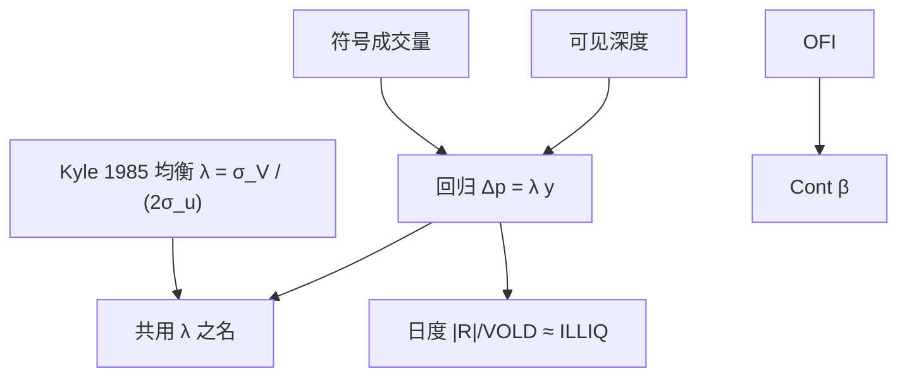

# Kyle lambda 冲击系数

做市商只看见总订单流，价格对流量线性反应；那个斜率既是深度的倒数，也是信息被写进价格的强度——经验上人们把回归系数也叫做 lambda，但那已经是另一个对象。

<footer>—— Kyle, Continuous Auctions and Insider Trading, Econometrica, 1985</footer>

[Kyle 模型](/quant/kyle-model) 给出均衡里的 $\lambda=\sigma_V/(2\sigma_u)$：噪声交易越多，同样的知情数量越不容易被认出来，冲击越小。经验研究与交易台把

$$
\Delta p_t=\lambda y_t+\varepsilon_t
$$

的斜率也叫做 Kyle's lambda，其中 $y$ 是带符号成交量或订单流。Hasbrouck 和其他市场质量文献用它比较股票、比较时段的冲击成本；Goyenko、Holden、Trzcinka 等把它与价差、[Amihud 非流动性](/quant/amihud-illiquidity) 对照。本篇写这个**回归对象**如何构造、它和 1985 年均衡参数的距离、以及它和 Cont 的 OFI $\beta$、日度 ILLIQ 如何换算。理论机制不再重复模型全文；这里处理估计。

## 问题

交易者要一个数字回答「我下这么多量，价格会走多远」。价差只覆盖一笔小单的立刻成本；深度曲线随时间变；完整的 $P(Q)$ 难以在截面上对成千上万只股票每天算一遍。线性斜率 $\lambda$ 是压缩：假定在某个窗口内冲击与带符号流量成正比。问题是定义 $y$、定义 $\Delta p$、定义窗口，使 $\hat\lambda$ 比较的是深度而不是弹跳、不是公告、不是你把买卖价差写进了因变量。

第二个问题是名称。原文 $\lambda$ 是知情者与做市商最优反应的固定点，依赖于不可观测的 $\sigma_V,\sigma_u$。回归 $\hat\lambda$ 是可观测流对价格的投影，混有存货、机械深度、公开信息与逆向选择。二者同号、同量纲（价格/数量），不是同一随机变量。Kyle（1985）自己并不估计某个市场的 $\lambda$。

### 从均衡 λ 到回归斜率

单期均衡里 $p=\mu+\lambda y$，$y=x+u$。经验上没有 $V$，只能看价格变化。若有效价格本身在窗内因公开信息跳动，这部分会进 $\Delta p$ 而不进 $y$，把 $\hat\lambda$ 当噪声；若公开信息同时引发流量，又会把 $\hat\lambda$ 向上偏。因此窗口要短到深度近似不变，又要长到 $y$ 有足够变差。日内五分钟、十五分钟是常见折中；逐笔回归则更接近 Cont 的 OFI 设定，应改叫冲击系数而不是直接贴 1985 的标签。

量纲必须声明：$y$ 用股数、用金额、还是用成交量的标准差标准化，会让 $\hat\lambda$ 差几个数量级。截面排序通常对金额或对换手标准化，否则高价股、大盘股的 $\lambda$ 只是单位问题。与 Amihud 的桥梁是：日度 $|R|/\mathrm{VOLD}$ 像把 $|\lambda y|$ 除以 $|y|$ 再对符号取绝对值的粗糙平均，故 ILLIQ 常被当作 $\lambda$ 的低频代理。

原文做市商看见的是净市价需求。限价簿上把限价增撤也算进 $y$，对象就变成 OFI，$\hat\beta$ 与 $\hat\lambda$ 不可比。写方法时必须一句说清 $y$ 是符号成交量还是簿事件净额。

## 方法

日度构造（Hasbrouck 一类市场质量度量常用）：在每个交易日，用日内等间隔收益对同期带符号成交额回归，斜率取绝对值或保留，再在月内平均。符号可用 Lee–Ready 或成交相对中点。开收盘集合竞价单独处理或剔除。个股 $\hat\lambda$ 右偏、噪声大，截面上常用对数或分位。

高频构造：在事件时间或极短日历窗，

$$
\Delta m_t=\lambda\,\mathrm{sgn}(v_t)\,v_t+\varepsilon_t
$$

或直接对 OFI 回归。此时 $\lambda$ 随深度分钟级变化，应滚动估计，或把深度放进分母：$\Delta m=\lambda\, y/D+\varepsilon$，使 $\lambda$ 更接近无量纲的弹性。控制变量：滞后收益吸收弹跳与存货回复；同期公开信息代理（指数期货收益）吸收共同冲击，否则个股 $\lambda$ 含市场 beta。

### 符号成交量、窗口与公开信息

Lee–Ready 在价差只有一 tick 时错误率高，符号噪声把 $\hat\lambda$ 向零拉。用交易所提供的主动方向字段更干净，但仍有隐藏单与跨境。窗口太短，$y$ 稀疏，$\hat\lambda$ 不稳定；窗口太长，正负流量对冲，$y$ 变小、$\Delta p$ 含许多无关信息，$\hat\lambda$ 含义模糊。成交量时钟（等体积桶）与 VPIN 同源，适合在活跃突变时比较冲击，但桶内价格变化与符号分类会共享信息，见 [VPIN](/quant/vpin) 对批量分类的警告。

非线性几乎必然：小单主要付半价差，大单沿 [深度加权](/quant/depth-mid) 的阶梯走。线性 $\lambda$ 是局部斜率。应报告按 $|y|$ 分位的分段斜率，或二次项。若只在大单上估 $\lambda$，不要把它用到散户规模的成本模型上。

## 机制

在理论机制里，$\lambda$ 大可以是 $\sigma_V$ 大（价值不确定、逆向选择强），也可以是 $\sigma_u$ 小（没有噪声掩护、市场浅）。经验 $\hat\lambda$ 大同样有两种读法：知情流比例高，或可见深度薄。PIN 高与 $\hat\lambda$ 高经常一起出现，但回归无法单独指出是信息还是深度——除非把可见深度 $D$ 放进模型。除以 $D$ 之后仍显著的部分，才更像逆向选择。这与价差分解里「永久冲击」平行。

连续拍卖的教训是：知情者会拆单，使每一小窗的 $y$ 看起来像噪声。于是短窗 $\hat\lambda$ 可能低估持久信息的总冲击，日度 ILLIQ 反而把一天的累积走完。执行上这意味着：用短窗 $\lambda$ 去估「把今天全部数量一次下完」的成本会偏乐观，应用 $P(Q)$ 或把拆单路径积分。Kyle 原文的知情者最优 $\beta=1/(2\lambda)$ 不能拿来当算法拆单公式——那是模型里的策略性隐藏，不是交易所允许的操作手册；实务拆单是为了降低冲击与检测，应在自己的约束下优化，而不是复制均衡表达式。

### 与 Amihud、OFI 冲击的换算

粗换算：若 $\Delta p\approx\lambda y$，则 $|\Delta p|/|y|\approx\lambda$，日度对 $|\Delta p|/{\mathrm{VOLD}}$ 平均就得到 ILLIQ 型量。因此 Amihud 与日度 $\lambda$ 排序应高度相关，Goyenko 等人的比较文献支持这一点。OFI 的 $\beta$ 是每单位簿事件净额的中点移动，要把 $\beta$ 和 $\lambda$ 放在同一张表，先把 OFI 换成等价的股数或金额。不要报告「OFI 的 $R^2$ 更高所以 lambda 过时」：自变量不同，比的是设定，不是市场变了。

把 $\hat\lambda$ 写成「知情交易强度」需要额外结构，例如 PIN 或买卖持续。单独一个斜率不能识别 $\sigma_V$ 与 $\sigma_u$。政策或产品比较里，应同时给深度、价差与 $\hat\lambda$。

## 边界

线性、单一斜率、窗口内深度不变，是估计的舒适区。开盘、公告、涨跌停让斜率跳变，全日一个 $\hat\lambda$ 是混合物。多市场时本地 $y$ 与综合价格会对不齐，冲击被低估或算到错误的场所。最小报价单位使小单的 $\Delta p$ 被栅格化，$\hat\lambda$ 在低价股上偏高。

不要把回归 $\lambda$ 写进论文当「估计了 Kyle（1985）的均衡」。不要用它替代信息份额：后者拆的是多市场新息，前者是单市场流量弹性。不要在没有符号的成交额上估 $\lambda$。A 股涨跌停把 $\Delta p$ 截断，$y$ 仍可堆积，停板日的 $\hat\lambda$ 接近零或无定义，应剔除或单独建模。

高频 $\hat\lambda$ 对异常成交敏感。错价打印会同时制造巨大 $\Delta p$ 与虚假 $y$。先做 [tick 清洗](/quant/tick-cleaning) 再回归，否则 lambda 被少数印记主导。

## 小结

- 经验 Kyle lambda 是 $\Delta p$ 对带符号流量的斜率，量纲与窗口必须声明；它借用 1985 年的名字，不是原文均衡参数。
- $y$ 用成交量还是 OFI、是否除以深度，决定对象是冲击成本还是弹性。
- 短窗 $\lambda$ 偏机械深度，持续信息会被拆单稀释；日度 ILLIQ 是其低频绝对值代理。
- 线性只是局部；大单应沿深度曲线，而不是外推同一斜率。
- 符号分类、公告、涨跌停与错价打印构成估计边界。
- 出处：Kyle, *Econometrica*, 1985；经验冲击与市场质量见 Hasbrouck 后续度量文献；与价差代理的比较见 Goyenko, Holden and Trzcinka；高频线性冲击见 Cont, Kukanov and Stoikov, 2014。
