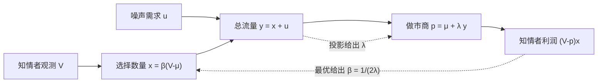

# Kyle 模型

知情交易者选择数量，把自己的需求藏进噪声交易里；做市商只看见总订单流，用线性价格函数出清。价格冲击系数衡量市场深度，也衡量信息被写入价格的速度。

<footer>—— Kyle, Continuous Auctions and Insider Trading, Econometrica, 1985</footer>

[上一课](/quant/glosten-milgrom)里知情者每期只暴露一个方向比特，价格是一对买卖报价。本课把知情交易推进到「选择下多少量」，把定价推进到按总订单流出清的价格。噪声交易者提交随机净需求，知情者观测价值后选择自己的量，做市商只看见两者之和。均衡里价格对总流量线性，斜率 $\lambda$ 是 Kyle's lambda。观测是带符号的数量，不是单位方向。

## 问题

[Glosten-Milgrom](/quant/glosten-milgrom) 不允许知情者选择数量。量下得越大，越快把价值变现，但也越快让总订单流暴露自己。缺口是求出一种策略：在做市商理性推断的前提下，知情者的最优隐蔽程度是什么，以及出清价格如何依赖那一股分不清来源的净需求。做市商看见 $y=x+u$，要给出 $p=E[V\mid y]$，否则被知情者系统性剥削。线性均衡若存在，则 $p=\mu+\lambda y$。噪声太少，知情者无处藏身，$\lambda$ 变大，交易自己摧毁价格；噪声充足，$\lambda$ 变小，每单位信息带来的价格移动也更小。Kyle 要证明这样的均衡可以写出来，并在连续拍卖的极限里描述信息被逐渐写入价格。

### 单期批量与连续拍卖

论文包含单期（一次出清）与连续拍卖两条结果。单期把机制收成清晰的代数：正态分布、线性策略、$\lambda$ 与知情者交易强度 $\beta$ 互为对方的最优反应。连续拍卖让知情者在一段时间内把信息「匀」进价格，避免在某一个批量里过度暴露。阅读时不要只用单期公式去描述全文：连续情形的要点是信息揭示的路径与深度可以随时间变化，而不是再给一个不同的 $\lambda$ 字母表。下面的方法以单期正态线性均衡把变量说清，再回到连续拍卖的机制含义。

Kyle 的价格是出清价，不是同时存在的 bid 与 ask。价差在此不是一等对象；一等对象是订单流的价格冲击。要把 $\lambda$ 翻译成买卖价差，需要额外的双向报价结构，那已离开 1985 年的设定。

## 方法

单期设定：价值 $V\sim\mathcal{N}(\mu,\sigma_V^2)$，噪声需求 $u\sim\mathcal{N}(0,\sigma_u^2)$，二者独立。知情者观测 $V$，提交 $x$，目标是最大化 $E[(V-p)x\mid V]$。做市商观测 $y=x+u$，设定 $p=E[V\mid y]$。猜线性均衡

$$
x=\beta(V-\mu),\qquad p=\mu+\lambda y.
$$

知情者把 $p$ 的线性反应当给定，最优时 $\beta=1/(2\lambda)$：只执行「若价格不反应时想交易的量」的一半，因为线性冲击会把另一半租吃掉。做市商的投影给出

$$
\lambda=\frac{\beta\sigma_V^2}{\beta^2\sigma_V^2+\sigma_u^2}.
$$

联立得

$$
\lambda=\frac{\sigma_V}{2\sigma_u},\qquad \beta=\frac{\sigma_u}{\sigma_V}.
$$

噪声波动 $\sigma_u$ 越大，$\lambda$ 越小、知情者交易越积极（$\beta$ 越大）。价值不确定 $\sigma_V$ 越大，$\lambda$ 越大。事后剩余不确定满足 $\mathrm{Var}(V\mid y)=\sigma_V^2/2$：一次出清揭示一半信息。这是正态线性结构的结果，不是任意分布的定理。

### 从单期到连续揭示

连续拍卖里，知情者选择一个交易速率过程，噪声是布朗型的随机流，做市商在每一瞬间用当时的累积流更新价格。均衡的特征是：知情者把私有信息平滑地交易掉，价格在终点把信息充分反映，中途深度与剩余信息、剩余噪声时间相匹配。关键定性结论与单期相同——没有噪声就没有隐蔽，也就没有有限的深度——但动态上禁止「第一秒把信息全部砸进 $y$」。对执行问题的含义是：有持久信息优势的人，最优往往是拆开交易，而不是一次市价打穿；这与 Harris 讨论的大单拆分在现象上相接，但模型里的拆分动机是策略性隐藏，不是外生的冲击函数。

## 机制

$\lambda$ 同时是市场深度的倒数与信息传递的强度。$y$ 增加一个单位，价格增加 $\lambda$，做市商用这一反应保护自己：流里可能含有 $x$。知情者预见到这一点，不敢把 $x$ 开到竞争价格不变时的水平。均衡是固定点，不是某一方的单方面加价。噪声交易者在模型里没有优化，他们的 $\sigma_u$ 是流动性的外生来源；没有他们，分母消失，线性均衡崩溃。这与 Glosten-Milgrom 里非知情者的角色同构：非知情流是知情者能够成交而不立刻暴露的掩护。

信息进入价格的方式是数量，不是二元方向。同样是买，很大的 $y$ 比很小的 $y$ 移动更多信念。Roll 的弹跳在这里不是主题：没有固定的 $s$，也没有要求相邻成交负相关。若把 Kyle 的 $p$ 序列拿去算 Roll 公式，协方差的符号由信息揭示与噪声共同决定，不能解释成有效价差。O'Hara 把 Kyle 放在策略模型一章，正是为了强调知情者在「被推断」的约束下选行动，而不是像序贯单位模型那样只提交外生的一笔。

### 与 Glosten-Milgrom 的对照

两者都是零利润做市加信息不对称。差别在观测与策略。Glosten-Milgrom：单位方向、报价双向、学习按笔贝叶斯，价差是两个条件期望之差。Kyle：数量、单出清价、线性冲击，深度是 $\lambda$ 的倒数，知情者主动选择暴露速度。经验上，用买卖方向更新去谈价差，更靠近前者；用净订单流回归价格变化去谈冲击，更靠近后者。都不是 [限价订单簿](/quant/lob-structure) 本身：真实市场有双向可见深度与取消，知情者还要选场所与展示，见 [订单类型](/quant/order-types)。模型提供的是极端干净的机制，用来解释「流为什么能移动价格」以及「为什么移动得那么少或多」。

把回归 $\Delta p=\lambda y+\varepsilon$ 里估出的斜率直接叫做「Kyle $\lambda$」，只是借用记号。真实的 $y$ 要定义窗口、哪些订单计入、是否去除公开信息；原文的 $\lambda$ 是均衡对象，不是任意窗口上的 OLS 系数。

## 边界

正态、线性、单一知情者、外生噪声、批量或连续拍卖的出清规则，构成数学边界。多个知情者会互相抢信息租金，通常提高信息传递、改变 $\lambda$。噪声若其实是知情的或具有弹性，掩护消失。限价单让部分「做市」发生在事先挂好的深度上，冲击不再是单一线性函数，而依赖簿的几何与 [盘口不平衡](/quant/order-imbalance)。离散价格与买卖价差让小单先付 $s/2$，再谈 $\lambda$，小单样本里估到的斜率会混进弹跳。

连续交易的日历与 Kyle 的「拍卖时间」不是同一轴。必须在 [事件时间](/quant/event-time) 或成交量时间上定义 $y$，并切断隔夜。做市商在原文里看不见个体身份，只能看见合计；若数据是 L3，研究者比模型中的做市商知道得更多，用编号去拆 $x$ 与 $u$ 已经离开模型信息集。Kyle（1985）不估计某个市场的 $\lambda$，也不给出买卖价差分解公式。它说明：在策略性知情交易下，深度与信息揭示是同一枚硬币的两面，都由噪声交易的规模来支撑。

单期结果 $\mathrm{Var}(V\mid y)=\sigma_V^2/2$ 依赖正态线性结构，不要写成「所有信息模型都揭示一半」。连续拍卖的揭示路径是另一条命题，应分开引用，不要把一半公式贴到全日时间轴上。

## 小结

- Kyle（1985）中知情者选择数量，做市商按总流量线性定价 $p=\mu+\lambda y$；$\lambda=\sigma_V/(2\sigma_u)$ 在单期正态均衡中成立。
- 知情者最优只交易无冲击意愿的一半（$\beta=1/(2\lambda)$），用噪声做掩护。
- $\lambda$ 是深度的倒数，也是订单流的信息含量；没有噪声则线性均衡难以维持。
- 连续拍卖强调把信息平滑写入价格，而不是单次暴露。
- 与 Glosten-Milgrom 分享逆向选择，但观测是数量而非单位方向，对象是冲击而非买卖价差。
- 回归斜率借用 $\lambda$ 之名时，必须声明窗口与信息集，不能等同于原文均衡。
- 出处：Kyle, *Econometrica*, 1985；理论语境见 O'Hara, *Market Microstructure Theory*；冲击与执行的市场语言见 Harris, *Trading and Exchanges*。
