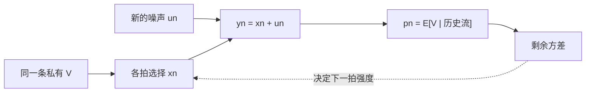

# Kyle 多期与连续时间

单次出清把信息一次写进价格；多期拍卖让知情者把同一条私有信息拆开，在一段噪声流里匀速释放。深度不再是一个数字，而是剩余不确定与剩余噪声时间的比。

<footer>—— Kyle, Continuous Auctions and Insider Trading, Econometrica, 1985</footer>

[债券趋势](/quant/bond-trend)把信号写在过去超额的符号上，价格被当成已经形成的输入。主干里[单期 Kyle](/quant/kyle-model)已经给出一次批量出清的线性均衡，[Glosten-Milgrom](/quant/glosten-milgrom)给出单位方向上的序贯学习，[限价簿](/quant/lob-structure)与[订单类型](/quant/order-types)给出电子盘的状态机。本课不重推单期 $\lambda=\sigma_V/(2\sigma_u)$。缺口是：同一知情者若可以交易多次，他会不会第一拍就把信息砸完？连续拍卖极限里，深度与揭示路径如何随时间走。

## 问题

单期模型里知情者只有一次行动。多期之后，今天的成交会改变明天做市商的信念，因而改变明天的深度。若他把全部优势压进第一拍，价格立刻贴近价值，后面的噪声掩护变得无用；若他永远不交易，租金留在手里却变现为零。问题是求出一条跨期计划：每一拍下多少，使得在做市商理性更新的约束下，剩余信息被平滑地写成价格。

连续时间把拍数送到无穷。噪声需求变成布朗型随机流，知情者选择交易速率过程。此时「一次出清揭示一半」不再是可搬运的数字：揭示是一条路径，深度是时变的。本课要回答的是路径的定性结构，而不是再给一个与单期同名的 $\lambda$ 闭式。

### 为什么不能把单期公式按日历重贴

把交易日切成 $N$ 段、每段套一次单期 $\lambda$，等于假定各段独立、知情者每段重新抽一次价值。多期 Kyle 的知情者始终拿着**同一条**未公开信息，各段的噪声才是新的。信念是共同的状态变量，不能切片重置。经验回归里按五分钟窗估冲击，测的是局部深度，不是这篇均衡对象。

Kyle（1989）另开一条：不完全竞争的知情者提交需求函数，而不是一个数量。那是限额供给曲线，不是本课的多期数量策略。两篇不要混成「Kyle 模型」一个词。

## 方法

离散多期：共 $N$ 次拍卖。价值 $V$ 在开始时被知情者观测，期末公开。第 $n$ 拍噪声 $u_n$ 独立，做市商看见累计净流 $y_n=x_n+u_n$，设定 $p_n=E[V\mid y_1,\ldots,y_n]$。知情者选 $x_n$ 最大化剩余各拍利润之和。线性马尔可夫均衡里，$x_n$ 对当时的定价误差 $V-p_{n-1}$ 成正比，比例随剩余拍数与剩余噪声规模调整：剩余时间短、剩余噪声少，交易更急，冲击更大。

连续拍卖把拍间隔送到零。累计噪声是布朗运动，价格是对 $V$ 的滤波。均衡的标志性结论是：知情者选择的交易使价格过程成为鞅，并且在终点几乎完全揭示 $V$；中途的即时深度与**当时剩余的价值方差**成正比、与**当时剩余可用来掩护的噪声**成反比。单期公式是这条关系在 $N=1$ 时的切片，不是全日常数。

### 与序贯单位模型的分工

Glosten-Milgrom 每期只来一笔单位方向，知情者不选量。多期 Kyle 的观测是带符号数量，策略是速率。两者都随时间学习，但学习的充分统计量不同：一个是方向计数，一个是累计净流。不要用 PIN 的日度买卖笔数去「验证」连续 Kyle 的揭示路径。

## 机制

跨期隐蔽的代价是延迟变现。每一拍多交易一单位，当前利润增加，但价格多走一截，后面所有拍的 $V-p$ 变薄。最优是把边际当前租与边际未来深度损耗抵平。噪声若在某段突然变少（开盘稀、公告后流动性撤退），同一信息优势对应的最优速率下降、冲击上升——这是时变深度，不是「lambda 估坏了」。

连续极限禁止「第一秒砸完」。若知情者在任意正长度区间内把流量奇异化，做市商立刻读出 $V$，后续深度崩溃，该策略被自己摧毁。平滑释放既是数学正则，也是有持久信息优势时拆单的策略动机；它与 Harris 讨论的大单切片在现象上相接，模型里的动机是被推断，不是外生冲击函数。

## 边界

单一知情者、外生噪声、可竞争到条件期望定价，三条都硬。多个知情者会互相抢揭示，通常加快价格收敛、改变深度路径。噪声若其实有弹性（Admati–Pfleiderer 式的择时流动性交易者），掩护变成内生，下一课才碰到策略噪声；本课仍把 $u$ 当给定。真实市场有买卖价差与[限价簿](/quant/lob-structure)几何，冲击不是单一线性函数。

连续拍卖的「时间」是交易时间，不是日历。隔夜、停牌、集合竞价要把滤波切开。把单期一半揭示公式画在横轴「一天」上，是误用。

经验 $\Delta p=\lambda y$ 的窗内斜率可以随时段变，这与理论时变深度同方向，但窗口、哪些单计入、是否去公告，已经是[回归 lambda](/quant/kyle-lambda) 的对象。

## 小结

- 多期 Kyle 的知情者拿着同一条信息在一串拍卖里交易；深度随剩余不确定与剩余噪声变化，不能把单期 $\lambda$ 按日历重贴。
- 连续拍卖要求平滑释放：奇异流量会自我揭示，线性深度难以维持。
- 价格对累计流的滤波是鞅，终点揭示 $V$；中途深度是路径，不是常数。
- 与 Glosten-Milgrom 同属学习，观测是数量速率而不是单位方向。
- 1989 年的需求函数竞争是另一篇，不在本课。
- 出处：Kyle, *Econometrica*, 1985（多期与连续拍卖两节）；语境见 O'Hara, *Market Microstructure Theory*。
