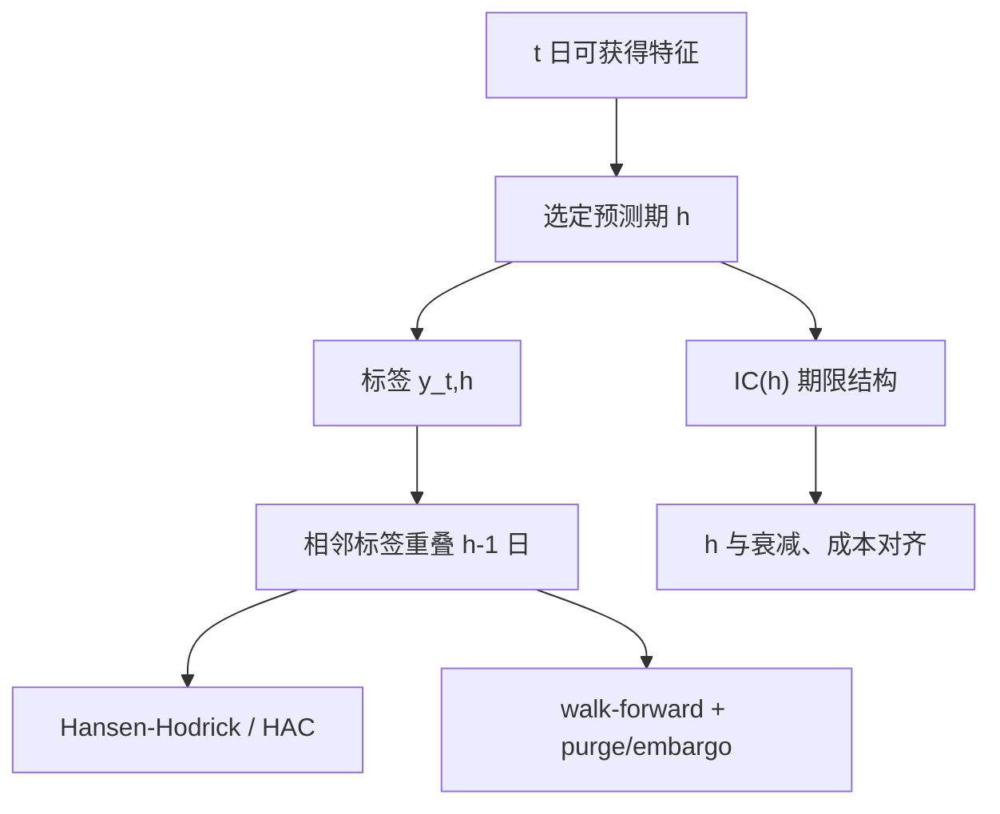

# 标签、预测期与重叠

用重叠的多期收益做回归时，残差不再是独立的；标准误差必须按重叠结构修正，否则显著性只是同一段价格被重复计算。

<footer>—— Hansen and Hodrick, Forward Exchange Rates as Optimal Predictors of Future Spot Rates, Journal of Political Economy, 1980</footer>

监督学习把收益当成标签。标签一旦是未来 $h$ 日的累计收益，相邻样本的标签共享 $h-1$ 日的收益，观测不再独立。Hansen 与 Hodrick（1980）在远期溢价回归里把这个问题写清楚；Newey 与 West（1987）给出 HAC 标准误的常用实现。Jegadeesh–Titman 的动量重叠持有、Fama–French 的月度组合，都是在组合层处理重叠，而不是假装每日都是新实验。Gu、Kelly 与 Xiu（2020）把机器学习引进截面定价时，明确用下一期收益作目标并强调样本外；López de Prado 在金融机器学习中强调三重障碍标签、以及交叉验证中的 purge 与 embargo。本篇写三件必须预先写死的事：标签定义、预测期 $h$ 与信号衰减是否匹配、重叠如何进入标准误与交叉验证。它决定[树模型](/quant/gbdt-alpha)的「重要性」有多少是统计幻觉。

## 问题

记 $t$ 日可交易特征为 $x_t$，标签为 $y_{t,h}=\sum_{k=1}^{h} r_{t+k}$（或对数收益、或超额、或相对行业）。若样本按日滑动，$y_{t,h}$ 与 $y_{t+1,h}$ 共享 $h-1$ 项。回归 $y_{t,h}=\alpha+\beta x_t+e_{t,h}$ 的 OLS 点估计在平稳性下仍可一致，但 $t$ 统计量若当 i.i.d. 会膨胀大约与 $h$ 成正比的量级。把日频样本的 $R^2$ 拿去和月频非重叠回归比，是在比较两种不同的因变量。问题不是「能不能用重叠提高样本」，而是**重叠增加的是相关观测，不是独立信息**。

预测期还要与交易日历一致。信号在 $t$ 日收盘可得，最早交易 $t+1$ 开盘或 $t+1$ 收盘，标签不能含 $t$ 日盘中。A 股涨跌停使 $t+1$ 可能不可买，有效 $h$ 被拉长。财报与宏观公告日把 $h$ 日内的收益集中在几个跳上，连续时间的重叠公式低估了簇状相关。

### 三重障碍与方向标签改变的是损失，不是独立性

López de Prado 的三重障碍（止盈、止损、垂直时间壁垒）把路径变成分类标签，对执行更诚实，见[止损](/quant/statarb-stops)。它不消除重叠：相邻时点的障碍仍共享路径前缀，分类误差同样序列相关。把问题改成涨跌分类，再用准确率当选模标准，会在趋势样本里得到虚假高精度（类别不平衡）。标签的经济含义必须仍是可交易 P&amp;L，而不是 Kaggle 分数。

用未来 $h$ 日的夏普或最大回撤当标签，是把整段路径的非线性泛函当作因变量，重叠与前视更严重。这类标签几乎只能用于描述，不能用于逐日监督。

## 方法

**非重叠对照。** 主结果应用步长为 $h$ 的非重叠回归或组合（每月一个标签），重叠样本只作为效率对照，并报告 Hansen–Hodrick / Newey–West 标准误，滞后阶数至少 $h$ 且对异方差稳健。月度资产定价里这是默认；日频 ML 论文常省略，这是不可接受的。

**信息系数的期限结构。** 与其只训 $h=5$，不如报告 $x_t$ 对 $r_{t+1},\ldots,r_{t+h}$ 逐日的截面 IC，见[衰减](/quant/factor-decay-turnover)。若 IC 在第 1–2 日已消失，却用 $h=20$ 的累计标签训练 [GBDT](/quant/gbdt-alpha)，模型会去拟合噪声累计，换手与持有期将无法对齐。Gu–Kelly–Xiu 的月频设定与特征的会计滞后是匹配的；把他们的月频结论搬到日频文本或微观结构特征上，预测期错配。

**交叉验证。** 标准 K 折打乱时间会泄漏重叠标签。应使用向前验证（walk-forward），并在训练与验证之间 **purge** 掉标签重叠的样本，在验证段前 **embargo** 一段（López de Prado）。时间块交叉验证若块长小于 $h$，仍然泄漏。组合层更干净：用日期切分，特征在切分日必须可获得，标签完全落在切分日之后。

### 标签的经济变换

超额收益相对什么：现金、市场、行业、风险模型残差，决定模型在学 alpha 还是在学 beta。Gu–Kelly–Xiu 同时报告对特征的预测与对定价误差的含义；若标签是原始收益，树会先学市场与规模，这不是缺陷，但必须在解释时承认，并在组合层做中性，见[行业中性](/quant/industry-neutral)。波动标准化（$r/\sigma$）改变的是损失权重，使高波动日不主导平方损失；标签与特征若同时除以同一 $\sigma$，部分预测力来自波动持续性（HAR 类），应单独设波动基线。

Welch 与 Goyal（2008）、Rapach、Strauss 与 Zhou（2010）在股权溢价预测里强调样本外 $R^2$ 与历史均值基线。截面 ML 应同样报告：相对横截面均值、相对线性模型的增量，而不是只报训练 $R^2$。重叠会让样本内 $R^2$ 看起来可观，样本外一次体制切换就塌。

分类标签的阈值若按全样本分位来选（例如涨幅最大的 30%），分位本身含未来分布，属于前视。阈值应在每个训练窗内单独计算，或使用预先写死的绝对障碍。

## 机制

重叠的数学是 $e_{t,h}$ 的 MA($h-1$) 结构（在收益弱相关的近似下）。Hansen–Hodrick 对矩条件做相应的协方差。机制上，一次大的宏观日会被写进前后各 $h$ 条标签，树模型会把该日前的任何巧合特征当成「重要」——这是伪重要性的主要来源之一。Purge 的机制是删掉那些标签跨过切分点的训练样本，使验证段的 $y$ 不出现在训练损失里。Embargo 额外丢掉切分点附近可能仍有序列相关的特征（波动集群、新闻余波）。

预测期 $h$ 还决定交易成本能否被标签里的均值覆盖。$h$ 短，年化换手高，Novy-Marx–Velikov 成本更致命；$h$ 长，标签更噪、重叠更重，有效样本量下降。不存在免费的 $h$：它必须由 IC 期限结构与容量共同标定，而不是由验证集上的最大夏普标定——后者把 $h$ 变成又一个被[多重检验](/quant/multiple-testing-factors)的超参。

Fama–MacBeth 对每个 $t$ 做截面回归再对斜率时间序列求均值，时间序列维的重叠仍存在于斜率里，同样需要 HAC。ML 的日频「截面损失」若把所有 $(i,t)$ 当 i.i.d.，连 Fama–MacBeth 都不如。

### 事件标签与连续标签

盈余公告后漂移、并购完成，标签应在事件时间定义，样本是事件而不是日历日，重叠变成同一公司相邻事件或共同交易日的横截面相关，聚类标准误应在公司与日期两维。把事件收益摊回日历面板再做日频 GBDT，会把非事件日的零标签当成海量负例，模型学到的是「大多数日子什么都不发生」。日历监督与事件监督应分开，不要混在同一个混淆矩阵里报准确率。

## 边界与工程取舍

不要用含当天收益的标签。不要在验证集上挑选 $h$ 再只报告那个 $h$。不要把三重障碍的止盈止损参数在全样本上网格搜索后声称分类准确率可交易。A 股 T+1、涨跌停使有效预测期随机延长，标签应定义为「下一可交易区间的收益」，否则回测假设了不存在的成交。微观结构特征的 $h$ 往往是分钟到日，会计特征的 $h$ 是月；拼在同一张设计矩阵里时，应对不同列使用不同标签或不同模型，而不是强迫一个 $h$。

样本外 $R^2$ 为负在股权溢价预测里很常见（Welch–Goyal）。截面 ML 若只在再加权后的小盘上为正，应报告价值加权与流动性过滤后的结果，否则标签的可预测性来自不可交易的尾巴。

## 小结

- 重叠多期标签使残差相关；Hansen–Hodrick（1980）与 Newey–West（1987）要求修正标准误，独立观测数不随日频滑动线性增长。
- 预测期 $h$ 必须由 IC 衰减与可交易日历标定，并与 Gu–Kelly–Xiu 一类月频设计区分；错配会让模型拟合累计噪声。
- 交叉验证必须尊重时间与重叠（purge/embargo）；打乱 K 折对金融标签无效。
- 标签是原始收益还是残差、是否波动标准化、是日历还是事件，决定模型在学什么；准确率不是 P&amp;L。
- 出处：Hansen and Hodrick, *JPE*, 1980；Newey and West, *Econometrica*, 1987；Gu, Kelly and Xiu, *RFS*, 2020；Welch and Goyal, *RFS*, 2008；Rapach, Strauss and Zhou, *RFS*, 2010；Jegadeesh and Titman, *JF*, 1993；López de Prado, *Advances in Financial Machine Learning*。
