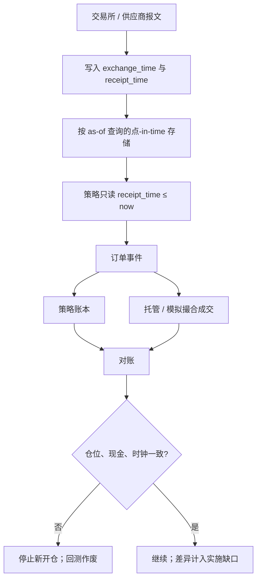

# 时钟、迟到数据与对账

宏观序列有当时发布的版本与多年后的修订版；用修订版去模拟当时的决策，是最干净的前视。交易数据里同样有到达时间与事件时间的差，对账就是把两套时钟重新对齐。

<footer>—— Croushore and Stark, A real-time data set for macroeconomists, Journal of Econometrics, 2001；对照 Easley, López de Prado and O'Hara, The Volume Clock, JPM, 2012</footer>

回测里的「时间 $t$」至少有三种：交易所撮合时钟、数据包到达你主机的时钟、以及你用来对齐特征的业务日历。三者不一致时，策略会在尚未收到的报价上成交，或在修订后的盈利数字上开仓。Croushore 与 Stark 为宏观构建实时数据集，正是因为 Taylor 规则一类决策在修订后的 GDP 上成立、在当时的初值上不必成立。Easley、López de Prado 与 O'Hara（2012）则指出，价格形成更贴近成交时钟而不是墙上时钟。本篇把时钟选择、迟到与修订、以及研究–模拟–实盘之间的对账写成同一条因果链。它是数据架构，不是把延迟当成武器去描述的交易手法。

## 问题

前视偏差的标准例子是用当日收盘价计算信号并在当日收盘成交。更隐蔽的例子是：基本面供应商在 $t+k$ 才送达 $t$ 期财报，回测却在 $t$ 的 bar 上就有了字段；指数成份在季度调整生效前已被「历史成份表」写成当时成员；成交回报先以交易所戳写入，回测按交易所戳撮合，实盘却按到达戳看见簿。Hasbrouck 对逐笔数据的讨论强调时间戳的来源与精度；精度到毫秒仍可能因为时钟未同步而乱序。乱序比延迟更坏：延迟至少是因果的平移，乱序会把后果放到原因前面。

迟到是正常的网络与发布过程，不是异常。异常是假装没有迟到。点-in-time 数据库为每一字段保存「何时可知」，查询给定 as-of 时刻只能返回当时已发布的版本。没有这层，[交叉验证](/quant/cv-leakage-finance) 清得再干净，训练折里仍然含有检验期才修订进来的盈利。宏观上 Orphanides 对实时政策规则的研究表明，数据修订足以改变结论；交易上同一机制作用于财报、分析师汇总、借贷费率与停牌状态。

### 两套戳：事件发生与信息到达

每一条记录应带 `exchange_time` 与 `receipt_time`（以及写入存储的 `ingest_time`）。策略决策只能依赖 `receipt_time ≤ now` 的信息；撮合模拟若要逼近实盘，应用到达后的簿，而不是用交易所簿的上帝视角。研究若只用交易所戳，等于假设零延迟与零丢包，晋级到模拟时跟踪误差会突然出现，却被误诊为「冲击模型错了」。对账的第一项就是两种戳下权益曲线的差：这是信息延迟的实施缺口，不是价差。

墙上时钟的 NTP/PTP 同步是实盘问题，也是回测重放问题。多交易所对齐若混用未校准的本地戳，套利回测会看见不存在的铅滞后。声明时钟源，与声明成本模型同等重要。

## 方法

存储层：所有会进入信号的输入都版本化，查询 API 必须接受 as-of。公司行动、成份、借贷可获得性、宏观、另类数据，无一例外。Croushore–Stark 的实时宏观数据集是这一原则在宏观上的实现；交易台需要自己的点-in-time 仓。清洗层：迟到超过阈值的包标记为 late，进入研究统计但不默认进入「当时可交易」集合；撤销与更正作为修订事件进入[事件队列](/quant/event-driven-backtest)，而不是原地改写历史成交。

对账层分三级。一级：研究向量化结果与事件模拟在同一 as-of 数据上的差，应主要来自成交模型。二级：模拟与实盘在同一版本策略上的差，应来自延迟、拒单、部分成交与身份成本。三级：实盘内部——订单状态、成交回报、托管与资金账户三者一致，现金与仓位不能只在策略内存里正确。任何一级对不上，先修数据与时钟，再谈信号衰减。Barndorff-Nielsen 等人把坏记录从已实现核里滤掉；对账是同一精神在跨系统上的延伸：先排除录入与时钟错误，再估计噪声。

### 成交时钟、日历时钟与业务日历

Easley–López de Prado–O'Hara 的成交时钟把采样对齐到信息流的密度，避免把沉寂时段的空格子当成观测。回测必须声明信号生活在哪一种时钟上，并保证订单事件能映射回交易所日历：午休、半日市、拍卖、夏令时。业务日历错误会造成「在假日下单」的假成交或「假日信号缺失」的假空洞。对账清单应包含：时区、夏令时规则版本、各交易所假期表的 as-of——假期表也会修订。

用收盘价面板对齐另类数据时，最常见的错误是把「数据日期」当成「可知日期」。卫星或卡消费若标注的是观测日，发布可能晚几天。缺少发布戳的另类数据，默认不可用于因果回测。

## 机制

修订改变的是条件期望的信息集。设真实决策是 $\mathbb{E}[y\mid\mathcal{F}_t]$，$\mathcal{F}_t$ 由当时到达的报文生成。用最终修订 $X_T$ 替代 $X_t$ 的初值，等于用 $\mathcal{F}_T$ 去拟合一条假装生活在 $t$ 的策略。样本内拟合会变好，因为 $X_T$ 含有后来才知道的状态；样本外一旦只能收到初值，边缘消失。这与 Bailey 等描述的过拟合不同源，但症状相同：研究美、实盘差。隔离环境若共享未版本化的数据库，修订会在某次供应商全量刷新后无声地污染所有历史回测，使过去登记过的试验不可复现。

乱序与迟到在事件循环里必须显式处理：迟到事件是带着旧 `exchange_time`、新 `receipt_time` 的新事件，状态更新用到达序，统计可以用发生序。用发生序去下单是前视。高频上，Hasbrouck 风格的逐笔分析还要处理同一毫秒内的序号；没有序号，撮合回放会与实盘状态机分叉，对账永远对不上最后几笔。

### 对账失败时的默认动作

对账不是事后报表，应是闸门。仓位与托管不一致时，策略应停止新开仓，进入平仓或只减仓模式，直到人工确认。这与信号对错无关，是时钟与状态已经被证明不可信。研究环境没有托管，但对账闸门应对标：模拟账本与事件引擎仓位不一致时，该次回测作废，而不是插值抹平。把对账失败当异常值删掉，等于在最需要诚实的时刻引入选择偏差。

## 边界与工程取舍

点-in-time 存储贵，查询慢。最低限度是对会修订的字段保存发布戳，对不会修订的成交保存双时间戳。不要声称「我们是点-in-time」却只对价格这样做、对宇宙与借券用最终表。时钟同步在地理上分布式的实盘里不可能完美；回测应把延迟做成情景，而不是假设实盘将与回放零差。A 股、港股、美股混用时，日历与午休不同，对账必须分市场，不能用一个 `timestamp` 列打天下。

不要用对账去「解释」亏损：先证明账是对的，再做归因。也不要把迟到数据当成额外 alpha 源去交易别人尚未收到的包——那是数据许可与微观结构里另一类问题，本篇的对象是不让自己的回测偷看自己尚未收到的包。架构目标是可复现与因果，不是相对他人的信息优势叙事。

供应商「历史库」经常以后视成份与最终财报示人，实时库才是点-in-time。用历史库做研究、用实时库做实盘，是环境隔离失败的一种具体形式。

## 小结

- 「时间 $t$」要拆成事件发生、信息到达与业务日历；决策只能用已到达的信息集。
- Croushore–Stark 的实时宏观数据说明修订会改变决策评估；交易数据同样需要点-in-time 与发布戳。
- 成交时钟与日历时钟服务不同问题，但订单必须能映射回交易所日历与双时间戳。
- 对账是研究–模拟–实盘的闸门，失败时停止开仓或作废回测，而不是删异常。
- 未版本化的历史库会在供应商刷新后污染全部试验，使过拟合调整失去意义。
- 出处：Croushore and Stark, *Journal of Econometrics*, 2001；Orphanides, *American Economic Review*, 2001；Easley, López de Prado and O'Hara, *JPM*, 2012；Hasbrouck, *Empirical Market Microstructure*；López de Prado, *AFML*, 2018；Barndorff-Nielsen, Hansen, Lunde and Shephard, *Econometrics Journal*, 2009。
