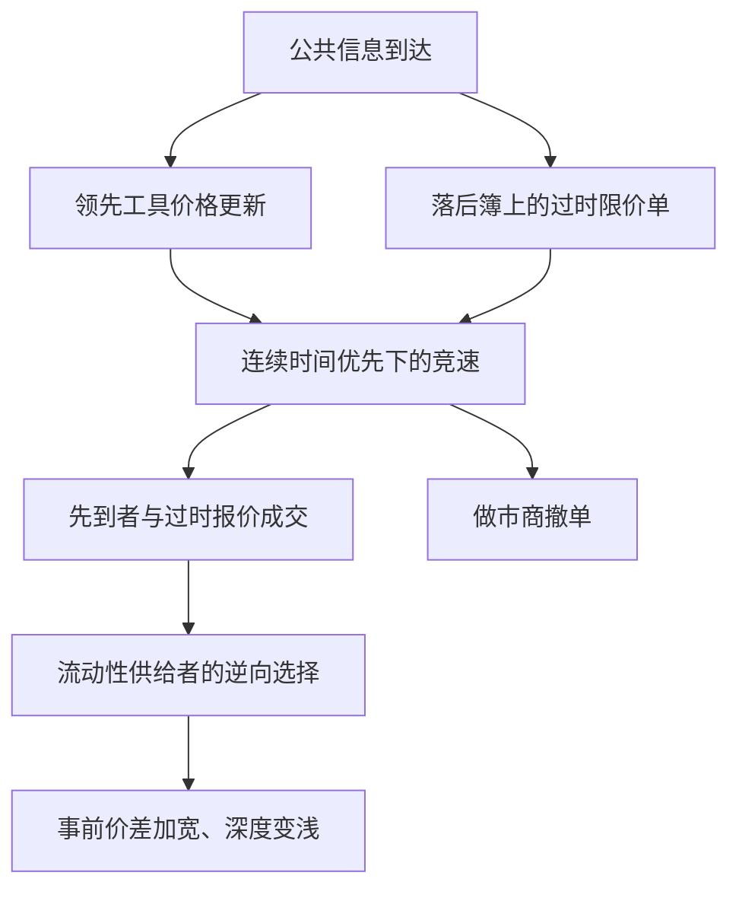

# 延迟套利

在连续限价簿上，公共信息一到，过时报价会在一段极短的时间内变成免费期权；争夺这张期权的竞速，是市场设计问题，不是谁更勤快的问题。

<footer>—— Budish, Cramton &amp; Shim, The High-Frequency Trading Arms Race, Quarterly Journal of Economics, 2015</footer>

相关证券的价格在经济上应一起动：股指期货与 ETF、同一股票的多个交易场所、 mechanically 相连的现货与衍生品。公共信息到达之后，若市场仍按**连续**时间优先、价格优先撮合，总会有一小段窗口，某些报价还停在旧价值上。先看到新信息的一方可以与这些过时报价成交，把流动性提供者的报价当成被错误定价的期权。Budish、Cramton、Shim（2015）把这种机制叫做高频竞速的经济内核；后续 Aquilina、Budish、O'Neill（2022）用交易所可观测的「竞速」消息来度量它的规模。本篇只写**公开的市场结构文献**：过时报价为何是连续交易的均衡产物、它如何以逆向选择的形式进入价差、以及频繁批次拍卖等设计回应。它不是交易手册。与 [ETF 套利](/quant/etf-arb)、[指数套利](/quant/index-arb) 的经济价差不同，这里的「套利」来自**时间上的不一致**，不是来自长期错误定价。

## 问题

教科书套利假设所有人同时面对同一价格向量。连续限价簿打破「同时」：撮合是一笔接一笔的，消息在物理与系统里传播需要时间，相关工具又在不同服务器上更新。于是出现一种与基本面无关的利润机会——**延迟套利**（latency arbitrage）：利用同一公共信息在不同订单簿上的到达差，去打仍按旧中点挂着的限价单。被打的一方往往是提供买卖报价的流动性供给者；他们事后发现成交发生在信息已经过时的价格上。

这与知情交易的经典逆向选择不同。Glosten–Milgrom 里知情者拥有关于价值的**私有**信号。延迟套利用的是**已经公开**、只是尚未均匀写进所有报价的信息：指数期货跳了，ETF 的卖价还在原地。经济上它仍是逆向选择——流动性供给者对「谁会来吃我的报价」的条件期望变差——但信息源是公共的，竞速对象是速度本身。若把这类亏损全部解释成「有人基本面研究得更好」，会误导监管与做市资本的讨论。

### 连续时间优先如何把速度变成必要投入

价格优先、时间优先在连续时钟上意味着：同一价位，先到的单先成交。当公共信号使某档报价瞬间变成错价，所有想吃这档的人提交的是**经济上相同**的指令，胜负只取决于谁的消息与报单更先到达撮合引擎。这是一场对同一张被错误定价期权的竞速，而不是对分散估值的竞争。Budish 等人强调：只要相关价格的相关不是完美同步更新，连续簿就会内生出这种竞速；投入真实资源去缩短毫秒、微秒，在私人是理性的，在社会上却近似零和——更快的一方赢的是另一方本来也会提供的流动性租金，价格发现的增量很小。

文献里的「sniping / 抢跑过时报价」是均衡描述：公共信息到达后，过时限价单被市价或可立即成交的指令击中。它不是一份操作清单。讨论应停在机制与福利，而不是传播路径或机房位置。

## 方法

公开研究度量延迟套利，靠的是**可观测的市场数据与交易所消息**，而不是任何人的专有链路。Budish 等用高度相关的工具（如 E-mini 与 SPY）在高频上的价格比较：当一边中间价已经移动、另一边报价尚未更新，错价的持续时长、发生频率、以及错价幅度构成「竞速的原料」。若错价经常出现、又迅速消失，且消失伴随着成交与报价撤销的密集爆发，就与「过时报价被吃或被撤」的叙事一致。

Aquilina、Budish、O'Neill（2022）进一步使用交易所提供的、用于识别「同一时刻多笔可成交意图互相竞争」的消息结构，把竞速事件从普通成交里分开。他们关心的矩是：竞速在全部成交里占多少、竞速的价差租金有多大、流动性供给者因此必须把报价放宽多少才能盈亏平衡。这些是**市场质量会计**，用来回答「连续交易税了流动性多少」，不是用来复现某次竞速的胜负。

Foucault、Kozhan、Tham（2017）把跨市场的延迟套利写成「有毒套利」（toxic arbitrage）：当一边的价格已经包含信息、另一边的做市商还按旧信念报价，套利交易会伤害后者。毒性随工具间的相关、更新频率与信息不对称而变。这与本站 [毒性](/quant/toxic-flow) 的订单流毒性是同一类逆向选择，只是信息来自另一张簿的公开印记，而不是来自个股的私有消息。

### 相关工具、公共信息与过时报价

设证券 A 与 B 的有效价值高度相关。A 先反映公共信息（更活跃的期货、更中心的场所），B 的限价单仍按旧中点挂着。经济上的错价是 $p_B-v(p_A)$。在连续簿里，这个错价的寿命由「B 侧做市商撤单」与「他人吃单」谁先完成决定。两者都是对同一公共信号的反应，于是形成竞速。批次拍卖若把极短区间内的指令集中撮合，同一信号上的指令同时到，时间优先不再分配那张免费期权，竞速的私人回报下降。

经验上应报告的是：相关结构（哪些合约在经济上是同一风险）、错价的分布、竞速成交相对普通成交的比例、以及价差、深度在信息密集时段的变化。不应把「A 领先 B」的领先滞后回归直接写成可交易规则：领先滞后本身随时钟精度、采样与通道延迟而变，Hasbrouck 信息份额文献已经说明时钟是识别条件。这里只需承认：在连续交易下，领先滞后的残差窗口会被竞速填满。

把期货与 ETF 的基差当成「延迟套利信号」会与基差的经济成分混在一起：利率、分红、创建赎回约束都会造成可持续的价差。延迟套利文献关心的是**信息到达后数个最小时间单位内**的过时报价，不是持有到收盘的基差交易。

## 机制

福利评价分三步。第一，流动性供给者预期会被公共信息下的过时报价伤害，于是事前加宽价差、变浅深度，把预期损失转给普通投资者。第二，竞速的胜者获得的是这笔转移，而不是新的风险分担；社会多出来的是为了争先而消耗的技术与通道资源。第三，价格发现并不因此显著变快：信息已经出现在领先工具上，落后工具的「发现」只是被强制对齐，连续撮合只是决定谁来执行这次对齐。Budish 等因此把高频竞速称为军备竞赛：私人最优速度不断上升，社会收益递减。

这与「做市商之间的竞争会压价差」不矛盾。竞争压的是**处理与存货**补偿；延迟套利加的是一层**公共信息逆向选择**。电子化可以同时让 $\phi$ 下降、让竞速更激烈。观察到价差下降，不能推出延迟套利消失；可能只是处理成本下降幅度更大。Menkveld 等对高频做市的综述指出：同一类快速参与者既在提供流动性，也在参与对过时报价的竞争；净效果取决于哪一种活动占主导，而不是取决于「是不是高频」。

市场设计的公开提案因此针对时钟，而不是针对某一类公司的身份。频繁批次拍卖（frequent batch auctions）把连续时间改成极短间隔的统一价格拍卖，使同一信息上的需求同时出清，时间优先不再奖励单纯的更快。离散化间隔的选择是设计参数：太长则中间价更新慢、价格发现变钝；太短则接近连续，竞速回来。文献讨论的是这个权衡，以及现有连续市场已经用的部分替代（随机延迟、速度bump、定期拍卖时段），它们改变的是过时报价的存活时间，从而改变那张免费期权的价值。

### 与私有信息、中介利润的分界

延迟套利不是 PIN 里的信息事件，也不是公司内部人交易。它甚至不一定需要关于股票现金流的任何私有知识：只要看见领先合约的公开成交与报价即可。因此用 [PIN](/quant/pin) 或公司公告窗口去「验证」延迟套利，问错了对象。它也不是指数套利里持有到收敛的那条腿：指数套利承担基差、分红与创建风险，延迟套利承担的是谁先到达的不确定性，持有期以市场的最小时间分辨率为单位。

对流动性供给者的含义是会计上的：实现价差在信息密集的竞速时段会变差，甚至为负；有效价差可能仍然看起来「有收入」，因为成交发生在宽报价上，但随后中点立刻跳走。这与 [MRR](/quant/mrr-decomposition) 里 $\theta$ 上升、实现价差下降是同一类指纹，只是信息来源写成了「另一市场的公开价格」，而不是本市场订单流的意外。监管评估若只看平均价差，会把竞速税摊进全日均值里看不出来；应按信息到达聚类的窗口单独报告实现价差。

## 边界与工程取舍

文献的识别依赖时钟对齐与「何为同一信息」。把两个场所的本地接收时间当成交易所时间，会把管道延迟写成领先滞后，从而把普通的同步交易误判成延迟套利。研究应使用交易所时间戳，并承认时间戳精度本身构成分辨率上限。相关若不够高（不同到期、不同篮子、不同币种），「过时」没有定义：价差可能是风险溢价。

不要把所有高频盈利都叫做延迟套利。做市、库存管理、统计套利的慢信号、以及真正的私有信息，都会在高频数据里留下短持有期。延迟套利的定义性特征是：**利润来自公共信息下过时限价单的免费期权，且竞争形式是对同一指令的时间优先竞速。** 把任何快于某个人的交易都贴上这个标签，会让市场结构设计讨论失去对象。

本篇不讨论如何缩短路径、如何布置基础设施、如何撰写抢先指令。那些内容既不是定价理论，也不是可公开检验的市场质量度量。可公开讨论的是：连续交易是否内生竞速、竞速的租金有多大、以及改时钟规则会怎样改变价差与深度。后一个问题只能用设计对比与自然实验回答，不能用某一家公司的延迟数字回答。

Flash Boys 把竞速写进了公众叙事；学术文献要保留的是可证伪的机制：连续簿 + 相关工具 + 公共信息 → 过时报价期权 → 价差中的逆向选择。媒体里的人物与机房不是识别策略。

## 小结

- 延迟套利在公开文献里指：公共信息下，连续限价簿上过时报价成为免费期权，时间优先把期权分配给速度竞争的胜者。
- 它是流动性供给者面临的公共信息逆向选择，会进入价差，不等于私有知情交易，也不等于持有基差至收敛的指数/ETF 套利。
- 度量应使用交易所时钟与可观测的竞速/错价事件，报告频率、租金与对实现价差的影响。
- 频繁批次拍卖等设计通过改时钟削弱「单纯更快」的私人回报；间隔长短是发现速度与竞速税之间的权衡。
- 讨论停留在机制、福利与市场质量；不涉及基础设施或指令实现。
- 出处：Budish, Cramton & Shim, *QJE*, 2015；度量见 Aquilina, Budish & O'Neill, *QJE*, 2022；跨市场毒性见 Foucault, Kozhan & Tham, 2017。
