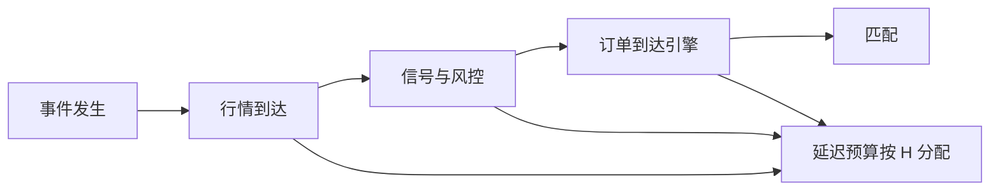

# 延迟预算

延迟是从事件发生到你的订单到达匹配引擎的时间分配问题。把所有策略都接到同一根低延迟管道上，是在用容量买一个持有期并不需要的时钟。

<footer>—— 据 Hasbrouck and Saar 对低延迟交易与市场质量的讨论；对照 O'Hara 对高频环境下「何时算一笔交易」的论述</footer>

[策略容量](/quant/strategy-capacity)把规模写成曲线。本课的缺口是时间：在已经选定的持有期 $H$ 上，哪些环节的毫秒（或秒、或分钟）会改变期望，哪些只是工程舒适。Hasbrouck 与 Saar 研究低延迟交易如何改变簿的动态；Budish、Cramton 与 Shim 把连续限价簿上的速度竞赛写成市场设计问题。本课写**预算**：把端到端延迟拆成行情、计算、风控、路由、场所，按 $H$ 分配，而不是默认越快越好。不写如何建设或利用抢跑管道。

## 问题

端到端延迟 $L=L_{\mathrm{md}}+L_{\mathrm{cpu}}+L_{\mathrm{risk}}+L_{\mathrm{net}}$。对做市和延迟套利，$L$ 的一毫秒可以改变队列与中点锚；对月频再平衡，$L$ 的一分钟通常小于价差。容量课已经说明大规模会自己制造冲击；延迟课说明小规模但时钟错了，会去吃已经过时的 NBBO，见[市场分割](/quant/market-fragmentation)。问题是给每个策略一个延迟预算：超过预算的加速，边际 alpha 小于边际成本（包括变薄的深度和更吵的撤单）。

预算必须按路径而不是按平均值。均值 200 微秒、尾部 20 毫秒，对必须在拍卖不可撤窗口前到达的订单，尾部才是约束。开收盘集合、波动中断再开盘，约束是日历时刻而不是微秒竞赛。把所有订单的 SLA 写成同一条，会在集合上过度工程、在连续抢 tick 上预算不够。

### 信息延迟与决策延迟

行情到达晚，是信息集的错：你在用过时中点算有效价差、用过时深度估冲击。计算与风控晚，是决策的错：信息已经在内存里，订单没出去。路由与场所晚，是执行的错。三类对期望的导数不同。信息延迟会让信号符号在短 $H$ 上变号；决策延迟在长 $H$ 上只影响实施缺口的延迟腿；执行延迟在碎片化市场上造成 trade-through 或错过中点。监控课已经要求两套时间戳；本课把两套戳的差当成预算消耗。

A 股集合竞价的不可撤窗口是硬截止。预算应写成「9:19:59 前必须到达」这类时钟约束，而不是「平均延迟 3 毫秒」。错过窗口，开盘单的 $H$ 直接变成「下一场连续」，成本跳到另一条曲线。

## 方法

测量每段延迟的分布：行情源（SIP vs 直连只在这里作为预算输入，细节见附录）、信号完成、风控放行、网关确认、交易所确认。把实施缺口按 Perold 拆出延迟腿，对 $L$ 做分层：同一信号在 $L$ 的不同分位上净收益差多少。差不显著的环节，预算可以放松。差显著的环节，才值得投资工程——这是研究结论，不是建设指南。

按 $H$ 分桶。$H$ 以秒计：预算落在行情与网关。$H$ 以日计：预算落在数据准时（基本面、公司行为）和拍卖截止。$H$ 以月计：预算落在再平衡日历与指数生效日。把月频价值策略接到盘中微秒监控上，会把拒单噪声当成 alpha 衰减。

### 延迟与容量的替换

同一 alpha，可以用更快的速度去抢薄深度，也可以用更慢的速度、更大的 $H$、更低的参与率去吃厚的拍卖流动性。Budish 等人指出连续时间优先制造速度竞赛；集合竞价削弱这种竞赛。策略选择场所与协议，就是在买不同的延迟制度。容量曲线应在「当前延迟」和「放松延迟、改参与拍卖」两个点上各画一次，避免把工程速度当成唯一扩容手段。

## 机制

延迟进入损益的机制是过时决策：你以为自己在 $m_t$ 上提供或吃进，实际匹配发生在 $m_{t+L}$。对 maker，过时报价等于被捡走的过期期权；对 taker，过时吃单可能已经穿越。$H$ 越短，过时越致命。拥挤时，所有人的 $L$ 分布决定谁排在队头；你的绝对延迟不如相对延迟。这与容量的共同流量是对偶：那边是量，这边是到达时刻。

风控闸门也消耗预算。把复杂模型塞进预交易，会把 $L_{\mathrm{risk}}$ 拉长。正确做法是把必须同步的检查留在路径上，把慢检查放到异步，监控课已经区分拒单来源。延迟预算因此也是风控架构预算。

不要用 [Kyle](/quant/kyle-model) 的批量拍卖来为连续速度竞赛辩护。Kyle 没有时间优先。连续 LOB 的延迟价值来自 Harris 意义上的队列，不是来自 $\lambda$ 公式。

### 尾部截止比均值 SLA 更常成为紧约束

集合不可撤窗口、再开盘延长、监管文件截止，约束的是分位而不是平均延迟。只优化均值，会在必须到达的时刻失败，把 $H$ 推到下一场协议。

## 边界

本课不讨论共址、微波或如何缩短某一跳的物理路径。合规与公平接入是交易所规则问题。加密链上的延迟是区块时间与 mempool，对象不同。下一课把 $H$、容量、延迟打包成高频 / 中频 / 低频的体制标签，避免口头禅。

把月频价值策略接到微秒监控，会把拒单噪声当成 alpha 衰减。预算应按体制卡分配，不能全公司一根管道。

## 小结

- 延迟是按持有期分配的预算，不是全局越小越好。
- 信息、决策、执行三段延迟对期望的导数不同。
- 约束常常是截止时刻与尾部，不是均值。
- 速度与更长 $H$、更厚的拍卖流动性可以替换，应比较两条容量曲线。
- 相对延迟在拥挤时比绝对延迟更重要。
- 出处：Hasbrouck and Saar, *Journal of Financial Markets*, 2013；Budish, Cramton and Shim, *QJE*, 2015；O'Hara, *Journal of Finance*, 2015；实施缺口见 Perold, 1988。
