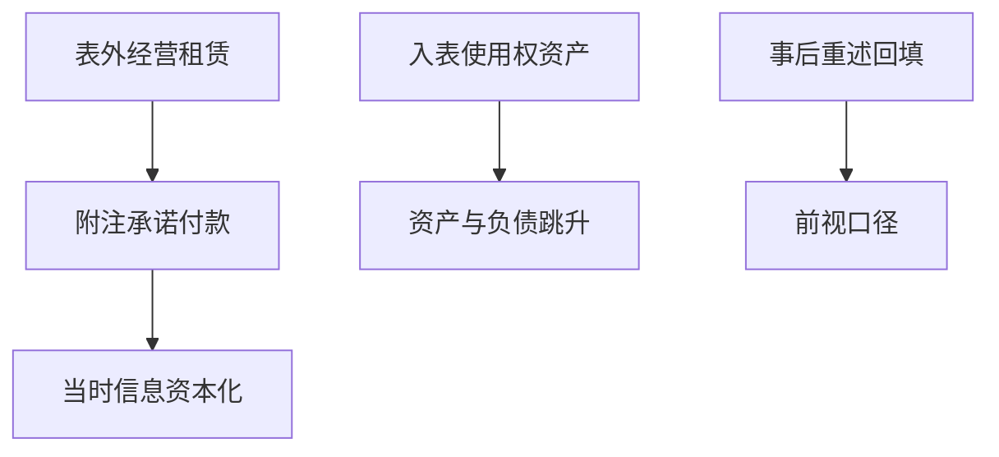

# 租赁与表外

经营租赁曾把使用权资产与负债留在表外，杠杆与投资因子被系统性写小；入表之后，同一经济租赁变成资产增长与账面变厚。

<footer>—— 据 IFRS 16 / ASC 842；Penman 对表外融资的讨论整理</footer>

上一课[分部与地域](/quant/segment-geo)修正了合并加总的业务构成。租赁修正的是合并加总的**杠杆与资产**。上一课因子索引里，投资常用总资产增长，价值用账面，盈利用利润表；经营租赁的会计选择会同时推动这三张表。本课只补表外变表内这一口径，不写租赁准则百科，也不进入下一课的合并范围。

## 问题

IFRS 16 与 ASC 842 之前，经营租赁的租金进利润表，承诺付款在附注。资产与有息负债偏低，资产增长率偏低，账面可能偏高或偏低取决于累计费用模式。准则切换后，使用权资产与租赁负债入表，投资因子出现一次性跳升，杠杆与覆盖率一起变。若时间序列不声明准则断点，因子会把「会计入表」当成真实加杠杆。缺口是：比较租赁密集公司时，要么把表外承诺资本化（用当时附注），要么承认断点，禁止用新准则重述去改写旧年还假装连续。

### 资本化附注不是 restated 主表

用今天已经按 IFRS 16 重述的历史资产负债表回填 2016 年，是 PIT 违规：2016 年交易者看到的是表外附注，不是后来的使用权资产。允许的做法是：在 2016 年用当时附注的最低租赁付款额自行折现资本化——折现率与年限必须用当时可获得的信息，不能用后来才披露的增量借款利率回填。

零售、航空、电信对这条最敏感。行业中性只能部分吸收：同行业里租赁政策仍可不同，断点年仍会集体跳。

## 方法

复制官方 Fama–French 时，按他们当时能用的 Compustat 主表，不要私自用新准则重述去「改进」历史 HML。自建投资/杠杆因子则声明：表外租赁是否资本化、折现规则、可用日期取年报附注。准则切换年把受影响公司单独标记或做断点调整，避免资产增长因子在切换年全体做空租赁密集股。盈利侧：租金费用变为折旧加利息后，EBIT 与 EBITDA 含义改变，口径要与分析师共识对齐，否则惊喜被准则切换污染。

官方因子复制用当时主表；自建杠杆才允许当时附注资本化。IFRS 16 重述余额不得回写切换前年份。切换年租赁密集行业单独报告。

## 机制

表外融资让杠杆因子、违约距离、资产增长同时偏小，质量应计相对少受影响（租金多为经营流出）。入表后，投资与价值被一次性改写，真实租赁合同未必变。这是会计身份推动因子共线的又一例，与商誉并购对称：一次计量规则改变，多条信号同跳。资金与保证金课会把杠杆当成可交易约束；这里的杠杆还只是报表口径，尚未变成经纪商保证金。

不要把本课读成「杠杆越高 alpha 越高」。对象是口径偏差与回测断点，不是杠杆溢价理论。

复制官方因子：跟随当时 Compustat 主表，准则切换年做断点标记。自建杠杆或投资因子：若资本化表外承诺，折现率与剩余年限只用当时附注与当时利率，禁止用 IFRS 16 重述余额回写 2015 年。切换年把零售、航空等租赁密集行业单独报告，避免投资因子的空头被会计跳升填满。EBIT 与 EBITDA 在入表后与 IBES 口径对齐，再算惊喜。

## 边界

不汇编 IFRS 16 条款，不估房地产重置。下一课[合并与少数股东](/quant/nci-consolidation)处理谁被加进合并表，与租赁谁被加进资产是不同问题。后课默认：投资与杠杆因子已声明租赁口径与准则断点；禁止用新准则 restated 主表冒充历史 PIT。

后课 NCI 处理谁被合并；本课处理哪些租赁被资本化。两条修正不要合成一个「调整后资产」却不留痕迹。准则切换年在投资因子里单独报告。复制 French 库时继续用当时主表，自建杠杆因子才允许当时附注资本化，两套结果不要混称为同一个 HML。

后课默认投资与杠杆已声明租赁口径与准则断点；禁止用新准则 restated 主表冒充历史 PIT。

入表后 EBITDA 上升、利息上升，分析师若仍用旧口径，惊喜会被准则切换污染。本课要求在切换年把口径对齐声明写进惊喜来源卡，而不是把跳跃解释成经营改善。

## 小结

- 经营租赁曾表外，资产增长与杠杆被写小。
- 入表造成一次性跳升，不是经济上突然加杠杆。
- 用当时附注资本化可以，用事后重述回填不可以。
- 官方因子复制应跟随当时主表，不要私自「改进历史」。
- EBIT 口径在入表后与分析师共识要对齐。
- 出处：IFRS 16 / ASC 842；Penman 表外融资。
