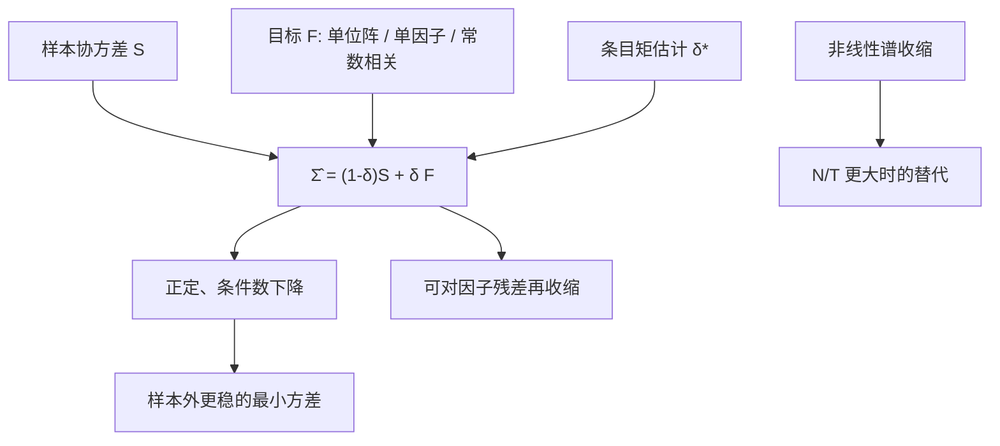

# Ledoit-Wolf 收缩

    
我们把样本协方差向一个结构良好的目标做凸组合，收缩强度由数据估计，使期望 Frobenius 损失最小；这比把样本矩阵直接求逆更适合高维组合。

    <footer>—— Ledoit and Wolf, Honey, I Shrunk the Sample Covariance Matrix, Journal of Portfolio Management, 2004；公式见 2003 年 JEF 与 2004 年 JMA</footer>

[上一课](/quant/sovereign-cds)停在信用曲线。缺口是组合优化里协方差怎么估。[估计误差与收缩](/quant/cov-shrinkage) 写的是病态协方差如何毁掉 Markowitz 权重，以及收缩、因子、随机矩阵清理的分工。本篇把 Ledoit–Wolf（LW）估计器本身写具体：目标 $F$ 怎么选、最优强度 $\delta$ 从哪一组矩来、2003–2004 年三篇论文各自收缩向哪里，以及它与后来的非线性收缩、[因子协方差](/quant/factor-vs-sample-cov) 如何衔接。公式是

$$
\hat\Sigma=(1-\delta)S+\delta F,
$$

$S$ 为样本协方差。$\delta\in[0,1]$ 不是风险预算，是估计参数：维数相对样本越大，越信 $F$。

## 问题

$N$ 个资产、$T$ 个收益。$S$ 有 $\min(N,T-1)$ 个非零特征值；$N/T\to c\gt 0$ 时样本特征值按 Marčenko–Pastur 律散开，最大的偏大、最小的偏小。组合权重用 $\Sigma^{-1}$，小特征值的倒数把噪声方向变成重仓。Jobson–Korkie 与 Michaud 已经指出这是误差最大化。需要一个对 $\Sigma$ 的估计，使 $\mathbb{E}\|\hat\Sigma-\Sigma\|_F^2$ 变小，并让 $\hat\Sigma$ 可逆、条件数可控。

朴素做法是交叉验证 $\delta$，或把对角以外全部关掉。LW 的贡献是：在一组弱假设下，$\delta$ 的最优值可以用 $S$ 的条目一致估计出来，不必再留一块验证集去扫网格。目标 $F$ 仍要选——选错目标就是系统性偏差，只是通常比未收缩的方差更划算。

### 损失是矩阵的，不是夏普的

LW 最小化的是 Frobenius 意义下对 $\Sigma$ 的距离，不是样本外夏普。最小方差组合的已实现方差与这个损失相关，但切点组合还依赖 $\mu$，见收缩总论。若你的真正损失是 $w^\top\Sigma w$ 在约束下的值，最优 $\delta$ 会与 Frobenius 最优略有偏差。实务上仍先用 LW 的 $\delta$，再在组合层用权重约束补正则；不要因为夏普没有「被公式最大化」就否定估计器。

实现时先决定缩的是协方差还是相关。JPM「honey」文把方差留下、把相关向常数相关拉，往往比把整块 $S$ 向单位阵拉更适合股票——股票的平均相关明显为正。先标准化成相关、收缩、再还原方差，是更干净的顺序。

## 方法

**恒等目标（JEF 2003）。** $F=\hat\mu_S I$，或更常见地向单位阵（按平均方差缩放）收缩。适用于对相关结构几乎无先验、只求可逆与稳定特征值。偏差大：所有相关被拉向零，最小方差组合接近逆波动加权。

**单因子目标（JMA 2004）。** $F$ 来自市场模型 $\Sigma=\sigma_m^2\beta\beta^\top+\Delta$。适合股票对市场有共同因子时。$S$ 里超出单因子的相关被部分保留（权重 $1-\delta$），单因子解释不了的块在 $\delta$ 大时被抹平。

**常数相关目标（JPM 2004 honey）。** $F$ 的对角与 $S$ 相同，非对角为 $\bar\rho\sqrt{S_{ii}S_{jj}}$，$\bar\rho$ 为样本相关的平均。这是股票上最常用的 LW。它保留异方差，只收缩「谁与谁特别相关」的离差——正是样本里最吵的那一块。

最优强度的形状是 $\delta^\ast=\kappa/T$，其中 $\kappa$ 由 $S$ 与 $F$ 的条目矩构成：本质上是估计误差的方差除以 $S-F$ 的偏差平方。$T$ 大则 $\delta$ 小；$S$ 与 $F$ 很近则分母小、$\delta$ 也变大（没有结构可保留时不如多信目标）。估计 $\delta$ 时要用无偏修正的平方和，并对 $\delta$ 截断到 $[0,1]$。收益应先去均值（或对因子回归后对残差做），否则均值误差会漏进 $S$。

### 非线性收缩与谱

线性 LW 对所有特征值用同一个 $\delta$ 拉向 $F$ 的谱。Ledoit–Wolf 后来的非线性收缩对每个样本特征值施加不同的收缩，目标是渐近最优的谱（相对 Marčenko–Pastur）。当 $N/T$ 很大且真实特征值差异大时，非线性通常更好；当 $N$ 中等、常数相关已是好先验时，honey 线性式更简单、更稳。不要把非线性收缩再和大幅度常数相关线性收缩叠两次，以免双重把谱压扁。

## 机制

Stein 效应：在高维，无偏的 $S$ 作为矩阵估计方差太大，引入偏差可降低二次损失。LW 把偏差放到 $F$ 的低维结构上，于是 $\hat\Sigma$ 的逆不再放大 bulk 里的噪声特征向量。条件数下降，最小方差权重的换手下降，样本外方差通常下降。若真实存在一个强行业块而 $F$ 是常数相关，这个块会被部分抹平——直到 $1-\delta$ 把 $S$ 里的块带回来。$\delta$ 的公式在平均意义上平衡「抹平」与「噪声」；结构破裂的那一个月，你会暂时低估该方向风险。

与 [基本面因子模型](/quant/fundamental-risk-model) 的差别：因子模型用经济载荷把秩直接降到 $K$，特异方差对角；LW 不命名因子，只把 $S$ 向一个简单目标拉。两者可叠加：对因子残差再做 LW，避免残差协方差在 $N$ 大时奇异。与 [图形 Lasso](/quant/glasso) 的差别：Glasso 稀疏的是精度矩阵的边，LW 不造条件独立图。

$\delta$ 接近 1 不是「数据不足所以放弃量化」，而是估计器在说：这一窗里 $S$ 的离差几乎全是噪声。若你确信存在一个未被 $F$ 包含的真实块，应换目标（行业常数相关、多因子），而不是把 $\delta$ 手工拧小来「保留 alpha」。那是在拒绝正则。

### 评价必须离开估计窗

滚动：在 $t$ 用过去 $T$ 日估 $\hat\Sigma_t$，做最小方差或风险平价，看 $t+1$ 的已实现方差、换手与约束违反。同一窗口里看 $w^\top S w$ 必然偏小。比较对象应包括：样本 $S$（可逆时）、对角、常数相关不收缩、单因子、供应商因子模型。LW 赢在「未加经济结构、只要可逆」的赛道；有可靠的 $X$ 载荷时，因子协方差常赢在可解释与压力叙事，见 [因子协方差 vs 样本](/quant/factor-vs-sample-cov)。

## 边界与工程取舍

不要对已经因子化且条件数良好的 $\Sigma$ 再做一次无结构大 $\delta$ 收缩。不要用全样本估 $\delta$ 再在同一样本上报告组合。不要把日度 $T$ 拉到分钟级还以为 $c=N/T$ 变小了——微观结构噪声会另造一层有偏的 $S$。厚尾与波动聚类下，$S$ 本身不是有效协方差，应先用稳健协方差或已实现核，再 LW。

国际资产非同步会压低相关，LW 不能修复同步偏差，只能让矩阵可逆。均值侧：LW 不管 $\mu$；切点组合必须另处理期望，否则只修 $\Sigma$ 不够。实现细节：是否用指数加权的 $S$、是否对缺失收益做成对删除，都会改变 $\delta$。成对删除可能得到非正定的「样本」矩阵，应先补全再收缩。

论文里的 $S$ 往往是等权日收益。交易台的风险模型常用 EWMA 或半衰期。把 LW 的 $\delta$ 公式套在已经指数加权的 $S$ 上，渐近式不再精确，但仍可作为强度的合理起点，再用样本外方差微调。

## 小结

- Ledoit–Wolf 用数据驱动的 $\delta$ 把 $S$ 缩向目标 $F$，最小化期望 Frobenius 损失，是高维协方差的线性收缩标准件。
- 股票上常数相关目标通常优于单位阵；单因子目标适合有市场共同运动时。
- $\delta$ 随 $N/T$ 增大而增大，应截断在 $[0,1]$；它不是配置权重。
- 可与因子模型叠加（缩残差），不要与非线性收缩或已良好的因子 $\Sigma$ 重复抹平。
- 评价必须样本外；切点还要处理 $\mu$。
- 出处：Ledoit and Wolf, *Journal of Empirical Finance*, 2003；*Journal of Multivariate Analysis*, 2004；*Journal of Portfolio Management*, 2004。总论见 [估计误差与收缩](/quant/cov-shrinkage)；非线性收缩见二人后续谱方法。
