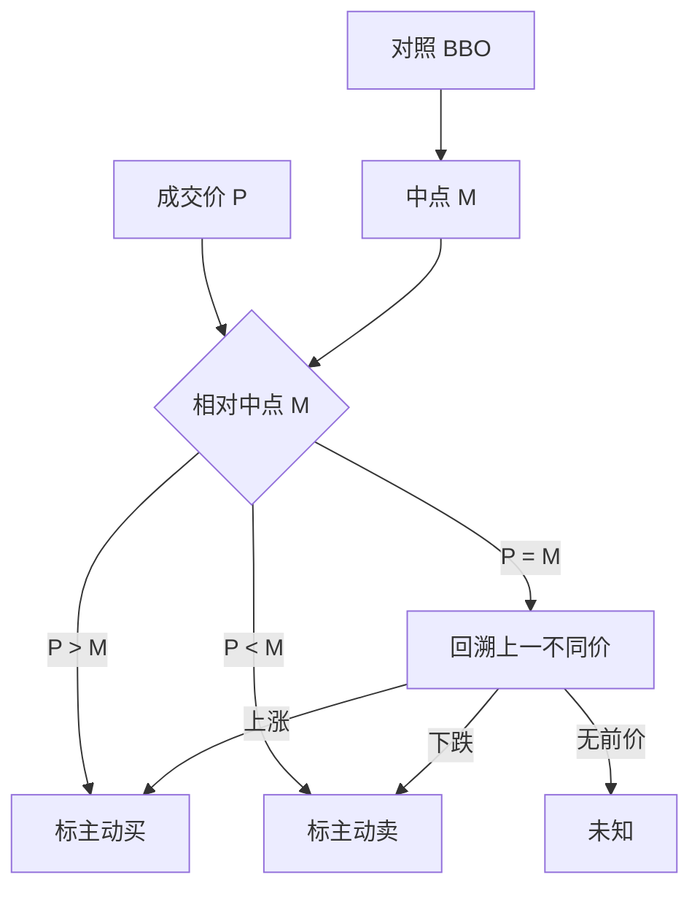

# Lee-Ready 算法

成交没有贴着「主动买」标签到达研究者手里。先拿成交价对照当时买卖中点，平价再退回到上一笔不同价格的涨跌，这是把方向从公开行情里读出来的默认程序。

<footer>—— Lee & Ready, Inferring Trade Direction from Intraday Data, Journal of Finance, 1991</footer>

[有效价差](/quant/effective-realized-spread)、[PIN](/quant/pin)、[Kyle lambda](/quant/kyle-lambda) 都要成交方向 $D_t\in\{+1,-1\}$。交易所或数据商现在有时提供主动方标志，1991 年的 ISSM 样本没有。Lee 与 Ready 给出一套当时可复述的规则：先做报价检验，中点成交再做 tick 检验，报价还要相对成交滞后五秒。本篇写这套**组合算法**本身——阈值、平价分支、滞后约定——以及它在小数报价、多交易所并行之后错在哪里。单独的 [Tick Rule 与 Quote Rule](/quant/tick-quote-rule) 是它的两个零件，不在这里展开对照实验。

## 问题

逐笔成交价 $P$ 落在买价 $B$、卖价 $A$ 或其中间。主动买倾向于在卖价或之上成交，主动卖倾向于在买价或之下。若所有成交都严格打在 BBO 上，方向就是报价检验。真实数据里大量成交打在中点：定价改善、交叉盘、做市商内化、报告延迟让 $P=M=(A+B)/2$。中点没有左右，必须另找参照。tick 检验用价格相对上一笔**不同价格**的涨跌来补这一刀。

第二个问题是时间对齐。1991 年纽约的成交与报价不是同一条管道，成交往往先被报告，当时的 BBO 其实是「未来」的报价。Lee–Ready 因此把报价往回挪五秒再比。今天的纳秒时间戳上再套五秒，是把算法的历史补丁当成物理常数。问题于是收成：在你的数据生成过程里，报价检验该用哪一版 BBO——成交之前最后一笔有效报价，还是带固定滞后的报价。

### 报价检验加 tick 检验

规则按顺序：

$$
D_t=
\begin{cases}
+1, & P_t > M_{t-}\\
-1, & P_t < M_{t-}\\
\mathrm{tick}(P_t,P_{t-k}), & P_t=M_{t-}
\end{cases}
$$

其中 $M_{t-}$ 是用于对照的中点，$\mathrm{tick}$ 在 $P_t>P_{t-k}$ 时为买、小于为卖，$P_{t-k}$ 是最近一个与 $P_t$ 不同的成交价。零 tick（价格不变）继续往回找，直到有涨跌或样本开头。开盘第一笔没有前 tick，只能标未知或丢掉。集合竞价、交叉盘、成交发生在锁定报价上，算法没有额外智慧，只会机械输出一个符号。

原文的五秒滞后是 ISSM 报告延迟的补丁，不是微观结构理论的一部分。现代研究默认用成交前最后一笔有效 NBBO 或本交易所 BBO。把五秒写进 2020 年代的代码，分类错误会系统性上升。

## 方法

输入是已清洗的成交与报价，见 [tick 清洗](/quant/tick-cleaning)。对每笔成交：取对照报价（因果：时间戳严格小于成交；或原文：成交时间减五秒）、算中点、比较价格。平价则沿成交序列回溯不同价。输出 $D_t$，并保留「由报价判定 / 由 tick 判定 / 无法判定」的标志。无法判定不应 silently 填成上一笔方向，那会制造虚假持续。

精度评估需要真实主动方。Ellis、Michaely、O'Hara（2000）用纽约的系统订单数据当标签，发现 Lee–Ready 总体正确率大约八成，中点成交明显更差，打在买一卖一上则报价检验已经够用。后续文献在 NASDAQ、小数化之后重复：价差只有一两个 tick 时，中点附近的密度上升，组合算法的错误率跟着上升。工程上应报告：中点成交占比、报价检验占比、以及用交易所主动标志当对照时的一致率。

### 中点成交是错误的主产地

价差一个 tick 时，$P$ 只能落在 $B$、$M$、$A$ 三格。中点一格占掉大量成交，全部交给 tick 检验。tick 检验假定价格涨是因为主动买——这在存货回复、报价上移、前一笔打印错误时都不成立。反向成交（主动买打在买价上，因为深度或隐藏单）会让报价检验也错。Lee–Ready 没有模型去修这些情形，它只是一个可复述的默认。

多市场时，综合中点与成交所属交易所可以对不齐：成交在 B 所发生，对照却用了 A 所已更新的 NBBO，方向被未来信息污染。合法做法是：本所成交对本所 BBO，或对综合簿但时间戳用成交所在场所的撮合时钟。跨市场「全局 Lee–Ready」不是原文对象。

## 机制

报价检验的机制来自做市：卖报价是对主动买的条款，买报价是对主动卖的条款。成交价高于中点，更像吃了卖方流动性。tick 检验的机制更弱：它把价格变化当成订单流的充分统计量，这只在「没有新报价、只有成交推动价格」时近似成立。Lee–Ready 把强规则用在能用的地方，把弱规则留给报价检验失效的子集，是工程分层，不是一条均衡一阶条件。

分类错误对下游的偏误方向几乎总是衰减。随机把一半买标成卖，带符号流量向零缩，$D(P-M)$ 的期望变小，[有效价差](/quant/effective-realized-spread)被低估，PIN 的 $|B-S|$ 被抹平，lambda 向零。错误若与波动相关（繁忙时中点成交更多），偏误就变成状态依赖，不是一个可减的常数。因此「先 Lee–Ready 再估冲击」必须把分类当作估计量的一部分，而不是数据预处理的无害步骤。

### 小数化之后默认程序变脆

最小报价单位缩小，中点网格变密，更多成交落在价差内部却不等于中点，报价检验仍能工作；但隐藏流动性与中点匹配把 $P=M$ 的比例重新抬高。高频做市让 BBO 在成交到达前已经改写，因果中点与「成交那一瞬间屏幕上的中点」可以不是同一个。算法没有错，是市场结构换了，默认程序的识别假设变差。能拿到交易所主动标志时，Lee–Ready 应降为对照序列，而不是主序列。

A 股竞价制度、涨跌停与集合竞价使开盘第一批成交没有可用的连续盘 BBO。这些时段应单独标记，不要用隔夜最后报价去给开盘成交做 Lee–Ready。停板一侧没有对手价，中点无定义。

## 边界与工程取舍

不要把 Lee–Ready 的输出叫做「知情方向」。它估计的是主动方，不是知情方。不要在没有报价的成交带上强行跑报价检验。不要用收盘价相对日中点去给全日唯一一笔「方向」——那不是 1991 年算法。批量成交、冰山打出的一串同价成交，tick 检验会给出一长串相同符号，可能对、也可能只是同一主动方的切片。

与[批量成交量分类](/quant/bulk-volume-classification) 的分工：Lee–Ready 要报价、逐笔、贵；BVC 用桶内价格变化的 CDF，不要报价、但把波动写进方向。两者错误结构不同，不可用一个的正确率去为另一个背书。生产上若有官方主动标志，优先用它，Lee–Ready 只用于缺失与交叉验证。

出处：Lee & Ready, *Inferring Trade Direction from Intraday Data*, Journal of Finance, 1991。精度评估见 Ellis, Michaely & O'Hara, 2000。五秒滞后属于原文数据环境，不属于算法的数学内核。

## 小结

- Lee–Ready 先用成交价相对中点定方向，平价再用 tick 检验回溯上一不同价。
- 五秒报价滞后是 1991 年报告延迟的补丁；现代应用应改用成交前最后有效报价。
- 中点成交与一 tick 价差是错误率的主要来源；随机错误会把下游价差与 PIN 向零拉。
- 多市场必须声明对照的是本所 BBO 还是综合中点，以及时钟。
- 主动方不等于知情方；有官方标志时应把 Lee–Ready 降为对照。
- 开盘拍卖、锁定报价、停板使中点无定义，应标未知而不是硬填。
- 出处：Lee & Ready, Journal of Finance, 1991。
