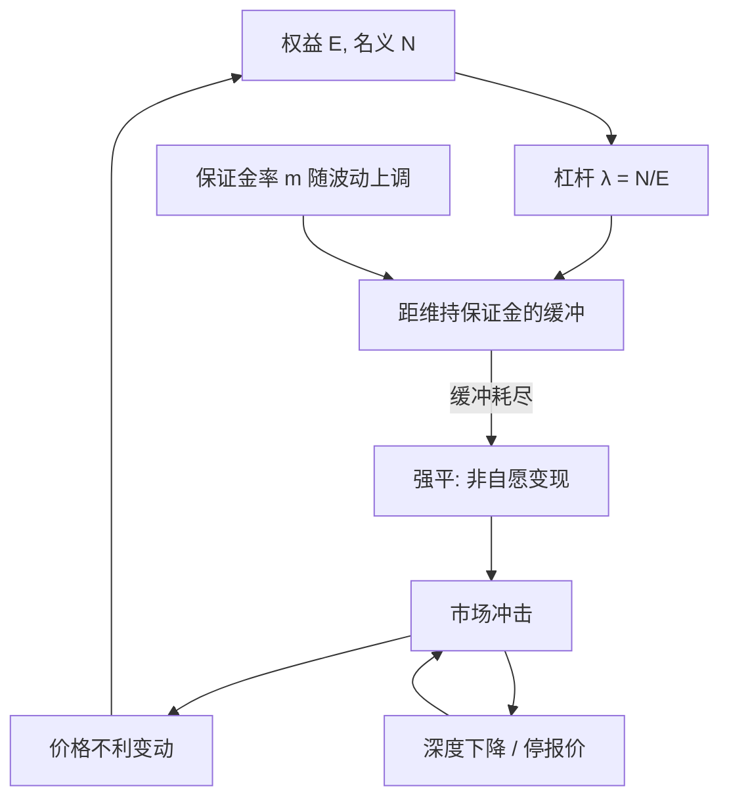

# 杠杆、保证金与强平

市场流动性与融资流动性互相喂养：价格下跌削弱抵押品，保证金上调迫使变现，变现再打压价格。杠杆把这一环写成账户规则，强平是规则的角点，不是外生的意外。

<footer>—— Brunnermeier and Pedersen, Market Liquidity and Funding Liquidity, Review of Financial Studies, 2009</footer>

[上一课](/quant/var-backtest)用 Kupiec 的无条件覆盖与 Christoffersen 的独立性检验声明的 $p$：99% 日 VaR 年样本期望违反极少，不拒绝不是验证，次数检验也不能当作 ES 回测。缺口是纸面损失假设价格外生、持有期能走完：有杠杆时维持水平被击穿则非自愿变现，真实路径含被迫在不利价格上交易的段。Brunnermeier–Pedersen 的螺旋与 Adrian–Shin 的主动杠杆，使去杠杆成为价格的供给冲击。本课写账户算术与强平反馈，不重写覆盖检验。对象是风险架构，不是如何把他人逼到清算阈值。

## 问题

覆盖检验回答的是声明的 $p$ 有没有被次数与独立性打脸。留下的是：那条损失路径是否假设你能持有到期末。无杠杆时，损失以权益为限，变现时间可以由投资人选择。有杠杆时，名义头寸 $N$ 远大于权益 $E$，杠杆 $\lambda=N/E$。价格反向移动 $\Delta P$ 使权益变成 $E'=E+N\cdot\Delta P$（符号按方向），杠杆升到 $N/E'$。若 $E'$ 低于维持保证金要求 $m_{\mathrm{maint}}\cdot N$，经纪人要求追加现金；若在时限内不到账，就按规则减名义，直到保证金恢复或头寸清零。问题是把这套规则写成对 $L$ 的改写：真实损失路径含有**被迫在不利价格上交易**的段，这段不出现在未加保证金约束的 VaR 里。

第二句话是内生性。个体的强平是账户问题；许多账户共享同类抵押品、同类风险因子时，强平是市场价格的供给冲击。Brunnermeier–Pedersen 区分市场流动性（变现对价格的冲击）与融资流动性（用抵押品借钱的难易）：两者在压力里螺旋。风险系统若把价格过程当外生、再在外生路径上算保证金，会低估同时去杠杆的尾部。Jorion 讨论流动性风险时强调：VaR 地平线上未必能按标记价退出；强平规则把「未必」变成「必须立刻退出」。

### 初始、维持与变异保证金

期货风格的变异保证金每日把盈亏兑成现金，维持的是保证金账户余额；股票融资则把证券当抵押，贷款余额相对市值有折扣（haircut）。折扣升等价于初始保证金升：同样权益能支持的 $N$ 下降。维持水平低于初始，是为了给价格噪声一个缓冲，避免一碰到就平仓；缓冲越窄，强平越频繁。交易所与经纪商的保证金模型（SPAN、基于 VaR 的保证金等）把 $m$ 写成风险的函数，于是 $m$ 在波动上升时上调——融资流动性在最需要时收紧。这是制度，不是微观结构故障。

强平价格通常差于当时中间价：它走市价、吃深度、可能穿过涨跌停后的缺口。用中间价算「触及维持保证金时的账面损失」会低估真实权益消耗，也会低估对其它账户的冲击。

## 方法

单账户、单一资产、多头融资买入：价格从 $P$ 到 $P(1+r)$，权益 $E'=E+N r$。维持约束 $E'\ge m N$。临界收益

$$
r_{\mathrm{liq}}= \frac{m N-E}{N}= m-\frac{1}{\lambda}.
$$

杠杆越高、维持保证金越高，反向一点点就触及。触及后若不允许补仓或补仓失败，名义必须降到 $N'\le E'/m_{\mathrm{init}}$（回到初始水平）或清零。出售量为 $N-N'$，在薄市场上的冲击把 $r$ 进一步打低，可能触发下一轮。这就是损失螺旋（价格跌→权益跌）与保证金螺旋（$m$ 升→必须卖更多）的算术。

组合层用保证金模型输出一个总要求 $M_t$，约束 $E_t\ge M_t$。$M_t$ 若按组合 VaR 或 SPAN 情景随 $\sigma_t$ 与相关性上升，则与风险模型同源：同一个高 $\sigma$ 既提高 VaR 限额压力，又提高保证金。回测纸面 VaR 而不回测「是否触发 $E<M$」，会漏掉账户的真正死亡方式。Kelly 公式给出的增长最优仓位在有强平时不再可行：触及清算的路径把对数效用打到 $-\infty$ 的离散版本，分数 Kelly 与硬杠杆上限是对这一角点的工程响应，见 [仓位与 Kelly](/quant/kelly-sizing)。

### 螺旋何时成为市场现象

个体强平成为价格冲击，需要：头寸相对当时深度足够大，或许多账户同时同向。后者在拥挤策略、指数再平衡、同类 VaR 模型同步削减时出现。Adrian–Shin 的机制是主动杠杆目标：银行不想要、也往往不被允许，在资产下跌后维持高 $\lambda$，于是卖资产。Brunnermeier–Pedersen 的机制是保证金对波动与冲击内生上升。两者叠加时，供给曲线在下跌市场里向右下弯：越跌越卖。Thurner 等人的模拟显示，无杠杆时近正态的收益，加上杠杆与强平阈值后出现肥尾与波动聚类——看起来像 [GARCH](/quant/garch) 或 [EVT](/quant/evt) 要拟合的对象，生成机制却是融资约束而不是外生跳。

## 机制

保证金是看跌期权的抵押版本：贷方拒绝在 $E$ 过低时继续承担违约。强平是执行该保护。对市场而言，保护的执行把潜在违约转换成立即的市价供给。价格因而在融资压力期不再只反映信息与存货，还反映谁必须卖。这与做市商 [停报价](/quant/toxic-flow) 互相反馈：深度下降使同等出售的冲击更大，更多账户触及 $r_{\mathrm{liq}}$。O'Hara 的微观结构价格形成，在这里被加上一层融资状态变量。

从风险度量看，真实损失分布在杠杆下是截断加冲击：未强平时像纸面 P&L，强平后变成「在不可选的时间、以冲击后的价格实现」。ES 对这些路径特别敏感，因为它们正是尾巴。Artzner 公理的正齐次在此处紧张：名义翻倍不只使线性损失翻倍，还使触及强平的概率非线性上升。要把杠杆写进风险，或者把 $L$ 定义为已施加保证金规则的账户损益，或者在纸面 ES 上加一项融资流动性附加。只提高 $\alpha$ 而不改 $L$ 的定义，是在用更极端的外生分位数去近似一个内生机制，通常近似得很差。

隔夜跳空可以越过维持水平而不断触发盘中追加，直接开盘强平。日频 VaR 把跳空放进 $L$，但仍假定你能在次日以标记价调整名义。跳空后的第一笔成交往往已经是清算流。

### 与实施缺口、做市库存的对照

投资组合的 [实施缺口](/quant/implementation-shortfall) 是自愿执行相对决策价的成本；强平是非自愿执行，决策价是保证金规则而不是投资观点。做市的库存限额是内部 $q_{\max}$，触及后偏度与停报价是内部控制；经纪商保证金是外部硬约束，通常更粗、更同步、更不顾你的公允中点。架构上应把内部限额设在外部强平之前，使「自己减仓」发生在「被减仓」之前。内部限额若与外部保证金用同一套 VaR，压力期会同时触发，缓冲为零。这是参数选择，不是理论必然。

## 边界与工程取舍

上述算术忽略交叉保证金、期权非线性、多币种、以及司法上的破产留存。真实经纪规则含有酌情权：可以提前提高 haircut、拒绝加仓、延长或缩短追加时限。模型把规则当确定性阈值，会低估酌情收紧、高估在阈值前的安全。跨市场的抵押品再抵押链（Adrian–Shin 所强调的）使同一证券支撑多层杠杆，haircut 的一小步可以沿链放大。

风险报告若只给纸面 VaR 与 ES，应至少附加：当前杠杆、距维持水平的缓冲（价格距离与资金距离）、集中抵押品、以及压力 haircut 情景下的强制卖出规模。回测应包含「是否触及追加、是否被减仓」，而不是只有 Kupiec 的违反次数。监管与内部模型把流动性期限写进 FRTB 一类框架，正是承认 $h$ 日标记不是 $h$ 日可变现。Geanakoplos 的教训是杠杆本身是均衡价格的一部分；把杠杆当外生常数，价格理论不完整，风险管理也不完整。

本篇说明强平如何成为损失机制与系统性反馈，不提供如何定位他人保证金阈值、如何交易清算流的任何路径。那些问题属于对脆弱账户的利用，不是风险管理架构。

## 小结

- 杠杆把保证金规则写进损失路径：维持水平被击穿则非自愿变现，纸面 VaR 的外生价格假设失效。
- 临界反向收益约为 $m-1/\lambda$；杠杆与保证金率共同决定缓冲。
- Brunnermeier–Pedersen 的损失螺旋与保证金螺旋，以及 Adrian–Shin 的主动杠杆，使去杠杆成为价格的供给冲击。
- 强平路径落在 ES 的尾巴里，且使正齐次的连贯度量与真实流动性成本分家。
- 内部库存或风险限额应严于外部强平，并避免与保证金模型在同一信号上同时触发。
- 回测除违反次数外，应记录追加与减仓事件；跳空可以越过盘中缓冲。
- 出处：Brunnermeier and Pedersen, *RFS*, 2009；Adrian and Shin, *Journal of Financial Intermediation*, 2010；Shleifer and Vishny, *Journal of Finance*, 1997；Geanakoplos, *NBER Macroeconomics Annual*, 2010；Thurner, Farmer and Geanakoplos, *Quantitative Finance*, 2012；VaR 与流动性语境见 Jorion, *Value at Risk*。
