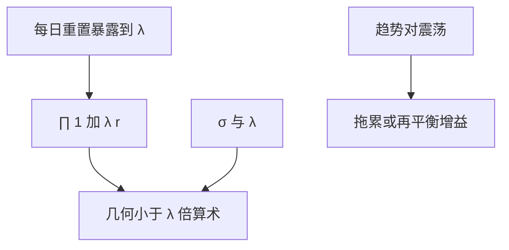

# 杠杆与波动拖累

每日再平衡的杠杆 ETF 的复利，不等于标的复利乘杠杆倍数；方差项把路径拉向几何均值。

<footer>—— 对照 Cheng and Madhavan 对杠杆 ETF 路径依赖的分析；波动拖累见连续时间财富 $r-\tfrac12\sigma^2$ 项</footer>

[上一课](/quant/target-date-glidepath)的路径默认未杠杆化。本课缺口是 **$2\times$、$3\times$ 与融资杠杆的离散再平衡**：算术收益可以是 $\lambda$ 倍，几何收益少一块 $\tfrac12\lambda(\lambda-1)\sigma^2$ 量级的拖累。主干 Kelly 已有杠杆上限；这里写清楚拖累与再平衡溢价的符号关系，后课专门写再平衡溢价。

## 问题

设标的日收益 $r_t$，杠杆 ETF 近 $\lambda r_t$ 再扣费。多日财富 $\prod(1+\lambda r_t)$，不是 $(1+\lambda\bar r)^T$。对数近似 $\lambda\mu-\tfrac12\lambda^2\sigma^2$ 对对数效用投资者，而标的是 $\mu-\tfrac12\sigma^2$。杠杆既放大漂移也放大方差项。震荡市里标的来回、杠杆产品因每日重置而锁亏——这是凸性/再平衡，不是「产品骗人」。问题是把拖累写成预期项，放进 Merton 实现，而不是在回测里用算术 $\lambda\bar r$ 当持有期收益。

融资杠杆（借钱买股票、不每日精确重置）的拖累形式不同：利息是现金，再平衡不是强制每日。不要把杠杆 ETF 的路径公式套到经纪商保证金账户上。

### 拖累不是费用的别名

管理费与融资利率是另一项。波动拖累在零费用下仍在。高 $\sigma$、高 $\lambda$、长持有、震荡（负自相关）时拖累大；趋势市（正自相关）里每日再平衡可以获利，即后课再平衡溢价的反面或同面，取决于你站在产品哪一侧。

波动瞄准策略每日调杠杆，也有同类路径项。把它当免费的「稳夏普」，忽略了调仓冲击与拖累。

## 方法

报告持有期收益用产品 NAV 路径，不用 $\lambda\times$ 指数收益。预测：用预期 $\sigma$（HAR）估拖累，持有期超过数日的杠杆 ETF 必须有这项。对冲：用期货加现金复制杠杆暴露，控制再平衡频率，使拖累成为选择而不是产品强制。Merton：$\lambda$ 进 $\pi$，但效用按几何，自动惩罚过高 $\lambda$。

## 机制

每日重置把暴露钉在 $\lambda$，等价于持续买卖：涨则加仓、跌则减仓（对多头杠杆）。震荡时买高卖低。这与固定份额组合的再平衡相反或相同，取决于比较对象。连续时间 Itô 的 $-\tfrac12\sigma^2$ 是同一数学。

## 边界

隔夜跳、跟踪误差、对手方（ETN）不是拖累公式能覆盖的。反向杠杆在趋势下跌中可赢，但仍有方差项。本课不建议用杠杆 ETF 当长期 TDF 核心。监管与适当性另论。

## 小结

- 每日杠杆的复利不是 $\lambda$ 倍标的复利；方差项是一等公民。
- 融资杠杆与杠杆 ETF 的重置规则不同，公式不可混用。
- 震荡锁亏、趋势可能增益，接到再平衡溢价。
- 出处：Cheng and Madhavan 对杠杆 ETF 的分析；Itô 公式的几何均值项。
