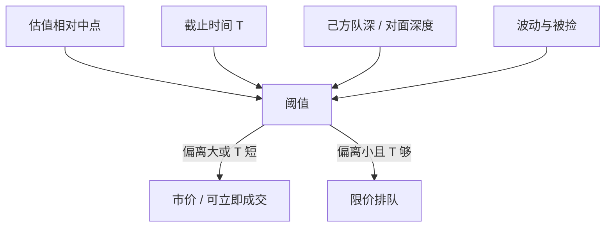

# 限价单对市价单的选择

市价买即时性，限价卖等待、买价差。选择不是性格，是状态：估值偏离、队列、波动与截止时间把同一个人在两极之间切换。

<footer>—— 据 Cohen, Maier, Schwartz and Whitcomb, Transaction Costs, Order Placement Strategy, and Existence of a Bid-Ask Spread, Journal of Political Economy, 1981；对照 Harris 对 maker / taker 的论述</footer>

[Glosten 电子簿](/quant/glosten-electronic-lob)给出竞争性曲线 $p(Q)$。缺口是需求侧：面对这条曲线（以及己方排队），交易者何时沿曲线吃、何时把自己写成曲线上的一点。Cohen 等人（1981）已在交易成本下讨论下单策略与价差存在；Parlour / Foucault / Roşu 把选择写成均衡。本课把选择规则收成可执行的权衡，不重推那些均衡的存在性。

## 问题

若永远市价，你付有效价差与冲击，从不赚价差，也很少被捡。若永远限价，你在有利时省钱，在截止时间前可能零成交，或在信息来时被捡。真实约束是截止时间（对冲、指数公布、资金到账）与私有估值相对中点的偏离。问题是给出状态依赖的阈值：偏离大、时间短、对方簿薄、己方队长、波动高时，更应市价；相反则限价。

[订单类型](/quant/order-types)已经区分 marketable limit 与纯市价。本课的「市价」包括一切到场即吃的指令；「限价」指未交叉、进入己方队列的指令。冰山是限价的可见性变体，不改变这层二元选择的一阶条件。

### 价差存在性

Cohen–Maier–Schwartz–Whitcomb 指出：若所有人都能无成本地挂在同一价位并立刻成交，价差会塌掉。离散到达加上不能同时双边成交的约束，使买卖报价分开——有人必须先挂、有人后到选择吃或挂。电子簿继承这个逻辑：价差是选择的均衡结果，不是外生费用。tick 只是把最小分开单位钉在栅格上。

Handa 与 Schwartz（1996）强调限价单作为「把波动变成收入」的策略。那是低信息、高波动时的限价动机，与被捡风险反方向，必须与 Foucault 合看。

## 方法

记私有估值 $v$，中点 $m$，对方最优价 $a$（买方向），己方队深 $n$，截止剩余 $T$，波动 $\sigma$。市价的期望成本约 $a-m$ 加冲击。限价挂在 $b'$ 的期望收益是：以概率 $\pi_{\mathrm{fill}}(n,T,\ldots)$ 在 $b'$ 成交，否则在截止时被迫市价或放弃。最优是比较

$$
v-a \quad\text{对}\quad \pi_{\mathrm{fill}}\,(v-b')+(1-\pi_{\mathrm{fill}})\,U_{\mathrm{fail}}.
$$

$\pi_{\mathrm{fill}}$ 来自 Parlour 队列与到达强度，$\ U_{\mathrm{fail}}$ 含被迫市价的更差价格与被捡。经验上用订单簿状态预测随后的限价/市价选择（Hollifield–Miller–Sandås 等），而不是估一条结构曲线。

### 可立即成交限价是阈值上的细栅格

估值刚过 $a$ 时，用 $a$ 的限价吃、余量转挂，与纯市价扫到底不同。选择其实是三维：价格、是否允许余量存活、展示量。本课保持二维叙事，把第三维留给隐藏流动性。

## 机制

每个人的阈值不同，市场看到的是混合。价差宽时，限价阈值更容易达到，供给增加，价差有回复压力；价差窄、队长时，更多人改吃，供给减少。这是 Foucault 组成的操作版。策略噪声会把截止时间同步（指数收盘），阈值集体移向市价，造成收盘前吃单高峰——与 Admati–Pfleiderer 的量峰相接，但微观动作是 maker 变 taker。

信息：知情者的 $|v-m|$ 大，阈值常倒向市价或深扫，这正是 Glosten 曲线开口的需求来源。非知情大单若被误当成知情，会在本应限价的区域被自己的冲击吓到，改为暗池，选择离开这张公开簿。

## 边界

截止时间与估值在数据里不可见，经验模型用代理（订单大小、账户类型、距收盘分钟）。算法拆单把一笔「母单」变成一串状态依赖的子选择，观测到的市价/限价比不是偏好参数。费用与 maker-taker 返佣平移阈值，比较不同交易所的「限价比例」要先净费用。

把散户的市价比例高读成「不理性」，可能只是 $T$ 短或不会管理队列。Boehmer 等人识别零售流之后，仍要问他们的截止约束，再谈选择质量。

## 小结

- 限价对市价是状态依赖阈值：估值偏离、截止时间、队深与被捡风险。
- 价差与深度由这些阈值的加总内生，Cohen 等人已给出价差存在的交易成本逻辑。
- 知情者更常越过阈值成为 taker，供给曲线因此开口。
- 出处：Cohen, Maier, Schwartz and Whitcomb, *Journal of Political Economy*, 1981；Handa and Schwartz, *Journal of Finance*, 1996；Harris, *Trading and Exchanges*。
