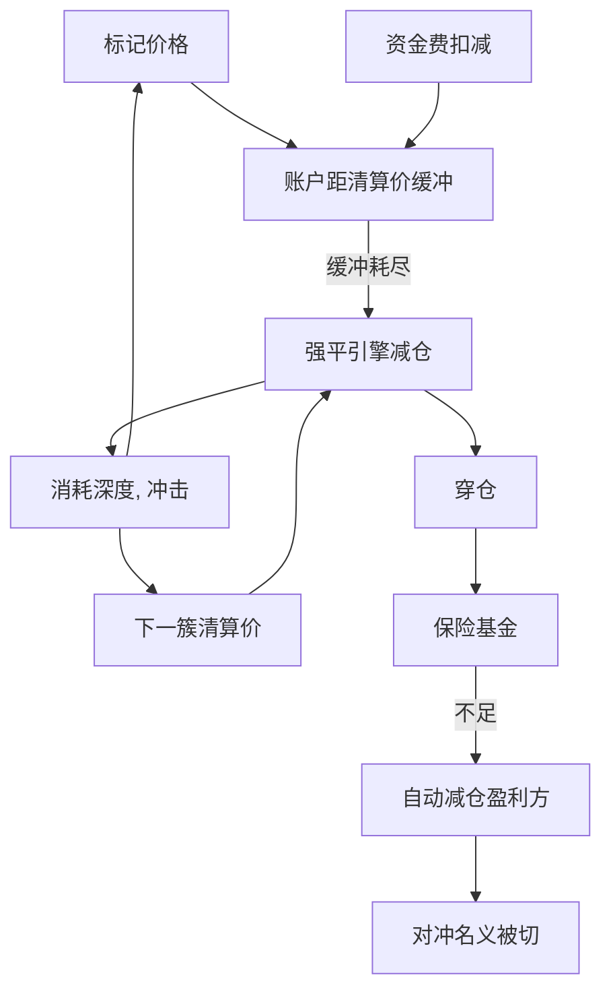

# 清算连锁

    
价格下跌削弱抵押品，保证金规则迫使变现，变现再打压价格；永续市场把这一环写成自动强平引擎，连锁是许多账户共享同一标记价时的宏观结果。

    <footer>—— Brunnermeier and Pedersen, Market Liquidity and Funding Liquidity, Review of Financial Studies, 2009</footer>

[上一课](/quant/crypto-basis-trade)把加密期现基差写成有到期期货对可结算现货的持有成本交易，盯市使期货腿出现现金缺口。缺口是永续引擎上的强制减仓：标记穿过清算价，引擎接管，穿仓可能动用保险基金，再不够则 ADL。当许多账户的清算价挤在同一价格带、深度相对未平仓量过薄时，一笔触发会把标记推进下一簇清算价。本课写清算连锁的会计条件与自身账户保护。不重推期现无套利带。对象不是定位他人清算价。

## 问题

单账户、多头永续：开仓价、杠杆、维持保证金率决定清算价 $P_{\mathrm{liq}}$（细节含手续费与资金费预扣）。标记价格 $P_{\mathrm{mark}}$ 跌到 $P_{\mathrm{liq}}$，仓位被引擎提交为减仓订单。若减仓成交均价差于破产价，缺口由保险基金补；基金不足则 ADL 按规则降低盈利对手方的仓位。问题从个体变成市场：设清算密度 $\lambda(P)$ 为「标记到 $P$ 时将被强制卖出的名义」。若 $\lambda(P)$ 在某区间高、且该区间的市场深度 $D(P)$ 低，则强制卖出造成的价格增量 $\Delta P\sim \lambda/D$ 足以触及下一层 $\lambda$，连锁发生。纸面 VaR 把价格当外生，不会生成这一段。

第二句话是标记。公开设计用指数加基差得到 $P_{\mathrm{mark}}$，降低最后成交被单笔扫单钉住的敏感度。连锁仍然可能：现货指数本身可以在多场所同步下跌，标记跟着走，清算引擎在所有引用该指数的永续上同时动作。指数是公共信息，不是漏洞；它使清算与现货流动性耦合。

### 清算价簇是状态，不是秘密名单

清算价由各账户的开仓与杠杆决定，市场整体的 $\lambda(P)$ 不可由公开订单簿直接读出，但未平仓量、近期成交、资金费与公开的清算成交记录提供**总量层**约束。风险架构需要的是：自身清算价离当前标记多远、自身减仓相对当时深度有多大、以及压力情景下指数跳跃是否越过缓冲。不需要、也不应当去还原他人账户。把「地图上的清算墙」当交易对象，是对脆弱保证金的利用，不属于本篇。本篇把 $\lambda(P)$ 当作宏观状态变量的存在性论证：它解释为何收益有悬崖，而不是给出悬崖的坐标。

资金费在结算点从保证金扣除，可以在价格不动时把账户推过维持水平。连锁的触发器不一定是「针」；也可以是高额资金与浅缓冲的叠加。风险系统把下一期应付资金当作确定扣减，见永续资金费篇。

## 方法

单账户缓冲：价格距离 $P_{\mathrm{mark}}-P_{\mathrm{liq}}$（或反向仓位的对称），资金距离（权益减维持）。压力应含：指数跳跃、资金脉冲、保证金率上调、自身减仓冲击。自身减仓冲击用当时深度与参与率估计，避免用中间价假设「触及即按标记平掉」——引擎走的是市价路径，成交差于标记。组合层若多币对、多场所，清算时钟不同步，对冲在分钟内裂开。

市场层监控（总量、公开）：未平仓量相对现货与永续深度、短时实现波动、公开清算量、保险基金余额变化（若披露）、资金费是否触达夹紧。这些是体制变量，用于降低自身杠杆或减少同向拥挤敞口，不是用于预测下一笔清算的方向性下注。回测自身策略必须把引擎规则写进路径：触及则强制成交、滑点用深度函数、允许部分减仓与剩余仓位的新清算价。只在日收盘检查保证金，会漏掉盘中连锁。

### 保险基金与 ADL 如何改写净敞口

保险基金吸收穿仓，使盈利方暂时不必被减仓，连锁在「有垫」时更像普通冲击。基金耗尽后，ADL 按公开优先级降低盈利仓位，你的对冲若在盈利侧，名义会在最需要的时候变小：现货腿仍在，永续腿被切，结构从中性变成方向性。这是 [Funding 套利](/quant/funding-rate-arb) 与做市库存的尾部。方法是：把 ADL 当成缺口风险的情景，限制单场所集中，避免「市场中性」在规则上并不中性。不要假设保险基金在历史上从未耗尽因此未来也不会——基金规模相对未平仓量才是比例。

自动减仓的优先级通常公开（杠杆与盈利程度），但不提供选择「谁被减」的交易接口。架构上能做的是降低自己成为 ADL 对象或依赖单一对手池的程度：分散场所、降低杠杆、避免把全部对冲放在同一永续合约。

## 机制

连锁的机制是 Brunnermeier–Pedersen 螺旋的合约化。市场流动性：强制市价单消耗深度，冲击大。融资流动性：维持保证金与标记规则决定谁必须卖。两者在同一标记价上闭环。O'Hara 的价格形成在此被加上引擎状态：报价不仅反映信息与存货，还反映即将到来的强制流。做市商若预期连锁，会撤出深度，$D(P)$ 下降，$\lambda/D$ 上升，预言自我实现。停报价与清算在时间上重叠，不是微观结构故障，是规则与存货的理性反应。

肥尾与波动聚集可以从这一机制生成，而不需要外生跳过程。价格接近高 $\lambda$ 带时，小的外生冲击被放大；远离时，同样大小的冲击只是普通成交。看起来像 [GARCH](/quant/garch) 或跳扩散要拟合的对象，生成机制却是阈值。风险模型若只用外生厚尾补丁，而不降低杠杆与集中度，是在用校准去覆盖一个可以改变的账户规则。

隔夜或周末现货仍交易、部分永续流动性下降时，指数可以跳过一层 $\lambda$ 而在永续簿上几乎没有连续成交。开盘后的第一批清算单面对更浅的 $D$，连锁更陡。日频风险数字会低估这类时钟错配。

### 与传统期货强平、股票融资的差别

传统期货也有强平，但中央清算、日终盯市、涨跌停与熔断会切断连续连锁的路径，见 [涨跌停与集合竞价](/quant/cn-limit-auction) 一类规则。加密永续 24 小时连续、杠杆更高、保险基金与 ADL 替代了部分中央对手方职能，切断更少、速度更快。股票融资的追加有时限，人工协商存在；引擎没有时限。差别是速度与同步，不是「有没有螺旋」——螺旋在 2008 年的融资流动性里已经写过。加密把螺旋的钟摆缩短到分钟。架构含义是：内部限额必须比引擎清算价更远，使「自己减仓」发生在「被减仓」之前；内部限额若与引擎用同一标记、同一维持率，缓冲为零。

## 边界与工程取舍

上述密度论证忽略交叉保证金、期权非线性、多币种抵押折扣以及场所酌情暂停。真实规则含有：暂停开仓、提高保证金、限制市价、保险基金注入。模型把规则当确定性阈值，会低估酌情收紧、高估阈值前的安全。跨所同一币的永续共享现货指数，连锁可以跨所传播而无需共享订单簿。分散场所降低单所对手方风险，不自动降低指数层连锁。

风险报告除纸面 VaR 外应附加：杠杆、距清算的价格与资金距离、下一期资金、单所集中度、压力 haircut 下的强制减仓规模。回测含「是否被引擎接管」，而不是只有日收益的 Kupiec 计数。不要把历史上的清算量当 alpha 因子去追涨杀跌：公开清算是滞后或同步的压力标志，交易它等于在螺旋里加一笔自愿流量。

本篇说明连锁如何从公开保证金规则与深度中产生，不提供估算他人清算价、挂单引诱引擎或在连锁中猎杀账户的任何方法。保护自身账户的方式是降低杠杆、拉开清算距离、分散对手方与承认 ADL 缺口。

用市价单去「推动标记穿过某墙」依赖操纵最后成交或冲击指数成分，前者正是标记价格设计要提高成本的行为，后者涉及现货多场所。两者都不是风险管理，本篇不讨论其执行。

## 小结

- 清算连锁是强制减仓冲击触及下一层清算密度时的反馈，把融资流动性螺旋写成永续引擎的宏观结果。
- 标记价格降低对最后成交的敏感，但指数同步下跌仍使多所引擎同时动作。
- 自身风险看清算距离、资金扣减、减仓冲击与 ADL 缺口，而不是去还原他人清算墙。
- 保险基金耗尽后 ADL 会切盈利腿，市场中性结构在尾部不再中性。
- 内部限额必须严于引擎维持水平，否则压力期同时触发、缓冲为零。
- 24 小时连续与高杠杆使螺旋的时钟短于传统期货；日频 VaR 会漏掉盘中引擎接管。
- 出处：Brunnermeier and Pedersen, *Review of Financial Studies*, 2009；Adrian and Shin, 2010；Thurner, Farmer and Geanakoplos, 2012；Geanakoplos 对杠杆周期的论述；永续清算、保险基金与 ADL 的公开规则；对照 Perold 实施缺口与 Jorion 对流动性风险的讨论。
