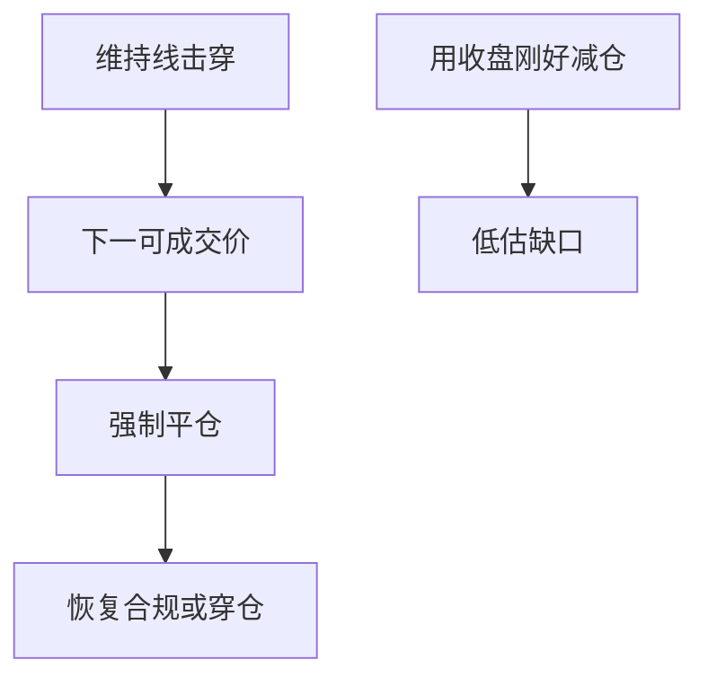

# 强平与缺口风险

维持保证金被击穿后，下一笔可成交价格不一定在维持线上；跳空缺口让强平发生在更差的价位，损失大于「刚好减到合规」的回测。

<footer>—— 据 Brunnermeier and Pedersen, 2009；Harris, Trading and Exchanges 对强制平仓与市场中断的讨论整理</footer>

上一课[保证金与维持保证金](/quant/margin-maintenance)把维持线写成每日检查。若价格连续，似乎总能在线上减仓。真实路径有隔夜跳空、停牌复牌、涨跌停封死，下一可成交价可以远在线外。本课补缺口：强平不是沿着回测曲线滑到合规，而是在可成交集合上一次性砍仓。不重讲双线定义。

## 问题

无缺口回测的隐含算法是：权益刚碰到维持线，立刻按该价格卖出（买入回补）到合规。缺口风险说：标记到市价的那一刻，可成交价已经跳过维持线，甚至跳过初始线与强平触发价。经纪商按规则市价平仓，成交在缺口后的第一笔可用流动性上。回测若用连续复权收盘价插值，会把这笔成交画在维持线上，系统性低估强平损失。

财务课的退市与停牌在这里变成资金事件：停牌期间保证金仍按最后价或按经纪商规则标记，复牌第一笔可能直接强平。

### 强平不是自愿再平衡

再平衡可以选择等待；强平由规则触发，时间优先于信号。把强平日当成普通换手、用 VWAP 假设成交，是把强制减仓当成有耐心的执行。后课停牌涨跌停会细化可成交集合；本课先把「线外第一笔」写进损益。

期货与差价合约的自动减仓、穿仓保险基金是同一缺口的合约化版本。本课用股票保证金讲清楚机制，不把各交易所规则抄一遍。

## 方法

状态机在检查维持线失败后进入强平：以**下一可成交价格**（开盘、复牌、涨跌停打开后的第一笔）按规则顺序平仓，直到满足恢复要求（有的规则要回到初始线，不只维持线）。缺口 = 触发标记价与实际成交价之差。回测禁止在触发日用收盘价「刚好」减仓。现金不足且无法追加时，允许权益为负（穿仓），不要用零截断假装有限责任——除非你的账户结构真的有限。

宇宙仍含退市：退市缺口本身可以是一次强平。

把强平单记成独立成交类型：时间戳是下一可成交，价格是当时可成交集合的边，数量由恢复规则决定。不要与信号再平衡合并成一笔净换手，否则你会以为自己在「主动高换手」。穿仓路径要留在样本里报告，删掉爆仓账户等于删掉资金约束最重要的左尾。期货自动减仓是同一逻辑的合约化，规则不同但禁止用标记价成交。

## 机制

缺口在波动聚集、流动性撤退时变大，与保证金上调同时出现，于是融资流动性螺旋被离散化：不是平滑去杠杆，而是一串跳空强平。多空因子的空头侧更易在跳空上涨时被强平回补，制造「空头挤压」路径，无约束回测里这些路径不存在。后课借券与回购会再加入能否借到券、抵押品被 haircut 的约束；没有券或没有抵押时，强平更早发生。

事件窗口里把强平当成普通成交，会把制度损失记进「事件 alpha」。业绩公告跳空尤其如此，后课事件策略必须复用本课的成交规则。

触发后禁止用当日收盘「刚好减到维持线」。成交价取下一开盘、复牌价或涨跌停打开后的第一笔，数量按规则一次砍到恢复要求（有的券商要求回到初始线）。穿仓允许权益为负，除非账户有限责任。把强平交易单独记账，不要混进主动再平衡的换手统计，否则成本归因会把强制减仓当成你自愿高换手。事件日跳空是本课最常见的触发器。

## 边界

不写各经纪商强平顺序的法务条款，不估计最优减仓算法。下一课[融资融券机制](/quant/margin-securities-lending)把多头融资与空头借券拆开。涨跌停作为可成交约束的系统处理见[停牌与涨跌停对回测](/quant/halt-limit-backtest)。后课默认：维持线失败按下一可成交价强平；连续价上的「刚好合规」不是合法成交。

后课融券会在召回时制造同类强制交易，不必等到维持线。本课把「下一可成交价」写成强平成交的唯一定义。连续复权价上的光滑去杠杆，从本课起视为非法成交假设。事件跳空、复牌、退市都是缺口来源，单独记账。

后课默认维持线失败按下一可成交价强平；连续价上减到刚好合规，不再视为合法成交。

恢复要求若是回到初始线而非维持线，强平数量大于「刚好合规」。这条规则必须写进状态机，禁止用维持线缺口去近似一条更严的恢复规则，否则危机路径会被画得过轻。

## 小结

- 维持线给出触发，缺口给出真实成交价。
- 用收盘插值减到合规，会低估强平损失。
- 强平是规则时间，不是信号再平衡。
- 跳空、复牌、退市都是缺口的来源。
- 无约束危机满仓回测缺的就是这些路径。
- 出处：Brunnermeier and Pedersen (2009)；Harris, *Trading and Exchanges*。
