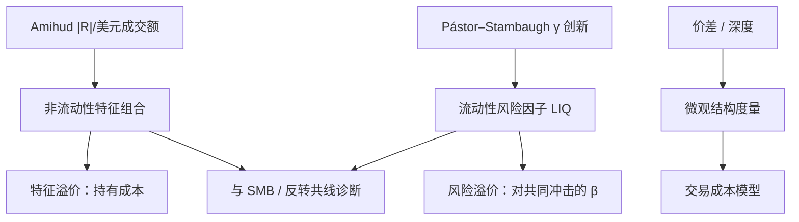

# 流动性因子

用绝对收益除以当日美元成交额，得到一个简单的非流动性比率；非流动性高的股票要求更高的预期收益，市场整体非流动性的创新则作为共同风险被定价。

<footer>—— Amihud, Illiquidity and Stock Returns, Journal of Financial Markets, 2002</footer>

[上一课](/quant/low-vol-bab)把证券市场线过平收成 BAB：按估计 β 排序、两腿杠杆到 β=1 再多空。缺口是另一类「难持有」：成交差的股票持有成本高，平均收益应更高；市场流动性突然恶化时，对流动性敏感的股票一起跌，这笔共同冲击也应有风险溢价。Amihud 把特征写成 ILLIQ；Pástor–Stambaugh 把市场流动性创新做成可交易因子；Acharya–Pedersen 把两者放进同一套 β。本课写 ILLIQ 的构造、特征溢价与交易流动性因子的区别，以及它和[短期反转](/quant/short-term-reversal)、规模的纠缠。不重推 BAB 的杠杆多空。

## 问题

BAB 管的是 β 与波动；留下的是冲击与成交。买卖价差、深度、价格冲击、换手、零成交天数都叫流动性，排序结果可以相反。价差是即时交易成本，冲击是数量的函数，换手是活动性而不是成本。若没有一个能在日频、长样本上算出来的代理，流动性就无法进入因子动物园。Amihud 选的是 Kyle 式直觉的粗实现：给定成交金额，价格动得越大，越不流动。

第二个问题是特征 vs 风险。高 ILLIQ 股票的高平均收益，可能只是对不可交易性的补偿（像一种税），并不要求它们对**市场流动性冲击**有高 β。Pástor–Stambaugh 构造的是后者：用个股收益对符号成交额的回归系数度量临时价格冲击，再把截面平均成市场流动性，取创新，按对创新的 β 排序做多空。两种「流动性因子」名字相同、持仓可以很不同。

### Amihud 比率量的是冲击不是价差

$$
\mathrm{ILLIQ}_{i,t}=\frac{1}{D_{i,t}}\sum_{d=1}^{D_{i,t}}\frac{|R_{i,d}|}{\mathrm{VOLD}_{i,d}}
$$

其中 $\mathrm{VOLD}$ 是美元成交额，$D$ 是当月（或当年）有效交易日。没有成交的日子通常跳过。这个数字随通胀与市场容量漂移，所以截面上要用断点或标准化，时序上常取对数或相对变化。它与买卖价差正相关，但在电子化之后价差压缩、ILLIQ 仍能区分冲击差异。不要把它读成「平均价差的估计」。

美元成交额随股价水平变。拆股不改变 ILLIQ 的经济学，但数据错误的成交额会把 ILLIQ 打飞。低价股 $|R|/\mathrm{VOLD}$ 极大，等权非流动性溢价很大一块是低价。价值加权或价格过滤是默认，不是可选美化。

## 方法

特征组合：每月用过去 12 个月的日度 ILLIQ 均值排序（需足够交易日），NYSE 分位，价值加权多空，可与规模 2×3 交叉以免做成第二个 SMB。持有期一个月。因为 ILLIQ 持久，换手低于反转、高于价值年度重构。

Pástor–Stambaugh 因子：对每只股票、每月，用日超额收益对滞后收益与「符号(超额收益)×成交额」回归，后者的系数 $\gamma$ 是流动性度量（越负越不流动）。市场流动性是 $\gamma$ 的等权平均，再减去趋势得到创新。按个股对创新的历史 β 排序，多空价值加权，得到交易型流动性风险因子 LIQ。

Acharya–Pedersen 把净收益写成对市场收益、市场流动性创新的 β，预期收益随自身非流动性水平上升、随流动性 β 上升。实证实现需要同时估计特征与若干流动性 β，样本噪声大，更常作为解释框架而不是第三个可下载因子。

### 与规模、反转、动量的共线

小盘 ILLIQ 高，SMB 已经含流动性补偿。独立于规模的流动性溢价更薄，但仍常被报告存在。短期反转是流动性供给的收益，ILLIQ 是水平；两者在压力月一起变强。动量的输家腿往往非流动，WML 的账面收益含卖空非流动股的补偿。任何「加入流动性因子后 α 消失」的声明，都要报告与 SMB、WML 的相关，以及是否用了价值加权。

## 机制

特征溢价：投资者要求补偿不可分散的持有成本——进出场价差、等待时间、被迫减持时的冲击。非流动股票在需要变现的状态上更痛，即使共同冲击不大，水平补偿也可以存在。风险溢价：市场做市资本有限，系统性抛售时冲击放大，高流动性 β 的资产在「流动性枯竭」状态付出协方差，应当像市场 β 一样被定价。2008 年、2020 年 3 月是这种状态的实验室，但几个月决定不了因子是否存在。

微观结构把 ILLIQ 和噪声连在一起：同样的冲击度量会进入已实现波动。高 ILLIQ 股票的「风险」有一部分是测量的价格噪声而不是未来现金流风险。用中点收益或隔夜-日内分解，可以看溢价是否来自成交价跳动。

### 时变与共同性

个股流动性有共同因子：价差、ILLIQ、换手在截面上一起变。共同性越强，越难靠分散化去掉流动性风险，Pástor–Stambaugh 的定价逻辑越硬。电子做市提高平均流动性、也可能提高共同性（同一套算法、同一类 ETF 赎回）。因此「价差变窄了所以流动性因子死了」并不自动成立——要看冲击的系统性。

把 Amihud 组合和 Pástor–Stambaugh LIQ 画在同一张累计收益图上当互相复制，会误导。前者偏小盘、偏特征；后者偏对市场流动性创新的协方差，大盘也可以有高流动性 β。下载哪一条、回归哪一条，必须在公式里写出来。

## 边界与工程取舍

ILLIQ 对零成交、盘后批量、货币单位敏感。新兴市场与 A 股的涨跌停让 $|R|$ 封顶，ILLIQ 被压低，排序失真。应用本地的限价规则修正，或改用非涨跌停日。成交额口径（是否含大宗、是否含暗池）在不同数据商之间不一致。

不要用 ILLIQ 当交易成本的美元估计去扣收益——量纲是收益/美元，不是价差。成本模型应回到有效价差与冲击函数。也不要在已经对规模、价格、换手三重过滤后，还宣称发现了巨大的非流动性 α。五因子不会自动吸收 LIQ；是否加入取决于投资宇宙是大盘可投资还是全市场等权。

真实出处：Amihud, Journal of Financial Markets, 2002；Pástor & Stambaugh, Journal of Political Economy, 2003；Acharya & Pedersen, Journal of Financial Economics, 2005。Kyle 1985 是冲击的理论源头，不是 ILLIQ 的实证定义。

## 小结

- Amihud ILLIQ 用 $|R|/\mathrm{VOLD}$ 代理价格冲击，做成非流动性**特征**组合。
- Pástor–Stambaugh 用市场流动性创新的 β 做成**风险**因子，持仓与 ILLIQ 组合不同。
- 与规模、反转、动量空头腿共线；价值加权与价格过滤会显著改溢价。
- 价差变窄不等于流动性风险消失，共同性与冲击系统性仍在。
- 出处：Amihud, 2002；Pástor & Stambaugh, 2003；Acharya & Pedersen, 2005。
