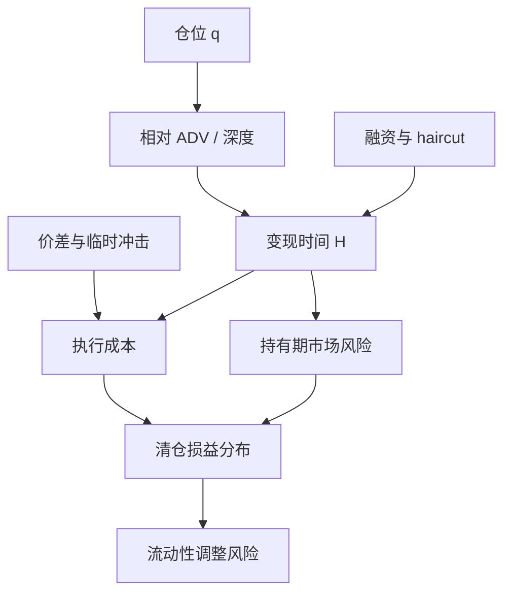

# 流动性风险与变现时间

市场风险的持有期默认你能按模型里的价格退出；流动性风险问的是另一件事：把仓位变现需要多长时间，以及这段时间里冲击与价差会把损益再拉出多远。

<footer>—— 对照 Bangia, Diebold, Schuermann and Stroughair 对流动性调整 VaR 的问题设定</footer>

[上一课](/quant/leverage-liquidation)把强平写成对损失路径的改写：临界反向收益约为 $m-1/\lambda$，内部限额应严于外部强平，跳空可以越过盘中缓冲。缺口是即使没有被强平，仓位也未必能在 VaR 地平线上按中间价退出：变现时间是风险参数，不是事后摩擦。外生价差与内生冲击要分开；朴素 $\sqrt{H}$ 既不是渐进清仓的市场风险，也不含冲击。本课写 $T$ 的权衡与 FRTB 分档，不重写保证金螺旋公式。它连接 [Kyle 模型](/quant/kyle-model) 里的冲击与 [流动性因子](/quant/liquidity-factor) 里的溢价。

## 问题

把仓位记为 $q$。即时变现的成本至少有两块：外生流动性（现行买卖价差、即使数量很小也付）和内生流动性（你的数量沿供给曲线移动价格）。Bangia、Diebold、Schuermann 与 Stroughair 把前者写进流动性调整 VaR：在市场 VaR 上加一半价差及其波动。Almgren 与 Chriss（2000）把后者写成执行轨迹：在时间 $T$ 内把 $q$ 拆成若干笔，临时冲击随交易速率上升，永久冲击改变后续中价。$T$ 就是变现时间。选短 $T$，冲击大；选长 $T$，你在市场上暴露更久，市场风险累积。

风险系统若强制所有因子共用 10 天，等于假设信用利差、小盘股与利率掉期同样好卖。危机里第一件失效的就是这个假设：买方消失，可成交量掉到正常的几分之一，名义上的 10 天变成无法完成的日历。Brunnermeier 与 Pedersen（2009）进一步指出，市场流动性与融资流动性互相放大——haircut 上升迫使降杠杆，降杠杆制造冲击，冲击再提高 haircut。变现时间在 spiral 里是内生的，不是你在政策文件里填的那个数。

### 平方根法则在渐进清仓下不成立

若你把 $q$ 在 $H$ 天内均匀卖掉，每天只承担剩余仓位的市场风险，总方差不是 $H\sigma^2 q^2$，而是量级为 $H\sigma^2 q^2/3$ 的积分（线性清仓的剩余暴露呈三角形）。同时每天还付冲击。朴素地把 1 日 VaR 乘 $\sqrt{H}$ 会高估「持有不动 $H$ 天」的市场风险，又完全漏掉冲击；对真正按 $H$ 清仓的组合，两项误差方向相反，不能互相抵消当免费午餐。正确对象是执行路径上的损益分布，不是把持有期换成另一个数再沿用同一套 VaR。

变现时间不是「这只股票平均几天换手一次」。换手是市场总量，你的 $q$ 相对 ADV（日均成交额）才决定冲击。占 ADV 的 5% 与 50%，同一只股票对应完全不同的 $H$。

## 方法

**仓位/ADV 规则。** 实务上最常用的代理：$H \approx q / (\pi \cdot \mathrm{ADV})$，其中 $\pi$ 是你愿意占日成交的比例（例如 10%–20%）。再按资产类别设下限，以免把国债也估成零天。这是容量约束，不是定价模型；它回答「按当前深度，机械地卖完要几天」。

**最优执行给出的 $T$。** Almgren–Chriss 在风险厌恶 $\lambda$ 下最小化冲击成本加执行期方差。最优速率随 $\lambda$ 与永久/临时冲击参数变，$T$ 可以是约束（必须在 $T$ 内卖完）或被最优解内生决定。Bertsimas 与 Lo 从动态规划给出另一条执行路径。把风控里的 $H$ 取成「在可接受 $\lambda$ 下使总成本低于阈值的最短 $T$」，比拍一个 10 天更接近交易现实。

**监管映射。** 巴塞尔交易账本根本审查（FRTB）给风险因子指定流动性期限：大盘股与利率常见 10 天，小盘与信用更长，可达 20、40、60 甚至 120 天。这不是说监管认为你真的会持有 120 天，而是说在压力市场里，这类因子的对冲与退出不能按 10 天计。内部模型若所有账面共用一个 horizon，和 FRTB 的分档精神相反。

### 外生与内生要分开进账

价差成本近似与 $|q|$ 成正比（付半价差），冲击成本对临时代价常与 $q^2/T$ 一类量成正比。小仓位被价差主导，大仓位被冲击主导。流动性调整 VaR 若只加价差，会让集中持仓看起来「有流动性费用但没有额外市场暴露」——恰恰把大仓位最危险的那一块漏掉。工程上应同时报告：即时半价差、按 ADV 规则的 $H$、以及把 $H$ 代入执行模型后的成本分布分位数。

用平静期 ADV 估 $H$，再拿去管危机，是循环论证。压力情景里要把 ADV 打一个折扣（或把 Kyle 的 $\lambda$ 放大），否则变现时间只会在回撤已经发生之后才变长。

## 机制

Kyle 的 $\lambda$ 把知情交易强度与噪声交易深度写成价格对净流的斜率。变现时间长，意味着你把同一笔 $q$ 摊到更多噪声交易上，$\lambda q$ 的瞬时冲击下降，但你与市场共处的时间变长，方向性新闻有更多机会打你。这是冲击与伽马（持有期风险）的权衡，和期权对冲里「交易太勤付价差、交易太稀留 delta」是同一类权衡。

融资约束改变可行集。抵押品市值下跌时，经纪商提高 haircut，你无法再「多等几天换更小的冲击」，因为保证金会先把你踢出仓位。此时有效 $H$ 被融资方压缩，执行从最优轨迹退化成火线抛售。Brunnermeier–Pedersen 的 margin spiral 与 loss spiral 描述的就是 $H$ 突然内生化、并且变短的过程。对多策略平台，这意味着：流动性期限必须与融资条款同频审查，不能只在市场风险引擎里写死。

### 与流动性溢价不是同一数字

Amihud 非流动性、Pástor–Stambaugh 的流动性 $\beta$，解释的是截面预期收益：难卖的股票或对市场流动性冲击敏感的股票，平均要求更高回报。变现时间回答的是存量仓位的退出风险。一只高 ILLIQ 的股票可能同时有高溢价和高 $H$，但因子多空若两边都能按 ADV 规则在几天内调完，组合层面的 $H$ 可以短于成份股的 $H$。反过来，杠杆信用组合即使成份「有溢价」，在买方消失时 $H$ 可以变成无穷——溢价补不了变现失败。

## 边界与工程取舍

ADV 规则对债券、场外衍生品几乎不可用：成交是询价的，公开「日均成交额」严重低估真实可成交，或把一次性大单当成日常深度。这时要用经销商报价频率、可成交量询价、以及历史清仓经验，并承认 $H$ 的误差本身是风险。ETF 的二级流动性不等于篮子里债券的一级流动性；用 ETF 的 $H$ 去套债券持仓，会在折溢价扩大时失效。

不要把 FRTB 的分档直接当成最优执行的 $T$。监管数字是资本计算的标准化假设，偏保守、且按因子类别一刀切。内部风控可以更细（按名字、按集中度），但应能解释：为什么内部 $H$ 比监管更短——通常需要可观察的深度与可承诺的融资。也无法用拉长 $H$ 来「做小」冲击后再按短期限报 VaR：两个数字必须来自同一条执行假设。

回测里假设每日按收盘价调仓，等于把所有名字的 $H$ 设成 0。容量测试至少应按 $q/(\pi\cdot\mathrm{ADV})$ 把成交摊到随后若干天，并计入临时冲击，否则夏普是按不可执行的轨迹算出来的。

## 小结

- 变现时间是把仓位在可接受冲击下卖完所需的时间；它是风险参数，不是事后摩擦。
- 外生价差与内生冲击要分开；朴素 $\sqrt{H}$ 既不是渐进清仓的市场风险，也不含冲击。
- Almgren–Chriss 把 $T$ 写成冲击与方差的权衡；Brunnermeier–Pedersen 说明融资能把可行 $T$ 突然压短。
- FRTB 按风险因子分档流动性期限，反对所有账面共用一个 10 天。
- 流动性溢价是预期收益，变现时间是存量退出；两者相关，不可互换。
- 出处：Bangia, Diebold, Schuermann and Stroughair, *Modeling Liquidity Risk*, Wharton / Risk, 1998–1999；Almgren and Chriss, *Optimal Execution of Portfolio Transactions*, Journal of Risk, 2000；Brunnermeier and Pedersen, *Market Liquidity and Funding Liquidity*, Review of Financial Studies, 2009；BCBS, *Minimum capital requirements for market risk*（FRTB）中的 liquidity horizon 分档。
