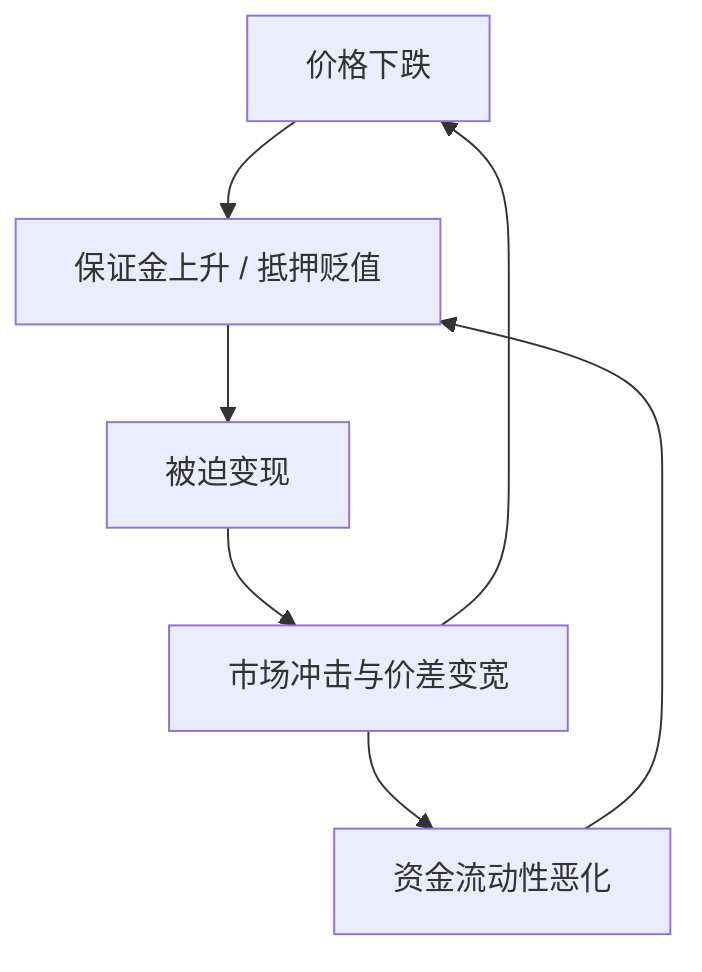

# 流动性螺旋

市场流动性与资金流动性互相喂养：价格下跌削弱抵押，融资收缩迫使变现，变现再打价格。风险模型若把流动性和相关当成外生常数，螺旋会以「模型失效」的形式出现。

<footer>—— Brunnermeier and Pedersen, Market Liquidity and Funding Liquidity, Review of Financial Studies, 2009</footer>

[相关性崩溃](/quant/correlation-breakdown)已经说明压力期共同运动上升，并引用 Brunnermeier 把融资与火线抛售连在一起。本课的缺口是把**螺旋本身**写成模型风险对象：不是再估计一个下行相关，而是问哪些模型假设在螺旋里同时破裂——外生流动性、外生相关、外生波动、可按中间价变现。拥挤清盘课写的是仓位同质化；本课写风险系统如何系统性低估同一环路。后课模型风险清单会把螺旋收成条目；本课把机制钉死。

## 问题

Brunnermeier–Pedersen 区分市场流动性（变现冲击、价差）与资金流动性（保证金、抵押折扣、短期融资）。好时光里两者互相强化：价差窄、保证金低、杠杆上升、做市存货充足。坏时光里：价格跌 → 保证金上调 / 抵押贬值 → 被迫卖出 → 冲击放大价格跌。相关崩溃是螺旋的截面症状：许多资产同时成为融资链上的抵押或同时被同一批杠杆账户持有。若风险引擎只更新 $\Sigma$ 而不更新变现时间与融资约束，VaR 会在螺旋加速时才跳，而不是在保证金规则已经收紧时跳。

缺口是把螺旋写成可监测的状态机，而不是危机叙事。状态至少包括：融资利差与保证金、市场深度/价差、被迫卖出的代理（共同基金赎回、期货持仓骤降）、以及模型仍在使用的流动性地平线是否已被市场证伪。

### 三种容易混为一谈的「流动性」

资金流动性：能否借到钱、抵押折扣多少。市场流动性：变现对价格的冲击。会计流动性：资产是否被记成 Level 1/2/3。螺旋把前两者焊死；第三者会在危机里从 1 变成 3，造成估值与监管资本的额外跳跃。本课对象是前两者的环路。用会计分类去代理市场流动性，会滞后。

螺旋不是「波动变大所以相关变大」的统计伪影。Forbes–Rigobon 的异方差修正处理估计偏差；螺旋是经济机制，即使相关估计无偏，被迫卖出仍然存在。

## 方法

把风险报告拆成两层。市场风险：给定仍能按假设地平线变现，$\mathrm{VaR}/\mathrm{ES}$。流动性调整：把地平线换成压力变现时间，冲击用参与率而不是中间价，见[流动性地平线](/quant/liquidity-horizon)。融资层：保证金与抵押折扣上调 $x\%$ 时的强制减仓量，把减仓量送进冲击函数，得到第二轮价格，再喂回保证金——这就是螺旋的一圈数值。不必追求精致均衡，一圈已经能显示平静期 VaR 缺了哪一项。

监测用公开代理：TED 或 CIP 偏离、券商 CDS、股票与公司债价差、ETF 相对 NAV 的折价、期货基差。代理不是因果证明，是状态。当代理与持仓拥挤同时亮，应切换到压力相关与压力地平线，而不是等相关系数的滚动窗口追上来——滚动窗口永远晚一截。

### 模型同时失效的清单预告

螺旋里一起坏的通常有：高斯或历史 VaR 的样本不含共同减仓；DCC 仍被平静期粘住；股票有效价差与债券 RFQ 成本仍用上周均值；期货可滚动假设仍成立。下一课把这些写成模型风险清单。本课只要求：任何只更新价格波动、不更新流动性地平线与融资的引擎，都对螺旋没有状态变量。

## 机制

做市商与杠杆投资者提供市场流动性，他们的资金流动性决定存货与杠杆能维持多久。保证金是市价的函数，于是价格进入约束。约束触发的卖出是无弹性供给，Kyle 意义上的「噪声交易」在这里变成被迫的、同向的流量，冲击 $\lambda Q$ 不再来自知情者，而来自融资规则。相关上升，因为 $Q$ 打在许多作为抵押或作为同类策略持仓的资产上。这与「基本面共同因子变强」可以同时发生，识别不必二选一；风险上两者都要求更大的资本。

不要用平静期 [Kyle lambda](/quant/kyle-lambda) 去模拟螺旋第二圈。lambda 在深度消失时非线性上升。压力冲击应单独校准，或至少对参与率凸化。

### 滚动相关永远晚于融资规则

保证金上调可以在一天内完成，滚动 $\rho$ 还在用过去三个月。监测应先看融资与价差代理，再看相关是否追认。用相关跳升当螺旋的触发，触发已经结束。

## 边界

央行干预、交易暂停、做市义务可以切断环路，历史样本里的螺旋长度不是物理常数。加密的分档强平是同一环路的自动化版本，标记价格课会对照。本课不写如何在螺旋中交易。对风险：承认模型在螺旋里失效，是进入清单与反向压力的前提。

历史螺旋长度不是物理常数。央行干预、停牌、做市义务会切断环路。压力参数必须可切换，不能把 2008 的周数写成默认。

## 小结

- 流动性螺旋是市场流动性与资金流动性的正反馈，相关崩溃是其截面症状。
- 风险引擎必须同时更新地平线、冲击与融资，而不是只更新 $\Sigma$。
- 一圈数值（强制减仓 → 冲击 → 新保证金）已能暴露平静期 VaR 的缺口。
- 被迫流量不是 Kyle 里的噪声交易，lambda 在压力下不可线性外推。
- 监测用融资与市场流动性代理，不要等滚动相关追认。
- 出处：Brunnermeier and Pedersen, *RFS*, 2009；Brunnermeier, *JEP*, 2009；变现时间见流动性调整 VaR 传统（Bangia 等）。
