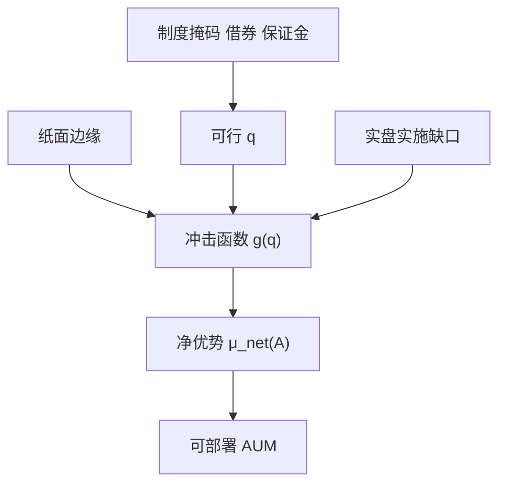

# 实盘容量估计

纸面边缘随规模被冲击吃掉。容量是使净优势降到可接受下限的那条资产管理规模，而不是营销口径里的「市场足够深」。

<footer>—— Perold and Salomon, The Right Amount of Assets Under Management, FAJ, 1991；Korajczyk and Sadka, Are Momentum Profits Robust to Trading Costs?, Journal of Finance, 2004；对照 Almgren 冲击与[容量与参与率](/quant/capacity-participation)</footer>

[上一课](/quant/production-monitoring-alerts)要求监控去读容量曲线。主干[容量与参与率](/quant/capacity-participation)已给出 $A$ 与参与率 $p$ 的代数。本课的缺口是**用实盘观测校准这条曲线**：登记的 $p$ 上限、借券与保证金、制度掩码，如何从纸面 AUM 改成可部署 AUM。本课程「交易所、数据与工程」到此收束；下一课程中国市场进阶从产品制度继续，容量约束在那里不会变松。

## 问题

回测容量常假设：任意名字可按 ADV 的固定比例成交、空头免费、涨跌停不存在、特征不拥挤。实盘里 $V$ 是同时与你竞争的流动性，不是历史 ADV；可借库存、期货保证金、程序化报撤上限都会先于 ADV 收紧。问题是估计 $\mu_{\mathrm{net}}(A)$ 时必须用生产已实现的实施缺口成分（价差、延迟、拒单、部分成交）去替换回测里的冲击函数，否则容量是实验室数字。

Korajczyk 与 Sadka（2004）表明动量利润对交易成本假设敏感。推广：任何换手非零的策略，容量结论都属于冲击模型。应报告至少两套冲击（线性、平方根）以及一套「参与率封顶 + 制度掩码」的硬约束容量——往往更小。

### 实盘样本短，曲线仍要画

上线初期 $A$ 小，观测不到平方根冲击的弯曲。不能因此声称容量无限。应用历史同类流量、券商成交分析、以及保守外推，并把「估计的不确定性」写成容量的折减，而不是等到冲击出现才减仓。监控课的参与率时间序列是校准数据：若实际 $p$ 经常顶格，说明 $A$ 已经碰到执行约束。

A 股容量还受：涨跌停不可成交、T+1 不能当日纠错、融券暂停、指数期货贴水与保证金、公募持仓披露与集中度。美股容量公式不能原样贴。

## 方法

输入：策略登记的宇宙与换手、生产实施缺口分解、借券费率分布、保证金与 VM 历史、制度掩码覆盖率（多少权重当日不可交易）。输出：使 $\mu_{\mathrm{net}}(A)$ 等于费用后最低可接受值的 $A^\ast$，以及先碰到的约束名称（冲击 / 借券 / 保证金 / 报撤 / 披露）。$A^\ast$ 随波动与制度改变，应定期重估，不是一年一次的营销数字。

与指数增强、中性策略的关系：跟踪误差预算与对冲工具容量可能先于个股 ADV 耗尽——后课中国指增与中性会用到。本课只要求：容量是约束的最小值，不是各约束分别估计再取最大。

### 拥挤是内生的

同一因子被多产品持有，$V$ 里有你的同类。历史 ADV 高估可用流动性。可用换手、借券费、期货基差作为拥挤代理，把 $A^\ast$ 再折减。不要等到 2020 年 3 月或 2015 年股灾才承认折减。

## 机制

规模通过 $q=q(A)$ 进入冲击 $g(q)$，再进入净优势。制度把 $q$ 的可行集砍掉一块，等价于更陡的 $g$。工程（托管、低延迟）不增加 $A^\ast$ 的经济学上限，只减少延迟成分；若策略不是延迟敏感，工程对容量几乎无贡献。这纠正「买了托管就能做更大」的叙事。

清算与融资：haircut 与 VM 使杠杆策略的 $A^\ast$ 在压力日下降。容量应报告平静期与压力期两套，生产取压力期。

## 边界

不提供把参与率藏到监控阈值以下以虚增容量、或利用客户订单流信息扩大自身容量的方法。容量估计对外披露须与内部监控一致，避免两套数字。下一课程讨论中国产品时，容量数字必须用本课方法在 A 股约束下重算。

## 小结

- 实盘容量用已实现缺口与制度硬约束校准，不单用历史 ADV。
- $A^\ast$ 取所有约束的最小，并分平静/压力两套。
- 托管降延迟，不自动提高经济容量。
- 出处：Perold and Salomon, *FAJ*, 1991；Korajczyk and Sadka, *JF*, 2004；本栏容量课。
