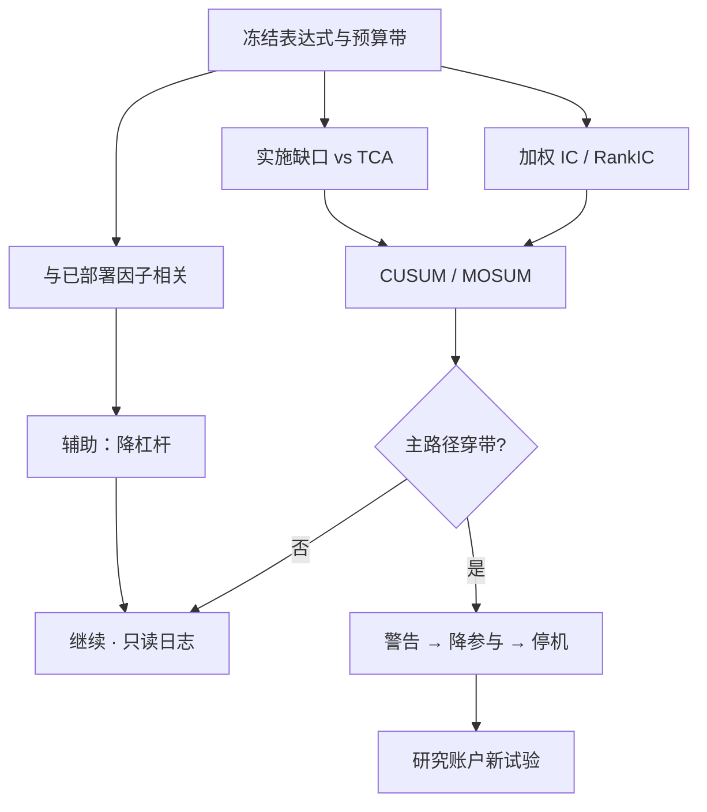

# 实盘漂移监测

    
把递归残差依次累加，若关系在样本中途换了，累加路径会像带漂移的随机游走一样穿出常数参数下的边界。

    <footer>—— Brown, Durbin and Evans, Techniques for Testing the Constancy of Regression Relationships over Time, JRSS-B, 1975</footer>

回测通过、模拟通过、小规模实盘开始赚钱之后，问题变成：现在的 alpha 还是当时冻结的那一个吗？漂移监测是顺序检验，不是再做一次全样本 t。[CUSUM / MOSUM](/quant/cusum-mosum) 把回归残差累加或滑动求和，参数一旦不稳就穿带；在交易里，监测对象换成 IC、扣费后残差、实施缺口、以及与研究路径的跟踪误差。McLean–Pontiff 提醒：公开信号有一个朝下的期望衰减，监测的原假设不应是「IC 永远等于回测」，而应是「IC 落在预扣偏差与拥挤之后的预算带里」。Hou–Xue–Zhang 提醒：若实盘宇宙滑向微盘与等权才能维持 t，经济上已经漂移。本篇写听什么、何时停、以及如何与[研究-模拟-实盘隔离](/quant/research-sim-prod)兼容——监测是只读的，不能回头改定义把实盘变成新的样本内。

## 问题

实盘路径短，Lo（2002）意义上的夏普标准误很大，用三个月夏普去「验证」研究是把噪声当证据。需要的是对预指定统计量的顺序检验：每天或每周更新，控制一类错误，穿越才触发。对象至少四条：(1) 截面 IC 或 RankIC 相对冻结期均值；(2) 扣费后残差相对模拟器；(3) 实施缺口相对 TCA 基准；(4) 与已部署因子的相关，捕获拥挤漂移。任一单条都不够：IC 仍在但缺口扩大，是执行漂移；缺口稳定但 IC 下降，是 alpha 漂移；两者都稳但相关上升，是拥挤漂移。

原假设必须含衰减预算。若把原假设设成「IC 等于回测全样本」，McLean–Pontiff 的 −26% 到 −58% 会让几乎所有公开因子迟早报警，报警没有信息量。预指定一条衰减带：例如发表后折扣后的均值，加减冻结期标准误的若干倍，或一条允许随时间缓降的斜坡。穿出带才叫漂移。Hou–Xue–Zhang 的加权手续应在实盘同样执行：监测市值加权 IC，而不是只监测等权——等权可以在微盘上假装没有漂移。

### 漂移不是回撤

回撤可以由共同因子、利率、一次宏观冲击造成，alpha 仍在。漂移是条件期望变了：给定你的信号，未来收益的映射不再是冻结时的那条。用净值回撤当监测，会在系统性坏年停掉仍然有效的风险溢价，也会在拥挤赚钱的阶段放过正在变薄的错误定价。正确的残差是相对风险模型与相对模拟器，而不是相对零。vol targeting 的 CTA 在波动上升时净值会缩，那是规则，不是 IC 漂移。

纸上交易若由人盯着实时价格点「假如成交」，不能当监测样本：没有拒单、没有部分成交、没有迟到。监测必须接真实账户或至少接与实盘同一套状态机的模拟成交。

## 方法

**IC 的 CUSUM。** 每日截面 RankIC 减预算均值，标准化后累加。参数恒定、近似短记忆时，路径有临界带；穿带则拒绝恒定。MOSUM 用固定窗对近期断裂更敏感，适合快信号。块长度要覆盖换手周期，避免把一周的噪声当成断裂。与 Bai–Perron 的差别：后者是事后全局切段，监测是在线的，不能回头用未来残差估 $\tau$。

**实施缺口。** 决策价到成交的短fall 对 TCA 预测回归，监听残差 CUSUM。缺口扩大而 IC 仍在，应先查参与率、场内、借券，而不是先关信号。缺口与 IC 同时坏，才像 alpha 与市场冲击一起变了，见[策略容量](/quant/strategy-capacity-decay)。

**相关与拥挤。** 实盘组合与文献因子、与内部已部署因子的滚动相关，以及残差 PCA 第一主成分解释方差。相关穿出冻结期分位，触发降杠杆而不是立刻清盘——[拥挤衰减](/quant/crowded-alpha-decay)里，做空拥挤需要另有独立腿。

**多重监测的错误率。** 四条路径同时听，一类错误会膨胀。预指定主路径（通常是扣费后残差或加权 IC）与若干辅助路径；辅助只降杠杆或开票，主路径穿带才停机。不要每天根据哪条「看起来坏」临时改主路径。

### 停机规则与研究隔离

穿带之后的动作必须预先写成状态机：警告 → 降参与率 → 冻结加仓 → 停机。停机后的复盘在研究账户进行，新参数是新试验，带新的版本号与新的 $N$，见过拟合作为风险。实盘监测日志只读，禁止把报警日当成新的样本内起点去重估信号。Arnott–Harvey–Markowitz 的协议在这里最硬：看过结果再改定义，样本外就消失了。

LLM 挖掘流水线更容易漂：生成器每周换模板，实盘上的「因子」其实是一条不断改写的搜索轨迹。监测必须绑在冻结的表达式哈希上，而不是绑在策略中文名上。表达式一变，计时器归零，当作新产品。

## 机制

统计机制是顺序检验的边界：在原假设下，累积和收敛到布朗桥一类过程，边界按一类错误校准。金融里误差有肥尾与波动聚类，名义边界会低估穿带概率，应用稳健标准化或对残差做波动缩放，并在冻结期做一次假发现校准。经济机制是：错误定价被交易进去、体制切换、成本结构变化、执行场内变化，都会把 $E[r\mid x]$ 挪走。McLean–Pontiff 给出公开信号朝下挪的平均速度；拥挤与融资给出加速项；Hou–Xue–Zhang 给出「看起来没挪、其实只是滑进微盘」的伪稳定。

实施缺口的漂移常常先于 IC。流动性供给撤退时，同样的信号、同样的 $p$，短fall 先升，IC 还来得及在价格上实现。监测若只看 PnL，会把执行问题记成 alpha 死亡，下一步去翻信号，错过 $Q/D$。反过来，IC 已死而缺口看起来正常，是因为已经没什么量可做——低换手掩盖了死亡。两条一起看。

### 预算带如何吸收「正常衰减」

把发表后折扣写成原假设均值 $\mu_t=\mu_{\mathrm{IS}}\times(1-\delta_t)$，$\delta_t$ 可取 McLean–Pontiff 的阶梯（样本外 26%、发表后 58%）或一条更慢的指数。预算带围绕 $\mu_t$，而不是围绕 $\mu_{\mathrm{IS}}$。这样，符合文献平均衰减的公开因子不会天天报警；真正异常的是相对文献平均还要更快的崩塌，或向微盘集中的伪稳定。经济显著性要求：即使落在预算带内，若 $\mu_t$ 已经低于成本 MC 的左尾，也应停机——监测通过但经济上已无边缘，见[经济 vs 统计](/quant/econ-vs-stat-sig)。

## 边界与工程取舍

CUSUM 对原假设「参数恒定」敏感，对「从来没有关系」不区分：本来就不平稳的残差会穿任何带。因此监测加在已经通过形成期筛选的策略上，而不是用来发现新因子。短样本的峰度让边界很吵，应报告对标准化方式的敏感性。A 股停牌与涨跌停造成 IC 缺失日，累加时要明确：跳过、还是按零填。按零填会低估漂移。

不要用监测去替代验证集。没有冻结期、没有预指定统计量的「我们一直在看实盘」，只是把实盘当第三折交叉验证。也不要在穿带之后用同一段实盘去证明「改完参数就好了」——那是泄漏。小规模实盘的作用是校准冲击与完成率，给监测提供 TCA 基准，不是给 t 统计量提供新样本。

出处：Brown, Durbin and Evans, *JRSS-B*, 1975；Ploberger and Krämer, *Econometrica*, 1992；McLean and Pontiff, *JF*, 2016；Hou, Xue and Zhang, *RFS*, 2020；Lo, *FAJ*, 2002；Arnott, Harvey and Markowitz, *JFDS*, 2019。顺序监听的交易用法见 CUSUM/MOSUM 篇；隔离见研究-模拟-实盘。

## 小结

- 实盘漂移监测是对预指定统计量的顺序检验，原假设应含 McLean–Pontiff 一类衰减预算，而不是「IC 等于回测」。
- 主路径看加权 IC 或扣费残差，辅助路径看缺口与拥挤相关；停机规则必须预先写成状态机。
- 等权微盘上的伪稳定不是没有漂移；Hou–Xue–Zhang 的加权手续应在监测里同样执行。
- 监测只读，穿带后的改动是新试验；禁止把实盘报警日变成新的样本内。
- 漂移不是回撤；执行缺口与 alpha 死亡要分开听。
- 出处：Brown–Durbin–Evans, *JRSS-B*, 1975；McLean–Pontiff, *JF*, 2016；Hou–Xue–Zhang, *RFS*, 2020；Arnott–Harvey–Markowitz, *JFDS*, 2019。
