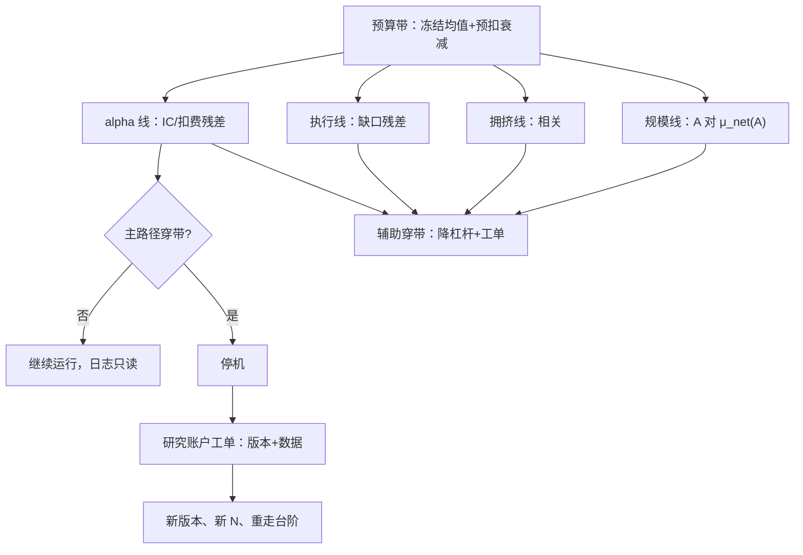
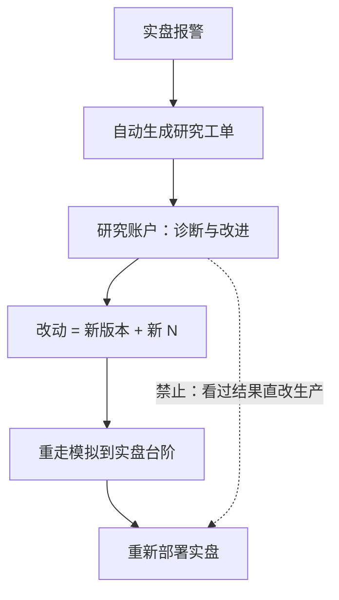

# 实盘监控与研究再触发

衰减是公开信号的平均命运，不是运营事故；监控要回答的不是「这个月赚了没」，而是「相对预扣衰减的预算带，现在走到哪」。

<footer>—— 据 McLean and Pontiff, Journal of Finance, 2016；Brown, Durbin and Evans, JRSS-B, 1975 整理</footer>

[上一课](/quant/paper-to-live-staging)沿容量台阶把仓位放到目标档位；台阶之上，问题从「能不能上」变成「现在的 alpha 还是当初冻结的那一个吗」。本课写实盘监控的仪表、衰减检测与再研究触发器。顺序检验的方法本身——CUSUM 统计量、含衰减预算的原假设、主辅路径的错误率分配——已在[实盘漂移监测](/quant/live-drift-monitor)讲透；本课接它留下的缺口：仪表怎么组织、每条线谁负责、报警之后如何回到研究流程而不把实盘变成新的样本内。

## 问题

监控失效有三种固定姿势。其一，盯净值：实盘路径短，净值噪声淹没信号，而且净值坏分不清是执行坏了还是 alpha 死了——把执行问题记成 alpha 死亡，下一步就会去翻本该不动的信号。其二，仪表没有 owner：人人能看、无人负责，报警发出后没有预定义动作，于是每次报警都重新开一次辩论。其三，闭环断裂：报警之后，改动绕过研究账户直接上生产——看过结果再改定义，[研究、模拟、实盘隔离](/quant/research-sim-prod)所保护的全部样本外就此消失，试验计数也失去意义。这三种姿势的共同点：监控成了展示，而不是触发器。

净值就是账户的累计盈亏曲线。直觉类比：靠它判断 alpha 死没死，像只看体温诊断疾病——发烧只说明「出了问题」，分不清是信号衰减这个病根，还是执行变差这个并发症。四条漂移线就是把「体温计」拆成专科检查，每条查一种病。

## 方法

仪表按漂移类型组织成四条线，每条对应一种病与一个责任人。**alpha 线**：加权 IC 与扣费后残差，相对冻结期均值加预扣衰减的预算带——带的构造见[实盘漂移监测](/quant/live-drift-monitor)，主路径通常是这条。**执行线**：成交缺口对[成本预测](/quant/execution-cost-forecast-cap)的残差，坏的是执行不是信号。**拥挤线**：与已部署因子及同业的滚动相关。**规模线**：实际占用 $A$ 相对[策略容量与冲击衰减](/quant/strategy-capacity-decay)的 $\mu_{\mathrm{net}}(A)$ 过零点，防的是「规模漂移」——AUM 涨上去后净边缘悄悄转负。主路径穿带才停机；辅助路径穿带只降杠杆、开工单，不动仓位存量。每条线的 owner、值班表与对应动作写进 runbook：报警级别与动作一一对应，值班人执行而非判断。

规模线最常被漏装：IC 还在、缺口正常，但 AUM 已爬过 $\mu_{\mathrm{net}}(A)$ 的过零点——策略「健康地」亏钱。容量曲线要随成交回报定期重估，报警带挂在当前版本的重估曲线上。

**再研究触发器**是监控的出口：主路径停机后，系统自动在研究账户开工单，附冻结版本号、报警序列、对账与成交数据；任何参数改动都是新版本、新 $N$、重新走[上线台阶](/quant/paper-to-live-staging)。从报警到工单应当是机器动作，不经过「谁来背锅」的会议。

## 机制

闭环的机制核心是**监控只读**：监测日志只流向研究账户，不直接改生产参数；改动必须以新试验的身份重新进入晋级流程。这样 $N$ 保持可数，多重检验折价继续有效，第一单元的纪律在实盘阶段没有断链。预算带防两类错：没有带，正常衰减天天误报，狼来了三次之后真死亡无人再听；带太宽，衰减实际加速（拥挤、机制变化）时漏报。顺序检验给出受控的犯错误率，这是「每天看图」永远做不到的——看图的一类错误率是每天重新抽签。

数字实例能让「重新抽签」具体化：若每天按 5% 的显著性门槛看一次，一年约 250 个交易日，「至少误报一次」的概率是 $1 - 0.95^{250} \approx 99.9\%$——几乎必然报警。顺序检验（CUSUM 一类）的价值正在于此：它把整段监测期的总误报率控制在你预设的水平上。

上图是闭环的合法路径与唯一被堵死的捷径。

「监控只读」可以用邮局来类比：监测日志像只能寄往研究部门的信件，研究部门读完写好新方案，再走完整的挂号审批流程才能改地址簿；信件本身永远没有权力直接改生产参数。这条单向管道保住了「试验次数可数」，也就保住了多重检验折价的有效性。

规模线的机制提醒监控与研究的分工边界：容量衰减不是 alpha 漂移，处置是降规模或升级执行，不是改信号；四条线分开听，才能把病诊断对再动手。

## 边界

监控不能替代样本外验证：没有冻结期与预指定统计量的「一直在看」，只是把实盘当第三折。预算带自己也要有版本：制度切换使带失效，重估带要走与改参数相同的审批与版本号；指数调整、交易规则变化等已知跳变日应单独标记，避免机械误触发。最后，监控的价值取决于链路的完整性：报警、工单、新版本、台阶重走，任何一环断掉，仪表墙就退化为装饰——所以 runbook 与 owner 不是管理姿态，是统计纪律能落到实盘的最后一根管道。

初学者容易以为「实盘数据是最新的真数据，多看多赚」。实际上，没有冻结期与预指定统计量的「一直在看」，等于把实盘当第三折样本反复翻看——看出来的规律同样是过拟合，只不过这次过拟合发生在真金白银上，学费按亏损金额结算。

## 小结

- 监控对象是四条漂移线（alpha、执行、拥挤、规模），不是净值；主路径穿带才停机，辅助只降杠杆。
- 预算带含预扣衰减，原假设不是「IC 等于回测」；顺序检验给出受控错误率，看图做不到。
- 每条线有 owner 与预写动作；规模线对照 $\mu_{\mathrm{net}}(A)$，防「健康地亏钱」。
- 闭环靠监控只读：停机自动生成研究工单，改动即新版本、新 $N$、重走台阶。
- 出处：McLean and Pontiff, *JF*, 2016；Brown, Durbin and Evans, *JRSS-B*, 1975；检验细节见[实盘漂移监测](/quant/live-drift-monitor)，隔离原则见[研究、模拟、实盘隔离](/quant/research-sim-prod)。
