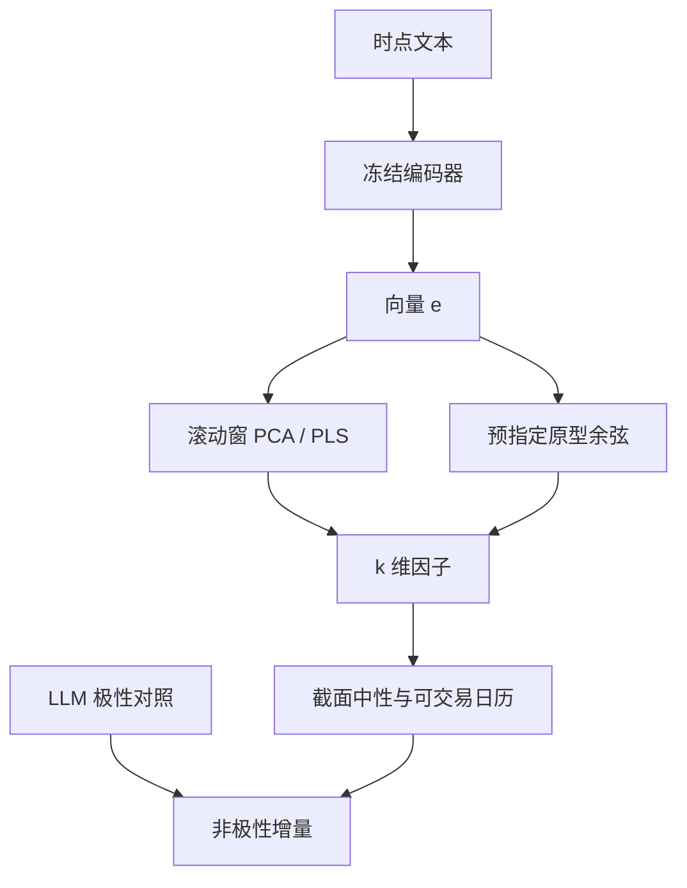

# LLM embedding 因子

把新闻、公告或分析师文本映到固定维稠密向量，再在向量空间里做降维或监督投影，得到的不是一个极性分数，而是一组可正交的语义暴露。

<footer>—— 文本即数据的计量框架见 Gentzkow, Kelly and Taddy, Journal of Economic Literature, 2019；金融文本嵌入的应用见 FinBERT 与后续收益预测工作</footer>

[LLM 情绪 alpha](/quant/llm-sentiment-alpha) 把大模型收成 $+1/-1$ 的方向。[舆情与文本](/quant/news-nlp-alpha) 把文档收成词频与主题。embedding 因子走第三条路：用编码器（BERT、FinBERT、句向量模型、或 LLM 的隐藏状态）把变长文本变成 $d$ 维向量 $e_{i,t}\in\mathbb{R}^d$，再把 $e$ 当特征进入横截面。Huang、Wang 与 Yu 的 FinBERT，以及把句向量、OpenAI 嵌入用于 10-K 与新闻的后续研究，证明稠密表示能抓住词典漏掉的同义与结构，但也把「维度灾难、训练窗泄漏、不可解释」一并带进因子流水线。本篇写如何把嵌入做成**可复制的截面因子**，而不是把 1536 维原样丢进 [GBDT](/quant/gbdt-alpha)。

## 问题

词袋的坐标是词，主题模型的坐标是主题，嵌入的坐标没有预先命名。同一家公司「指引上调但毛利率承压」与「毛利率改善但指引谨慎」在极性上可能接近，在嵌入空间里应能分开。问题是：$d$ 通常为 768 到 1536，远大于日频横截面的有效样本量；若不降维或正则，样本内拟合只是记住了语料里的稀有短语。Gu、Kelly 与 Xiu 在表格特征上已经说明高维机器学习必须走样本外；嵌入只是把同一问题从财务比率搬到语义坐标。

第二问题是编码器本身的时间。用事后在全市场新闻上继续预训练的 BERT 去编码历史文档，IDF 与领域适应都含未来分布。用闭源 embedding API 则模型会静默更换。嵌入因子的「模型」包括：分词、截断长度、是否对多条新闻平均、以及编码器权重哈希。缺任何一项都无法复现 $e_{i,t}$。

### 极性、主题与嵌入不是互相替代

Lopez-Lira–Tang 的标量情绪回答「好不好」；嵌入回答「像什么」。可以在嵌入空间里定义原型向量（「回购」「降级」「供应链中断」），用余弦相似度做成可命名因子，这接近主题。也可以对 $e_{i,t}$ 做 PCA，把前若干主成分当统计因子，这接近 [IPCA](/quant/ipca) 的文本版。还可以让 $e$ 预测收益，用 [正则线性](/quant/regularized-linear-alpha) 或 PLS 得到监督投影。三条产出的经济含义不同：原型可审计，PCA 捕获共同叙事，监督投影混进风险溢价。报告里应分开，而不是只报一个「embedding 综合分」。

对多条新闻取向量平均，等价于假设语义可加。一条「并购终止」会被十条常规经营稿稀释。应按事件强度加权，或先选当日最相关的一条，再编码。

## 方法

**编码。** 文档 $d_{i,t}$（标题、摘要或分段后的 10-K 句子）过冻结编码器得 $e_{i,t}$。日频新闻：当日可交易窗口内的向量等权或按源加权。长文档：分块编码再注意加权或平均，避免只读前 512 token。中文必须用中文或多语言编码器，不能把英文 BERT 的子词硬套上去。

**降维。** 在每个再训练日，用**仅过去**窗口的嵌入矩阵做 PCA 或自动编码器，把 $d$ 降到 $k$（例如 10–50），再对 $k$ 维做截面 rank 与行业市值中性。主成分的载荷应存档：某年 PC1 可能是「宏观不确定」，次年可能是「生成式 AI」——名称会变，这是特征，不是 bug。禁止用全样本 PCA，那是 [前视](/quant/look-ahead-bias)。

**监督投影。** 以随后收益为标签，在滚动窗上对 $e$ 做弹性网或 PLS，得到权重 $w_t$，分数 $s_{i,t}=w_t^\top e_{i,t}$。标签与文档的时间对齐见 [重叠](/quant/label-horizon-overlap) 与 [时点](/quant/point-in-time)。必须相对 Lopez-Lira–Tang 极性与 LM 词典报告增量，否则无法知道稠密维是带来新信息还是把极性重新编码了一遍。

### 原型因子与稳定性

选定一组短语（「share repurchase」「FDA rejection」等），编码为原型 $p_j$，因子 $f_{i,j,t}=\cos(e_{i,t},p_j)$。短语表必须预指定并版本化，不能在看到收益后再加「chatbot」。稳定性检查：同一事件用不同措辞改写，余弦应接近；若对同义改写极度敏感，编码器不适合做因子。跨语言原型要用平行短语，而不是翻译分数。

生产上编码器升级等于新因子：应并行跑旧权重直到衰减可接受，而不是热切换。存储上只存 $k$ 维因子与哈希，不必把 1536 维原向量永久留在研究库，但要能从原文重算。

OpenAI 一类 API 嵌入的余弦尺度会随模型代数变化，不能把 2024 年的向量与 2026 年的向量拼成同一 PCA。分代各做各的降维，再在因子层面比较 IC，不要在向量层面拼接。

## 机制

嵌入捕获的是叙事邻近性：同一天谈同一供应链冲击的公司，向量靠近，即使没有共用负面词。若市场尚未按叙事聚类定价，主成分或多空会赚到「主题扩散」的滞后。这与 Bybee 等把商业新闻主题对齐宏观周期是同一想法，只是基从主题比例换成了神经网络坐标。若市场已经用行业 ETF 把叙事交易完，嵌入因子在行业中性后应接近零——这是应该报告的诊断，不是失败。

监督投影会把任何与收益相关的语义吸入，包括风险：「破产」「稀释」类方向可能是困境溢价而不是 alpha。应用 [Fama–MacBeth](/quant/fama-macbeth) 或对已知因子残差，看嵌入分数是否还有定价误差。换手方面，新闻嵌入日更，10-K 嵌入季更，二者不要做成同一个持有期。

### 与 LLM 极性打分的信息重叠

极性是嵌入空间里一条极粗的线性方向。若先用嵌入 PCA，再把第一主成分与 Lopez-Lira–Tang 分数回归，残差才是「非极性语义」。实践中常发现：短标题的有效信息大部分就是极性与一两个事件类型；长文档（10-K 风险因素、电话会问答）嵌入的增量更大。因此 embedding 因子的容量叙事应写在长文本、低换手一侧，而把标题级短持有留给情绪 alpha。

## 边界与工程取舍

不要用未来语料继续预训练后再编码过去。不要把检索增强（RAG）进回测：检索库的构成是另一种前视。不要对个人社交媒体账号做身份识别。版权上只存向量与分数。高维监督必须预指定 $k$ 与正则，并把搜索次数计入 [Harvey–Liu–Zhu](/quant/harvey-liu-zhu) 一类多重检验。A 股分词、繁简与转载站使同一公告出现多个近重复向量，去重应在编码前做。

嵌入不是「比 ChatGPT 情绪更先进的一代」，而是不同的充分统计量。情绪回答方向，嵌入回答位置。二者可以同时存在于同一研究平台，但必须分开做中性化与衰减诊断，否则 GBDT 会在共线上任意切换。

把分析师全文嵌入再预测评级修订，很容易变成对「已写在标题里的结论」的复读。增量检验应相对标题级极性，而不是相对零。

## 小结

- Embedding 因子把文本映到稠密向量，再经滚动降维、原型余弦或监督投影进入横截面，产出的是语义暴露而非单一极性。
- 编码器权重、截断、多文档聚合与 PCA 窗口都必须冻结在 $t$ 之前，否则是前视。
- 短标题上与 LLM 情绪高度重叠；增量更可能来自长文档与叙事聚类。
- 高维须正则，并相对词典与 Lopez-Lira–Tang 极性报告增量。
- 出处：Gentzkow, Kelly and Taddy, *JEL*, 2019；Huang, Wang and Yu, FinBERT；Ke, Kelly and Xiu, 2019；Lopez-Lira and Tang, 2023；降维与正则见 Gu, Kelly and Xiu 的机器学习资产定价框架。
