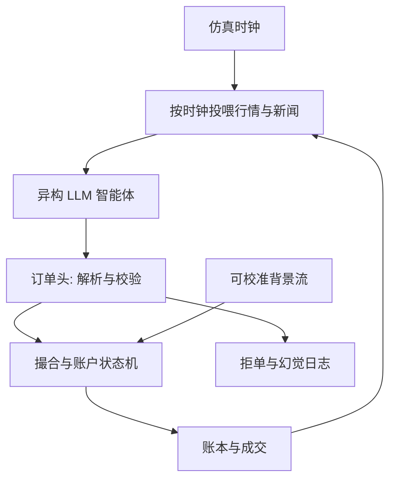

# LLM 多智能体市场仿真

    
若把交易者写成会读新闻、会改信念、会下单的对话主体，市场仿真从校准过的强度过程变成一场可重复的剧场——叙事能注入，微观结构却不一定还在。

    <footer>—— 多智能体市场仿真的语言接口；对照 ABIDES 一类事件驱动引擎与生成式订单流</footer>

经典多智能体市场用显式规则：零智能、启发式做市、带库存的最优执行。[Hawkes](/quant/hawkes-trades) 拟合事件强度，[ABIDES](/quant/abides-simulation) 一类引擎在消息层推进撮合。大语言模型把「规则」换成提示词与记忆：每个智能体读公开信息、私有持仓、最近成交，输出订单或撤单理由。吸引力是异构信念与叙事冲击可以自然语言注入，而不必先写成强度核。代价是校准、可重复性与时间尺度全部变软。本篇写这种仿真能回答什么问题、不能替代哪一层生成器，以及它与 [Market Generator](/quant/market-generator-vae)、[生成式回测评估](/quant/generative-backtest-eval) 应如何分账；不把某个聊天产品的提示词当协议，也不把盘口 tick 保真许诺给语言模型。

## 问题

市场仿真有三层常被混为一谈。第一层是**撮合与账户**：价格优先时间优先、保证金、手续费，必须是确定性状态机。第二层是**订单流统计**：间隔、取消率、队列消耗，应用事件过程或生成式订单流去对齐。第三层是**主体理由**：为什么在新闻后追涨、为什么库存超限仍报价。传统智能体把第三层压成几个数（信号权重、风险厌恶）。LLM 多智能体把第三层展开成文本策略。问题不是「像不像人说话」，而是：第三层的文本决策，映射到第一层订单之后，第二层的统计是否还在可接受集合里；以及同一随机种子与同一信息集，路径能否复现。

语言模型的输出是离散语言，不是强度。要把「偏多、保守、等回撤」变成限价、市价、量、存活时间，必须有一层**订单头**：解析、校验、拒单。没有订单头，仿真日志里全是散文，撮合引擎收不到合法指令。有了订单头，模型仍会幻觉价格、无视涨跌停、在已成交后继续平仓。因此 LLM 不是替换撮合器，只是替换（或包裹）策略函数。

### 异构、记忆与信息集

多智能体的意义是异构。若每个智能体共用同一系统提示、同一温度、同一检索库，多样性只来自采样噪声，不是来自信念差异。要模拟共同基金对冲基金零售的分层，应把目标函数、约束、延迟、可交易集合写进提示或工具权限，而不是写进形容词。记忆分三块：私有持仓与成交（必须与账本一致，不能让模型「记得」一笔没发生的买）、公开行情（应按仿真时钟投喂，禁止读未来条）、叙事（研报、宏观文本，带时间戳）。任何一条记忆越界，仿真就变成带泄漏的故事。

把 LLM 当「更聪明的零智能」会高估它的微观结构价值。零智能在统计上可校准；LLM 在统计上往往不可识别——同一提示下单分布随解码温度、上下文截断和模型版本漂移。

## 方法

**时钟。** 语言模型推理是秒到十秒级。真实撮合是微秒到毫秒。仿真必须选一个决策步长：例如每 $n$ 笔成交或每 $k$ 秒唤醒一批智能体，中间的订单流由做市规则或生成式背景流填充。若每笔 tick 都问一次模型，成本不可行，而且模型会在无新信息时胡乱改报价，取消率失真。背景流与 LLM 决策的接口要写清：谁有优先权、延迟多少、能否看到对方未成交队列。

**动作空间。** 只允许有限指令集：限价买卖、市价、撤单、什么都不做。数量分档。禁止自由文本改规则。解析失败则视为空操作并记一次故障。这样，策略的随机性来自模型在合法集合上的选择，而不是来自句法错误。工具调用（查账、查盘口摘要）应返回仿真状态的投影，而不是真实经纪商 API。

**校准与锚定。** 纯 LLM 市场几乎不可能同时匹配收益肥尾、日内 U 形量和价差。可行做法是：**锚定微观结构，放开叙事**。撮合、手续费、背景噪声交易者仍用可校准模块；LLM 只驱动少数大型主体，在新闻事件窗口改它们的目标库存或信号。比较的是「有叙事 / 无叙事」下价格发现与拥挤，而不是声称整张限价簿由对话生成。对照实验必须固定背景流种子。

### 可重复性：温度、版本与日志

科学仿真要求给定种子可复现。语言模型的解码若带采样，必须记录完整提示、工具返回、token 级输出和模型哈希。闭源接口一改版，旧实验作废。评估协议应把「同一实验配置跑多条叙事种子」当成一等公民：关注的是跨种子稳定的定性结论（例如冲击后价差扩大、反向资金迟到），而不是某一条生成路径的夏普。把单次对话录成「市场在 2026 年会如何」没有内部效度。

## 机制

LLM 多智能体改变的是**条件动作**的生成方式。传统智能体的 $\pi(a\mid s)$ 是表格或浅层函数；语言模型用 $s$ 的文本渲染加上权重里的语言先验。语言先验带来两种真实世界里也存在的东西：叙事共振（多主体读同一标题后同向下单）和指令遵循失败（约束写在提示里但不被执行）。前者可以当作行为金融的实验装置，后者必须当模型风险从日志里减掉，不能解释成「市场非理性」。

价格形成仍只发生在撮合层。模型内部的「公允价值」数字若不经过订单与对手盘，对成交价没有因果。因此，读智能体的思维链去解释收益，是范畴错误：思维链不是报价，撮合才是。有用的可观测量是订单流毒性、存货路径、事件后的方向一致性，以及它们是否随提示中的风险约束单调变化。若单调性不存在，说明动作头或提示没有把约束绑住，实验无效。

### 与生成式路径模型的分工

[VAE](/quant/market-generator-vae) 与 [Sig-WGAN](/quant/sig-wasserstein-gan) 直接拟合路径测度，适合给 [Deep Hedging](/quant/deep-hedging-buehler) 供情景。[Neural SDE](/quant/neural-sde) 提供正则路径。LLM 多智能体不提供弱收敛意义下的 $\widehat{\mathbb{P}}$，它提供的是机制实验：信息如何在约束不同的主体间传播。用 LLM 仿真去回测高频执行，是用错层；用它去回测「研报发布后基金调仓是否拥挤」，在锚定微观结构之后可以做定性比较。两类输出不要拼成同一条回测曲线。

新闻文本若来自真实历史且时间戳与行情对齐，仍可能泄漏：模型预训练语料可能已经读过该事件的事后评论。事件研究应优先用仿真内合成新闻，或对真实文本做信息集截断检查。

## 边界与工程取舍

不要用 LLM 仿真替代监管级市场冲击实验，除非撮合规则、延迟与账户与生产一致，且背景流经过与真实订单流的过程级检验。语言模型不能当随机数发生器的替代品：它的熵来源、重复惩罚和安全过滤都会扭曲动作分布。成本上，智能体数目与唤醒频率线性放大推理账单，实验设计应先做功率计算：要区分的效应有多大，需要多少独立叙事种子。

提示词不是策略源码。人员变动、模型升级会使「同一个仿真」变成另一个数据生成过程。生产研究库应把智能体规格写成结构化配置（约束、工具、动作表），提示只是渲染，并做回归测试：固定假行情下动作分布的分位数是否漂移。失败时，关掉 LLM，让规则智能体顶上，仿真仍应能跑——否则基础设施把不可重复的部件放进了关键路径。

多智能体对话很容易演成角色扮演竞赛，日志很长、成交很少。应限制对聊轮次，强制每轮输出动作或明确空操作，并把「发言字数」排除在任何绩效指标之外。

若研究问题只是路径分布，用签名 GAN 或 VAE；若问题是规则与信息结构，用 ABIDES 类引擎；只有当信息是非结构化文本、且主体必须解释文本时，才引入 LLM。工具跟着问题走，不是跟着热点走。

## 小结

- LLM 多智能体替换的是策略函数的文本接口，不替换撮合状态机，也不自动校准订单流统计。
- 合法动作集合、按时钟的信息集、与账本一致的记忆，是内部效度的硬条件。
- 可行校准是锚定微观结构、仅让少数主体响应叙事；整市场由对话生成通常不可识别。
- 可重复性要求记录模型版本、完整提示与动作；关注跨种子稳定的定性效应。
- 与路径生成器分工：后者供分布与对冲，前者供机制与文本信息实验。
- 出处：事件驱动多智能体市场仿真见 ABIDES 一线；生成式订单流与路径测度见 Market Generator / Sig-WGAN；语言模型多智能体是在上述引擎上的策略层接口，须单独做拒单与泄漏审计。
