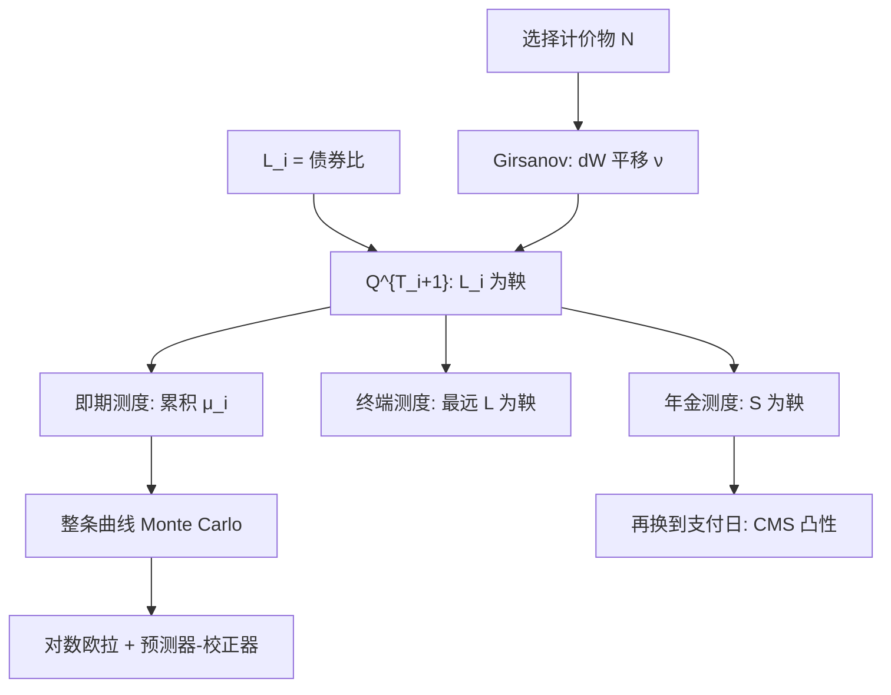

# LMM 漂移与测度变换

每个简单远期只在自己的支付日远期测度下是鞅；要在同一个概率空间里模拟整条曲线，就必须用计价物比把漂移写出来，而不能假定所有 $L_i$ 同时对数正态。

<footer>—— Brace, Gątarek & Musiela, The Market Model of Interest Rate Dynamics, Mathematical Finance, 1997</footer>

[LMM](/quant/lmm) 已经把状态选成可观测的简单远期 $L_i$，并写出即期测度下的漂移公式。本篇把那条公式从「可以抄」变成「可以从计价物推出来」：换测度是 Girsanov，漂移是相对债券波动的点积，不是对瞬时 HJM 积分随便离散。Brace、Gątarek 与 Musiela（1997）的市场模型，核心不是对数正态本身，而是 tenor 结构下无套利漂移与 caplet 的 Black 公式在各自远期测度下对齐。Jamshidian 与 Miltersen–Sandmann–Sondermann 几乎同时给出等价构造。读懂漂移，才能判断预测器–校正器在改什么、终端测度与即期测度何时不可互换，以及 [CMS 复制](/quant/cms-replication) 所用的年金测度如何嵌进同一套变换。

## 问题

取定日期 $T_0<\cdots<T_n$，$\tau_i=T_{i+1}-T_i$，

$$
L_i(t)=\frac{1}{\tau_i}\left(\frac{P(t,T_i)}{P(t,T_{i+1})}-1\right).
$$

$L_i$ 是两只零息债的比，因而是可交易资产比。选计价物 $P(\cdot,T_{i+1})$，对应 $T_{i+1}$-远期测度 $\mathbb{Q}^{T_{i+1}}$，则 $L_i$ 为鞅。对数正态假设立刻给出 Black caplet。问题是：账簿里有几十个重叠的 $L_i$，Monte Carlo 只能抽一个测度。若错误地让所有 $L_i$ 在同一测度下都是无漂移对数正态，折现债券族不再是鞅，长端曲线会系统性漂掉，这是离散时间里最常见的「LMM 实现无套利失败」。

第二个问题是数值而不是理论。即期 LIBOR 测度的漂移含 $\sum_j \tau_j L_j/(1+\tau_j L_j)$，状态依赖，欧拉离散有偏。预测器–校正器、对数欧拉、以及换到终端测度（只让最远端 $L_{n-1}$ 无漂移）都是在改同一段 Girsanov 核的积分误差。不写清测度，就无法解释为什么换随机种子后面值变了、换终端测度后面值又变了。

### 计价物定理给出的漂移核

设计价物 $N$ 与 $M$ 的波动向量为 $\nu^N,\nu^M$（对同一套布朗）。Girsanov 说，从 $\mathbb{Q}^M$ 到 $\mathbb{Q}^N$，

$$
\mathrm{d}W^N = \mathrm{d}W^M - \bigl(\nu^N-\nu^M\bigr)^\top \mathrm{d}t
$$

（符号随波动定义约定，实现必须与 Ito 公式一致）。资产 $X$ 若在 $\mathbb{Q}^M$ 下波动为 $\sigma^X$，则其在 $\mathbb{Q}^N$ 下的漂移等于 $\sigma^X\cdot(\nu^N-\nu^M)$。对 $L_i$，在 $\mathbb{Q}^{T_{i+1}}$ 下漂移为零；换到另一个远期测度 $\mathbb{Q}^{T_{k+1}}$，漂移就是 $L_i$ 的波动乘上 $P(\cdot,T_{i+1})$ 相对 $P(\cdot,T_{k+1})$ 的波动差。债券比的波动由中间那串 $L_j$ 决定，于是出现因子 $\tau_j L_j/(1+\tau_j L_j)$：它正是 $\partial \log P(\cdot,T_{j+1})/\partial L_j$ 一类载荷，不是经验权重。

把 LMM 理解成「HJM 的离散版」可以，但简单利率与瞬时远期的 Ito 对应带 $1+\tau L$ 分母。对 $f(t,T)$ 做欧拉再换成 $L$，漂移条件会被离散破坏。实现必须对 $L_i$ 直接积分 BGM 漂移。

## 方法

在 $T_{i+1}$-远期测度下，BGM 取

$$
\mathrm{d}L_i(t)=\sigma_i(t)L_i(t)\,\mathrm{d}W_t^{T_{i+1}}.
$$

即期 LIBOR 测度用滚动银行账户 $B_t$：在每个 $T_q$ 把本金再投资一期，计价物在 $(T_q,T_{q+1}]$ 上与 $P(\cdot,T_{q+1})$ 成比例。对第一个未确定远期下标 $q(t)$ 以及 $i\ge q(t)$，

$$
\mu_i(t)=\sigma_i(t)\sum_{j=q(t)}^{i}\frac{\tau_j L_j(t)}{1+\tau_j L_j(t)}\rho_{ij}(t)\sigma_j(t),
$$

$$
\frac{\mathrm{d}L_i}{L_i}=\mu_i(t)\,\mathrm{d}t+\sigma_i(t)\,\mathrm{d}W_t^{\mathrm{spot}}.
$$

这是 Brace–Gątarek–Musiela 无套利条件的即期形式。终端测度 $\mathbb{Q}^{T_n}$ 让 $L_{n-1}$ 为鞅，更近的 $L_i$ 带负向累积漂移（相对即期公式符号相反的一段），模拟长到期 cap 有时方差更小。互换测度的计价物是年金 $A$，互换利率 $S$ 为鞅，但 $S$ 不是单个 $L_i$，[CMS](/quant/cms-convexity) 支付又不在年金测度下结算，必须再换一次。

离散格式：对数欧拉

$$
\log L_i(t+\Delta)=\log L_i(t)+\bigl(\mu_i-\tfrac12\sigma_i^2\bigr)\Delta+\sigma_i\sqrt{\Delta}\,Z
$$

里的 $\mu_i$ 若用左端点 $L(t)$，对长 tenor、大波动会系统性抬高或压低远端曲线。预测器–校正器先用左端点走一步得 $\hat L$，再用 $\tfrac12(\mu(L)+\mu(\hat L))$ 重做，把状态依赖漂移的一阶偏差压下去。相关矩阵必须正定；因子载荷 $\sigma_i$ 是向量时，$\rho_{ij}\sigma_i\sigma_j$ 应写成 $\sigma_i\cdot\sigma_j$。

### 从债券比推到 $\tau L/(1+\tau L)$

固定 $k>i$。乘积

$$
\frac{P(t,T_i)}{P(t,T_{k+1})}=\prod_{j=i}^{k}\bigl(1+\tau_j L_j(t)\bigr)
$$

的对数微分给出 $P(\cdot,T_i)$ 相对 $P(\cdot,T_{k+1})$ 的波动，等于各段 $\frac{\tau_j L_j}{1+\tau_j L_j}\sigma_j$ 之和（再加 $L_i$ 自身那一项的组合）。把这段相对波动送进 Girsanov，就得到 $L_i$ 在 $\mathbb{Q}^{T_{k+1}}$ 下的漂移。$k=i$ 时相对波动为零，漂移为零，回到远期测度鞅。推导应在连续时间 Ito 下完成，再对模拟步做离散近似；不要在离散乘积上「加一个经验凸性」充作漂移。

多曲线时代贴现用 OIS、预测用期限 SOFR 或残存的 IBOR。BGM 公式仍对**预测曲线上的简单远期**成立，但计价物若换成 OIS 零息，远期测度不再使 IBOR 远期为鞅，基差变成额外状态。把 1997 年的漂移原样接到「OIS 贴现的 SOFR 期限远期」上，必须声明计价物与 $L_i$ 的定义一致，见 [SOFR 过渡](/quant/sofr-transition)。

## 机制

经济内容是凸性：更远的简单远期，其对应的零息债久期更长，为保持折现债券在选定计价物下为鞅，必须在即期测度下补上正的补偿漂移（通常符号约定下）。波动越大、相关越正、中间 $L_j$ 越高，补偿越大。这与瞬时 HJM 的 $\sigma_f\int\sigma_f$ 漂移是同一件事：LMM 把积分换成沿 tenor 的离散求和，并把瞬时波动换成简单利率的百分比波动。

测度选择不改变套利价格，只改变方差与离散误差。即期测度对整条曲线一次性模拟最自然，漂移项最多；终端测度让长端稳、短端漂移复杂；对每个 caplet 分别用自己的远期测度，解析最干净，却无法给依赖整条曲线的 Bermudan 一次抽样。CMS 要的 $\mathbb{E}^{T_p}[S_T]$ 既不是即期也不是年金，复制积分其实是在用香草把这次测度变换的凸性买回来，见 [CMS 复制](/quant/cms-replication)。

风险中性测度（连续复利银行账户）下的 LMM 漂移还要加上相对滚动 LIBOR 账户的核，不能把即期 LIBOR 测度的 $\mu_i$ 抄进 $\mathrm{d}r$ 模拟器。混用是长端折现债不再重定价到 $P(0,T)$ 的典型原因。

### 冻结、Rebonato 与「看起来像 Black」

欧式 swaption 在年金测度下是对 $S$ 的看涨，但 $S$ 的波动由 $\partial S/\partial L_i$ 与 $L$ 的协方差给出，权重随 $L$ 变，$S$ 不是对数正态。把权重冻在 $t=0$，得到 Black 近似，市场报价与模型之间最常用的桥。该近似相当于忽略了权重随机性带来的又一次测度/凸性修正。中等波动可用；长尾、高 $\sigma$、强时间依赖的 $\sigma_i(t)$ 应用模拟。Rebonato 把 ATM swaption 方差写成 $\sigma$ 与 $\rho$ 的二次型，便于校准，但它是冻结世界里的对象，不能反过来当无套利定义。

## 边界与工程取舍

不要在 $\mathbb{Q}^{T_{i+1}}$ 下给 $L_k$（$k\neq i$）也设零漂移。不要让 $\rho$ 的特征值出负再拿去 Cholesky。不要用 caplet 标定的 $\sigma_i$ 配历史上的满秩相关矩阵：瞬时相关的秩受因子数限制，满秩历史相关通常不正定或不稳定。位移对数正态把 $L+\delta$ 当对数正态，漂移公式里 $L/(1+\tau L)$ 要改成对 $(L+\delta)$ 的相应项，漏改会在负利率区把无套利破坏。

校准上，$\sigma_i(t)$ 应光滑；把每个 caplet 的 Black 波动当成独立的分段常数，对冲会出现锯齿 vega。LIBOR 停用后，同一套测度语言可以对期限 RFR 远期写出，但期货凸性、在险期限与支付滞后与 1997 年的 3M USD LIBOR 不同，漂移实现要按新合约重推，不能只改名字。

出处的重心是 Brace, Gątarek & Musiela, *Mathematical Finance*, 1997 的漂移与测度，而不是后来的微笑扩展。Jamshidian（1997）与 Miltersen–Sandmann–Sondermann（1997）应并列为市场模型的同时文献；实现细节（预测器–校正器）是数值文献，不要写进「BGM 定理」。

## 小结

- 每个 $L_i$ 只在 $T_{i+1}$-远期测度下为鞅；BGM 的对数正态是该测度下的假设，不是全局假设。
- 即期测度漂移 $\mu_i=\sigma_i\sum_j \frac{\tau_j L_j}{1+\tau_j L_j}\rho_{ij}\sigma_j$ 来自债券比的相对波动，是离散 HJM 条件。
- 终端、即期、年金、支付日远期是不同计价物；价格一致，离散误差与方差不同。
- 预测器–校正器修正的是状态依赖漂移的欧拉偏差，不是改模型。
- 多曲线与 RFR 不取消这套变换，但计价物必须与被模拟的远期定义一致。
- 出处：Brace, Gątarek & Musiela, *Mathematical Finance*, 1997；Jamshidian, *Finance and Stochastics*, 1997；Miltersen, Sandmann & Sondermann, *Journal of Finance*, 1997。
