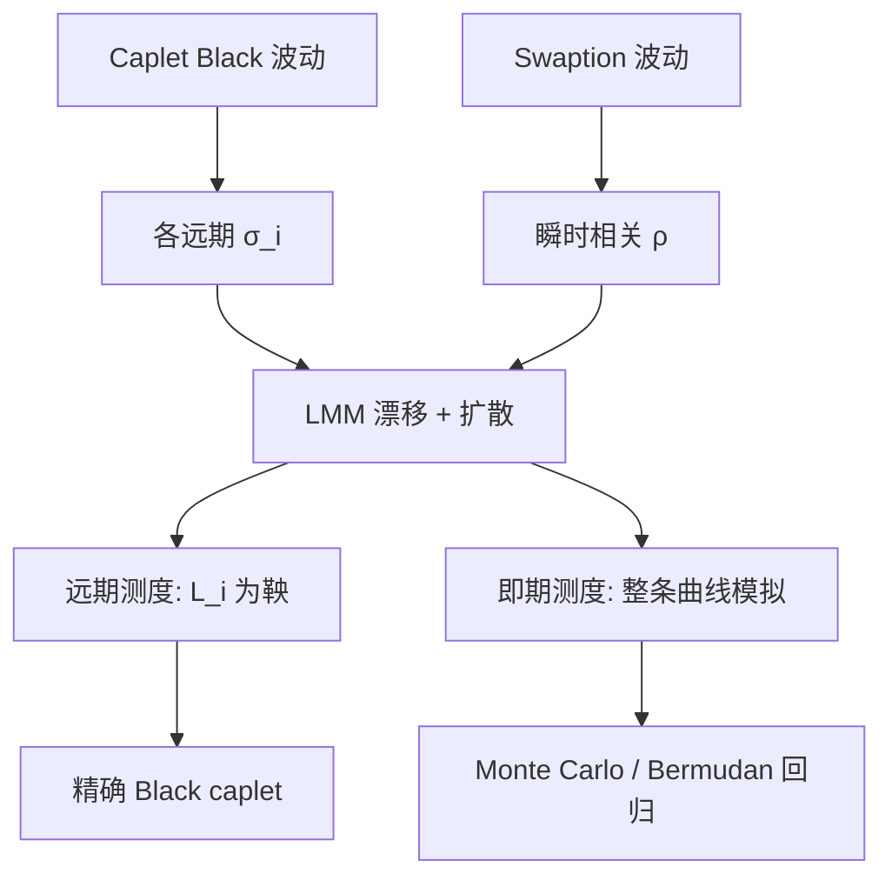

# LMM

对一串简单复利远期利率直接写对数正态扩散，在相应远期测度下它们是鞅，caplet 回到 Black 公式，曲线产品终于用市场自己的坐标来建模。

<footer>—— Brace, Gątarek & Musiela, The Market Model of Interest Rate Dynamics, Mathematical Finance, 1997</footer>

市场报的不是瞬时远期 $f(t,T)$，而是 3M 或 6M 的简单远期、互换与 Black 波动。Brace、Gątarek 与 Musiela（1997）以及几乎同时的 Jamshidian（1997）、Miltersen–Sandmann–Sondermann（1997）把状态选成这些可观测的远期 LIBOR $L_i(t)$，在与结算日对齐的远期测度下让 $L_i$ 成为对数正态鞅，于是 caplet 的市场公式就是模型公式。[HJM](/quant/hjm) 的漂移条件在离散简单利率下变成一套 tenor 结构的漂移；换到即期 LIBOR 测度后，漂移是其他 $L_j$ 的函数，模拟必须小心。本篇写 LMM（LIBOR Market Model）的测度、漂移、校准对象，以及 LIBOR 停用后同一骨架如何接到期限 SOFR。

## 问题

短端模型与瞬时 HJM 的共同麻烦是：校准仪器是 cap 与 swaption 的 Black 波动，模型对象却是 $r$ 或 $f$。每次校准都在翻译。若状态就是 Black 公式里那个远期，翻译消失。问题是：一串重叠的 $L_i$ 不能在同一个测度下同时是对数正态鞅——每个 $L_i$ 只在自己的支付日对应的远期测度下是鞅。要给整条曲线一个测度来做 Monte Carlo，就必须写出相容的漂移，并证明无套利（相对贴现债券族）。

第二个问题是相关性与微笑。对数正态 LMM 给出每个 caplet 自己的 $\sigma_i$，但 swaption 是若干 $L_i$ 的加权，其波动还依赖瞬时相关 $\rho_{ij}$。相关若太平，长到期 swaption 会错；相关若从历史相关直接塞入，又与风险中性校准冲突。位移对数正态或局部 / 随机波动 LMM 是后来为 smile 加的，不是 1997 年原文。

### 为什么必须换测度

取定 tenor 结构 $0\le T_0<\cdots<T_n$，$\tau_i=T_{i+1}-T_i$，$L_i(t)$ 是 $[T_i,T_{i+1}]$ 上的简单远期。在 $T_{i+1}$-远期测度下，计价物是 $P(\cdot,T_{i+1})$，$L_i$ 是可交易资产比，故为鞅；对数正态假设直接给出 Black caplet。对 $L_k$（$k\neq i$）同一测度下一般有漂移。即期测度用滚动的银行账户（在每个 $T_i$ 再投资一期）当计价物，所有 $L_i$ 同时有漂移，适合一次性模拟整条曲线。LMM 的「市场模型」之名，来自 caplet 市场与模型在各自远期测度下对齐；不是说来了一个测度让所有报价同时对数正态。

把 LMM 理解成「HJM 的离散版」可以，但简单利率与瞬时远期的 Ito 对应含 $1+\tau L$ 分母，漂移不是把 HJM 积分随便换成求和。实现必须用市场模型自己的漂移公式，不要对 $f$ 做欧拉再换算成 $L$。

## 方法

在 $T_{i+1}$-远期测度下，

$$
dL_i(t)=\sigma_i(t)L_i(t)\,dW^{T_{i+1}}_t.
$$

在即期 LIBOR 测度下，对 $i\ge q(t)$（第一个未确定的远期），

$$
\frac{dL_i}{L_i}=\mu_i(t)\,dt+\sigma_i(t)\,dW_t,\qquad
\mu_i(t)=\sigma_i(t)\sum_{j=q(t)}^{i}\frac{\tau_j L_j(t)}{1+\tau_j L_j(t)}\rho_{ij}(t)\sigma_j(t).
$$

这是离散 HJM 条件。模拟常用对数欧拉加预测器–校正器（predictor–corrector）压漂移偏差；相关矩阵 $\rho$ 必须正定，常用参数化（Rebonato 角度、两因子指数相关）保证这一点。校准：先用 caplet 或 swaption 对角波动定 $\sigma_i(t)$ 的期限结构（分段常数或参数化），再用一批共终端或 co-terminal swaption 定相关，或反过来——Rebonato 的近似把 swaption 波动写成 $\sigma$ 与 $\rho$ 的二次型，便于先猜相关再调 $\sigma$。

欧式 swaption 没有精确 Black 公式（除非一因子且 Jamshidian 类假设），但有冻结漂移、Rebonato 等标准近似；精确价格用模拟。Bermudan 用 Longstaff–Schwartz 在 LMM 路径上回归。位移 $\delta$ 把 $L+\delta$ 写成对数正态，以产生向下倾斜的 caplet smile 并允许轻度负利率。

### 互换测度与冻结

互换利率 $S$ 在年金测度下是鞅，但 $S$ 不是单个 $L_i$，其波动由权重 $\partial S/\partial L_i$ 与 $L$ 的协方差给出。权重依赖 $L$，严格说 $S$ 不是对数正态。冻结权重（把 $L$ 停在 $t=0$）给出 Black swaption 近似，这是市场报价与 LMM 之间最常用的桥。近似在波动中等、期限不极端时可用；对长尾、高波动或强均值回复式的 $\sigma(t)$ 形状，应用模拟修正，不要把冻结误差当成交易边际。

## 机制

LMM 能同时校准许多 caplet，是因为每个 $L_i$ 有自己的 $\sigma_i$。曲线的共同运动来自 $\rho_{ij}$：相关全为 1 时退化成近似一因子，swaption 相对 cap 的定价会被绑死；相关衰减太快，长区间互换的波动过低。机制上，漂移 $\mu_i$ 随「已经实现的较短远期」累积，这是 tenor 结构下的凸性：更远的 $L_i$ 为了让折现债券保持鞅，必须在即期测度下有正漂移（在通常的符号下）。这与 HJM 积分漂移是同一件事的离散版。

因子个数：用 $d$ 维 $W$ 驱动 $n$ 个 $L_i$（$n$ 常为 40+），瞬时相关的秩最多为 $d$。低因子省计算、相关结构光滑，但难以同时拟合短端与长端的独立运动。高因子贴近历史相关，Monte Carlo 噪声和校准不稳定上升。实务取 2–4 个因子加参数化相关，而不是满秩历史相关矩阵。

LIBOR 操纵丑闻与停用之后，$L_i$ 不再是无风险简单利率。同一套公式可以对期限 SOFR 或 RFR 复利远期写出，但凸性、在险期限与期货结算惯例不同，不能把 1997 年的 USD 3M LIBOR 校准表直接改名 SOFR。

### 与短端树的计算分界

LMM 的状态维度等于未到期远期个数，树几乎不可用，标准是 Monte Carlo。因此带早行权的产品必须回归或策略近似，数值误差与短端 Hull–White 树不是同一类。账簿若以 Bermudan swaption 为主，许多台仍用短端或低因子马尔可夫泛函（Markov-functional）来换计算；LMM 更适合香草校准、风险分解到每个 tenor、以及需要明确 cap/swaption 相关结构的账簿。选模型是选状态是否等于市场坐标，不是选谁更「现代」。

## 边界与工程取舍

不要在风险中性（银行账户连续复利）下抄即期 LIBOR 测度的漂移公式。不要让相关矩阵特征值出现负的再拿去模拟。不要只用 ATM cap 校准再给深度 OTM 的 CMS 标价——需要位移、局部波动或随机波动扩展。不要忽略多曲线：贴现用 OIS，预测用 LIBOR 或 SOFR 期限，基差可以另做扩散或冻结。

校准过度参数化会导致 $\sigma_i(t)$ 在时间上剧烈跳动，对冲出现虚假的 vega 期限结构。应约束 $\sigma$ 光滑，把残差留给模型风险。LMM 也不自动给出债券与股票的混合；可转债见 [可转债与信用混合](/quant/convertible-credit)，那里的利率部分常常是一因子 Hull–White 而不是全 LMM，因为信用与股权已经占满维度。

Rebonato 近似很好用，也很容易让人忘记模型价格不是市场 Black 价格。内部估值应以模拟为准，近似只用于校准的第一层与风险的快速解释。

## 小结

- LMM 对简单复利远期建模；每个 $L_i$ 在自身远期测度下可为对数正态鞅，caplet 即 Black。
- 即期测度下漂移由 tenor 结构的无套利条件给出，是离散 HJM。
- Brace–Gątarek–Musiela（1997）、Jamshidian（1997）、Miltersen–Sandmann–Sondermann（1997）构成市场模型的经典来源。
- Swaption 依赖相关与冻结近似；Bermudan 依赖模拟回归，与短端树的职责不同。
- 停用 LIBOR 后骨架仍在，但必须改写到 RFR 期限与多曲线惯例。
- 出处：Brace, Gątarek & Musiela, *Mathematical Finance*, 1997；Jamshidian, *Finance and Stochastics*, 1997；Miltersen, Sandmann & Sondermann, *Journal of Finance*, 1997。
