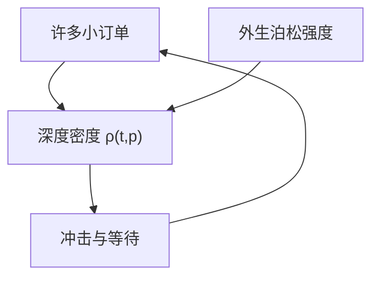

# 簿的均场极限

当到达的订单无穷多、每一笔无穷小，限价簿的状态可以用深度密度的偏微分方程来描述。个体博弈收成对这个密度的反应，密度再由个体行动自洽。

<footer>—— Cont, Stoikov and Talreja, A stochastic model for order book dynamics, Operations Research, 2010；均场控制的交易拥挤见 Cardaliaguet and Lehalle, Mean field game of controls and an application to trade crowding, Mathematics and Financial Economics, 2018</footer>

[宏观形状](/quant/lob-shape-macro)是经验直方图。缺口是：直方图能否作为大量微观订单的极限定律被推导出来，而不是只被测量。Cont、Stoikov 与 Talreja（2010）用独立到达的点过程描述各档增减；Cardaliaguet 与 Lehalle（2018）把拥挤执行写成均场博弈。本课只取「从个体到密度」这一层，不把统计物理的整套场论搬进来，也不重推单期 $\lambda$。

## 问题

Parlour 的状态是两个整数队长，维数随档数爆炸。均场用密度 $\rho(t,p)$ 表示价格 $p$ 附近的深度，到达、撤单、成交写成对 $\rho$ 的算子。问题是两类模型的分工：若订单流被当成外生强度（Cont 等），形状是排队系统的稳态，没有策略；若交易者对拥挤反应（均场博弈），强度对 $\rho$ 内生，出现拥堵反馈。前者适合描述，后者适合问「大家都用同样执行算法时冲击如何变」。

Kyle 的连续拍卖已经是一种均场：噪声布朗、知情者对价格函数最优。限价簿均场把价格函数换成整条密度，状态更富，解析更少。

### 外生强度 vs 对密度的控制

CST（2010）：限价、市价、撤单是独立泊松，强度可依赖价差等低维状态，稳态可算、可校准到事件流。预测是统计的。均场博弈：每个小交易者选交易速率，成本依赖所有人加总的永久冲击，均衡是 PDE–HJB 系统。预测是策略的：公告同时执行会自我加重冲击。Admati–Pfleiderer 的聚集在连续密度上变成拥挤外部性。

Lasry–Lions 均场博弈是数学框架。本课只引用它在订单流拥挤上的应用，不讲一般存在性定理。

## 方法

点过程簿：各档深度是生灭过程，市价把对方近端吃掉并可能改变价差状态。校准用各事件类型的强度。输出：价差分布、形状、首达时间。它能复制宏观轮廓的一部分，但不能解释强度从哪来。

均场执行：代表性交易者最小化冲击 + 等待，冲击是平均场 $\mu_t$ 的函数。均衡时 $\mu$ 等于个体最优的加总。比较静态：同时段目标越多，瞬时 $\lambda$ 式成本越高，最优是错开——与策略噪声相反的「避开拥挤」。现实里截止时间不允许任意错开，于是收盘密度出现尖峰。

### 从密度再读 $P(Q)$

给定 $\rho$，市价 $Q$ 沿密度积分得到即时价格。$\rho$ 随机或随场变化时，冲击过程有持续性。这为非线性冲击与平方根冲击等经验定律提供一条「形状积分」通道，而不是从 Kyle 线性出发再假设临时冲击函数。临时/永久冲击课已有执行侧叙述；这里只强调簿密度是那个函数的状态基础。

## 机制

均场极限抹掉队内名次，只保留密度——FIFO 的位置租金在极限里变成密度的局部高度，时间优先的微观价值被平均掉。因此均场更接近 pro-rata 或「无穷可分订单」的世界，用来谈形状与拥挤合适，用来谈抢一个队头不合适。速度竞赛是有限人、非均场的博弈，下一单元开始。

外生点过程把撤单写成强度，能拟合高撤单率，但不解释为什么强度在新闻时跳。把强度条件于公共信息，就回到 Foucault 被捡，只是写在密度上。

## 边界

独立泊松忽略订单流自相关（Hawkes）。无穷小订单忽略手数栅格与冰山。校准过的 CST 模型常低估真实冲击凸性，因为缺少策略同步。均场博弈的对称假设在「一个巨鹰对一群小单」时失效，那是 Kyle 单一知情者的领地。

不要用均场 PDE 去给某一档的队头排队时间做精确预测。名次是离散对象，要回 Parlour / 队列反应模型。

## 小结

- 均场把簿写成深度密度：外生点过程给出可校准稳态，均场博弈给出拥挤外部性。
- 极限抹掉 FIFO 名次，适合形状与同步执行，不适合队头抢位。
- 冲击函数可以由密度积分得到，而不必回到单期线性 $\lambda$。
- 出处：Cont, Stoikov and Talreja, *Operations Research*, 2010；Cardaliaguet and Lehalle, *Mathematics and Financial Economics*, 2018；形状对照 Bouchaud, Mézard and Potters, 2002。
