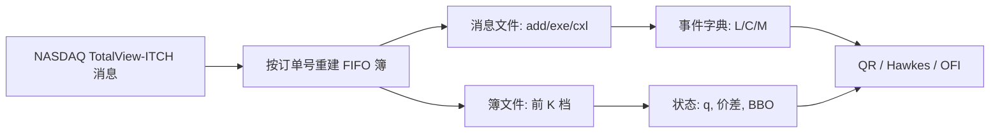

# LOBSTER 与 ITCH 行情

公开研究用的限价簿，不必来自私有的生产行情口：只要有带订单编号的逐笔消息，就可以按价格-时间优先把簿重建到任意深度——LOBSTER 正是对 NASDAQ TotalView-ITCH 做这件事的研究馈送。

<footer>—— Huang and Polak, LOBSTER: Limit Order Book Reconstruction System；消息契约见 NASDAQ TotalView-ITCH 说明</footer>

[Level-2 / Level-3 数据](/quant/l2-l3-data) 区分了聚合深度与带编号的订单流。学术上长期缺乏可引用、可复现的 L3：自有交易所口不可分享，快照产品又毁掉事件时间。LOBSTER（Limit Order Book Reconstruction System）把 NASDAQ 的 ITCH 历史消息重建成「事件 + 重建后的簿快照」配对，供研究下载。ITCH 是交易所的原生增量协议：增加、执行、撤销、替换都以订单号为键。本篇写这条公共研究链能看见什么、看不见什么、以及用它校准 [Queue-reactive](/quant/queue-reactive) 或 Hawkes 时必须遵守的时间与样本边界。它不是生产交易通道，也不涉及如何接入未授权的实时口。

## 问题

微观结构模型的估计对象是事件与状态：$(t,\text{type},\text{id},\text{price},\text{size})$ 以及事后的 $q^b_k,q^a_k$。没有订单号，队列位置不可点名；没有撮合时间，事件次序会变成网络到达次序。ITCH 提供订单号与撮合引擎时间戳，理论上足够重建 FIFO 簿。障碍是工程：消息类型多、盘中需要处理部分成交、隐藏单、替换、以及开盘跨时段的状态重置。LOBSTER 把这层工程做成标准化输出，使论文可以引用同一天、同一股票、同一深度的样本。

问题于是变成理解投影：LOBSTER 输出的「消息文件」与「簿文件」分别对应什么；隐藏执行如何出现；你看到的十档是重建的可见簿，不是一定包含冰山的真实可成交量。把它当成「完整的市场」会高估可见深度的解释力。

### 消息类型与重建不变量

ITCH 的核心原语与 LOB 结构一文中的四类一致：add、execute（部分或全部）、cancel、replace。每条 add 带新订单号；execute 与 cancel 引用已有编号并减少剩余量；replace 通常等价于对旧编号 cancel、再 add 新编号（价格或量变了，时间优先常重置）。重建不变量是：任意时刻，按价格-时间优先把存活订单排起来，应得到当时交易所用于撮合的可见簿（隐藏量除外）。LOBSTER 在每条改变可见簿的消息之后，导出前 $K$ 档价量。研究应同时保留消息流与快照：只留快照会退回 L2；只留消息不校对快照，难以发现重建错误。

LOBSTER 覆盖的是 NASDAQ 上该证券的订单。同一只股票在其他交易所的份额看不见。美国股票是碎片化市场，单一场所的 Hawkes 与冲击系数不能直接当成全国结果。

## 方法

使用顺序建议如下。第一，锁定证券、日期、深度 $K$，并阅读该日是否有停牌、开盘交叉、盘后。第二，以消息文件为主时钟，每条记录应能在簿文件找到对应的重建状态；不一致则停止估计，而不是插值。第三，把消息映射到自己的事件字典：主动买/卖通常由 execute 相对当时 BBO 判定；add 在 BBO 内侧是交叉（应已在 execute 路径），在外侧是限价。第四，处理隐藏单：ITCH 有单独的隐藏执行消息，它们改变价格与成交，但不对应此前可见的 add。QR 与成交概率若只用可见 $q$，必须承认这些执行是对 $x$ 的未观测消耗。

时间戳用纳秒级撮合时间排序。不要用文件行号当次序以外的时间轴。隔夜与日界：LOBSTER 按交易日切文件，不要把昨日最后一条与今日第一条连成 Hawkes 的一步。样本选择上，论文常用相对活跃的股票与较短的日期窗；把 LOBSTER 样本上的系数外推到薄股票或 A 股，属于制度外推，必须另做本地数据。

### 作为公共研究馈送的优点与缺口

优点：可复现、L3 编号、与 ITCH 契约对齐、深度可选、对学术友好。缺口：不是实时；延迟结构（从撮合到你策略）不在文件里；费用、拍卖机制细节、监管停牌原因需要外接；没有你自己的订单标识——回测填成只能用「当时可见队列 + 假设排在队尾」的反事实，见 [排队与成交概率](/quant/fill-probability)。ITCH 历史也不包含未显示在 TotalView 里的数据。对需要中国市场制度（T+1、涨跌停、集合竞价）的问题，LOBSTER 只能当方法对照，不能当样本。

与自建重建的关系：若你有其他市场的 order-by-order 馈送，应模仿 LOBSTER 的双文件输出（消息 + 簿），以便同一套 QR/Hawkes 代码切换样本。重建错误的典型症状是负深度、交叉簿、或 BBO 与成交价长期不一致。这些应在估计前当数据测试失败，而不是靠模型去「平滑」。

## 机制

ITCH 是撮合引擎的对外投影：每一笔改变引擎内部订单表的可见动作，几乎都有一条消息。机制上，它使学术模型第一次可以在真实 FIFO 规则下谈 $x$ 而不是只谈 $Q$。这正是 CST 生灭模型、QR、CKS 放置问题能够被估计而不是只被模拟的前提。隐藏单机制则提醒：公开馈送仍是透明性的下限。做市商与执行算法的一部分流量故意不进入可见 add，只在 execute 时冒出来；估计的 $\lambda^{\mathrm{MO}}(q)$ 会把打穿可见档的概率估高。

碎片化机制：全国最优报价可能在别的场所。用 LOBSTER 的 NASDAQ 簿去解释中点，中点若取全国 NBBO，会出现「本地没事件、价格却动了」。研究必须声明价格是本地 BBO 中点还是 NBBO。Hawkes 互激若用 NBBO 中点当价格事件、用本地 ITCH 当订单事件，因果会被跨市场延迟污染。

### 研究设计里的样本伦理与口径

LOBSTER 作为公共馈送，价值在于让不同论文的 $\lambda(q)$、核 $\phi$、OFI 的 $\beta$ 可以在同一数据契约上比较。引用时应写明版本、日期、股票、深度、是否含盘前。不要把「我们用了 LOBSTER」当成已经处理过分类与隐藏单。也不要把重建快照当成可以免费无限再分发的原始 ITCH——使用仍受该数据提供方的许可条款约束，研究复现应指向官方渠道。

公共研究馈送降低的是复现成本，不是识别难度。没有编号的市场不会因为你模仿了 LOBSTER 的列名就变成 L3。

## 边界

盘前盘后的流动性与连续交易不可混估。极小价格的股票、ETF 的申赎、拆细日，消息语义会变。ITCH 版本随年份变化，字段与隐藏单处理要以对应说明书为准，而不是以某篇 2010 年论文的附录为准。用 LOBSTER 校准的平方根冲击或传播核，只反映该场所、该时段的可见簿；母单若在多场所路由，短fall 会被低估或高估，取决于未观测场所吸收了多少量。

不要试图从 LOBSTER 推断未公开的订单归属或账户。数据是匿名编号，编号在日界重置。任何把编号串联成「某类参与者」的做法都超出馈送设计，也超出本篇范围。实时交易系统应使用有授权的行情与撮合接口，历史研究馈送没有延迟保证，不能当生产输入。

把 LOBSTER 当「真源」只在 NASDAQ 可见簿这一层成立。全国市场、暗池、批发内部化都不在里面。冲击与毒性的外推要写清这一层。

## 小结

- LOBSTER 是对 NASDAQ ITCH 的学术重建：带编号的事件加上重建后的深度快照。
- 研究应以消息为主时钟，用簿文件校对；隐藏执行会消耗不可见的 $x$。
- 单一场所、非实时、无自身订单号，限制填成反事实与全国冲击。
- 价格用本地中点还是 NBBO 必须声明，否则跨市场移动会冒充本地事件。
- 可复现不等于可外推到 A 股制度或其他碎片化结构。
- 出处：Huang and Polak, LOBSTER；消息语义见 NASDAQ TotalView-ITCH 规范。
