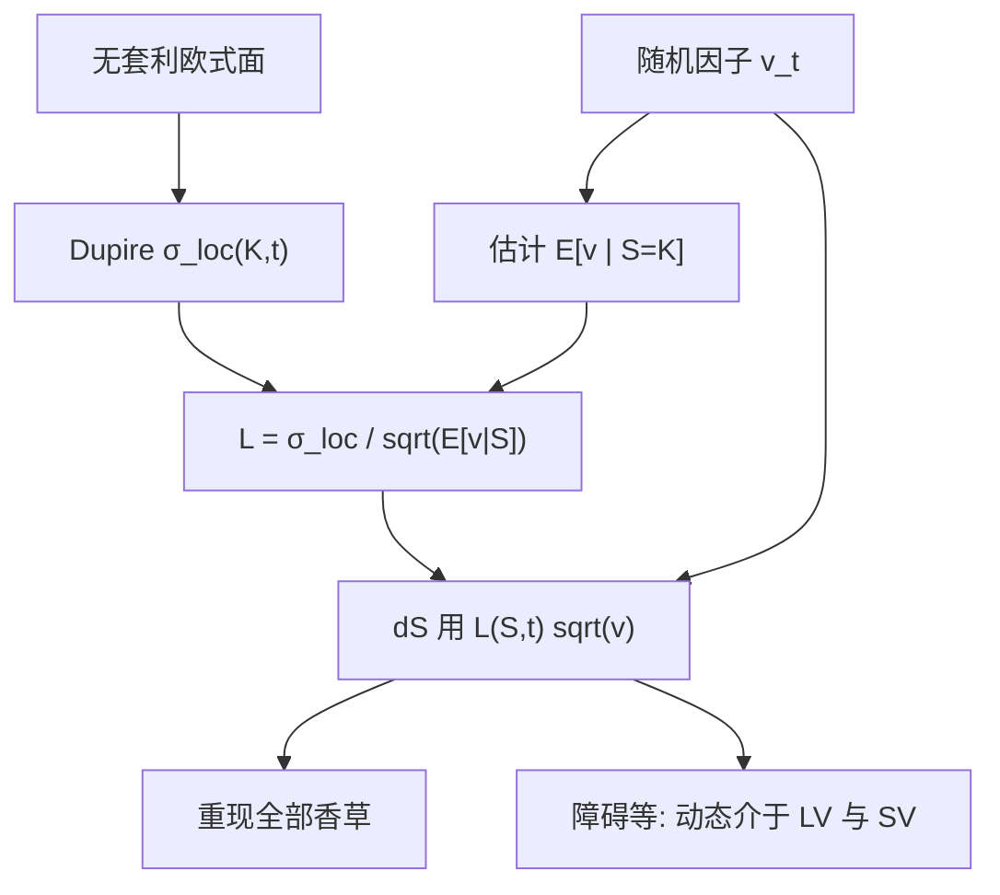

# 局部随机波动

    
瞬时方差写成随机因子乘上杠杆函数 $L(S,t)$，令杠杆满足 Dupire 局部方差等于条件期望 $\mathbb{E}[L^2 v\mid S_t=K]$，则今日全部香草仍被拟合，而路径上仍保留波动的随机性与相关。

    <footer>—— 机制见 Gyöngy 与 Dupire 的边际匹配；粒子校准见 Guyon and Henry-Labordère；混合 SLV 的工程传统见 Lipton 以及 Ren, Madan and Qian</footer>

[上一课](/quant/sabr-calib)把 SABR 校准写成 Hagan 映射的反问题：冻 $\beta$，ATM 解 $\alpha$，加权拟合 $\rho,\nu$，并检查密度与日历。[Dupire](/quant/dupire) 能把欧式曲面变成 $\sigma_{\mathrm{loc}}(S,t)$，香草拟合到数值误差，但远期微笑被锁死；纯随机波动保留动态，却贴不齐整张面。缺口是乘积规格：随机因子负责聚类与杠杆，杠杆函数 $L$ 把条件方差修到与 Dupire 一致。本课写 LSV 的约束与粒子校准，不重推 SABR 的识别策略，也不把 Heston 五参数再解释一遍。

## 问题

Gyöngy 的引理说：任意 Itô 过程都存在一个马尔可夫扩散，与它共享边际。Dupire 给出这个扩散的 $\sigma_{\mathrm{loc}}^2(K,t)=\mathbb{E}[\sigma_t^2\mid S_t=K]$。若真实模型已经是随机波动 $\sigma_t=\sqrt{v_t}$，对应的局部波动是条件期望，不是 $v_t$ 本身；用 $\sigma_{\mathrm{loc}}$ 去模拟，边际对、动态错。反过来，纯 Heston 的 $\mathbb{E}[v_t\mid S_t=K]$ 一般不等于市场 Dupire 方差，香草对不齐。LSV 要的是：选一个随机因子 $v_t$（Heston、对数正态、或 Bergomi 的投影），再找确定性的 $L(S,t)$，使得

$$
L(K,t)^2\,\mathbb{E}[v_t\mid S_t=K]=\sigma_{\mathrm{Dup}}^2(K,t).
$$

这样边际被钉死，额外的随机性仍在条件分布里，障碍看到的是「有时高波动、有时低波动」而不是 Dupire 的确定性杠杆。问题化为：如何从模拟或 PDE 里估计条件期望，从而解出 $L$，以及如何用少量路径产品锚定混合强度，以免 $L$ 与 $v$ 互相替代。

### 混合权重不是第三个闭式模型

有的实现把瞬时波动写成 $\sigma_{\mathrm{loc}}(S,t)\,v_t^{\gamma}$ 或 $(1-\lambda)\sigma_{\mathrm{loc}}+\lambda\times\mathrm{SV}$ 一类混合。$\lambda=0$ 退回 Dupire，$\lambda=1$ 退回纯随机（再丢掉精确香草拟合）。$\gamma$ 或 $\lambda$ 必须用障碍、cliquet 或历史对冲误差来定，不能单用香草：香草已经被 $L$ 用完。把 $\lambda$ 天天用香草重估，等于把识别重新弄坏。Lipton、Ren–Madan–Qian 以及后续的粒子文献，共同点是：香草约束写成上述条件期望，动态约束留给非香草。

杠杆 $L(S,t)$ 不是隐含波动，也不是 Dupire 的 $\sigma_{\mathrm{loc}}$。它是修正因子：随机因子的条件均值已经提供了一部分局部方差，$L$ 只补缺口。$v$ 的水平标定改变后，$L$ 必须重算，不能把昨日的 $L$ 表接到今日的 Heston $\theta$ 上。

## 方法

先从无套利欧式面算出 $\sigma_{\mathrm{Dup}}(K,t)$，方法见 Dupire 篇：光滑凸插值，禁止生差分。再选定因子动态，例如 Heston 的 $v_t$，参数先用香草粗校准或用方差互换期限结构钉住水平，不必完美。然后校准 $L$：

粒子法（Guyon, Henry-Labordère）：模拟一云粒子 $(S^i,v^i)$，在每个时间层用核回归或网格估计 $\widehat{\mathbb{E}}[v_t\mid S_t=K]$，令 $L(K,t)=\sigma_{\mathrm{Dup}}(K,t)/\sqrt{\widehat{\mathbb{E}}[v\mid S=K]}$，下一步粒子用这个 $L$ 扩散。如此前进，得到整张 $L(\cdot,\cdot)$。核带宽、粒子数与网格外推决定 $L$ 的噪声；过噪的 $L$ 会把 Dupire 翼部的爆炸复制进来。

PDE / Fokker–Planck：在 $(S,v)$ 上演化联合密度，切片上积分得到条件期望，同样解 $L$，再把 $L$ 代回生成元。二维可行时比粒子稳，三维（多因子 Bergomi）通常走粒子。校准 $L$ 之后，用同一生成元给障碍定价，并与纯 Dupire、纯 SV 的障碍价比较，作为合理性区间。

### 条件期望约束的离散实现

网格上 $S$ 与市场 $K$ 不对齐、日内 $t$ 与期权到期不对齐，都要使 $\mathbb{E}[L^2 v\mid S]$ 在插值后仍等于 $\sigma_{\mathrm{Dup}}^2$。常见错误是用 $\mathbb{E}[v\mid S]$ 的粒子平均时忘记 $L$ 已在扩散系数里、造成固定点迭代与模拟不一致。应在同一离散格式下定义 $L$：用哪一种 Euler，校准与定价共用。另一错误是对 $v$ 做吸收或反射处理 Feller，条件期望在零附近被边界政策扭曲，$L$ 在低执行价飙升。此时应先修因子动态，而不是把 $L$ 当垃圾桶。

香草验证：校准 $L$ 后必须把欧式再定价一遍，残差应在插值误差量级。若短端仍差，问题多半在 Dupire 面本身（日历噪声）或粒子在短时间内没混合好，而不是再加一个 $\lambda$。

## 机制

LSV 把「边际」和「条件方差」拆开。边际由 $L$ 钉死，故 Breeden–Litzenberger 密度与市场一致；给定 $S_t$ 之后 $v_t$ 仍随机，故从 $t$ 看未来的微笑可以再打开，打开的程度由因子的 vol-of-vol 与相关决定。障碍依赖路径上 $\sigma$ 何时变大：纯局部把 $\sigma$ 写成 $S$ 的函数，跌到障碍附近波动被杠杆锁死；纯随机可以在现货尚远时就把 $v$ 抬高。LSV 介于二者：杠杆仍然随 $S$ 变，但同一 $S$ 上还有 $v$ 的分散。这正是障碍市场常落在 LV 与 SV 报价之间的模型叙事。

与 Bates / Lévy 的分工：LSV 默认连续，短端极陡偏斜仍可能要 $L$ 在短 $t$ 上变得很尖，数值不稳。此时短端应让跳或粗糙波动承担，而不是强迫 $L(S,0^+)$ 去模仿跳。LSV 不是「有了 $L$ 就可以不要跳」。

### 识别：为何路径产品是必需的

$L$ 已经用尽香草信息。放大因子的 $\sigma$（vol-of-vol）同时改变 $\mathbb{E}[v\mid S]$ 的分散度，校准器会把 $L$ 往反方向调，香草仍拟合，障碍价却变。这是弱识别。解决办法是冻结因子参数于一个用方差产品或历史估计的合理区，只让 $L$ 吸收香草残差；或引入一个混合参数，用少数流动障碍去校准。没有这步，LSV 只是「带许多函数自由度的 Dupire」，动态故事是假的。

粒子校准的 $L$ 表是模型状态的一部分，应与因子参数一起版本化。只存 Heston 的五个数、不存 $L$，无法复现昨日障碍价。

## 边界

公式层假设扩散。有跳时 Dupire 比值不再是瞬时连续方差，LSV 会把跳质量吸进 $L$ 的尖峰。随机利率、离散股利要在生成元里显式处理，不能把股票 $L$ 表直接乘到期货上。高维篮子的条件期望是 $S$ 的函数不再够，要投影到范数或用马尔可夫投影的近似。

数值上 $L$ 的翼部继承 Dupire 的爆炸，必须切执行价。粒子核回归在稀疏区（深虚值）极不稳。Guyon–Henry-Labordère 的贡献是把校准写成可实现的蒙特卡洛；Lipton 与 Ren–Madan–Qian 代表把局部与随机乘在一起的建模传统。不要把 LSV 写成 1994 年 Dupire 论文里已经有的内容——Dupire 只有局部，没有随机因子。

「完美拟合香草」在 LSV 里仍然只对欧式边际。美式提前行权、离散观察障碍、对冲带交易费用，都不被 $L$ 的条件期望约束所担保。

## 小结

- 局部随机波动令 $\sigma_t=L(S_t,t)\sqrt{v_t}$，并用 $L^2\mathbb{E}[v\mid S]=\sigma_{\mathrm{Dup}}^2$ 钉住全部欧式边际。
- 动态介于 Dupire 与纯 SV 之间；障碍价格对因子 vol-of-vol 敏感，香草不敏感，故必须用路径产品或冻结因子来识别。
- 杠杆函数用粒子或 Fokker–Planck 校准，且须与定价共用同一离散格式。
- $L$ 不是 $\sigma_{\mathrm{loc}}$ 的别名，因子重定时要重算 $L$。
- 跳与短端尖峰会污染 $L$；LSV 不替代跳跃模型。
- 出处：边际匹配见 Dupire, *Risk*, 1994 与 Gyöngy；粒子校准见 Guyon and Henry-Labordère；SLV 工程见 Lipton 及 Ren, Madan and Qian。
