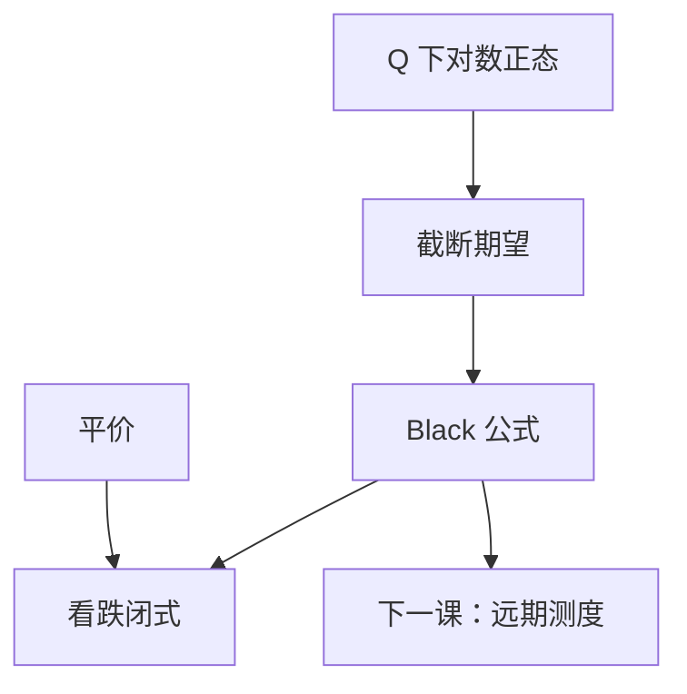

# 对数正态与 Black 公式

远期对数正态时，欧式期权价格是 Black 公式：$F\mathrm e^{-rT}\Phi(d_1)-K\mathrm e^{-rT}\Phi(d_2)$。$d_{1,2}$ 只含 $F,K,\sigma\sqrt{T}$。

<footer>—— 据 Black, Journal of Financial Economics, 1976；Black and Scholes, 1973；Shreve, Stochastic Calculus for Finance II, 第 5–6 章整理</footer>

上一课[Put–call 平价作为无套利](/quant/put-call-parity-arb)把 $C-P$ 钉成远期。缺口是凸性部分的闭式：在 $Q$ 下 $S_T$（或 $F_T$）对数正态时，$(S_T-K)^+$ 的期望能写成 $\Phi$。本课给出 Black / Black–Scholes 公式，作为完备 GBM 市场的可计算接口；期限结构与随机利率留给下一课远期测度。

## 问题

$Q$ 下 $\ln S_T\sim\mathcal N(\ln S_0+(r-\tfrac12\sigma^2)T,\sigma^2 T)$。$\mathbb E_Q[(S_T-K)^+]$ 是对数正态随机变量的截断期望。缺口是把它积出来，并改写成以远期 $F=S\mathrm e^{rT}$（无股息）为输入的 Black 形式，使利率只通过贴现与 $F$ 出现。不重解 PDE：Feynman–Kac 已保证公式解那个柯西问题。

$d_2$ 是 $Q$ 下虚值转实值的概率；$d_1$ 是股票测度下的对应概率。两者相差 $\sigma\sqrt{T}$，来自把 $S_T$ 本身当作计价物时的漂移平移——预告下一课。

### Black 公式不是「另一种期权」

Black 76 把标的换成远期或期货，对利率期权、商品期权是同一条对数正态积分。股票上的 BSM 是 $F=S\mathrm e^{(r-q)T}$ 的特例。把两者当成不可互相翻译的两套模型，会在实现里维护两份代码、两套 $\sigma$。本课只保留一份：对数正态远期 + 贴现。

$\Phi(d_2)$ 是 $Q$ 下结束实值的概率，不是 $\Delta$。$\Delta=\mathrm e^{-qT}\Phi(d_1)$。混用 $d_1$ 与 $d_2$ 是对冲账记错行。

## 方法

无股息 Black–Scholes：

$$
C=S\Phi(d_1)-K\mathrm e^{-rT}\Phi(d_2),\quad
d_{1,2}=\frac{\ln(S/K)+(r\pm\tfrac12\sigma^2)T}{\sigma\sqrt{T}}.
$$

Black 76：用 $F$ 写 $C=\mathrm e^{-rT}\bigl(F\Phi(d_1)-K\Phi(d_2)\bigr)$，$d_{1,2}=\frac{\ln(F/K)\pm\tfrac12\sigma^2 T}{\sigma\sqrt{T}}$。看跌由平价立即得到。$\sigma$ 是对数正态的波动率输入，本课当已知常数；它从哪来是[波动率是输入不是输出](/quant/vol-as-input)。

数字期权价格 $\mathrm e^{-rT}\Phi(d_2)$ 与虚值概率直接对应。这是后课复制数字、匹配密度的接口。

## 机制

积分把 $S_T$ 的对数正态密度从 $K$ 积到无穷。配方是配平方：一项变成 $S$ 的期望（股票测度），一项变成现金概率（$Q$）。$d_1=d_2+\sigma\sqrt{T}$ 正是两个高斯均值之差。公式对 $\sigma$ 递增（Vega 为正）：凸性对波动率单调，与 Jensen / Itô 修正同向。对 $K$ 递减（看涨），与支付一致。

$\sigma\to 0$：价格趋向贴现内在（远期兑现）。$\sigma\to\infty$：看涨趋向 $S$（无股息）。这些极限用来核验实现，不是新模型。

## 边界

本课不把公式推广到障碍、亚式、美式。微笑意味着单一 $\sigma$ 不能拟合所有 $K$，那是 vol 课的缺口，不是把本公式作废：每个 $K$ 仍用 Black 反解一个 $\sigma_{\mathrm{imp}}(K)$。后课默认：需要闭式欧式价时，先写 Black；利率随机时，$F$ 的测度要换成远期测度。下一课[远期测度](/quant/forward-measure)把 $d_2$ 的概率解释彻底换成计价物。

## 小结

- 对数正态远期 $\Rightarrow$ Black 公式；BSM 是其现货写法。
- $d_2$ 是 $Q$-实值概率；$d_1$ 给出 delta，不是同一个量。
- 看跌由平价得到，不必再积分。
- 单一 $\sigma$ 是输入；微笑是后课用同一公式反解。
- 出处：Black 1976；Black–Scholes 1973；Shreve SDE II 第 5–6 章。
