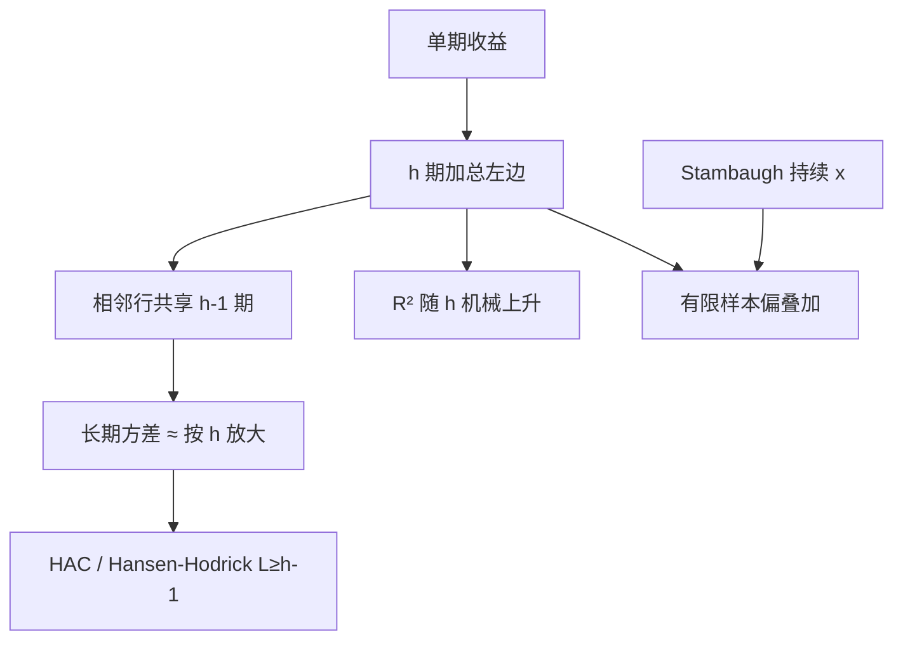

# 长期收益与重叠观测

用未来许多期的收益加总当左边，相邻观测几乎是同一段价格路径；若不按重叠修正，样本量会被重复计算，可预报性看起来随地平线变强。

<footer>—— Hansen and Hodrick, Forward Exchange Rates as Optimal Predictors of Future Spot Rates, Journal of Political Economy, 1980</footer>

[Stambaugh 偏差](/quant/stambaugh-bias) 已经说明：持续的 $x_t$ 会在有限样本里制造假预测力。实践中人们还把左边换成 $h$ 期累计收益 $r_{t+1}+\cdots+r_{t+h}$，希望 $R^2$ 随 $h$ 上升——Fama–French 对股利价格比的长期回归是典型。相邻的 $h$ 期窗口共享 $h-1$ 期收益，残差是 MA$(h-1)$。Hansen 与 Hodrick 在外汇远期回归里把重叠写进协方差；Valkanov、Boudoukh–Richardson–Whitelaw 指出 $R^2$ 随 $h$ 涨可以是算术而不是新信息。本课缺口：**重叠是已知的依赖结构**，应进入 [Newey–West](/quant/newey-west) 的带宽或进入 Hansen–Hodrick 的矩形核，而不能只当「更长的投资建议」。标签层面的重叠见已有的 [标签、预测期与重叠](/quant/label-horizon-overlap)；这里对象是资产定价里的长期收益回归。

## 问题

$$
\sum_{k=1}^{h}r_{t+k}=\alpha_h+\beta_h x_t+u_{t,h}.
$$

若单期 $u_{t,1}$ 白噪声，$u_{t,h}$ 仍与 $u_{t+1,h}$ 高度相关。把每月一个观测、共 $T$ 行，当成 $T$ 个独立的 $h$ 年实验，独立信息大约只有 $T/h$。问题是估计 $\beta_h$ 的精度，以及 $\beta_h$ 随 $h$ 变大是否只是把同一单期 $\beta$ 乘上了窗口。

若单期模型为真且收益无条件同质，$\beta_h\approx h\beta_1$，$R^2$ 也大致按重叠公式上升。看到「长期更可预测」要先减掉这条机械。真正的多期可预报性应表现为超出重叠算术的部分，或样本外在 $h$ 上仍站得住。

### Hansen–Hodrick 与 Newey–West

Hansen–Hodrick 用矩形核、滞后 $h-1$，对准重叠 MA。矩形核不保证正定。Newey–West 用 Bartlett、$L\ge h-1$，正定，金融默认。两者都假设弱依赖；长记忆或结构突变下，$h$ 很大时几乎没有不重叠的实验。

年化 $\beta_h/h$ 再拿去和单期比，才是同一对象。直接比较 $\beta_{12}$ 与 $\beta_1$ 的 $t$，会把窗口长度算进经济幅度。

## 方法

**推断。** 月度数据、$h=12$，至少 $L=11$。报告按不重叠子样本的回归作对照：只用每年一月，观测真独立，功效低但水平干净。Hodrick（1992）把重叠移到回归元一侧，有时有限样本更好。

**小样本。** $h$ 相对 $T$ 大（十年回归、八十年样本）时，即使 HAC 也会过度拒绝。应用模拟：在无预测力下生成重叠左边，看 $\hat\beta_h$ 与 $t$。Valkanov 讨论 $t/\sqrt{T}$ 一类重标。与 Stambaugh 叠加：长期回归的 $x$ 仍持续，偏误与重叠同时在，应在模拟里两者都开。

**与事件长期 CAR。** 三年买回超额是重叠加模型误设。日历时间组合（每月一个组合收益）把重叠收到组合构建里，再用单期回归——往往比叠窗口 CAR 更干净。

### 不要用重叠制造显著

同一套 $x_t$ 对 $h=1,3,12,24,36$ 扫一遍，挑选最大 $t$，是多重检验。预登记 $h$，或报告全部 $h$ 并用 Bonferroni。机器学习标签用未来 $h$ 日收益时，交叉验证须 purge，见标签课；本课的 HAC 不能替代时间序列 CV 的泄漏控制。

## 机制

重叠的机制是共享路径：$\mathrm{Cov}(u_{t,h},u_{t+j,h})$ 在 $|j|\lt h$ 时由共享的 $h-|j|$ 期收益决定。长期方差 $J$ 大约是单期方差的 $h$ 倍量级（精确系数依赖单期相关）。不修正时，标准误按 $1/\sqrt{T}$ 缩小，真实应按 $1/\sqrt{T/h}$ 量级。$t$ 于是随 $\sqrt{h}$ 虚涨——这就是「地平线越长越显著」的统计引擎之一。

$R^2$ 的机制：左边方差随 $h$ 涨，若 $x_t$ 慢变，它解释的是慢成分，拟合看起来更好。Boudoukh 等人强调这可以在 $\beta_1=0$ 的有限样本里发生，尤其叠加 Stambaugh。

外汇里 Hansen–Hodrick 的左边是远期溢价对应的未来即期变化，重叠来自合约期限与采样频率不匹配。股票长期回归是同一数学，经济故事换成折现率慢变。

### 与 GMM 的衔接

把正交条件写成 $E[u_{t,h}x_t]=0$，HAC 的 $J$ 正是 GMM 的长期方差。下一课 [GMM 与资产定价](/quant/gmm-asset-pricing) 把这类矩系统化；重叠回归是 GMM 最浅的特例：一个矩、已知 MA 阶。

## 边界与工程取舍

$h\gt T/10$ 时不要假装渐近。国际面板再叠加国家聚类，有效实验更少。用平滑的折现率代理当 $x$，等于把重叠写进右边，HAC 更要够长。

工程：默认报告单期 + 重叠 HAC 的多期；不重叠对照；模拟 p 值。不要把 $h=60$ 的月度 $t$ 当独立证据去挑战有效市场。不要用重叠长期收益做 [Fama–MacBeth](/quant/fama-macbeth) 月截面还只用截面标准误。机器学习管道里重叠标签必须与本课同一纪律。

## 小结

- $h$ 期重叠收益让独立信息大约降到 $T/h$，必须用 Hansen–Hodrick 或 Newey–West（$L\ge h-1$）。
- $\beta_h$ 与 $R^2$ 随 $h$ 变大含机械成分，应年化对照并做无预测力模拟。
- 与 Stambaugh 偏同时存在时，只开 HAC 仍会指向错误中心。
- 日历组合能把长期问题收成单期，往往比叠窗口更干净。
- 出处：Hansen and Hodrick, *JPE*, 1980；Hodrick, *Journal of Financial Economics*, 1992；地平线幻觉见 Boudoukh, Richardson and Whitelaw 及相关讨论；Valkanov, *Journal of Financial Economics*, 2003。
