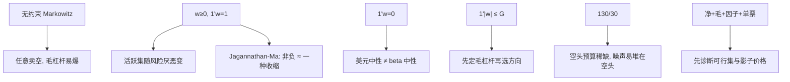

# 多空与多头约束

    
禁止卖空会改变有效前沿的活跃集合；有时「错误」的非负约束反而通过等价收缩改善样本外风险——约束在这里既是制度，也是正则。

    <footer>—— Jagannathan and Ma, Risk Reduction in Large Portfolios: Why Imposing the Wrong Constraints Helps, Journal of Finance, 2003</footer>

[Markowitz](/quant/markowitz) 的无约束解允许 $w_i$ 任意为负。章程、借券、融资与产品说明书把它切成几类可行集：多头（$w\ge 0,\mathbf{1}^\top w=1$）、多空美元中性（$\mathbf{1}^\top w=0$）、净暴露钉基准、总暴露（毛杠杆）上限、130/30 这类不对称多空。约束改的不是 $\mu$ 的叙事，是二次规划的 Kuhn–Tucker 活跃集：哪些名字被顶在零、哪些腿被顶在毛杠杆。Jagannathan 与 Ma（2003）进一步指出，非负约束在总体层面等价于对 $\Sigma$ 做一种收缩，样本外方差可以下降。本篇写这些可行集、130/30 与市场中性的会计、约束作为正则，以及与 [行业/国家中性](/quant/industry-country-neutral) 同时打开时如何互抢自由度。杠杆与换手的制度条目亦见 [组合约束](/quant/portfolio-constraints)；这里聚焦**符号与净/毛暴露**。

## 问题

同一套 $(\mu,\Sigma)$ 在不同可行集上是不同的策略。无约束切点常常是大多头加大空头，夏普样本内很高，借券与冲击下不可交易。多头基金不能实现负权重，有效前沿从双曲线变成有拐点的曲线，两基金定理失败：不同风险厌恶对应不同的活跃资产集合。多空基金若只钉 $\mathbf{1}^\top w=0$ 而不钉 $\mathbf{1}^\top|w|\le G$，优化器会用巨大的多空抵消来「对冲」噪声，毛杠杆爆炸。问题是把产品的法律形状写成线性约束，并理解每条约束切掉的是哪一类伪 alpha：不可借的空头、不可加的杠杆、还是不可偏离的净暴露。

「市场中性」一词在销售材料里至少有三种：美元中性、beta 中性、相对基准的残差中性。三者可行集不同。只做美元中性的组合可以有巨大的市场 beta（多高 beta 空低 beta）；只做 beta 中性可以有巨大的净市值暴露。写约束前必须选定中性的对象，否则风险报告与优化器不在同一空间。

### 卖空不是负的多头

空头的成本是借券、召回、上涨缺口；多头的成本是价差与资金。把 $w_i\lt 0$ 当成与 $w_i\gt 0$ 对称的连续变量，只在无摩擦二次型里成立。实现上应对空头腿用更高的线性成本、单票空头上限、以及可借券名单（硬零）。A 股融券标的与 T+1 使「多空」往往是指数期货对冲加多头选股，可行集更接近 $w_{\mathrm{cash}}+w_{\mathrm{fut}}+w_{\mathrm{stock}}$ 的混合，而不是美股式个股多空。约束语言要跟市场走，不能把 130/30 文献直接贴到不可卖空的股票池上。

130/30：多头和 130%、空头和 30%，净暴露 100%，毛暴露 160%。它不是「稍微允许卖空的多头基金」这么温和——30% 的空头可以集中在少数名字，单票与行业风险完全可以比净 100% 的多头更尖。约束必须同时写净、毛、单票、行业。

## 方法

常用线性约束（$w^+$、$w^-$ 为多头与空头拆分，$w=w^+-w^-$）：

- 多头：$\mathbf{1}^\top w=1,\ w\ge 0$。
- 美元中性：$\mathbf{1}^\top w=0$，常再加 $\mathbf{1}^\top(w^++w^-)=G$（毛杠杆）。
- 130/30：$\mathbf{1}^\top w^+=1.3,\ \mathbf{1}^\top w^-=0.3$（或净 $=1$ 且空头和 $\le 0.3$）。
- beta / 因子中性：$B^\top w=0$ 或等于基准暴露。
- 单票：$|w_i|\le \bar w_i$，空头 $\bar w_i$ 更紧。

求解仍是 QP（或 CVaR 的 LP）。活跃集随 $\mu_p$ 或风险厌恶变化：收紧风险时，多头问题先把高波动名字打到零；多空问题先把对冲腿打满毛杠杆。报告应列出绑紧的约束及影子价格：影子价格高说明产品形状在主导，alpha 几乎没进入一阶条件。

Jagannathan–Ma：在估计 $\Sigma$ 很吵时，加上 $w\ge 0$（即使总体允许卖空「本该」更优）可以降低样本外方差，因为非负约束等价于把某些协方差项向使最优解落在边界的方向调整——一种数据依赖的收缩。含义是：多头约束不必只当成制度成本，也可以当成对病态切点的正则。对照实验应包括「无约束 + Ledoit–Wolf」与「非负 + 样本 $\Sigma$」，不要只比较无约束样本切点与多头组合。

### 净暴露、毛暴露与 beta 是三个旋钮

净暴露 $\mathbf{1}^\top w$ 管资金与产品是否「像股票」。毛暴露 $\mathbf{1}^\top|w|$ 管冲击、借券与尾部同向。Beta $b^\top w$ 管相对市场的一阶。三个可以独立：净 0、毛 4、beta 0.2 是杠杆市场中性；净 1、毛 1、beta 1 是多头。优化器若只看到 $\mu$ 与 $\Sigma$，会用毛杠杆去放大任何正夏普方向，直到毛约束绑紧——于是你优化的其实是「在杠杆上限上选方向」。应先定 $G$，再在该截面上选 $w$，并把 $G$ 当成风险预算参数做样本外，而不是让求解器决定基金杠杆。

多空的 [ERC](/quant/erc) 不能直接用正权重公式。常见改法：对 $w^+$ 与 $w^-$ 分别做风险预算，或对因子暴露做平价、个股权重由回归残差约束。多头 ERC 在单纯形上定义清晰，是 Maillard 等人的原设定。

## 机制

卖空约束改变分散化的几何：不能做空高估资产时，只能把权重放到零，残余的不良暴露靠其余多头的相关来稀释，通常稀释不干净，跟踪误差里留下行业或风格。多空允许用空头去对冲，同一 $\alpha$ 的实现更接近特征组合，转移系数上升，同时换手、借券与拥挤上升。130/30 是两者之间的折中：空头预算是稀缺资源，优化器会把它花在最负的残差 alpha 上，若 alpha 估计噪声大，这 30% 会变成误差最大化最严重的腿——实务上应对空头腿用更高的 $\gamma$ 换手惩罚或更强的 $\alpha$ 收缩。

Jagannathan–Ma 机制：样本 $\Sigma$ 把某些资产标成「对冲工具」（与其余负相关或低相关），无约束解给它们大空头或大多头；这些相关往往是噪声。非负约束禁止用它们当对冲工具，等于忽略那些不可靠的负相关，样本外方差下降。这与显式收缩同向，但不能替代收缩：高维多头问题里 $\Sigma$ 仍可病态，只是逆的使用被边界挡住了一部分。

「允许卖空提高了信息比率」的回测，经常没有扣借券、没有召回、没有上涨缺口。空头腿的容量远小于多头。约束写进优化器之后，回测引擎必须用同一套可借名单，否则可行集在研究与实盘之间又裂了一次。

### 约束冲突与空可行集

净暴露、毛杠杆、beta 中性、行业中性、单票上限可以一起把可行集掏空，或只留下「几乎等于上期」的点。这时求解器仍返回一个点，目标值没有意义。应在优化前做约束诊断：放松一条看影子价格，或分层满足（先制度硬约束，再中性，再 alpha）。[换手惩罚](/quant/turnover-penalty) 相对 $w_0$ 过强时，等于又加了一组「接近上期」的软约束，冲突更频繁。新产品建仓期应允许更大毛杠杆路径或分步放松中性，否则第一天就不可行。

## 边界与工程取舍

不要把美元中性叫做市场中性。不要在不可卖空市场用对称多空文献的夏普当容量。不要只钉毛杠杆不钉单票：毛 2 可以是 200 只各 1%，也可以是两只各 100%。不要用无约束样本切点的崩溃来论证「必须多头」——应先收缩 $\Sigma$ 与锚 $\mu$，再决定符号约束；Jagannathan–Ma 是额外的正则，不是对均值方差理论的否定。期权、期货的符号与名义乘数要使 $w$ 的定义与现货一致，否则净暴露会计是错的。

多空组合的尾部不对称：空头损失无界。方差或 ERC 对这一点收费不足，应叠加 [CVaR 优化](/quant/cvar-opt) 或空头单票硬上限。压力情景里相关跳到 1，多空的「对冲」消失，毛杠杆变成单向风险——约束在平静期校准的 $G$，危机里应能被风控杀开关覆盖，而不是仍当作最优。

Jagannathan–Ma 的「错误约束有帮助」针对的是估计误差，不是说制度约束越多越好。把二十条彼此冲突的盒子堆上去，得到的是合规仓，不是正则化的切点。

## 小结

- 多头、美元中性、beta 中性、毛杠杆、130/30 是不同可行集，同一 $(\mu,\Sigma)$ 对应不同策略；「市场中性」必须定义对象。
- 卖空约束改变前沿活跃集；Jagannathan–Ma（2003）表明非负约束可等价于对 $\Sigma$ 收缩，改善样本外方差。
- 毛杠杆往往先于 alpha 绑紧，应外生定 $G$；空头腿成本不对称，约束与成本都应分腿。
- 多条中性同时开时要诊断可行集，避免求解器在空集附近返回合规点。
- 空头尾部与危机相关上升使「对冲」失效，方差目标不够，需 CVaR 或硬上限与杀开关。
- 出处：Jagannathan & Ma, *Journal of Finance*, 2003；卖空约束下的前沿为 Markowitz 1952/1959 的标准 Kuhn–Tucker 情形；130/30 见 Lo 与 Jacobs–Levy 一类主动扩展文献。
