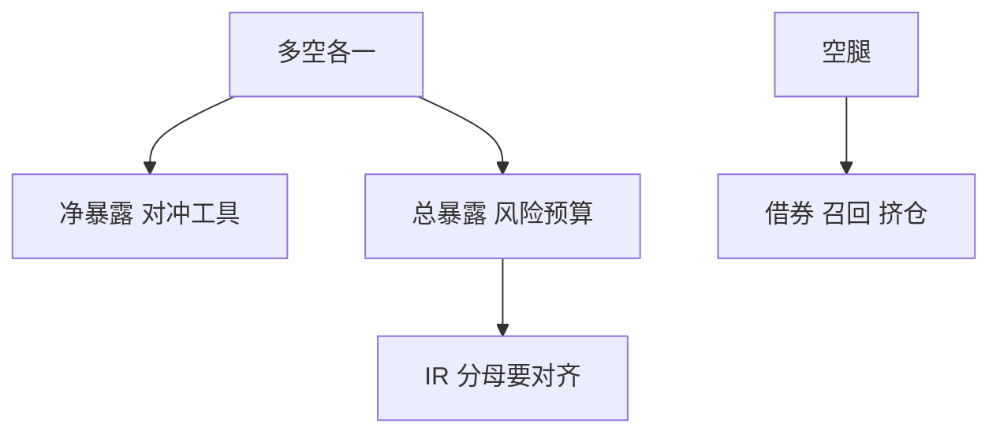

# 多空股票

多空不是两个多头相减那么简单；短腿有借券、召回与不对称的挤仓，多腿有资金与指数期货对冲的基差。

<footer>—— 对照 Jacobs and Levy 对多空与 130/30 的讨论；因子多空见 Fama–French 排序</footer>

[上一课](/quant/rebalancing-premium)收口多期配置。策略地图从多空股票起：主干 [单因子排序与多空](/quant/long-short-sort) 已写截面构造。缺口是**作为基金策略的实施**：总暴露、净暴露、借券、对冲工具，以及它和 130/30 的差别。后课 130/30 是多头加有限短。

## 问题

市场中性多空目标净暴露近 0、总暴露 $2\times$（或多空各 1）。因子溢价课里的 HML 是学术组合，不计借券稀缺与召回。实盘短腿成本随名字变化，拥挤时 [短约束](/quant/cn-short-constraint) 与一般 [证券借贷](/quant/securities-lending) 会把理论空头变成不可执行。问题是把策略定义成：可借券宇宙上的优化，而不是「把学术空头原样下单」。

净暴露若用股指期货对冲，留下基差与成分错配，中性变成「对指数中性」而非对全部风险因子中性，见 [基本面风险模型](/quant/fundamental-risk-model)。

### 总暴露才是风险预算的单位

报「我们市场中性」却 300% 总暴露，主动风险可以很大。限额应同时管净、总、因子、行业。多空的 IR 若用净资产当分母，会与用总暴露当分母的学术夏普不可比。

多空不是方向性择时。净暴露若随观点大幅摆动，应归入后课全球宏观或 130/30，不要留在中性桶里自我陈述。

## 方法

宇宙：可借、流动性、公司行动。优化：多空约束、因子中性、换手，见 [多空约束](/quant/long-short-constraints)。执行：短腿优先确认可借再卖。对冲残差用期货时单独报基差。容量：短腿往往先满，见 [策略容量](/quant/strategy-capacity)。

## 机制

多腿赚因子与特异，空腿赚因子反向并付借券。挤仓时空腿的损失非对称（上涨可无限）。再平衡溢价在多空里变成频繁调两边，费用双份。中性若真做成，主收益应来自截面 alpha 而不是 beta。

## 边界

危机中相关升、空头召回同时发生，中性失效。做空禁令是制度风险。本课不写如何规避借券定位规则。

## 小结

- 实盘多空的约束在空腿：可借、成本、挤仓；学术 HML 不是产品。
- 同时管净、总、因子；IR 分母对齐。
- 期货对冲留下基差，不是完全中性。
- 出处：Jacobs and Levy 对多空实施的讨论；Fama–French 排序为学术对照。
