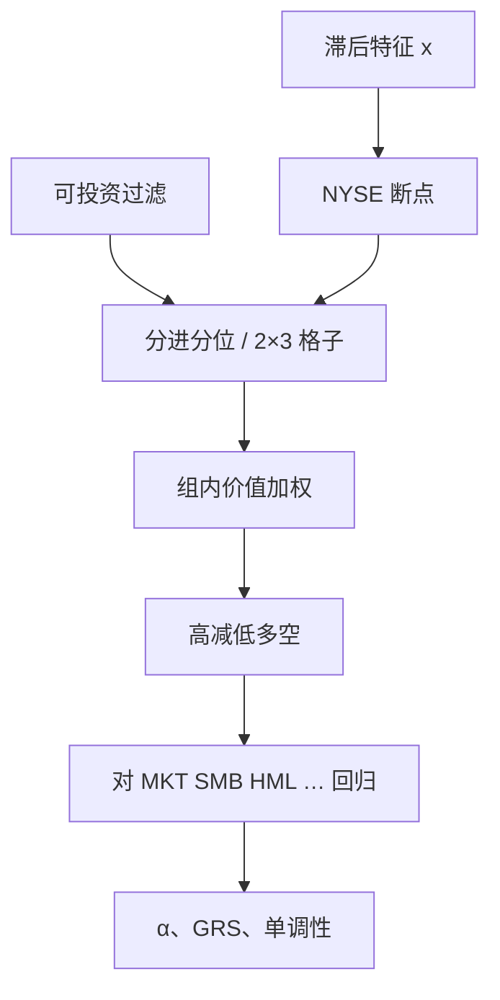

# 单因子排序与多空

先按一个可观测特征把股票排进分位组合，再看高减低的价值加权收益是否显著；这是把截面预测写成可交易因子的标准实验，而不是回归系数本身。

<footer>—— 综合 Fama–French 组合排序传统与后续因子复制惯例</footer>

前面各篇的 SMB、HML、WML、RMW、CMA、BAB、ILLIQ 腿，背后是同一套实验室手续：**排序、断点、加权、持有、多空、再对已有因子回归 α**。手续一改，溢价可以翻倍或消失。本篇把单因子排序写成可检查的流程，说明 NYSE 断点、独立 vs 从属双重排序、等权 vs 价值加权、以及多空 α 与截面回归各自回答什么问题。它不是又一个特征，而是[三因子](/quant/ff3)到[流动性](/quant/liquidity-factor)共用的构造语言。

## 问题

个股回归 $R_{i,t+1}=a+b\,x_{it}+e$ 的 $b$ 显著，只说明特征在样本里有预测斜率。它不保证：按 $x$ 切开的两端能形成可持有组合、中间组是否单调、微型股是否贡献全部 $b$、换手是否吃掉均值。组合排序把这些问题变成持仓。多空（long-short）再把多头与空头的差额当成一个资产，便于放进时间序列回归的右侧或左侧。

问题是排序有太多自由度：形成频率、分位数、断点总体、加权、滞后、跳月、行业中性、价格过滤。没有预先承诺，同一特征可以「被发现」也可以「被杀死」。单因子实验的最低标准是：这些选择写进定义，并报告对它们的敏感性，而不是只贴一个 t 统计量。

### 排序不等于已经定价

分位组合的平均收益差是**未调整**的溢价。把它对市场或五因子回归得到的 α 才是相对已有模型的增量。HML 作为右侧因子时，左边若仍是 B/M 十分位，α 应接近零——这是一致性检查，不是新发现。左边若是另一个特征（动量、ILLIQ），α 才回答「单因子排序是否已被现有因子吸收」。

等权十分位的 t 值几乎总比价值加权好看，因为小盘权重大、特异性对冲得看起来更净。可投资结论以价值加权、带流动性过滤的版本为准。等权当作诊断：若等权显著而价值加权不显著，效应在经济上可能不重要。

## 方法

单变量：每个再平衡日对股票 $i$ 计算特征 $x_{it}$（已滞后到可获得），在断点总体（通常 NYSE 上市、不含负账面等）上取分位 $q$，把全体股票（含 AMEX/NASDAQ）按这些断点分进组。组内价值加权，持有到下一再平衡日。多空是最高组减最低组，或 2×3 里两端的平均差。重叠持有（如动量 J/K）则每月对若干 vintage 等权。

独立双重排序：两个特征各自取断点，格子是笛卡尔积，用于构造在另一特征上中性的腿（SMB 对 B/M 平均）。从属排序：先按规模分组，再在组内按第二特征排，保证每组股票数均匀，但第二特征的断点随规模变。独立排序会出现空格子或极稀格子；从属排序会让「高 B/M」在小盘与大盘意味着不同的绝对比率。

$$
r_t^{\mathrm{LS}}=\sum_{i\in H}w_{it}R_{it}-\sum_{j\in L}w_{jt}R_{jt},\qquad \sum w=1
$$

$w$ 用上期市值。然后

$$
r_t^{\mathrm{LS}}=\alpha+\beta^\top F_t+\varepsilon_t
$$

$F$ 是已有因子。Newey–West 处理重叠持有造成的序列相关。GRS 检验一组分位组合的 α 是否联合为零。

### 断点、滞后与可投资宇宙

用全体股票的分位数当断点，NASDAQ 微型股会把阈值拉到不可交易区，大盘全部挤进同一组。NYSE 断点是 Fama–French 的 antidote。特征必须严格滞后：6 月用 t−1 年报，价格用已实现市值，动量跳过 t 月以免反转。宇宙要预先规定：价格不低于某阈值、过去成交额、是否含金融、是否含新上市。事后剔除「亏钱的名字」是前视。

## 机制

为何排序比回归更接近交易：回归的 $b$ 给每只股票相同斜率，极端 $x$ 与中间 $x$ 共用一个系数；排序允许非线性（只有两端有溢价、中间平坦）。多空强制资金中性，去掉市场水平的第一主成分，让 t 值反映截面。价值加权让组合收益对应「按市值计的经济」，与指数、与主动管理的基准更可比。

为何排序会骗人：两端组在特征上的差异可能只是行业、只是 β、只是流动性。单调性检查（十分位平均收益是否逐步上升）是最低防御。双重排序与行业中性把明显的混淆变量拿掉。正交化（对已有因子回归特征或回归收益）回答的是增量，但顺序敏感：先去掉价值再排盈利，与先去掉盈利再排价值，残差因子不同。

### 多空的空头腿不是免费的

账面 LS 假设能按收盘价卖空全部低组。借券费、禁止卖空、涨跌停让空头腿的实现收益高于回测（空头更贵）。许多异常的统计显著性来自空头。应单独报告多头超额、空头超额、以及仅做多相对基准。BAB 还要报告杠杆融资；反转要报告换手。单因子论文若只给 LS 均值，等于把不可实现的一半写进了夏普。

2×3 相对十分位更稳：两端更宽、换手更低、与 French 数据库一致，便于把新特征做成第四个因子。十分位更适合看单调性和「是否只有微型股」。两种都应给，只给更显著的那种是选择报告。

## 边界与工程取舍

多重检验：几百个特征里总会出现 t>2 的多空。p-hacking 的防法是预注册定义、样本外、以及 Bonferroni 一类门槛，另文展开。这里只强调单因子实验的内部有效性：同一宇宙、同一断点哲学、同一加权，才能比较 HML 与「新价值」、WML 与「新动量」。

不要用截面 Fama–MacBeth 的 $b$ 代替组合 α，也不要用组合 α 代替经济显著性（年化溢价 × 容量）。不要在再平衡日用当日收盘特征并假设当日收盘成交——至少滞后一天。A 股还要处理停牌：停牌股票不能进新组合，也不能用不可成交的收盘价算持有期收益。

跨因子比较时，把所有特征都做成月度 2×3 价值加权、NYSE 断点、同一过滤，再看相关矩阵与正交 α。这比各自沿用原文的十分位等权更公平，也更能说明[五因子](/quant/ff5)相对三因子到底加了什么。

方法论源头是 Fama–French 1993 的组合构造与后续 Ken French 数据说明，而不是单独一篇「排序论文」。Fama–MacBeth 1973 是截面回归传统，与组合排序互补。Jegadeesh–Titman 的 J/K 是动量特有的重叠持有，不要套到年度财务因子上造成无谓换手。

## 小结

- 单因子排序用滞后特征、NYSE 断点、组内加权把截面预测收成可持有组合；多空再收成一条收益序列。
- 独立 2×3 用于构造在另一特征上中性的因子；十分位用于看单调性。
- 定价语句是对已有因子的 α 与 GRS，不是等权十分位的原始均值。
- 空头可实现性、滞后、过滤和加权属于定义；改其中一项就不是同一个因子。
- 出处：Fama & French, 1993 的构造惯例；时间序列检验见同文及后续五因子；截面回归见 Fama–MacBeth, 1973。
