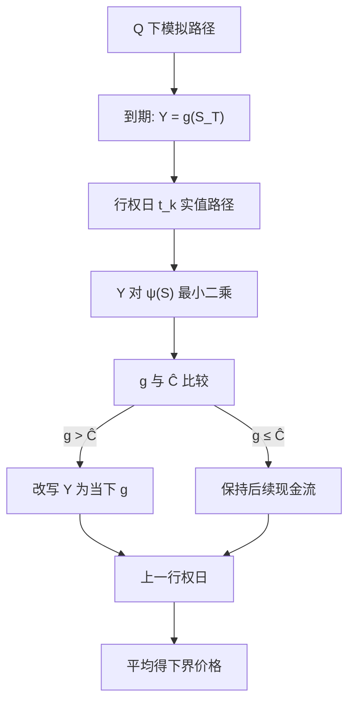

# Longstaff-Schwartz 美式 MC

    
续持价值是对后续贴现现金流的条件期望；在模拟路径的截面上用基函数做最小二乘，即可得到可计算的执行规则，而不必嵌套模拟。

    <footer>—— Longstaff and Schwartz, Valuing American Options by Simulation: A Simple Least-Squares Approach, Review of Financial Studies, 2001</footer>

[上一课](/quant/cos-method)在 $[a,b]$ 上用余弦展开密度，欧式价格是特征函数系数与支付系数的点积；百慕大可嵌同一核，但连续美式与路径依赖不是欧式 COS 的范围。美式价格是停时上的本质确界，低维网格另有树与 PDE。缺口是高维：路径可以模拟，但不能在每条路径上再嵌套一层期望。Longstaff–Schwartz 从到期倒推，用实值路径上的最小二乘拟合续持，并改写该路径此后的现金流。本课按原文写清「回归的是现金流、不是期权价值」，不重推 COS 的累积量区间。与 Tsitsiklis–Van Roy 及一般 [LSM](/quant/lsm-american) 的差别留到下一篇。

## 问题

百慕大在日期 $0=t_0\lt \cdots\lt t_M=T$ 上可执行。到期 $V(T)=g(S_T)$。在 $t_k$，持有人比较 $g(S_{t_k})$ 与

$$
C(S_{t_k})=\mathbb{E}\bigl[e^{-r(t_{k+1}-t_k)}V(t_{k+1})\mid S_{t_k}\bigr].
$$

条件期望没有闭式。嵌套模拟对每条路径再抽一簇后续路径，成本随 $M$ 指数上升。需要用**已经抽好的** $N$ 条路径估计 $C$，并且估计量只能依赖 $t_k$ 的可测信息。Longstaff–Schwartz 把 $C$ 当成 $S_{t_k}$ 的函数，用线性基 $\psi_j$ 在截面上最小二乘。还要决定：回归的响应变量是「下一期的期权价值」（本身也是估出来的）还是「这条路径此后真实发生的贴现现金流」。原文选后者：决策用拟合，定价用路径上按该决策实现的现金流。于是价格对应一个显式停时，在忽略回归误差时是真值的下界。

### 实值路径与 Laguerre 基

虚值路径上 $g=0$，执行不会发生，把它们放进回归会在远离自由边界的区域浪费自由度、拟合噪声。原文只对 $g(S_{t_k})\gt 0$ 的路径做回归。美式看跌的状态常取 $S$ 或 $S/K$。基函数用加权 Laguerre 多项式

$$
L_n(S)=e^{-S/2}\frac{e^S}{n!}\frac{d^n}{dS^n}(S^n e^{-S})
$$

的前几项，加上常数；多资产则用各坐标的多项式与交叉项。项数太少，续持的曲率不够，可能系统性错边执行；项数太多、路径不够，样本内 $R^2$ 虚高，停时过拟合。原文的数值例用很少的项就在单资产看跌上贴近树，这是展示方法，不是高维时的默认规格。

「简单最小二乘」指截面 OLS，不是逐条路径的时间序列回归。每条路径在 $t_k$ 只贡献一个点 $(X_i,Y_i)$，$Y_i$ 是该路径在 $t_k$ **之后**按已确定规则发生的贴现现金流。把 $Y$ 理解成「下一期网格上的 $V$」就写成了另一篇文章的算法。

## 方法

算法：

1. 在 $\mathbb{Q}$ 下模拟 $N$ 条路径，存下各行权日的状态。
2. 到期现金流 $Y_i=e^{-rT}g(S_T^{(i)})$（或未贴现标记，最后统一贴现）。
3. 对 $k=M-1,\ldots,1$：在实值路径上用 $Y_i$ 对 $\psi(S_{t_k}^{(i)})$ 回归，得 $\hat C=\hat\theta\cdot\psi$。若 $g\gt \hat C$ 则执行：$Y_i$ 改写为从 $t_k$ 起的 $g$ 贴现；否则 $Y_i$ 保持为后续已贴现现金流（相当于继续持有）。
4. $t=0$ 若不可执行，价格为 $Y_i$ 的平均；若可执行，再与 $g(S_0)$ 取最大。

关键实现细节：回归与决策发生在同一组路径上时，有向下的策略偏差加向上的样本内偏差，净效应通常仍偏低，但小样本可以花。原文也讨论用独立路径评估停时。美式看涨无股利时应几乎从不执行，算法必须能复现这一点，否则是基函数或实值筛选写错。与树对照：单资产看跌、中等 $N$ 与 $M$，价格应落在 CRR 加密结果的一个标准误内——这是回归测试，不是生产精度保证。

### 现金流改写而不是赋值续持

若在 $t_k$ 执行，该路径在 $t_{k+1},\ldots,T$ 的支付不再发生，必须从 $Y_i$ 里抹掉。若不改写，回归会把「本应已执行」的未来收益仍算进续持，后续日期的决策被污染。这是原文与「每个节点存一个期权价值」的 PDE/树倒推的对应物：树把后继期望写进节点；模拟把后继实现写进路径。希腊值不是免费的：对 $S_0$ 有限差分要用共同随机数；回归决策的不连续使路径导数失效，这是美式 MC 相对欧式 [蒙特卡洛](/quant/mc-pricing) 的额外痛点。

## 机制

条件期望是 $L^2$ 投影。基函数张成的子空间上的 OLS，是该投影的样本版。执行规则是对投影的贪婪比较，不是对真 $C$ 的比较，故停时次优，价格在大样本下从下方逼近（Clément–Lamberton–Protter 一类结果）。用已实现现金流而不是用拟合值当续持，避免了把回归噪声当成价值带进下一期——拟合只当分类器。这是 Longstaff–Schwartz 相对「把 $\hat C$ 当作价格并贴现回去」的核心设计。

高维时状态必须是马尔可夫充分统计量。两个资产的最大值期权要把 $S^1,S^2$ 都放进 $\psi$；亚式要把迄今平均放进去。漏状态等于用错误的信息集做停时，偏差不随 $N\to\infty$ 消失。利率随机则贴现因子沿路径，回归的 $Y$ 必须用随机贴现，或把债券价格当作额外坐标。

原文数值表里的美式看跌、可赎回债券、百慕大互换期权，展示的是「模拟能处理提前行权」，不是声称多项式基在任意维数上都够。维数升高时交叉项爆炸，要靠问题结构选基，而不是把 Laguerre 张量积写到十维。

### 下界、同一路径与独立评估

同一路径既估 $\theta$ 又评估停时，分类器用了未来实现里的一点信息，小样本可能偏高；策略次优又拉低。生产上更干净的是：一组路径做回归得 $\hat\theta$，另一组按该规则执行再平均。报告时应写 $N_{\mathrm{reg}}$、$N_{\mathrm{eval}}$、基函数列表、是否仅实值。不要把样本内价格当成无偏欧式那样的 MC 均值。上界需要对偶（嵌套模拟估鞅），2001 年论文没有给出；那是后续 [LSM](/quant/lsm-american) 文献。

## 边界与工程取舍

连续美式是百慕大 $M\to\infty$ 的极限，$M$ 太稀会低估提前行权溢价，这与回归偏差是两笔账。跳跃与随机波动要把因子放进状态，否则执行边界在方差维度上是错的。雇员期权的流失、不可交易，原文讨论可交易美式，不能直接套同一停时。一维香草用树或 PDE 更干净；用 Longstaff–Schwartz 去「验证」第四位小数，是用错工具。

不要在虚值区域强行回归；不要用执行日的期权「模型价格」当 $Y$（除非那是另一算法）；不要忘记改写现金流。引用 2001 年论文应落在模拟停时算法，而不是最优停时存在性——那更早。

出处：Longstaff and Schwartz, *Review of Financial Studies*, 2001。提前行权的经济论证见 Merton, 1973。Tsitsiklis and Van Roy, 1999 给出相关的回归近似，但价值迭代形式不同。收敛理论见 Clément, Lamberton and Protter, 2002。

## 小结

- Longstaff–Schwartz（2001）在模拟路径截面上用最小二乘估续持，用拟合做执行决策，用改写后的路径现金流定价。
- 回归响应是后续已实现贴现现金流，不是下一期的期权估值；通常只对实值路径回归。
- 得到的是次优停时价格，大样本下为下界；同一路径样本内评估会混淆两种偏差。
- 状态须马尔可夫充分；基函数项数与路径数要匹配，高维不能盲目张量积。
- 一维香草优先网格；本算法的设计点是多资产、路径依赖与可赎回结构。
- 出处：Longstaff and Schwartz, *RFS*, 2001；经济背景见 [提前行权](/quant/american-exercise)；一般 LSM 见 [最小二乘蒙特卡洛](/quant/lsm-american)。
