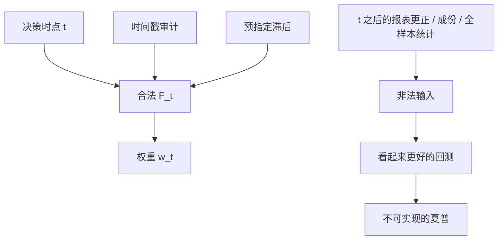

# 前视偏差

检验若使用了决策时点之后才到达的信息，拒绝无预测能力的概率不再是名义上的显著性，而是泄漏的函数。

<footer>—— 对照 Lo and MacKinlay 对数据窥探与可预测性检验的警告</footer>

前视偏差（look-ahead bias）是回测在 $t$ 用了 $\mathcal{F}_{t+h}$ 里的信息：$h>0$ 的财务更正、尚未宣布的指数调入、用全样本估好的波动去定 $t$ 的仓位、用未来最低价做过滤。它与[过拟合](/quant/overfit-as-risk)不同：过拟合可以只用当时可得的数据，仍然把噪声搜成技能；前视是信息集本身不合法。Lo 与 MacKinlay 强调，可预测性检验的分布在「搜过很多规则」时已经失效；若再叠加未来信息，失效从推断走到了交易不可实现。Fama–French 构造 HML 时把财年 $t-1$ 的账面放到 $t$ 年 6 月才用，正是为了躲开「财报尚未公布」的前视；Asness 与 Frazzini（2013）争论的是滞后该有多长，而不是要不要滞后。

## 问题

合法的回测要求：时刻 $t$ 的权重 $w_t$ 是映射 $f(\mathcal{F}_t)$，而 $\mathcal{F}_t$ 只含当时公共可得的价格、已公布（且当时版本）的财务、当时的指数成份、当时的停牌状态。违约的典型路径包括：（1）用最新数据库的「最新报表」代替当时已发布数字，把事后更正提前；（2）用期末才知道的成份或行业分类；（3）用全样本均值方差、全样本主成分、全样本协整向量去生成每一天的仓位；（4）用未来实现波动或未来最高最低价做仓位或过滤。任何一条都会把样本内夏普往真实可交易水平之上推。

会计数字的时间线尤其容易错。财年结束于 12 月 31 日，并不等于 12 月 31 日收盘后就能交易账面价值。10-K 可能在 3 月才报出；中国年报在 4 月 30 日前。Fama 与 French 用 6 月作为统一可交易时点，是粗但可复制的 PIT 近似。若在 1 月就用当年年报的净资产排序，那是在用三个月后才存在的信息。

### 静默的前视：标准化、排名与「已知的」公司行为

对特征做横截面 z-score 时，若用当天全部股票的均值方差，一般可接受（收盘后调仓假设）。若用包含次日上市、次日才复牌的名字，或用未来窗口的分布做分位断点，则泄漏。更隐蔽的是拆股：研究里常用后复权价画图，把未来的拆股因子提前除到历史价格上——对收益计算若一致处理可以自洽，但对「价格小于 5 美元过滤」「整数值支撑」这类规则，复权价不是当时可交易价格。公司行为必须区分：当时已知的已宣布拆股，与回测软件默认的全历史调整因子。详见[分红、拆股与复权](/quant/corporate-actions)。

用全样本估的对冲比 $\beta$ 去做每一天的配对，是最常见的学术前视。滚动或扩张窗口 $\beta$ 才与实时信息集相符。Johansen 向量若在全样本上估一次再回放残差，协整「看起来很稳」往往是因为 $\beta$ 已经看见了未来。

## 方法

**时间戳审计。** 每个输入字段必须有 as-of 时间：价格用当时成交，财务用发布时点的版本，成份用当时名录，分析师用当时快照。Ljungqvist、Malloy 与 Marston（2009）发现 I/B/E/S 的历史推荐会被事后改写；没有 PIT 快照，分析师因子会含前视。工程检查：随机抽 $t$，把 $w_t$ 的全部依赖列出来，问每个字段在 $t$ 日收盘前是否可下载。

**滞后规则预指定。** 账面、盈利、负债至少滞后到法定披露截止之后，或使用实际 file date。Asness–Frazzini 主张用最新已知账面、更频繁更新 HML，相对 FF 的年度 6 月滞后更激进，但仍明确拒绝未公布数字。争议应写成两种合法 PIT 规则的比较，而不是「用最新 Compustat 拉出来的数」。

**禁止全样本统计进仓位。** 标准化、PCA、协方差、协整、HMM 平滑概率，一律用 $\mathcal{F}_t$。平滑体制概率 $P(s_t\mid\mathcal{F}_T)$ 只用于叙事，见[体制切换](/quant/regime-switching-premia)。波动目标用已实现或预测波动的当时值，不用事后已知的当月实现。

### 指数、停牌与成交假设

指数调入在宣布日与生效日之间有可交易的窗口；回测若在宣布前就把名字纳入「指数内策略」，是前视。停牌期间成交价不是可成交价，用线性插值填停牌日收益等于假装当时能交易，见[停牌、涨跌停与不可交易](/quant/trading-halts)。VWAP 假设若用了当天全天成交量，对盘中策略是前视；收盘调仓策略用当日收盘价，在有涨跌停时仍可能买不到。

「研究用复权价、交易用未复权价」若分成两套代码且未对过滤规则对齐，会在低价股过滤上制造前视：未来拆股让历史复权价看起来从未低于 5 元，当时却低于 5 元。

## 机制

前视改变的是策略作为可测函数的定义域。统计上，它让预测变量与未来残差相关，$t$ 检验的原假设分布崩掉。经济上，它把不可交易的信息租金写进净值：更正后的盈利、事后才知道的退市、事后才稳定的行业分类，都不是当时能下单的信号。与幸存者的合谋尤其强：今天的成份既是生存筛选，也是对「谁将进入指数」的前视。

部分前视是连续的而不是开关。用 $t+1$ 到 $t+5$ 的数据做「更好的」当日波动估计，泄漏小于用整个样本，但仍然有偏。正确态度是把每一处未来窗口写成明确的滞后，并在敏感分析里拉长滞后，看 alpha 还剩多少。若 alpha 只存在于零滞后、在合法滞后下消失，它就不是可交易预测性。

### 与数据窥探的关系

数据窥探（snooping）是在合法信息集上搜索过多；前视是信息集非法。可以同时发生：先用最新财务把因子做漂亮，再在参数网格上搜。纠正前视不会自动纠正过拟合，反之亦然。流程上应先冻结信息集（PIT），再在该信息集上限制搜索并计算紧缩夏普。

## 边界与工程取舍

真实发布时点数据贵、且有错误。用统一滞后（FF 的 6 月）是偏差与可行的折中，但必须承认：相对真 PIT，它可能过慢（丢掉及时信息）或偶尔仍过快（个别公司推迟披露）。无法获得 PIT 时，应把「最新可得」结果标成上界，而不是当成实盘预期。盘中微观结构研究还要处理交易所时间戳与迟到成交，那是另一层前视，见 tick 清洗一类工作。

不要用「我们只做月频，所以前视无所谓」：月频照样会在月初用当季尚未公布的季报。也不要在样本外一段「关掉」前视、样本内保留，那会让验证集看起来更差，从而诱使你改回泄漏版本。

复现别人因子时，对方若未声明滞后与数据库版本，你的无泄漏复制更弱，不一定说明对方造假，但说明对方数字不能当可交易 alpha 的上界。

## 小结

- 前视偏差是 $w_t$ 依赖了当时不可得的信息；它使回测不可实现，而不只是使推断失真。
- 财务披露日历、指数成份、全样本估计的 $\beta$/PCA、未来价格过滤，是主要泄漏源。
- Fama–French 的 6 月滞后与 Asness–Frazzini 对 HML 时点的讨论，核心是 PIT 规则，不是要不要用账面。
- 先冻结信息集，再谈过拟合与多重检验；I/B/E/S 一类数据库存在事后改写，必须用快照。
- 出处：Lo and MacKinlay, *A Non-Random Walk Down Wall Street* 及相关数据窥探讨论；Fama and French 对 HML 构造中账面滞后的处理；Asness and Frazzini, *The Devil in HML’s Details*, Journal of Portfolio Management, 2013；Ljungqvist, Malloy and Marston, *Rewriting History*, Journal of Finance, 2009。
