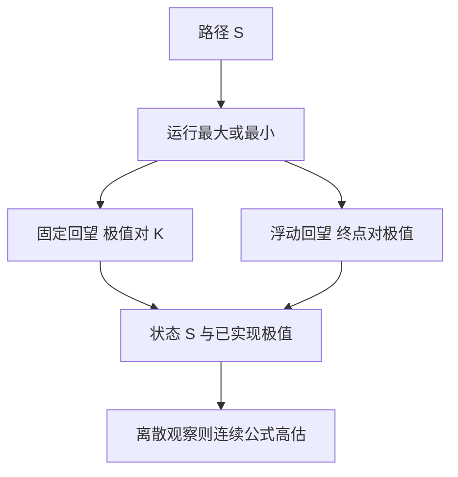

# 回望期权

浮动回望把执行价换成路径上的极值；固定回望把支付换成极值与固定 K 的差。状态必须包含到目前为止的最大或最小，而不是只盯现价。

<footer>—— Goldman, Sosin and Gatto, Path Dependent Options: "Buy at the Low, Sell at the High", Journal of Finance, 1979</footer>

[上一课](/quant/asian-options)把路径压成平均，凸性被平滑。本课的缺口是另一类统计量：**极值。** 回望看涨「在最低点买」、回望看跌「在最高点卖」，支付依赖 $m_T=\inf_{u\le T}S_u$ 或 $M_T=\sup_{u\le T}S_u$。后课数字期权会把支付收成触碰示性；这里先把连续极值在 GBM 下的解析结构写清，并接到离散观察。

## 问题

浮动执行价回望看涨支付 $S_T-m_T$，固定执行价回望看涨支付 $(M_T-K)^+$。两者都不是香草，也不能用亚式的矩匹配糊弄：极值的分布由反射原理与联合密度 $(S_T,M_T)$ 决定，尾部比平均厚得多。问题是：连续监控下 Goldman–Sosin–Gatto 与后续 Conze–Viswanathan 给出闭式；交易所与权证几乎都是离散观察（日频或周频），连续公式会高估触达更优极值的概率，从而高估价格。

第二句话是对冲。回望的 Delta 在现价接近已实现极值时变得尖锐：再创新高，$M_t$ 跟着走，支付的局部行为像持有更多标的。把回望当「杠杆香草」用一个更高的 Vega 去套，会在新高附近把 Gamma 方向做反。

### 已实现极值是吸收壁上的状态

记 $M_t=\sup_{u\le t}S_u$。若 $S_t<M_t$，短期内 $M$ 冻结，合约像执行价钉在 $M_t$ 的期权；若 $S_t=M_t$，下一步向上，$M$ 与 $S$ 一起动，有效 Gamma 与普通期权不同。这与亚式的 $(S,A)$ 类似——都是二维状态——但极值是非可微的运行最大值，PDE 的边界条件写在 $S=M$ 上，不是写在平均的积分核上。

回望不是障碍。障碍在触碰时改变合约身份（敲入/敲出）；回望在触碰时更新执行价或支付基准，合约继续活着。解析技巧都用反射，经济含义不要混。

## 方法

连续 GBM、连续监控：用 $(S_t,M_t)$ 的联合分布写出欧式回望价格，参数仍是 $r,q,\sigma,T$。离散监控：没有简单闭式，用带运行最大的树、或对离散采样的路径做 [蒙特卡洛](/quant/mc-pricing)；连续性修正的精神与 Broadie–Glasserman–Kou 类似，但系数不是障碍那一个 $\beta$，不要直接挪用 [障碍监控频率](/quant/barrier-monitoring) 的 $H'$。

浮动与固定通过恒等式联系（在无股息等简化下），实现时仍应按条款分别测。美式回望更常见于权证，提前行权破坏欧式闭式，应走树或回归。不要用 [BSM](/quant/bsm) 的 $N(d_1)$ 去冒充回望 Delta。

## 机制

布朗运动的运行最大与终点的联合律来自反射：碰到高位再回到 $S_T$ 的路径，与从未碰到的路径，测度可以配对。这给出 $M_T$ 的边际，从而给出固定回望的价格。浮动回望则是 $S_T$ 与 $m_T$ 的差，复制直觉是「一直有权在历史最低买」——代价是全程持有更大的凸性。波动上升同时抬高极值分布与终点分散，Vega 通常大于同类香草；这不是「回望=更高 vol 的香草」，因为偏斜与离散观察会把这层优势削掉。

## 边界

连续监控闭式对权证日频观察往往偏贵，卖方若按连续报价会被离散现实少付。有股息、离散分红、涨跌停，反射原理不再干净。局部波动与随机波动下极值分布对微笑敏感：回望吃的是路径上的偏斜，不是 ATM。商品与外汇的回望还要定义用即期还是期货、用日内高还是结算价。

本课不把回望写成交易「买低卖高」的保证。支付是期权，权利金已经把极值的风险中性期望收进去；历史「曾经摸到过」不能当未来极值的估计。

## 小结

- 回望的状态是现价加已实现极值；浮动钉执行价，固定钉支付。
- 连续 GBM 有反射闭式；离散观察必须另做，不能抄障碍平移系数。
- 新高/新低附近希腊值结构与香草不同，不能用更高 Vega 的香草代替。
- 出处：Goldman, Sosin and Gatto, *Journal of Finance*, 1979；Conze and Viswanathan, *Journal of Finance*, 1991。
