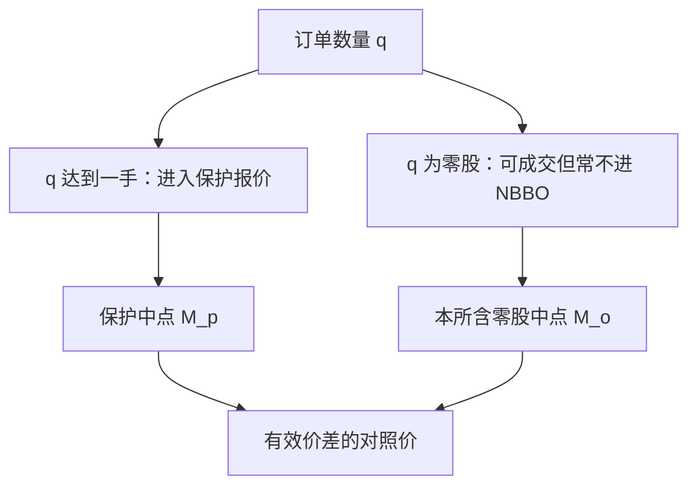

# 手数与零股

价格被 tick 离散之后，数量还被手数离散。不够一手的零股可以成交，却往往不进保护报价，深度统计若只看整手，会把真实供给切掉一截。

<footer>—— 据 O'Hara, Saar and Zhong 对零股交易与美国市场结构的讨论；对照各交易所对 round lot 与 odd lot 的公开定义</footer>

[最小变动价位](/quant/tick-size-regime)把价格钉在栅格上。本课补数量维：最小交易单位（手数、round lot）以及不满足手数的零股（odd lot）。美股历史上 100 股为一手，零股长期不进入公开 BBO；Reg NMS 的保护报价以 round lot 计。A 股买入通常以 100 股为整手，卖出可以零股。日本有単元株。缺口不是「什么是一手」，而是：报价、深度、NBBO 与冲击，究竟按哪一种数量单位来定义。后课把价格 tick 与手数合成价格栅格；本课先把数量规则写成状态。

## 问题

连续簿上的买一股数若是 40，在 100 股一手的制度里，这 40 股可能是零股，不更新保护买价。公开 NBBO 仍显示上一档整手报价，真实可成交的更好价格被藏在零股里。O'Hara、Saar 与 Zhong 指出，小数化与高价股使「一手对应的金额」变得很大，越来越多的经济上合理的订单落在零股，保护报价与可成交报价分叉。若研究只用 NBBO 中点算[有效价差](/quant/effective-realized-spread)，会把打在零股上的改善当成「价格改善」，其实是定义问题。

另一边：强制整手会把散户和小算法切片赶到特殊通道或暗处。A 股买必须整手，卖可零股，买卖不对称进入可提交集合。回测若允许买入 1 股，是在违反前端规则。问题是把手数写成约束，把零股写成可能不进保护簿的流动性，而不是当成脏数据删掉。

### 一手的金额随股价漂移

固定 100 股一手时，相对 lot 金额 $=100\times P$。高价股一手变贵，零股占比上升；低价股一手变便宜，整手深度看起来很大。拆股会突然把零股变回整手或相反。Tick Size Pilot 曾讨论伴随手数调整，因为粗 tick 配高价一手，会把小单完全挤出公开簿。比较深度必须同时报股数、手数和金额；只报「买一 500 股」在 10 元和 1000 元股票上不是同一个经济对象。

美股 2023 年起部分股票把 round lot 改成随价格分档（不足 100 股也可成为一手）。制度变更后，「零股不进 NBBO」这条旧经验不能无条件沿用。样本要切在规则生效日两边。

## 方法

数据字段里区分：交易所打印的全部成交、进入官方报价的尺寸、以及你自己合成 BBO 时是否纳入零股。三套中点可以对不齐。有效价差应声明对照的是保护报价中点还是含零股的本所中点。深度曲线按金额重建时，把零股加回；按「保护深度」重建时，只加 round lot。O'Hara–Saar–Zhong 的经验工作说明零股在高价股上的信息含量可以不低——它们不是默认的散户噪声。

执行上，算法的最小切片应同时满足 tick、手数、以及场所的可接受零股规则。智能路由若把零股送到不展示零股的场所，可能得到更好价格但失去保护。A 股卖出零股、买入整手，意味着再平衡最后一截往往只能卖不能买，组合权重会留下一截手数残差。这应进入[公司行动](/quant/corporate-actions)之后的仓位取整模块，而不是在信号层假装连续仓位。

### 零股与隐藏量不是同一类不可见

冰山是同一张限价里故意不展示的量，见[订单类型](/quant/order-types)。零股是尺寸规则导致的不进入保护报价。前者是策略选择，后者是制度定义。把零股全当隐藏流动性，会高估冰山探测的对象。把保护报价当全部可成交深度，又会低估扫档时实际碰到的量。方法是在 L2 里保留尺寸字段，合成两种簿：protected book 与 complete book。

## 机制

手数通过保护报价进入价格形成。Reg NMS 下，交易所以 round lot 报价参与全国最优买卖。零股可以在本所成交、可以在零售批发商成交，却不一定能锁定其他场所的保护报价。于是出现：打印发生在 NBBO 内部，却不是违规，因为对照的保护报价更宽。这会抬高「价差内成交」的统计，看起来像暗池，其实是零股定义。碎片化市场里，手数规则与后课[市场分割](/quant/market-fragmentation)纠缠。

信息方面，知情者用零股隐藏规模，或用整手去争取保护。不能先验认为零股无信息。分类错误：用只含整手的中点去做 Lee–Ready，会把打在零股买价上的主动卖标错。方向算法必须与中点定义一致。

A 股「买入 100 股的整数倍」是前端约束，不等于卖方深度也按 100 股一块消失。卖一可以是 1 股。合成簿时不要把卖侧也错误取整。

### 保护深度与可成交深度必须并报表

只报保护深度会低估扫档时碰到的零股；只报全部可见尺寸又会高估订单保护能锁定的量。两套深度并排，碎片化与暗池的会计才不会把零股改善写成制度套利。

## 边界

加密与外汇的 lot 是合约最小数量，通常远小于经济上「一手」的金额，约束主要在费用和 tick。债券以面值为单位，见后课 TRACE，不要套股票 round lot。ETF 申赎有 creation unit，那是一级市场手数，与二级市场 round lot 不同。本课不讨论如何把大单拆成零股以规避展示——那是执行选择；研究只要求统计时声明是否包含零股。

把零股从研究样本里删掉，等于在高价股上丢掉越来越大的一块真实成交。清洗应对错价，不对合法尺寸。

下一课把 $\Delta$ 与一手合成可提交的价格-数量栅格，并处理亚 tick 与中点。

## 小结

- 手数定义保护报价的最小展示单位；零股可以成交却常常不更新 NBBO。
- 一手金额随股价与拆股变化，深度必须同时用股数和金额报。
- 有效价差的中点要与是否含零股的定义一致，否则「价格改善」是会计幻觉。
- 零股 ≠ 冰山；一个是尺寸规则，一个是展示策略。
- A 股买卖手数不对称，仓位取整会留下残差。
- 出处：O'Hara, Saar and Zhong 对 odd-lot 的研究；Reg NMS 对 round lot 保护报价的规则；各交易所现行手数定义。
