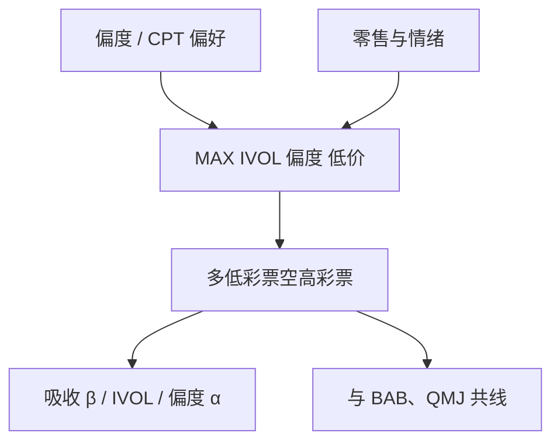

# 彩票型需求因子

投资者为小概率的巨大正收益付费；把这种需求写成可交易的多空，低彩票减高彩票，便得到一条能进入定价回归的因子。

<footer>—— 据 Barberis &amp; Huang 的偏度偏好、Bali 等的 MAX 以及 Bali, Brown, Murray &amp; Tang 对彩票需求因子的构造整理</footer>

[MAX](/quant/max-effect) 是特征：[IVOL](/quant/ivol-anomaly) 是特征。特征能排序，不一定能当右侧因子。彩票型需求因子要做的事，与 SMB、HML 相同：把「被当成彩票来买」的共同变动抽成一条多空收益，去解释其他异常——尤其是 β 异象、IVOL、偏度。Bali、Brown、Murray、Tang（2017）用 MAX 构造 **FMAX**（低 MAX 减高 MAX），显示它对低 β 异常有很强的解释力：高 β 股票更像彩票，价格被需求抬高，随后收益低，看起来像「高 β 低收益」。Kumar（2009）则从持有人侧证明：有人确实在股票市场上赌博。本篇写从偏好到因子的步骤，以及这条因子与质量、动量、情绪的共线。

## 问题

均值方差投资者不会为独立的正偏付费。累积前景理论（Barberis–Huang, 2008）与狭隘框架下的偏度偏好预测：正偏证券被高估。经验上的代理很多——MAX、预期特质偏度、低价格、高 IVOL、虚值期权的需求——它们指向同一组股票。若每个异常单独发论文，会得到一打「新因子」。若它们是同一需求冲击的投影，就应存在一个共同的多空腿，能在时间序列里吸收这打异常的 α。

β 异象是试金石。CAPM 预测高 β 高收益；实证上高 β 往往低 α，BAB 用杠杆把 β 拉平后赚钱。彩票故事给出另一条因果：高 β 名字波动大、右尾厚，零售当彩票买，于是高 β 被买贵。若 FMAX 能吸收 BAB 或高 β 组合的 α，则低波/低 β 不一定需要独立的「杠杆约束」叙事（Frazzini–Pedersen），至少在截面的这一块上两者无法区分。问题因此是构造一条干净的彩票因子，再跑吸收检验。

### 特征排序不等于因子收益

每月按 MAX（或复合彩票分数）排序，多低彩票、空高彩票，价值加权，得到因子收益 $R^{\mathrm{LTRY}}_t$。这与「在截面回归里放 MAX」不同。截面回归问特征是否预测；因子回归问其他组合的共同变动能否被这条腿的溢价说明。高 MAX 股票之间若没有共变，多空只是一堆特异噪声，吸收检验会失败。彩票股在主题热潮里高度同步——同一批零售注意力——因此共变是存在的，这也是拥挤点：因子在主题退潮时同步回撤。

FMAX 的符号是低 MAX 减高 MAX，与「做多彩票」相反。它赚的是彩票被高估之后的低收益。把它做成正的彩票腿当增长期权去持有，符号和论文相反，回撤会来自论文里当作利润来源的那一侧。

## 方法

Bali 等（2011）的 MAX 是自然的排序变量。BBMT（2017）在此上做 2×3 或十分位价值加权，定义 FMAX。更宽的彩票分数可以复合：高 MAX、高 IVOL、高预期特质偏度、低价格、高换手，截面分位等权——复合提高稳健、也提高与质量/流动性的共线。Kumar 的操作定义接近：高特质偏度、高 IVOL、低价格。复制必须先钉死排序变量，再钉加权与断点；用等权微型股彩票因子去解释大盘 β 组合，是维度不匹配。

吸收检验：把高 β 减低 β、高 IVOL 减低 IVOL、高偏度等组合放在左边，右边放市场与 FMAX（再逐步加 SMB、HML、WML）。若 α 消失而 FMAX 的载荷显著，彩票需求「解释了」该异常——这里的解释是统计吸收，不是唯一因果。反向检验同样需要：FMAX 的 α 在加入 BAB、QMJ、IVOL 因子之后是否还在。文献里常见的格局是：彩票因子与低波、质量互相削弱，谁是「更原初」取决于样本；诚实的报告是相关矩阵加双向吸收，而不是只发表一个方向。

### 谁在提供彩票需求

Kumar（2009）用账户数据说明：社会经济特征更接近彩票购买者的客户，更爱持有彩票型股票；在经济不好、彩票销售高的地区更明显。这是需求侧的微观证据，补上因子论文所缺的「人」。没有这些人，FMAX 只是又一条小盘高换手的多空。有了这些人，情绪高涨期（[Baker–Wurgler](/quant/baker-wurgler)）因子溢价应更强：需求更热，随后反转更深。把 BW 情绪与 FMAX 收益做交互，是自然的条件检验。

期权市场提供另一观测：散户对个股虚值 call 的净买入与 MAX、IVOL 同向。若彩票需求从股票挪到期权，股票侧的 MAX 效应可能变弱，因子收益衰减——这是市场结构变化，不是论文被证伪。长期样本里应允许这种替代。

## 机制

价格端：彩票股被高估，期望收益低；非彩票股被当成无聊的债券式权益，相对便宜或至少没有付彩票溢价。多空的平均收益来自空头腿的随后低收益者居多，这与卖空约束文献一致。风险端很难把 FMAX 写成「规避彩票风险」的补偿：持有低 MAX 股票并不显然更痛苦，除非把「错过主题」当成风险——那是基准与跟踪误差，不是消费风险。因此彩票因子更自然地落在错误定价加约束的篮子里，尽管它在回归里可以像一个因子一样工作。

与 BAB 的机制竞争：杠杆约束说高 β 被杠杆厌恶的投资者抛开，价格低、但实证是高 β 收益低，于是 BAB 用多低 β 空高 β 再加杠杆来赚 α。彩票说高 β 不是被抛开而是被买贵。两种机制对「谁在交易高 β」的预测相反：一个预测机构不足，一个预测零售过多。持有人数据、期权与换手更支持后者在个股截面上占重要地位；杠杆约束在指数、国债期货等可杠杆工具上另有证据。不要用股票 FMAX 去否定期货上的 BAB，也不要用期货 BAB 去否定个股彩票。

### 复合因子的共线与拥挤

把 MAX、IVOL、低价捆在一起，FMAX 会与 SMB、反转、流动性同时相关。月度再平衡加空头腿的借券，使它成为高换手、高拥挤的风格。主题退潮、监管打击或风险预算收缩时，空头回补与多头同时减仓可以让因子出现短窗口的正收益爆炸（高彩票反弹）——这是拥挤崩的镜像，与动量崩溃同构但腿相反。风险模型若把 FMAX 当正交因子，却在组合里已经通过低波、质量、低换手持有了同一暴露，会低估真实风险。

彩票因子的溢价对可投资过滤极其敏感。去掉低价股、要求最低价格与最低成交额之后，FMAX 的均值往往明显下降。论文表格里的全宇宙等权不是产品预期。过滤后若溢价仍在，更有经济含义，因为那才是可做空的彩票。

## 边界与工程取舍

不要同时把 MAX 特征、IVOL 特征、FMAX 因子、BAB、QMJ 塞进同一个「增强」组合还声称五条独立的 α。先看相关与双向 α。不要用盘中已实现偏度的高频估计去替换月度 MAX 还引用 BBMT 的吸收结果。不要在 A 股用涨停板次数当 MAX 而不重做吸收检验：涨停截断改变了彩票的度量，β 异象的结构也因杠杆与融资融券制度而不同。

因子命名混乱：有人把做多高 MAX 叫做 lottery factor，符号与定价方向相反。写模型时应定义：正的彩票需求因子是**做空彩票**的那条腿，还是**彩票减非彩票**的需求冲击本身。前者适合当右侧定价因子（正溢价对应低期望的高估腿被空头收获）；后者适合当情绪式状态。两者差一个负号，混用会把 β 的载荷讲反。

作为诊断，彩票暴露很有用：若某策略的 α 被 FMAX 吃掉，它可能只是在做空主题股。作为配置，它是昂贵的空头策略，容量在借券，左尾在主题狂热的延续——情绪可以比模型更久地维持高估。与 BW 情绪、零售流一起看，比单独盯 FMAX 的过去夏普更重要。

出处：Barberis & Huang, 2008（偏好）；Kumar, *Journal of Finance*, 2009（谁在赌）；Bali, Cakici & Whitelaw, 2011（MAX）；Bali, Brown, Murray & Tang, *JFQA*, 2017（FMAX 与 β 异象）。IVOL 见 Ang et al., 2006。不要把其中任何一篇的表格直接标成「彩票因子官方收益」。

## 小结

- 彩票型需求因子把 MAX/偏度/IVOL 一类特征做成多空，通常是低彩票减高彩票（FMAX）。
- 它在统计上常吸收 β 异象与部分 IVOL；与 BAB、质量共线，需双向检验。
- 微观基础是 CPT 偏度偏好与零售赌博式持仓；情绪高时需求更强。
- 溢价多来自空头腿，对价格过滤、借券与换手敏感。
- 符号必须声明：做空彩票才是论文里正的定价因子方向。
- 出处：BBMT, *JFQA*, 2017；特征见 Bali et al., 2011；持有人见 Kumar, 2009。
