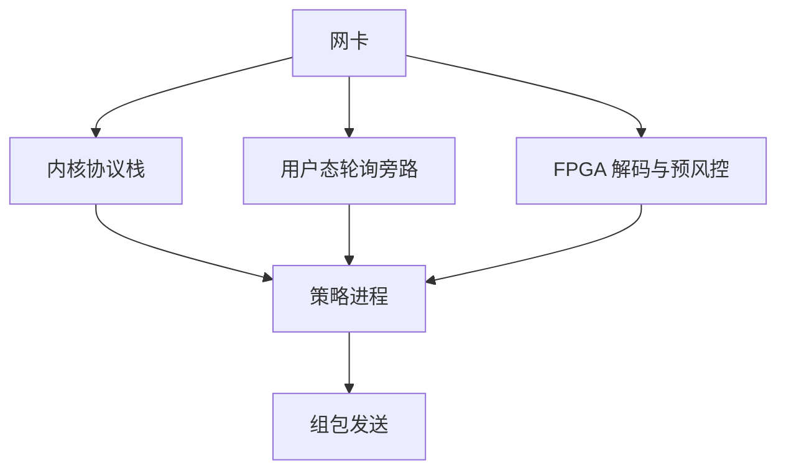

# 低延迟工程：内核旁路与 FPGA

操作系统把网卡中断、系统调用与调度写成通用分时；内核旁路把数据包交给用户态轮询，FPGA 把解析与风控下沉到硬件流水线。目标是抖动，不只是平均延迟。

<footer>—— 对照 Aldridge, High-Frequency Trading 对系统架构的综述；Intel DPDK 与网卡厂商内核旁路文档；交易所 FPGA 馈送的公开产品说明</footer>

[上一课](/quant/colocation-microwave)把物理路径停在机笼与城际。[撮合核](/quant/matching-engine-arch)已说明核内单线程全序。本课的缺口是**客户主机上、入核之前那几微秒**：内核网络栈、上下文切换、内存分配如何把「同等线长」重新变成不确定到达。后课时钟课测量这些抖动。本课写机制与研究含义，不提供可部署的旁路或 FPGA 交易代码。

## 问题

标准路径：网卡中断 → 内核协议栈 → socket → 用户进程。每一段都可能被调度器打断，尾部延迟可以比中位高一个数量级。时间优先只认到达全序，尾部才是经济量。内核旁路（如 Onload、DPDK 一类）让用户态直接轮询描述符队列，绕过系统调用与内核拷贝。FPGA 则在网卡或夹层卡上做协议解析、簿的部分更新、甚至预风控，再把事件送给 CPU 或直接回包。问题是：这些技术改变的是谁的抖动分布，会不会把研究用的软件模拟器训到一个永远达不到的执行集合。

回测若用日频或分钟 bar，本课全部无关。事件级回测若假设「看见行情立刻可撤」，等于假设内核旁路 + 核绑定 + 无日志阻塞已经实现。未实现时，模拟器应给撤单一个延迟分布，而不是一个常数 0。Aldridge 的工程章节强调关键路径上禁止锁、禁止分配、禁止磁盘；研究日志若写在同一线程，你测到的是日志系统的延迟。

### 确定性比「更低的中位」更值钱

把中位从 8 µs 降到 4 µs，而 99.9 分位仍是 200 µs，FIFO 竞赛里你仍会在微突发中输掉。工程对象是延迟直方图，尤其是与邻居流量、垃圾回收、CPU 频率缩放相关的尾部。Java 一类运行时除非暂停被严格控制，否则不适合核绑定的撮合客户端。这不是语言偏见，是停顿与时间优先不兼容。

FPGA 行情解码可以在卡上输出「已解码的增量事件」。CPU 若仍用非旁路栈收同一组播，两条路径会给出不同到达时钟。必须声明策略看见的是哪一条，否则信号与执行脚不在同一世界。

## 方法

关键路径清单：收包 → 解码 → 风控 → 决策 → 组包 → 发送。每一项标注运行位置（CPU 核 / FPGA / 另一进程）与是否共享缓存。核绑定、隔离中断、关闭频率缩放、大页内存，都是为了把操作系统从随机扰动改成近似专用机。测量用硬件时间戳（网卡、PTP）而不是 `gettimeofday`。对比实验：同一策略逻辑，走内核栈 vs 旁路，报告到达撮合的往返分布——对象是分布，不是「快了多少倍」的营销数字。

FPGA 适合稳定、规格化的流水：SBE 解码、价格整数比较、简单的涨跌幅与数量检查。不适合频繁改参数的研究策略。把研究平台与生产关键路径分成两套二进制：研究用可观测性强的语言，生产用抖动受控的实现，用同一内部事件定义对拍。对拍失败时以生产为准去改研究，而不是用研究的「理论单」去指责交易所。

### 与 A 股报撤约束同时存在

旁路与 FPGA 不创造额外的合法报撤密度。[程序化规则](/quant/cn-program-trading-rules)与[撤单收费](/quant/cn-fee-cancel-ratio)把报撤写成监管对象。工程上能发 10 万笔不意味着规则允许。延迟工程的可行集是「在已报告、未触发异常、公平接入」之内压抖动，不是把境外期货做市的报撤曲线搬到沪深股票。

## 机制

内核栈为隔离与通用性付税：拷贝、系统调用、调度。旁路用轮询把税换成占用整核的电与机会成本。FPGA 把确定性交给硬件时钟周期，代价是迭代慢、规格绑定、故障模式难调试。对市场质量：客户侧抖动下降，核入口的到达过程更「尖」，连续簿上的速度租金更集中于能付工程固定成本的人——与 Budish 等对军备竞赛的描述同方向，只是战场从光纤移到网卡。

生产事故里，工程优化本身是风险：驱动 bug、FPGA 映像错误、内核旁路与操作系统补丁不兼容。后课交易所故障会看到客户侧与交易所侧的故障会互相放大；监控必须覆盖「旁路端口无包」而不是只覆盖策略 PnL。

## 边界

不提供可编译的内核旁路交易程序、FPGA 抢跑逻辑或绕过会员网关的接入。研究实现用公开规格做解码即可。云上共享内核的虚拟机无法复制托管裸机的抖动承诺，回测不要用云虚拟时钟去校准微秒策略。

## 小结

- 低延迟工程的对象是到达抖动的尾部，不是平均延迟的广告数字。
- 内核旁路与 FPGA 改变客户侧关键路径，不改变撮合优先规则。
- 模拟器必须给「看见→可撤」一个真实延迟分布；A 股还要叠报撤制度。
- 出处：Aldridge, *High-Frequency Trading*；DPDK / 厂商旁路文档；Budish 等对速度竞赛的讨论。
