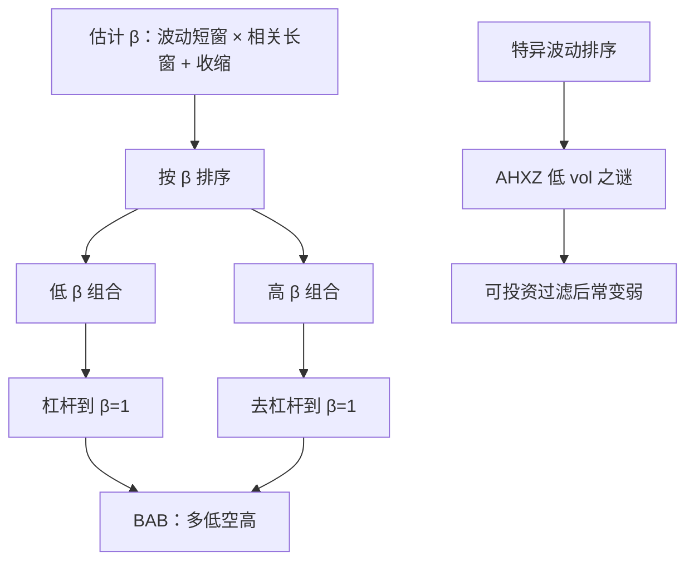

# 低波动 / BAB

把低 β 组合杠杆到与高 β 组合相同的市场暴露，再做多前者、做空后者；在资金约束下，这条 Betting Against Beta 的腿应当赚到正的平均收益。

<footer>—— Frazzini & Pedersen, Betting Against Beta, Journal of Financial Economics, 2014</footer>

CAPM 要求证券市场价格沿证券市场线：高 β 高预期收益。实证上证券市场线太平，甚至出现低波动、低 β 股票的经风险调整后收益更高——Ang、Hodrick、Xing、Zhang 2006 年的特异波动之谜是近亲。Frazzini 与 Pedersen 把现象收成可交易的 **BAB**：两边都把 β 调到 1，多空净 β 接近 0，收益来自斜率不足而不是来自净市场暴露。本篇写 BAB 的估计与杠杆，以及它和「低波动因子」在什么地方不是同一条腿。

## 问题

若部分投资者不能或不愿使用杠杆，他们会用高 β 股票当杠杆替代，把高 β 价格抬高、预期收益压低；能用杠杆的投资者则应买入低 β、自行加杠杆。均衡结果是证券市场线变平，低 β 的 α 为正、高 β 的 α 为负。这与「波动即风险、高波动必须高收益」的常识相反，也与以市场因子为唯一风险源的 [CAPM](/quant/capm) 直接冲突。

需要把现象从「低波动组平均收益高」里拆出来。低波动组往往低 β、偏防御行业、偏高质量，可能只是[质量](/quant/quality-profitability)或行业的马甲。BAB 的设计是显式对冲市场 β，只赌斜率。特异波动（idio vol）排序则不对冲 β，赌的是残差波动——Ang 等人的结果对换手和微型股更敏感。三者必须分开报告。

### 平的证券市场线不等于低波动溢价

把股票按总波动排序的多空，左边仍含大量 β。市场上涨时，空头高波动腿会亏很多，策略看起来像减 β。BAB 先估计 β，再在组合层面把多头除以 $\beta_L$、空头除以 $\beta_H$，使两边对市场的事后暴露都靠近 1，再相减。只有在这一杠杆之后仍有溢价，才是「对 β 的定价错误/约束」而不是「少承担了市场风险」。

BAB 的多头需要融资加杠杆，空头需要借券。账面回测若假设任意 $\beta_L<1$ 都能无成本借到资金，溢价会被高估。资金利率、保证金与借券费是策略的一部分，不是交易成本附录。

## 方法

Frazzini–Pedersen 的 β 分解为相关与波动：波动用约一年日收益，相关用约五年、重叠三日对数收益，以处理非同步交易；再向 1 收缩，

$$
\hat\beta_i=w\,\hat\rho_{iM}\frac{\hat\sigma_i}{\hat\sigma_M}+(1-w)\cdot 1,
$$

文中 $w=0.6$。每个形成日按 $\hat\beta$ 排序，低 β 组 L、高 β 组 H（价值加权）。组合 β 记为 $\beta_L,\beta_H$，

$$
r_{t+1}^{\mathrm{BAB}}=\frac{1}{\beta_L}(r_{t+1}^L-r_f)-\frac{1}{\beta_H}(r_{t+1}^H-r_f).
$$

事前净 β 为零。低波动因子则常按过去一年日收益标准差或特异波动（对市场或三因子回归的残差标准差）做十分位多空，**不**做 $1/\beta$ 杠杆。复制时必须写明：排序键是 β、总波动还是残差波动；加权是价值还是等权；是否行业中性。

### 与特质波动之谜的分工

AHXZ 2006：高特异波动股票平均收益低，尤其等权。后续发现效应集中在低价、低流动性、难卖空的股票；价值加权或可投资过滤后显著变弱。BAB 在大盘、国际市场、国债、信用、期货上也被报告过，主张的是跨资产的杠杆约束，不是微型股结构。若一个「低波」产品的持仓像 AHXZ 的空头（一堆小盘高 vol），它就不是 BAB。

## 机制

资金约束是主叙事：互惠基金、部分保险与零售不能加杠杆，只能买高 β；对冲基金与自营可以，但受保证金与赎回约束，不能无限把证券市场线扳回。约束越紧（危机、融资利率跳升），BAB 越应当赚钱——但危机里保证金同时提高，杠杆多头可能被强平，BAB 会回撤。因此机制预测的是**平均**为正、**状态**依赖，而不是保险。

行为补充：彩票偏好让投资者支付过高价格给高偏度、高波动股票，压低其预期收益。这条更贴近特异波动与低价股，而不是大盘 β。代理问题：考核相对基准的经理厌恶「独自加杠杆买公用事业」，即使 CAPM α 为正。低波超额因此能在机构约束下持续。

### β 估计误差如何假造溢价

β 估高的股票被分进高 β 组并被做空，若真实 β 没那么高，空头就带上负的真实市场暴露，策略在牛市里看起来像 BAB 成功。收缩向 1、用重叠多日收益、用滞后 β 再平衡，都是为了减这条偏差。即使如此，事后 β 仍常不完全等于 1，报告 BAB 必须同时报告实现净 β 与 CAPM α，而不是只报平均收益。

低波动指数（按总 vol 或按方差减权）没有把 β 杠杆到 1，产品的第一主成分仍是减市场。熊市相对表现好、牛市落后，是设计如此，不是 BAB 的 α。渠道混用会在配置上重复减 β。

## 边界与工程取舍

杠杆成本随政策利率与信用利差变；2009 年后无风险利率接近零时，账面 BAB 与可实现 BAB 的差距会变。卖空高 β 成长股在拥挤期借券贵。行业中性 BAB 更接近「同一行业内的 β 斜率」，溢价通常仍在但更薄。A 股有杠杆限制与融券标的约束，BAB 空头腿的可复制性低于美股。

不要把最低波动十分位的等权收益叫做 BAB。不要把期权隐含波动的低 IV 策略直接引用 2014 年论文——那是另一套截面。五因子与 QMJ 会吃掉一部分低波 α，因为质量的安全块与防御行业重叠；剩余是否显著取决于样本与行业控制。

真实出处：Frazzini & Pedersen, *Betting Against Beta*, Journal of Financial Economics, 2014。特异波动见 Ang, Hodrick, Xing & Zhang, Journal of Finance, 2006。证券市场线过平是 Black、Jensen、Scholes 与后续实证的老结果，不要写成 2014 年才发现。

## 小结

- 低 β / 低波动资产的经风险调整收益偏高，CAPM 证券市场线过平。
- BAB 用估计 β 排序，并把两腿杠杆到 β=1 再多空，赌的是斜率不是净市场。
- 特异波动之谜更依赖微型股与卖空约束，与 BAB 不是同一构造。
- 融资、保证金与借券费属于策略定义；事后净 β 必须披露。
- 出处：Frazzini & Pedersen, Journal of Financial Economics, 2014；AHXZ, Journal of Finance, 2006。
