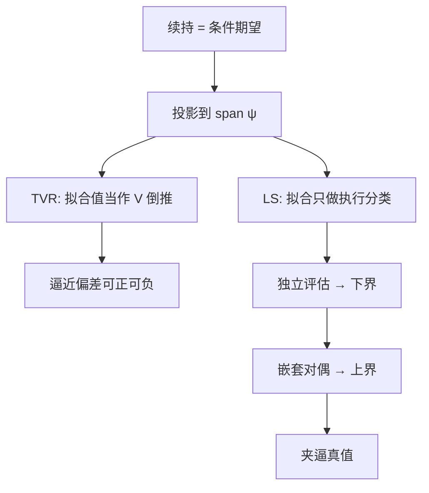

# 最小二乘蒙特卡洛 LSM

    
把续持算子投影到有限基上，用路径截面的最小二乘代替条件期望，美式定价就变成带执行判断的动态规划；偏差来自子空间与样本，而不是来自少抽了几条欧式路径。

    <footer>—— Longstaff and Schwartz, Review of Financial Studies, 2001；Tsitsiklis and Van Roy, IEEE Transactions on Neural Networks, 1999；Clément, Lamberton and Protter, Finance and Stochastics, 2002</footer>

[Longstaff–Schwartz](/quant/longstaff-schwartz) 给出可落地的路径现金流算法。[提前行权](/quant/american-exercise) 写经济与自由边界。本篇把 LSM 当成一类数值方法：条件期望的线性投影、两种价值迭代、基函数与过拟合、下界/上界，以及和欧式 [蒙特卡洛](/quant/mc-pricing) 完全不同的误差账本。它服务的是百慕大与高维美式；一维网格仍应走 [树](/quant/binomial-tree) 或 [PDE](/quant/option-pde)。名字里的「最小二乘」是投影的计算手段，不是普通回归预测收益。

## 问题

离散行权日上，续持 $C_k(x)=\mathbb{E}[D_{k+1}V_{k+1}\mid X_{t_k}=x]$。$V_{k+1}=\max(g,C_{k+1})$ 使算子非线性。函数逼近选一个有限维子空间 $\mathcal{H}=\mathrm{span}\{\psi_1,\ldots,\psi_J\}$，用 $\Pi_{\mathcal{H}}C_k$ 代替 $C_k$。问题是：投影之后，下一期代入的是投影值还是真实后续现金流；以及当 $\Pi_{\mathcal{H}}$ 换成样本 OLS 时，价格以什么方式收敛。

两条经典迭代。Tsitsiklis–Van Roy（TVR）让 $\hat V_k=\max(g,\hat\theta_k\cdot\psi)$，并把 $\hat V_k$ 贴现后当作下一期回归的响应——价值函数在基上闭环，像拟合值动态规划。Longstaff–Schwartz（LS）只用 $\hat\theta\cdot\psi$ 做是否执行的分类，响应始终是路径上按该规则实现的现金流。TVR 把逼近误差写进价值，可高可低；LS 的价格对应一个可模拟的停时，便于谈下界。LSM 一词在工程里常混指二者，实现前必须写明闭环的是价值还是现金流。

### 投影误差不是蒙特卡洛方差

欧式 MC 的误差主要是 $\mathrm{Var}(Y)/N$ 与时间离散。LSM 在此之外还有：$\mathcal{H}$ 不能逼近真 $C$（逼近偏差）、OLS 的有限 $N$ 噪声（估计偏差/方差）、行权日太稀（百慕大相对连续美式）、以及同一路径样本内评估。加大 $N$ 而不改基，只能压估计噪声，压不掉子空间偏差。这与「再加两个数量级路径，美式价格就会贴住 PDE」的直觉相反。报告 LSM 价格必须同时报告 $J$、$M$、$N$ 与是否独立评估，否则无法复核。

基函数选错时，加密路径会让错误规则被估得更「确定」，价格稳定在错误的数上。稳定不等于收敛到真值。应用一维看跌对树做对照，再把同一套基搬到高维，是最低限度的健全性检查。

## 方法

共同骨架：模拟路径 → 到期赋值 → 倒推回归 → 执行判断。差异在响应变量与是否改写现金流，见上。基的选择按结构来：单资产多项式或 Laguerre；随机波动把 $v$ 放进 $\psi$；篮子用主成分或价格的对称多项式；可转债加入信用强度或转换价值。正则化（Ridge、截断 SVD）在 $J$ 相对实值路径数偏大时比盲目加阶更有用。只回归实值路径是把 $\mathcal{H}$ 的预算花在自由边界附近；深度虚值美式看跌的价值接近欧式，执行信息本来就少。

独立评估：路径集 $A$ 估 $\hat\theta_{1:M}$，路径集 $B$ 只执行不回归，平均贴现支付。这给出对应该规则的无偏价格（相对规则而言），标准误按欧式方式报。上界用 Andersen–Broadie：对偶鞅由嵌套模拟估续持，成本高，通常只在基准产品上跑，不作为每日生产。实践中用加大 $J$ 与 $N$ 看下界是否抬升、是否饱和，当作「可能还早执行」的诊断，而不是证明最优。

### 过拟合、交叉项与状态缺失

多项式张量积在 $d$ 维上项数为 $O(J^d)$。路径数必须覆盖系数，否则 OLS 在样本内把噪声当续持，分类器乱跳。优先低阶主效应加少数经济上有意义的交叉（如 $S\cdot v$ 的杠杆），而不是完整次数 $p$ 的张量。状态缺失比过拟合更致命：亚式漏掉平均，停时在错误的一维流形上做，偏差是模型错误。检查方法是：在已知应永不执行的无股利看涨上，LSM 应给出与欧式 MC 一致的价格；系统性提前执行说明 $g\gt \hat C$ 被噪声触发，应减 $J$、加 $N$、或提高实值阈值。

## 机制

动态规划的 Bellman 算子在真条件期望下收缩（折现）。换成投影后，TVR 是投影 Bellman 的不动点，LS 是「投影只用于贪婪策略、价值沿策略累积」。LS 的下界来自：任意停时的期望不超过本质确界；OLS 策略是某停时（在独立评估时严格如此）。TVR 没有这条免费的不等式。Clément–Lamberton–Protter 证明：先 $N\to\infty$ 再让基足够丰富，LS 价格趋向百慕大真值；次序不能反——先把 $J$ 加到接近 $N$，再谈极限没有意义。

与网格比：PDE/树在离散化后解的是该网格上的**全局**最优（投影或罚函数意义下），没有策略回归这一层；维数一高网格先死。LSM 把维数代价从节点指数换成基函数与路径。这不是方差缩减：它改变的是可计算的策略集。欧式产品上跑 LSM 等于浪费：没有执行决策，回归无对象。

对偶上界与下界夹住真值，是生产上唯一能报「误差条」的方式，且上界贵。只报一个 LSM 下界、把 MC 标准误当成总误差，会系统性低估——标准误不含子空间偏差。

### 随机贴现、美式亚式与双方停时

利率随机或外汇quanto，贴现因子是路径泛函，$Y$ 必须用累积随机贴现，或把债券价格纳入 $X$。美式亚式的状态是 $(S,A)$，基要同时依赖二者。可赎回、可转换是发行人和持有人双方停时，LSM 要扩展为交替决策或在联合约束下回归，不能单边套用看跌代码。雇员期权加流失率：流失是外生跳，执行可行集随归属变化，基与可行标志要一起进回归。

## 边界与工程取舍

LSM 不消除 Euler 弱偏差：离散 SDE 错了，最优停时是错误过程上的最优。连续障碍加美式，观察偏差与策略偏差叠加。拟随机数在不连续执行指示下优势下降，平滑或用条件期望（给定不执行的桥）更有用。[控制变量](/quant/cv-european) 可加在最终支付上，降的是评估方差，不降策略偏差。

不要把 LSM 当欧式引擎的「升级」；不要用样本内价格报四位小数；不要在一维香草上用百万路径去对标 PDE 却不报基函数。引用时应分开：算法原形 LS 2001 / TVR 1999，收敛 CLP 2002，对偶 Andersen–Broadie 2004。

Glasserman 的《Monte Carlo Methods in Financial Engineering》把美式模拟写成专章，强调策略偏差与欧式方差是不同对象。实现对照原文时，先核对现金流是否改写，再讨论 Laguerre 的项数。

## 小结

- LSM 用有限基上的最小二乘代替续持条件期望；TVR 闭环价值，LS 闭环停时现金流。
- 误差 = 子空间 + 有限样本 + 行权日离散 + 评估方式；加大 $N$ 不能替代选基。
- 独立评估给出对应规则的下界；上界需对偶，MC 标准误不是总误差。
- 状态必须充分；过拟合与张量积爆炸是高维的主要工程风险。
- 一维香草用网格；LSM 的理由是维数与复杂可行集。
- 出处：Longstaff and Schwartz, *RFS*, 2001；Tsitsiklis and Van Roy, 1999；Clément, Lamberton and Protter, *Finance and Stochastics*, 2002；对偶见 Andersen and Broadie, *Management Science*, 2004。
